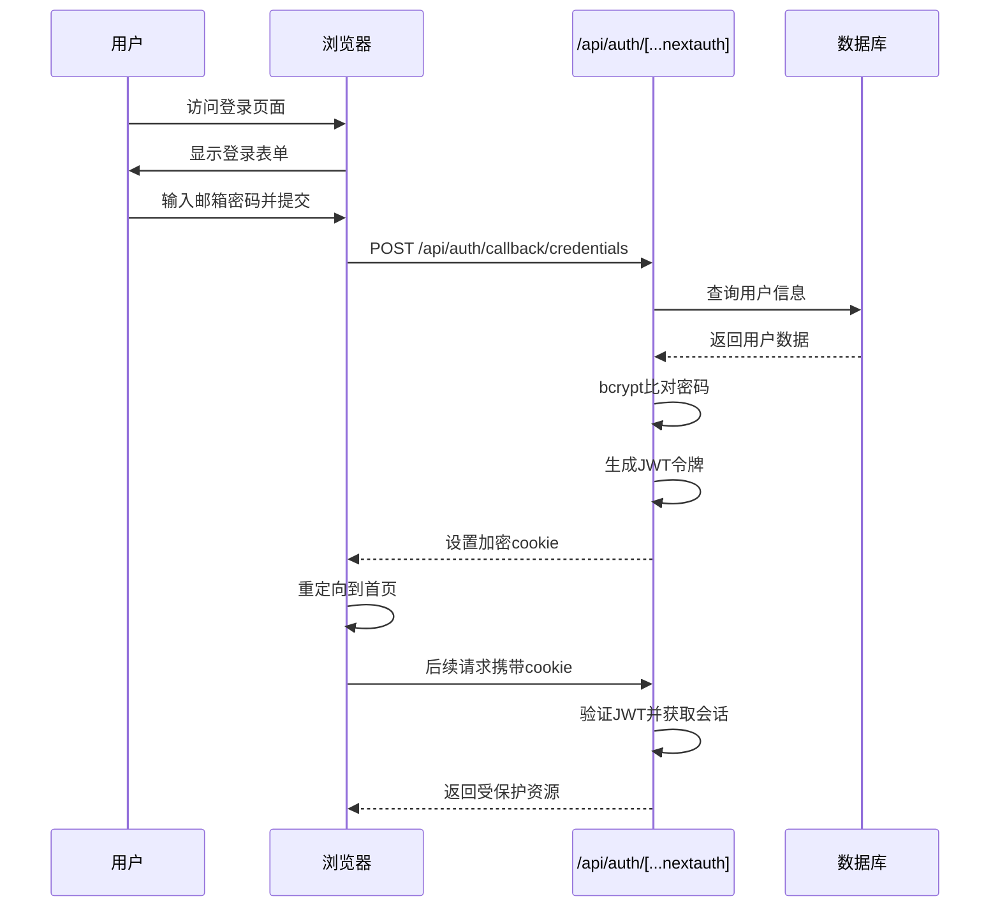

# API 参考

<cite>
**本文档中引用的文件**  
- [auth\[...nextauth]\route.ts](file://src/app/api/auth/[...nextauth]/route.ts)
- [register\route.ts](file://src/app/api/register/route.ts)
- [works\route.ts](file://src/app/api/works/route.ts)
- [works\[id]\route.ts](file://src/app/api/works/[id]/route.ts)
- [works\[id]\like\route.ts](file://src/app/api/works/[id]/like/route.ts)
- [works\[id]\view\route.ts](file://src/app/api/works/[id]/view/route.ts)
- [user\works\route.ts](file://src/app/api/user/works/route.ts)
- [user\works\[id]\route.ts](file://src/app/api/user/works/[id]/route.ts)
- [user\profile\route.ts](file://src/app/api/user/profile/route.ts)
- [admin\works\[id]\approve\route.ts](file://src/app/api/admin/works/[id]/approve/route.ts)
- [admin\works\[id]\reject\route.ts](file://src/app/api/admin/works/[id]/reject/route.ts)
- [admin\works\[id]\featured\route.ts](file://src/app/api/admin/works/[id]/featured/route.ts)
- [admin\users\[id]\route.ts](file://src/app/api/admin/users/[id]/route.ts)
- [admin\stats\route.ts](file://src/app/api/admin/stats/route.ts)
- [admin\upload-config\route.ts](file://src/app/api/admin/upload-config/route.ts)
- [admin\online-counter\route.ts](file://src/app/api/admin/online-counter/route.ts)
- [platform-config\route.ts](file://src/app/api/platform-config/route.ts)
- [auth.ts](file://src/lib/auth.ts)
</cite>

## 目录
1. [简介](#简介)
2. [认证API](#认证api)
3. [用户API](#用户api)
4. [作品API](#作品api)
5. [管理员API](#管理员api)
6. [平台配置API](#平台配置api)
7. [安全性与验证](#安全性与验证)
8. [错误码说明](#错误码说明)

## 简介
本API参考文档为“数字化作品互动展示平台”提供完整的公开API端点说明。文档涵盖所有主要API组（/works、/user、/admin、/platform-config等），详细列出每个端点的HTTP方法、URL路径、请求头要求、请求体结构（使用Zod验证）、响应格式及可能的错误码。

系统采用NextAuth进行身份认证，所有需要权限的API均通过JWT令牌验证。API设计遵循RESTful原则，返回统一的JSON响应格式：`{ success: boolean, data?: any, error?: string, code?: string, message?: string }`。

**API版本控制**：当前为v1版本，通过URL路径直接访问，暂未实现版本号前缀。
**速率限制**：暂未实现显式速率限制，但关键操作（如注册、登录）已通过NextAuth内置机制防护。
**输入验证**：所有请求数据均使用Zod进行严格验证，确保数据完整性。

## 认证API

### 认证工作流程（NextAuth集成）
系统使用NextAuth实现基于JWT的会话管理。认证流程如下：

1. 用户通过`/api/auth/signin`页面提交邮箱和密码
2. NextAuth调用`authorize`回调，验证凭据并返回用户信息
3. 服务端生成JWT令牌并加密存储在cookie中
4. 后续请求自动携带cookie，通过`getServerSession`验证身份
5. `session`回调将用户角色注入会话，实现权限控制



**Diagram sources**
- [auth\[...nextauth]\route.ts](file://src/app/api/auth/[...nextauth]/route.ts)
- [auth.ts](file://src/lib/auth.ts)

### 注册API
提供用户注册功能，支持邮箱密码注册。

#### POST /api/register
- **功能**：创建新用户账户
- **认证要求**：无需登录
- **请求头**：`Content-Type: application/json`
- **请求体（Zod验证）**：
  ```ts
  {
    name: string (1-50字符),
    email: string (有效邮箱),
    password: string (6-100字符),
    confirmPassword: string (需与password一致)
  }
  ```
- **成功响应**：
  ```json
  {
    "success": true,
    "data": {
      "id": "用户ID",
      "name": "姓名",
      "email": "邮箱",
      "role": "USER",
      "createdAt": "创建时间"
    },
    "message": "注册成功，请登录"
  }
  ```
- **错误码**：
  - `EMAIL_EXISTS` (409): 邮箱已被注册
  - `VALIDATION_ERROR` (400): 输入数据无效
  - `INTERNAL_ERROR` (500): 服务器内部错误

**Section sources**
- [register\route.ts](file://src/app/api/register/route.ts)

## 用户API

### 个人作品管理
提供用户对自己作品的增删改查接口。

#### GET /api/user/works
- **功能**：获取当前用户的作品列表
- **认证要求**：必须登录
- **请求头**：`Authorization: Bearer <token>`（通过cookie自动传递）
- **查询参数**：
  - `page`: 页码（默认1）
  - `limit`: 每页数量（默认10）
  - `status`: 状态过滤（PENDING/APPROVED/REJECTED）
  - `search`: 搜索关键词
- **成功响应**：
  ```json
  {
    "success": true,
    "data": {
      "works": [...],
      "pagination": {
        "page": 1,
        "limit": 10,
        "total": 5,
        "totalPages": 1,
        "hasNext": false,
        "hasPrev": false
      }
    }
  }
  ```
- **错误码**：
  - `UNAUTHORIZED` (401): 请先登录
  - `VALIDATION_ERROR` (400): 查询参数无效

#### GET /api/user/works/[id]
- **功能**：获取单个作品详情
- **认证要求**：必须登录且为作品作者
- **路径参数**：`id` - 作品ID
- **成功响应**：返回作品完整信息
- **错误码**：
  - `UNAUTHORIZED` (401): 请先登录
  - `NOT_FOUND` (404): 作品不存在或无权访问

#### DELETE /api/user/works/[id]
- **功能**：删除自己的作品
- **认证要求**：必须登录且为作品作者
- **路径参数**：`id` - 作品ID
- **处理逻辑**：删除数据库记录并从OSS清除图片文件
- **成功响应**：`{ "success": true, "message": "作品删除成功" }`
- **错误码**：
  - `UNAUTHORIZED` (401): 请先登录
  - `NOT_FOUND` (404): 作品不存在或无权删除

**Section sources**
- [user\works\route.ts](file://src/app/api/user/works/route.ts)
- [user\works\[id]\route.ts](file://src/app/api/user/works/[id]/route.ts)

### 用户资料管理

#### GET /api/user/profile
- **功能**：获取当前用户信息
- **认证要求**：必须登录
- **成功响应**：返回用户基本信息及作品统计
- **错误码**：
  - `UNAUTHORIZED` (401): 请先登录
  - `NOT_FOUND` (404): 用户不存在

#### PUT /api/user/profile
- **功能**：更新用户信息（支持修改密码）
- **认证要求**：必须登录
- **请求体（Zod验证）**：
  ```ts
  {
    name?: string,
    email?: string,
    currentPassword?: string,
    newPassword?: string,
    confirmNewPassword?: string
  }
  ```
- **密码修改要求**：必须提供当前密码和新密码，且新密码需一致
- **错误码**：
  - `EMAIL_EXISTS` (409): 邮箱已被使用
  - `INVALID_PASSWORD` (400): 当前密码不正确
  - `NO_PASSWORD` (400): 当前用户未设置密码

**Section sources**
- [user\profile\route.ts](file://src/app/api/user/profile/route.ts)

## 作品API

### 作品公共接口
提供作品的浏览、搜索和互动功能。

#### GET /api/works
- **功能**：获取作品列表（默认仅显示已审核作品）
- **认证要求**：无需登录
- **查询参数**：
  - `status`: 状态过滤
  - `sortBy`: 排序方式（latest-最新, popular-热门, default-默认）
  - `page`, `limit`: 分页参数
- **默认排序**：精选优先 → 点赞数 → 创建时间
- **成功响应**：包含作品列表和分页信息

#### GET /api/works/[id]
- **功能**：获取单个作品详情
- **认证要求**：无需登录
- **成功响应**：返回作品完整信息，包括作者信息
- **错误码**：
  - `404`: 作品不存在

#### POST /api/works
- **功能**：创建新作品（游客可提交）
- **认证要求**：无需登录（但登录用户可关联作者）
- **请求体**：
  ```json
  {
    "name": "作品名称",
    "author": "作者名",
    "prompt": "AI提示词",
    "imageUrl": "图片URL"
  }
  ```
- **上传限制**：
  - 未登录用户：无数量限制
  - 登录用户：受`uploadConfig.maxUploadsPerUser`限制
  - 时间窗口：受`uploadConfig.startTime/endTime`控制
- **初始状态**：PENDING（待审核）
- **错误码**：
  - `UPLOAD_DISABLED`: 上传功能已关闭
  - `UPLOAD_LIMIT_EXCEEDED`: 上传数量超限
  - `UPLOAD_NOT_STARTED`: 上传未开始
  - `UPLOAD_ENDED`: 上传已结束

#### PUT /api/works/[id]
- **功能**：更新作品信息
- **认证要求**：
  - 作品作者：可修改内容，修改后状态变更为PENDING
  - 管理员：可修改所有字段，包括状态和精选
- **权限控制**：普通用户无法直接修改状态和精选字段
- **内容变更处理**：作者修改内容后自动重新提交审核

#### DELETE /api/works/[id]
- **功能**：删除作品
- **认证要求**：作品作者或管理员
- **处理逻辑**：同步删除OSS文件和数据库记录

**Section sources**
- [works\route.ts](file://src/app/api/works/route.ts)
- [works\[id]\route.ts](file://src/app/api/works/[id]/route.ts)

### 作品互动接口

#### POST /api/works/[id]/like
- **功能**：点赞作品
- **认证要求**：无需登录
- **业务逻辑**：随机增加1-10个点赞数（防刷机制）
- **成功响应**：
  ```json
  {
    "success": true,
    "data": {
      "likeCount": 25,
      "increment": 3
    }
  }
  ```
- **错误码**：
  - `404`: 作品不存在或未审核通过

#### POST /api/works/[id]/view
- **功能**：增加浏览量
- **认证要求**：无需登录
- **业务逻辑**：每次调用浏览量+1
- **成功响应**：返回更新后的浏览量
- **错误码**：
  - `404`: 作品不存在或未审核通过

**Section sources**
- [works\[id]\like\route.ts](file://src/app/api/works/[id]/like/route.ts)
- [works\[id]\view\route.ts](file://src/app/api/works/[id]/view/route.ts)

## 管理员API

### 作品管理
提供管理员对作品的审核和管理功能。

#### POST /api/admin/works/[id]/approve
- **功能**：审核通过作品
- **认证要求**：管理员角色
- **处理逻辑**：设置状态为APPROVED，记录审核时间
- **成功响应**：返回更新后的作品信息

#### POST /api/admin/works/[id]/reject
- **功能**：拒绝作品
- **认证要求**：管理员角色
- **请求体**：`{ "reason": "拒绝原因" }`
- **处理逻辑**：设置状态为REJECTED，记录拒绝原因和时间

#### PUT /api/admin/works/[id]/featured
- **功能**：设置/取消精选状态
- **认证要求**：管理员角色
- **请求体**：`{ "featured": true/false }`
- **业务意义**：精选作品在默认排序中优先展示

**Section sources**
- [admin\works\[id]\approve\route.ts](file://src/app/api/admin/works/[id]/approve/route.ts)
- [admin\works\[id]\reject\route.ts](file://src/app/api/admin/works/[id]/reject/route.ts)
- [admin\works\[id]\featured\route.ts](file://src/app/api/admin/works/[id]/featured/route.ts)

### 用户管理

#### GET /api/admin/users
- **功能**：获取所有用户列表
- **认证要求**：管理员角色
- **分页支持**：支持page、limit参数

#### GET /api/admin/users/[id]
- **功能**：获取单个用户详情
- **认证要求**：管理员角色
- **包含信息**：用户基本信息及作品统计

#### PUT /api/admin/users/[id]
- **功能**：更新用户信息（如角色）
- **认证要求**：管理员角色
- **典型用途**：将普通用户提升为管理员

**Section sources**
- [admin\users\[id]\route.ts](file://src/app/api/admin/users/[id]/route.ts)

### 统计与配置

#### GET /api/admin/stats
- **功能**：获取平台统计数据
- **包含指标**：
  - 用户总数
  - 作品总数（按状态分类）
  - 今日新增作品
  - 点赞总数
  - 浏览总数

#### GET/PUT /api/admin/upload-config
- **功能**：管理上传配置
- **配置项**：
  - `isEnabled`: 是否开启上传
  - `startTime/endTime`: 上传时间窗口
  - `maxUploadsPerUser`: 用户上传上限
- **管理员用途**：控制活动周期和参与规则

#### GET/PUT /api/admin/online-counter
- **功能**：管理在线计数器配置
- **配置项**：
  - `isEnabled`: 是否启用
  - `title`: 计数器标题
  - `target`: 目标数值

**Section sources**
- [admin\stats\route.ts](file://src/app/api/admin/stats/route.ts)
- [admin\upload-config\route.ts](file://src/app/api/admin/upload-config/route.ts)
- [admin\online-counter\route.ts](file://src/app/api/admin/online-counter/route.ts)

## 平台配置API

#### GET /api/platform-config
- **功能**：获取平台全局配置
- **认证要求**：无需登录
- **返回配置**：
  ```ts
  {
    siteTitle: string,
    siteDescription: string,
    enableRegistration: boolean,
    enableComments: boolean,
    theme: 'light' | 'dark' | 'auto'
  }
  ```
- **前端用途**：根据配置动态调整UI和功能开关

**Section sources**
- [platform-config\route.ts](file://src/app/api/platform-config/route.ts)

## 安全性与验证

### 输入验证
所有API端点均使用Zod进行请求数据验证：

- **注册数据**：邮箱格式、密码强度、字段长度
- **作品数据**：必填字段、字符长度限制
- **用户资料**：邮箱唯一性、密码修改逻辑
- **管理员操作**：状态值枚举验证

验证失败返回`VALIDATION_ERROR`码及详细错误信息。

### 权限控制
基于角色的访问控制（RBAC）：

- **GUEST**：仅可浏览作品、点赞、提交作品
- **USER**：拥有GUEST所有权限，可管理自己的作品和资料
- **ADMIN**：拥有USER所有权限，可审核作品、管理用户、修改配置

权限检查通过`getServerSession`获取用户角色实现。

### CSRF防护
采用NextAuth内置的CSRF防护机制：

- 使用加密的JWT令牌
- 令牌存储在HttpOnly Cookie中
- 关键操作（如密码修改）要求重新验证
- 防止跨站请求伪造攻击

### 其他安全措施
- **密码存储**：使用bcrypt哈希加密（saltRounds=12）
- **OSS文件删除**：删除作品时同步清理云端文件
- **Prisma适配器**：通过Prisma Adapter集成NextAuth，确保数据一致性

## 错误码说明

| 错误码 | HTTP状态 | 说明 | 常见场景 |
|--------|---------|------|----------|
| `UNAUTHORIZED` | 401 | 未授权访问 | 未登录访问受保护资源 |
| `FORBIDDEN` | 403 | 权限不足 | 普通用户尝试管理员操作 |
| `NOT_FOUND` | 404 | 资源不存在 | 访问不存在的作品或用户 |
| `EMAIL_EXISTS` | 409 | 邮箱已存在 | 注册时使用已注册邮箱 |
| `VALIDATION_ERROR` | 400 | 数据验证失败 | 输入格式错误或必填字段缺失 |
| `UPLOAD_DISABLED` | 403 | 上传功能关闭 | 管理员关闭了上传 |
| `UPLOAD_LIMIT_EXCEEDED` | 403 | 上传数量超限 | 用户达到上传上限 |
| `UPLOAD_NOT_STARTED` | 403 | 上传未开始 | 当前时间早于开始时间 |
| `UPLOAD_ENDED` | 403 | 上传已结束 | 当前时间晚于结束时间 |
| `INTERNAL_ERROR` | 500 | 服务器内部错误 | 未预期的系统错误 |