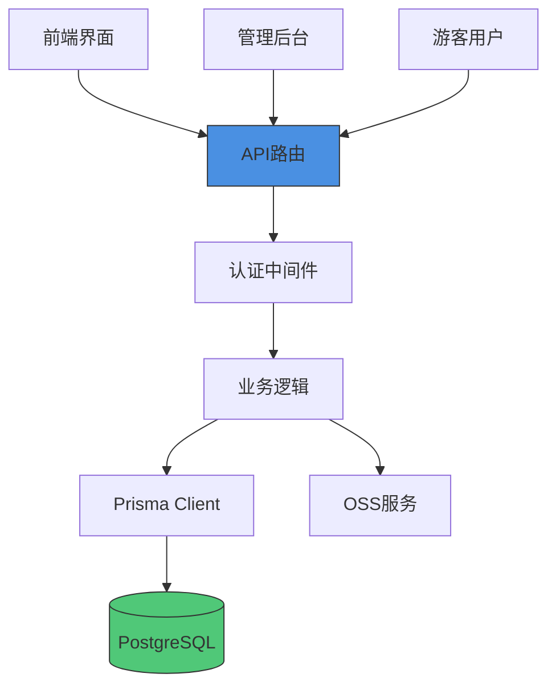
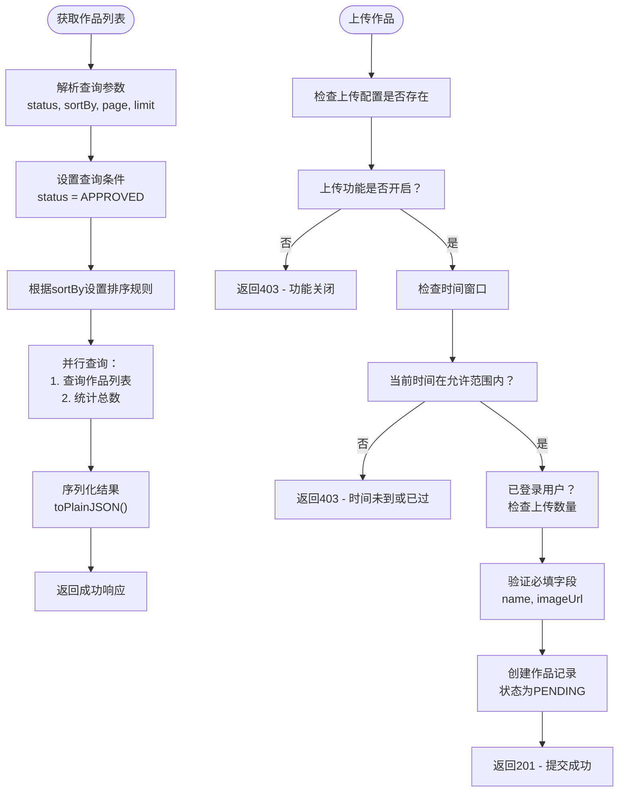
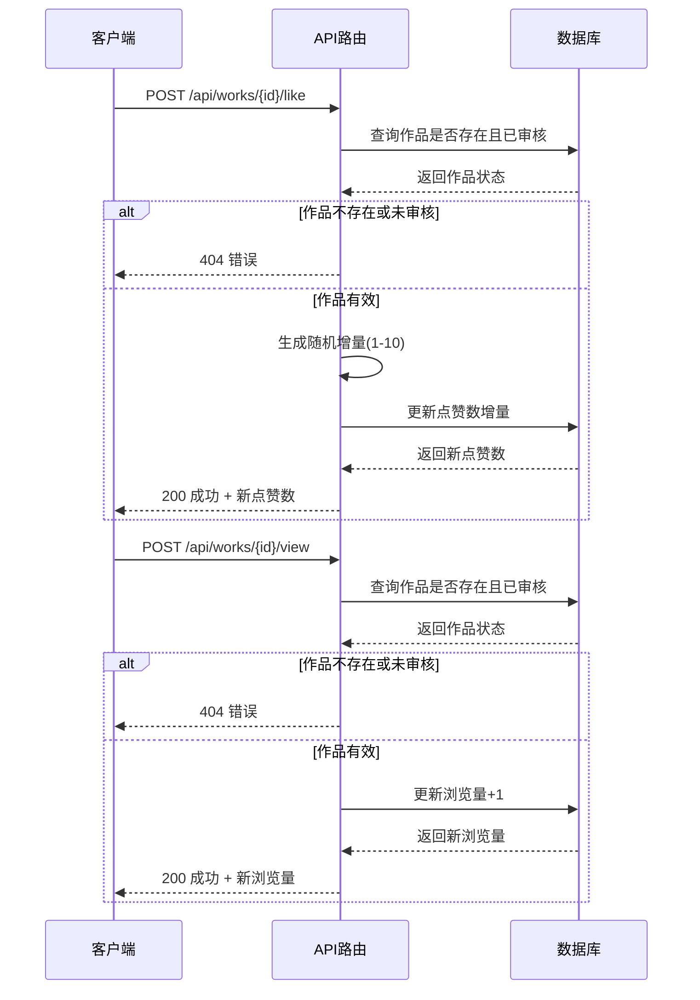
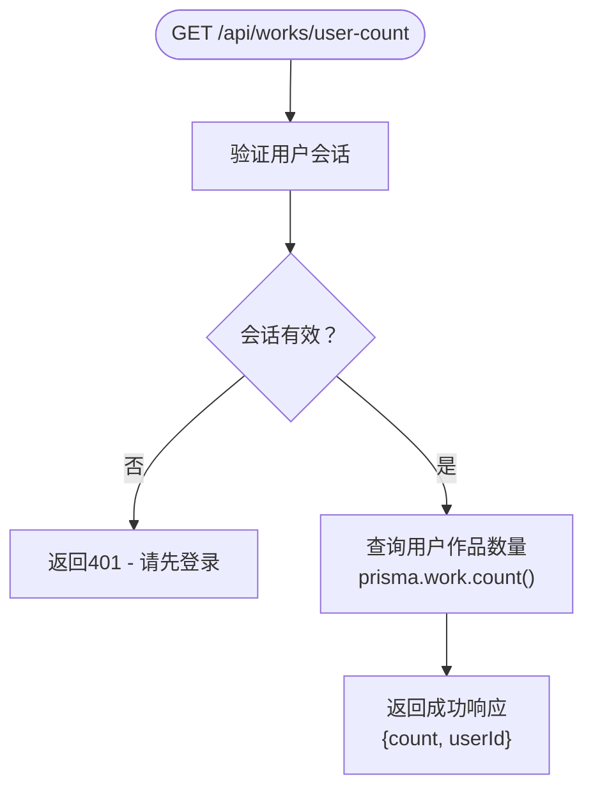
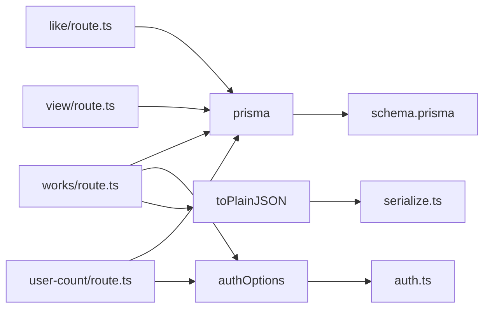

# 作品相关API

<cite>
**本文档引用的文件**
- [works/route.ts](file://src/app/api/works/route.ts)
- [works/[id]/like/route.ts](file://src/app/api/works/[id]/like/route.ts)
- [works/[id]/view/route.ts](file://src/app/api/works/[id]/view/route.ts)
- [works/user-count/route.ts](file://src/app/api/works/user-count/route.ts)
- [work.d.ts](file://src/types/work.d.ts)
- [prisma.ts](file://src/lib/prisma.ts)
- [schema.prisma](file://prisma/schema.prisma)
- [auth.ts](file://src/lib/auth.ts)
- [serialize.ts](file://src/lib/serialize.ts)
</cite>

## 目录
1. [简介](#简介)
2. [项目结构](#项目结构)
3. [核心组件](#核心组件)
4. [架构概览](#架构概览)
5. [详细组件分析](#详细组件分析)
6. [依赖分析](#依赖分析)
7. [性能考虑](#性能考虑)
8. [故障排除指南](#故障排除指南)
9. [结论](#结论)

## 简介
本文档详细描述了数字化作品互动展示平台中的作品相关API接口，涵盖作品列表获取、作品上传、点赞、浏览统计及用户作品数量查询等功能。文档说明了各接口的HTTP方法、请求参数、响应格式、错误码、权限控制逻辑以及性能优化建议，旨在为开发者提供清晰的技术参考。

## 项目结构
项目采用Next.js App Router架构，API路由集中于`src/app/api`目录下。作品相关接口位于`src/app/api/works`路径中，按功能拆分为多个子路由模块。类型定义统一存放于`src/types`目录，数据库模型通过Prisma管理，位于`prisma/schema.prisma`文件中。

```mermaid
graph TB
subgraph "API 路由"
A[/api/works] --> B[/api/works/[id]/like]
A --> C[/api/works/[id]/view]
A --> D[/api/works/user-count]
end
subgraph "类型与配置"
E[types/work.d.ts]
F[prisma/schema.prisma]
end
subgraph "核心逻辑"
G[lib/prisma.ts]
H[lib/auth.ts]
I[lib/serialize.ts]
end
A --> G
B --> G
C --> G
D --> G
D --> H
E --> A
F --> G
```

**图示来源**
- [works/route.ts](file://src/app/api/works/route.ts)
- [works/[id]/like/route.ts](file://src/app/api/works/[id]/like/route.ts)
- [works/[id]/view/route.ts](file://src/app/api/works/[id]/view/route.ts)
- [works/user-count/route.ts](file://src/app/api/works/user-count/route.ts)
- [work.d.ts](file://src/types/work.d.ts)
- [prisma.ts](file://src/lib/prisma.ts)
- [schema.prisma](file://prisma/schema.prisma)

**本节来源**
- [src/app/api](file://src/app/api)
- [prisma/schema.prisma](file://prisma/schema.prisma)

## 核心组件
作品相关API的核心功能包括：获取作品列表（支持分页和排序）、游客上传作品（自动进入审核队列）、用户对已审核作品进行点赞（随机增量）、记录作品浏览量、查询当前登录用户的作品上传数量。所有接口均返回统一格式的JSON响应，包含`success`、`data`、`message`或`error`字段。

**本节来源**
- [works/route.ts](file://src/app/api/works/route.ts#L1-L207)
- [works/[id]/like/route.ts](file://src/app/api/works/[id]/like/route.ts#L1-L65)
- [works/[id]/view/route.ts](file://src/app/api/works/[id]/view/route.ts#L1-L62)
- [works/user-count/route.ts](file://src/app/api/works/user-count/route.ts#L1-L42)

## 架构概览
系统采用前后端分离架构，前端通过Next.js Server Components和客户端组件与后端API交互。API层基于Next.js Route Handlers实现，使用Prisma Client操作PostgreSQL数据库。身份认证通过NextAuth.js实现，支持JWT会话管理。文件存储使用OSS（对象存储服务），并通过`lib/oss.ts`封装上传逻辑。



**图示来源**
- [auth.ts](file://src/lib/auth.ts#L1-L72)
- [prisma.ts](file://src/lib/prisma.ts#L1-L51)
- [schema.prisma](file://prisma/schema.prisma#L1-L169)

## 详细组件分析

### 作品列表获取与上传分析
该组件实现作品列表的分页查询与排序功能，并支持游客上传新作品。列表查询默认仅返回已审核通过的作品，支持按最新、热门或默认（精选优先）排序。上传功能受管理员配置控制，包括开关状态、时间窗口和用户上传数量限制。



**图示来源**
- [works/route.ts](file://src/app/api/works/route.ts#L1-L207)
- [schema.prisma](file://prisma/schema.prisma#L1-L169)

**本节来源**
- [works/route.ts](file://src/app/api/works/route.ts#L1-L207)
- [schema.prisma](file://prisma/schema.prisma#L1-L169)

### 作品点赞与浏览分析
该组件处理作品的互动行为，包括点赞和浏览量统计。两个接口均要求作品处于`APPROVED`状态，否则返回404。点赞接口采用随机增量机制（1-10），增强互动真实感；浏览接口每次调用增加1次浏览量。



**图示来源**
- [works/[id]/like/route.ts](file://src/app/api/works/[id]/like/route.ts#L1-L65)
- [works/[id]/view/route.ts](file://src/app/api/works/[id]/view/route.ts#L1-L62)
- [schema.prisma](file://prisma/schema.prisma#L1-L169)

**本节来源**
- [works/[id]/like/route.ts](file://src/app/api/works/[id]/like/route.ts#L1-L65)
- [works/[id]/view/route.ts](file://src/app/api/works/[id]/view/route.ts#L1-L62)

### 用户作品数量查询分析
该接口用于查询当前登录用户已上传的作品数量，需用户登录后访问。系统通过`getServerSession`验证会话，若未登录则返回401错误。查询结果包含用户ID和作品计数。



**图示来源**
- [works/user-count/route.ts](file://src/app/api/works/user-count/route.ts#L1-L42)
- [auth.ts](file://src/lib/auth.ts#L1-L72)

**本节来源**
- [works/user-count/route.ts](file://src/app/api/works/user-count/route.ts#L1-L42)

## 依赖分析
作品API模块依赖多个核心库和配置文件。主要依赖关系如下：



**图示来源**
- [prisma.ts](file://src/lib/prisma.ts)
- [auth.ts](file://src/lib/auth.ts)
- [serialize.ts](file://src/lib/serialize.ts)
- [schema.prisma](file://prisma/schema.prisma)

**本节来源**
- [prisma.ts](file://src/lib/prisma.ts#L1-L51)
- [auth.ts](file://src/lib/auth.ts#L1-L72)
- [serialize.ts](file://src/lib/serialize.ts#L1-L53)

## 性能考虑
系统在数据库连接、查询优化和响应序列化方面进行了多项性能优化。Prisma客户端配置了连接池参数以适应8核服务器，设置合理的连接超时和空闲超时。列表查询使用`Promise.all`并行执行数据查询和总数统计。响应序列化通过`toPlainJSON`函数处理BigInt和Date类型，避免JSON序列化错误，并优化图片URL优先级。

**本节来源**
- [prisma.ts](file://src/lib/prisma.ts#L1-L51)
- [serialize.ts](file://src/lib/serialize.ts#L1-L53)

## 故障排除指南
常见问题包括：上传功能关闭、时间窗口未到、用户上传数量超限、作品未审核导致无法点赞或浏览。排查时应检查`upload_config`表中的配置项，确认`isEnabled`、`startTime`、`endTime`和`maxUploadsPerUser`值。对于认证问题，检查会话是否有效及JWT令牌是否正确传递。

**本节来源**
- [works/route.ts](file://src/app/api/works/route.ts#L1-L207)
- [works/user-count/route.ts](file://src/app/api/works/user-count/route.ts#L1-L42)

## 结论
作品相关API设计合理，功能完整，具备良好的可扩展性和安全性。通过Prisma ORM实现高效数据库操作，结合NextAuth进行权限控制，支持游客上传与用户互动。建议未来增加缓存机制（如Redis）以减轻数据库压力，特别是在高并发点赞和浏览场景下。