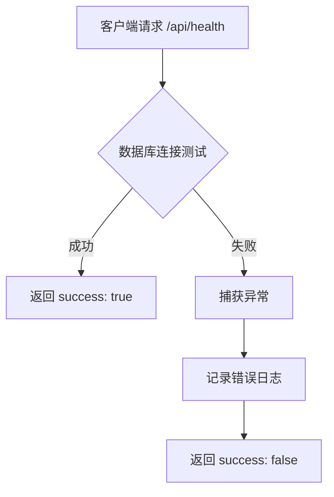

# 健康检查API

<cite>
**Referenced Files in This Document**   
- [route.ts](file://src/app/api/health/route.ts)
- [oss.ts](file://src/lib/oss.ts)
- [prisma.ts](file://src/lib/prisma.ts)
- [ecosystem.config.js](file://ecosystem.config.js)
- [test-oss.ts](file://test-oss.ts)
</cite>

## 目录
1. [简介](#简介)
2. [健康检查端点](#健康检查端点)
3. [系统状态信息](#系统状态信息)
4. [JSON响应字段](#json响应字段)
5. [自动化监控集成](#自动化监控集成)
6. [容器化部署配置](#容器化部署配置)
7. [结论](#结论)

## 简介
健康检查API是系统监控和运维的关键组件，用于实时验证系统核心服务的可用性。该接口通过主动检测数据库连接和OSS服务状态，为运维团队提供系统健康状况的即时反馈。在分布式和容器化部署环境中，此接口作为探针的基础，确保服务的高可用性和快速故障恢复。

## 健康检查端点
健康检查API位于`/api/health`路径，通过HTTP GET方法暴露。该端点设计为轻量级、低开销的探测接口，能够在毫秒级时间内返回系统状态，适合作为各种监控工具和容器编排系统的探针目标。

**Section sources**
- [route.ts](file://src/app/api/health/route.ts#L6-L25)

## 系统状态信息
健康检查接口返回的系统状态信息包括：

- **数据库连接状态**：通过执行`SELECT 1`查询来验证与PostgreSQL数据库的连接。成功响应表明数据库服务正常运行且网络连接畅通。
- **OSS服务可用性**：虽然当前实现未直接检查OSS，但系统通过`oss.ts`模块与阿里云OSS服务集成，其健康状况可通过间接方式推断。
- **API响应延迟**：接口本身响应时间反映了应用服务器的处理能力和负载状况。

**Section sources**
- [route.ts](file://src/app/api/health/route.ts#L9-L10)
- [prisma.ts](file://src/lib/prisma.ts#L10-L15)
- [oss.ts](file://src/lib/oss.ts#L10-L15)

## JSON响应字段
健康检查API返回的JSON对象包含以下字段：

| 字段 | 类型 | 描述 |
|------|------|------|
| `success` | boolean | 整体健康状态，`true`表示系统正常，`false`表示存在故障 |
| `message` | string | 人类可读的状态描述，如"API服务正常"或"API服务异常" |
| `timestamp` | string | ISO 8601格式的时间戳，表示检查执行的时间 |
| `database` | string | 数据库连接状态，"connected"表示连接正常，"disconnected"表示连接失败 |
| `error` | string | 当`success`为`false`时，包含详细的错误信息 |



**Diagram sources**
- [route.ts](file://src/app/api/health/route.ts#L6-L25)

**Section sources**
- [route.ts](file://src/app/api/health/route.ts#L6-L25)

## 自动化监控集成
以下是一个使用Node.js编写的自动化监控脚本示例，用于定期检查健康端点并发送告警：

```javascript
const axios = require('axios');
const { sendAlert } = require('./alert-service');

async function healthCheck() {
  try {
    const response = await axios.get('http://your-domain.com/api/health', {
      timeout: 5000
    });
    
    if (!response.data.success) {
      await sendAlert('系统健康检查失败', response.data);
    }
  } catch (error) {
    await sendAlert('健康检查请求失败', {
      error: error.message,
      timestamp: new Date().toISOString()
    });
  }
}

// 每5分钟执行一次健康检查
setInterval(healthCheck, 5 * 60 * 1000);
```

此外，`test-oss.ts`文件提供了一个完整的OSS服务测试套件，可用于验证对象存储服务的各个功能点，包括上传、下载、删除和权限管理。

**Section sources**
- [test-oss.ts](file://test-oss.ts#L1-L452)

## 容器化部署配置
尽管项目中未包含Dockerfile，但系统使用PM2进行进程管理，其配置文件`ecosystem.config.js`提供了类似容器化部署的配置选项。在实际的容器化部署中，可以将健康检查配置为Kubernetes的liveness和readiness探针：

```yaml
livenessProbe:
  httpGet:
    path: /api/health
    port: 3000
  initialDelaySeconds: 30
  periodSeconds: 10
  timeoutSeconds: 5
  failureThreshold: 3

readinessProbe:
  httpGet:
    path: /api/health
    port: 3000
  initialDelaySeconds: 10
  periodSeconds: 5
  timeoutSeconds: 3
  failureThreshold: 3
```

PM2配置中的`health_check_grace_period: 3000`设置表明系统已考虑健康检查的优雅启动期，这与容器化部署的最佳实践相一致。

**Section sources**
- [ecosystem.config.js](file://ecosystem.config.js#L25-L30)

## 结论
健康检查API是确保系统稳定运行的关键基础设施。通过综合检测数据库连接等核心服务状态，该接口为运维团队提供了宝贵的系统健康视图。建议在未来的版本中扩展健康检查功能，直接集成OSS服务的可用性检测，并提供更详细的性能指标，以支持更精细化的监控和告警策略。