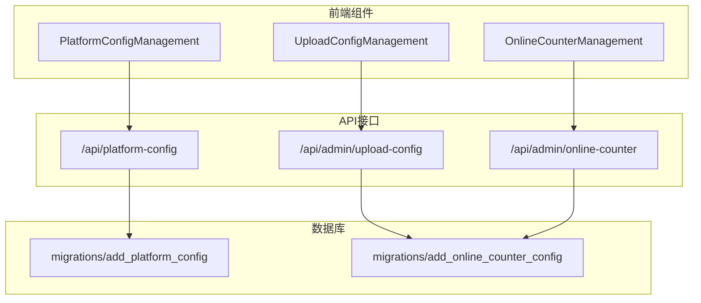
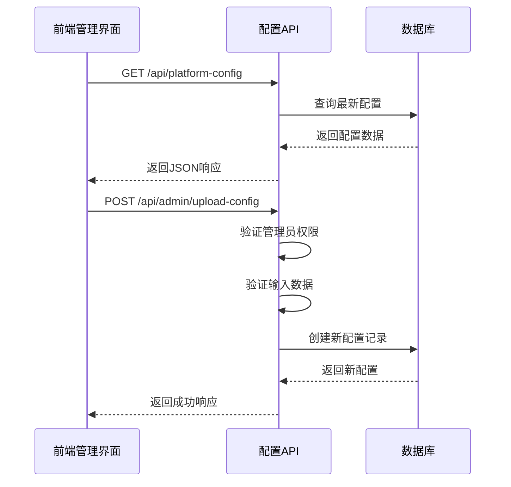
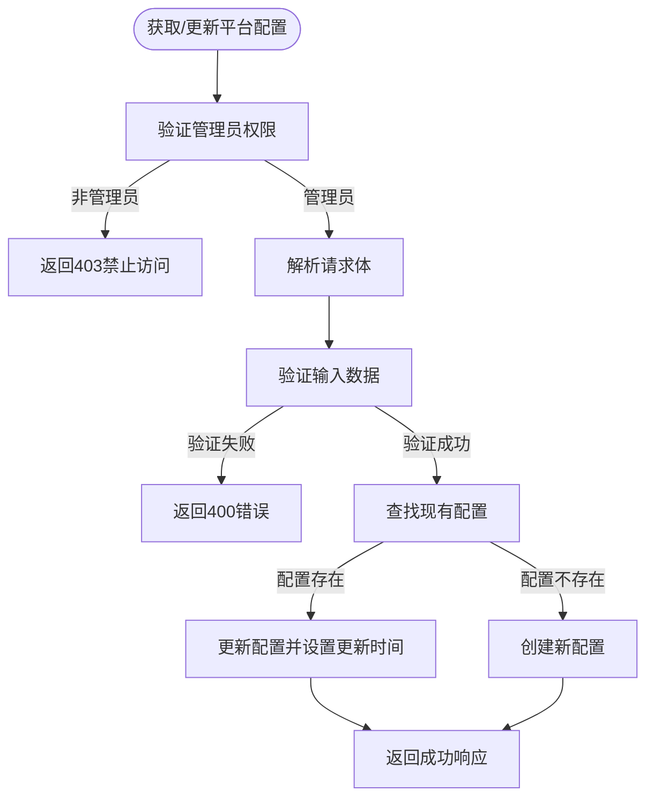
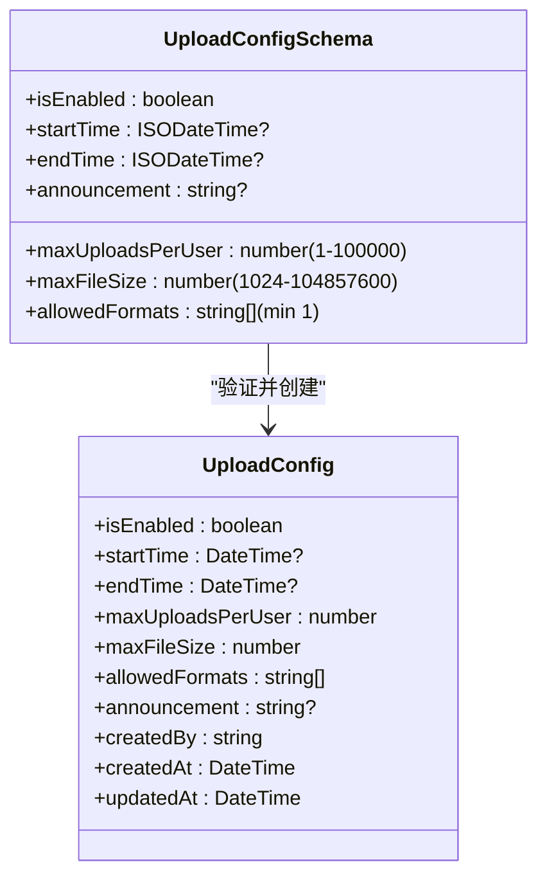
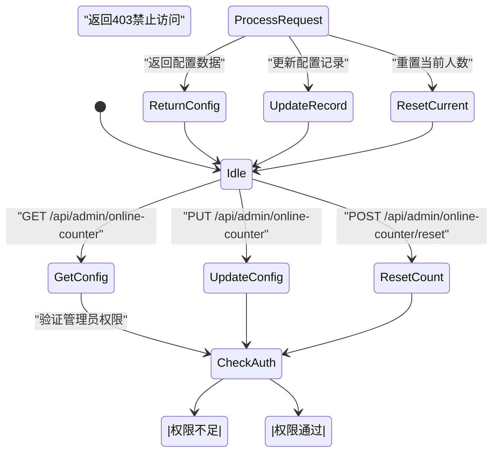
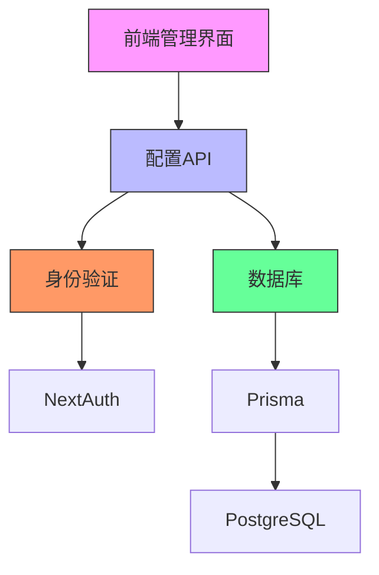

# 平台配置API

<cite>
**本文档引用的文件**
- [platform-config/route.ts](file://src/app/api/platform-config/route.ts)
- [admin/upload-config/route.ts](file://src/app/api/admin/upload-config/route.ts)
- [admin/online-counter/route.ts](file://src/app/api/admin/online-counter/route.ts)
- [migrations/20250905150839_add_platform_config/migration.sql](file://prisma/migrations/20250905150839_add_platform_config/migration.sql)
- [migrations/20250905143157_add_online_counter_config/migration.sql](file://prisma/migrations/20250905143157_add_online_counter_config/migration.sql)
- [migrations/20250905143157_add_online_counter_config/migration.sql](file://prisma/migrations/20250905143157_add_online_counter_config/migration.sql)
- [init-online-counter.ts](file://src/lib/init-online-counter.ts)
- [PlatformConfigManagement.tsx](file://src/components/admin/PlatformConfigManagement.tsx)
- [UploadConfigManagement.tsx](file://src/components/admin/UploadConfigManagement.tsx)
- [OnlineCounterManagement.tsx](file://src/components/admin/OnlineCounterManagement.tsx)
</cite>

## 目录
1. [简介](#简介)
2. [项目结构](#项目结构)
3. [核心组件](#核心组件)
4. [架构概述](#架构概述)
5. [详细组件分析](#详细组件分析)
6. [依赖分析](#依赖分析)
7. [性能考虑](#性能考虑)
8. [故障排除指南](#故障排除指南)
9. [结论](#结论)

## 简介
本文档详细说明了数字化作品互动展示平台的平台级配置管理API，涵盖平台通用配置、上传配置和在线计数器配置。文档描述了管理员如何通过API读取和更新系统配置，详细说明了各配置项的数据结构、数据验证规则、安全控制机制以及配置变更的生效方式。同时提供了配置同步到前端的推荐模式，帮助管理员高效管理平台各项参数。

## 项目结构
平台配置相关的API端点位于`src/app/api`目录下，分为公共访问和管理员专用接口。数据库配置通过Prisma迁移文件定义，前端管理界面组件位于`src/components/admin`目录。

**图示来源**
- [platform-config/route.ts](file://src/app/api/platform-config/route.ts)
- [admin/upload-config/route.ts](file://src/app/api/admin/upload-config/route.ts)
- [admin/online-counter/route.ts](file://src/app/api/admin/online-counter/route.ts)
- [migrations/20250905150839_add_platform_config/migration.sql](file://prisma/migrations/20250905150839_add_platform_config/migration.sql)
- [migrations/20250905143157_add_online_counter_config/migration.sql](file://prisma/migrations/20250905143157_add_online_counter_config/migration.sql)

**本节来源**
- [src/app/api](file://src/app/api)
- [prisma/migrations](file://prisma/migrations)
- [src/components/admin](file://src/components/admin)

## 核心组件
平台配置管理包含三个核心API组件：平台通用配置、上传配置和在线计数器配置。这些组件均采用RESTful设计模式，通过GET方法读取配置，通过POST/PUT方法更新配置。所有管理员专用配置接口均实施严格的身份验证和角色权限控制，确保只有管理员用户才能修改系统配置。

**本节来源**
- [platform-config/route.ts](file://src/app/api/platform-config/route.ts)
- [admin/upload-config/route.ts](file://src/app/api/admin/upload-config/route.ts)
- [admin/online-counter/route.ts](file://src/app/api/admin/online-counter/route.ts)

## 架构概述
平台配置管理采用分层架构设计，前端管理界面通过API与后端服务通信，后端服务通过Prisma ORM与数据库交互。配置数据存储在数据库中，每次读取时返回最新记录，更新时创建新记录而非修改旧记录，实现配置变更的历史追踪。

**图示来源**
- [platform-config/route.ts](file://src/app/api/platform-config/route.ts)
- [admin/upload-config/route.ts](file://src/app/api/admin/upload-config/route.ts)
- [admin/online-counter/route.ts](file://src/app/api/admin/online-counter/route.ts)

## 详细组件分析

### 平台通用配置分析
平台通用配置API提供对平台主标题的读取和更新功能。GET请求返回当前配置，若无配置则创建默认配置。POST请求用于更新配置，仅允许管理员访问。

**图示来源**
- [platform-config/route.ts](file://src/app/api/platform-config/route.ts#L0-L113)

**本节来源**
- [platform-config/route.ts](file://src/app/api/platform-config/route.ts#L0-L113)
- [PlatformConfigManagement.tsx](file://src/components/admin/PlatformConfigManagement.tsx#L0-L143)

### 上传配置分析
上传配置管理用户作品上传的相关设置，包括功能开关、时间限制、数量限制、文件大小和格式限制等。系统采用创建新记录的方式保存配置变更，保留历史配置记录。

**图示来源**
- [admin/upload-config/route.ts](file://src/app/api/admin/upload-config/route.ts#L0-L150)
- [UploadConfigManagement.tsx](file://src/components/admin/UploadConfigManagement.tsx#L0-L333)

**本节来源**
- [admin/upload-config/route.ts](file://src/app/api/admin/upload-config/route.ts#L0-L150)
- [UploadConfigManagement.tsx](file://src/components/admin/UploadConfigManagement.tsx#L0-L333)

### 在线计数器配置分析
在线计数器配置管理平台实时在线人数的显示和行为。系统支持获取配置、更新配置和重置人数三种操作，所有操作均需管理员权限。

**图示来源**
- [admin/online-counter/route.ts](file://src/app/api/admin/online-counter/route.ts#L0-L175)
- [OnlineCounterManagement.tsx](file://src/components/admin/OnlineCounterManagement.tsx#L0-L323)

**本节来源**
- [admin/online-counter/route.ts](file://src/app/api/admin/online-counter/route.ts#L0-L175)
- [OnlineCounterManagement.tsx](file://src/components/admin/OnlineCounterManagement.tsx#L0-L323)

## 依赖分析
平台配置管理组件依赖于身份验证系统、数据库访问层和前端管理界面。各组件之间通过清晰的API边界进行通信，确保了系统的模块化和可维护性。

**图示来源**
- [platform-config/route.ts](file://src/app/api/platform-config/route.ts)
- [admin/upload-config/route.ts](file://src/app/api/admin/upload-config/route.ts)
- [admin/online-counter/route.ts](file://src/app/api/admin/online-counter/route.ts)
- [authOptions](file://src/lib/auth.ts)

**本节来源**
- [src/lib/auth.ts](file://src/lib/auth.ts)
- [src/lib/prisma.ts](file://src/lib/prisma.ts)
- [package.json](file://package.json)

## 性能考虑
配置管理API的性能主要受数据库查询和身份验证开销影响。由于配置数据量小且访问频率相对较低，系统性能表现良好。建议在高并发场景下考虑对公共配置接口添加缓存机制，以减少数据库查询压力。

## 故障排除指南
当配置管理功能出现问题时，可参考以下常见问题及解决方案：

**本节来源**
- [platform-config/route.ts](file://src/app/api/platform-config/route.ts)
- [admin/upload-config/route.ts](file://src/app/api/admin/upload-config/route.ts)
- [admin/online-counter/route.ts](file://src/app/api/admin/online-counter/route.ts)

## 结论
平台配置管理API为管理员提供了安全、可靠的系统参数管理能力。通过清晰的RESTful接口设计、严格的权限控制和完善的错误处理机制，确保了配置管理的安全性和稳定性。各配置项的变更立即生效，无需重启服务，提高了运维效率。前端管理界面与后端API紧密配合，为管理员提供了友好的操作体验。