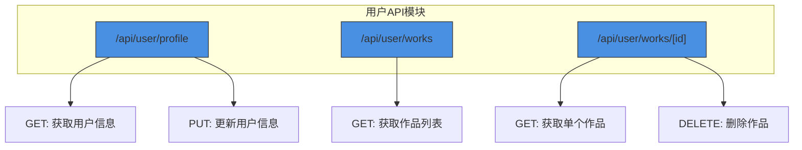
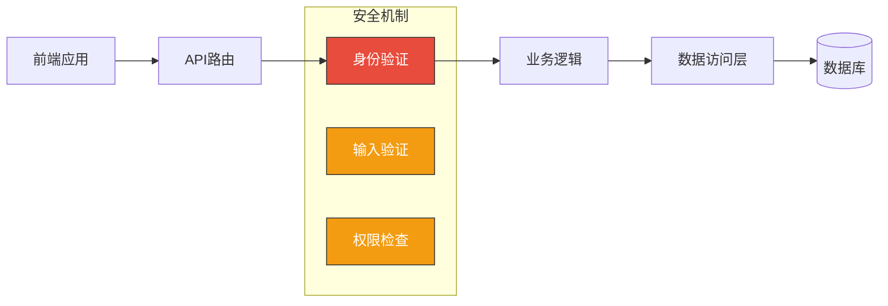
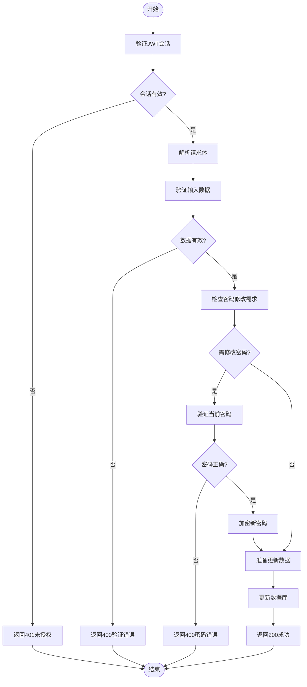
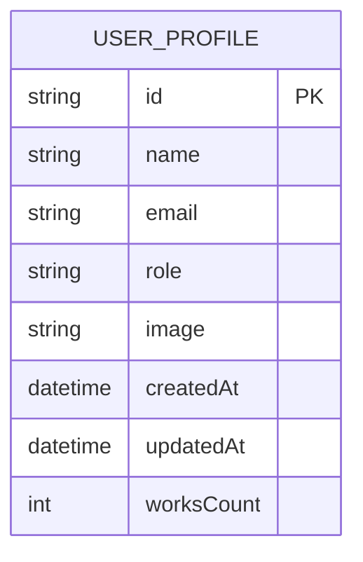
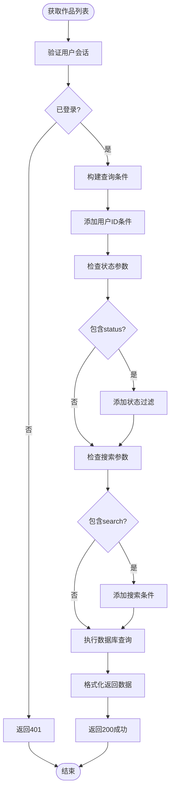
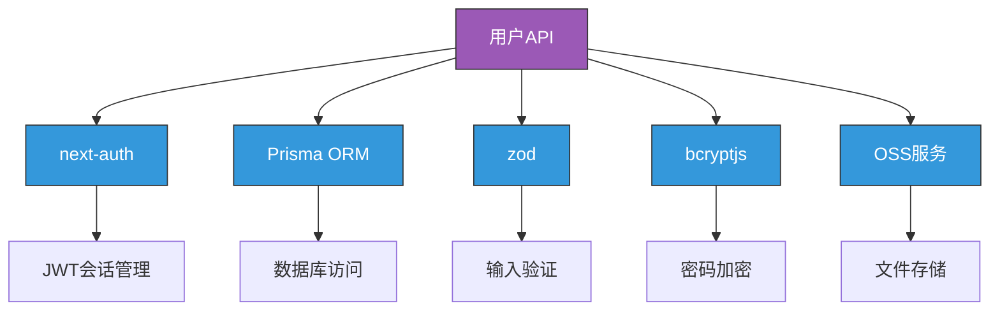

# 用户相关API

<cite>
**本文档引用的文件**  
- [profile/route.ts](file://src/app/api/user/profile/route.ts)
- [works/route.ts](file://src/app/api/user/works/route.ts)
- [works/[id]/route.ts](file://src/app/api/user/works/[id]/route.ts)
- [auth.ts](file://src/lib/auth.ts)
</cite>

## 目录
1. [简介](#简介)
2. [项目结构](#项目结构)
3. [核心组件](#核心组件)
4. [架构概览](#架构概览)
5. [详细组件分析](#详细组件分析)
6. [依赖分析](#依赖分析)
7. [性能考虑](#性能考虑)
8. [故障排除指南](#故障排除指南)
9. [结论](#结论)

## 简介
本文档详细描述了数字化作品互动展示平台中与用户个人数据相关的API接口，涵盖用户资料获取与更新、用户作品列表查询等功能。文档说明了系统的认证机制（基于JWT的会话管理）、请求验证流程、数据返回结构、隐私保护措施以及前端调用示例。同时解释了输入验证规则和错误反馈机制，确保开发者能够安全、高效地集成和使用这些接口。

## 项目结构
用户相关API位于`src/app/api/user`目录下，采用Next.js App Router的路由结构，分为`profile`和`works`两个子模块，分别处理用户信息和作品管理功能。

**Diagram sources**  
- [profile/route.ts](file://src/app/api/user/profile/route.ts#L1-L235)
- [works/route.ts](file://src/app/api/user/works/route.ts#L1-L125)
- [works/[id]/route.ts](file://src/app/api/user/works/[id]/route.ts#L1-L139)

**Section sources**  
- [profile/route.ts](file://src/app/api/user/profile/route.ts#L1-L235)
- [works/route.ts](file://src/app/api/user/works/route.ts#L1-L125)

## 核心组件
本节分析用户个人数据相关的核心API组件，包括用户资料管理、作品列表查询与管理等功能。所有接口均通过JWT会话进行身份验证，确保用户数据的安全性和隐私性。

**Section sources**  
- [profile/route.ts](file://src/app/api/user/profile/route.ts#L1-L235)
- [works/route.ts](file://src/app/api/user/works/route.ts#L1-L125)
- [works/[id]/route.ts](file://src/app/api/user/works/[id]/route.ts#L1-L139)

## 架构概览
系统采用分层架构，前端通过API路由调用后端服务，所有用户相关操作均需通过身份验证。数据持久化通过Prisma ORM与数据库交互，敏感操作（如密码修改）使用bcrypt加密处理。

**Diagram sources**  
- [auth.ts](file://src/lib/auth.ts#L1-L71)
- [profile/route.ts](file://src/app/api/user/profile/route.ts#L1-L235)

## 详细组件分析

### 用户资料管理分析
该组件提供用户信息的获取与更新功能，包含严格的输入验证和密码安全机制。

#### 请求验证流程

**Diagram sources**  
- [profile/route.ts](file://src/app/api/user/profile/route.ts#L1-L235)

#### 数据返回结构

**Diagram sources**  
- [profile/route.ts](file://src/app/api/user/profile/route.ts#L65-L75)
- [profile/route.ts](file://src/app/api/user/profile/route.ts#L175-L185)

**Section sources**  
- [profile/route.ts](file://src/app/api/user/profile/route.ts#L1-L235)

### 用户作品管理分析
该组件提供用户作品的查询、详情获取和删除功能，实现了基于用户身份的数据隔离。

#### 作品状态过滤逻辑

**Diagram sources**  
- [works/route.ts](file://src/app/api/user/works/route.ts#L35-L125)

#### 输入验证规则
- **用户名长度**：1-50个字符
- **邮箱格式**：必须为有效邮箱地址
- **密码长度**：至少6位，不超过100位
- **分页参数**：page和limit必须为正整数
- **搜索关键词**：支持不区分大小写的标题和描述模糊匹配

**Section sources**  
- [works/route.ts](file://src/app/api/user/works/route.ts#L1-L125)
- [works/[id]/route.ts](file://src/app/api/user/works/[id]/route.ts#L1-L139)

## 依赖分析
用户API模块依赖于多个核心库和配置文件，形成完整的功能链路。

**Diagram sources**  
- [auth.ts](file://src/lib/auth.ts#L1-L71)
- [profile/route.ts](file://src/app/api/user/profile/route.ts#L1-L235)
- [works/route.ts](file://src/app/api/user/works/route.ts#L1-L125)

**Section sources**  
- [auth.ts](file://src/lib/auth.ts#L1-L71)
- [profile/route.ts](file://src/app/api/user/profile/route.ts#L1-L235)

## 性能考虑
- 所有数据库查询均使用`select`字段限制返回数据量
- 作品列表查询采用分页机制，避免大数据量加载
- 使用`Promise.all`并行执行总数统计和列表查询
- 敏感字段（如密码）在任何响应中均不返回
- 图片路径通过OSS服务管理，减轻服务器负载

## 故障排除指南
常见错误及解决方案：

| 错误代码 | 错误信息 | 原因 | 解决方案 |
|---------|--------|------|---------|
| UNAUTHORIZED | 请先登录 | 未提供有效会话 | 检查认证状态，重新登录 |
| VALIDATION_ERROR | 输入数据无效 | 请求数据不符合验证规则 | 检查请求体字段和格式 |
| EMAIL_EXISTS | 该邮箱已被使用 | 邮箱重复 | 使用其他邮箱地址 |
| INVALID_PASSWORD | 当前密码不正确 | 密码验证失败 | 确认当前密码正确 |
| NOT_FOUND | 作品不存在或无权访问 | ID错误或权限不足 | 确认作品ID和用户身份 |

**Section sources**  
- [profile/route.ts](file://src/app/api/user/profile/route.ts#L1-L235)
- [works/route.ts](file://src/app/api/user/works/route.ts#L1-L125)

## 结论
本文档全面介绍了用户个人数据相关API的设计与实现。系统通过JWT会话认证确保安全性，采用严格的输入验证防止非法数据，通过用户ID绑定实现数据隔离保护隐私。建议前端在调用时妥善处理各种错误状态，并遵循最佳实践进行数据缓存和用户体验优化。