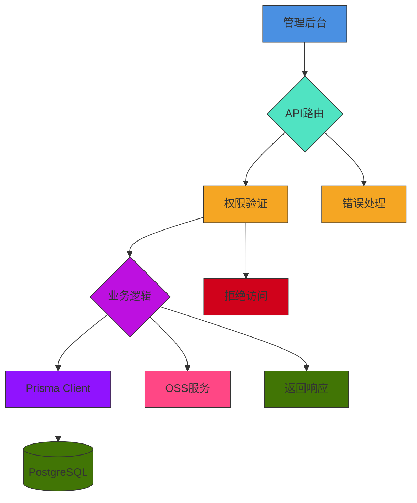
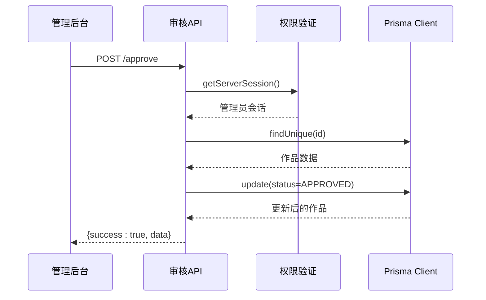
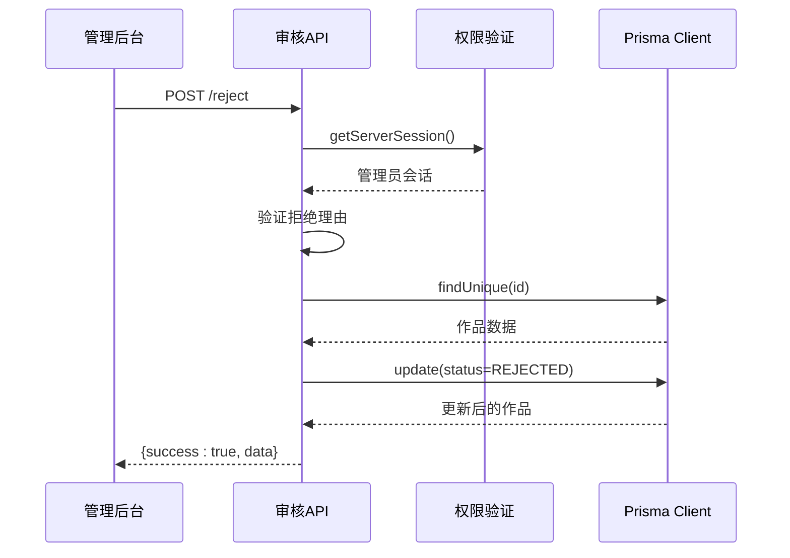
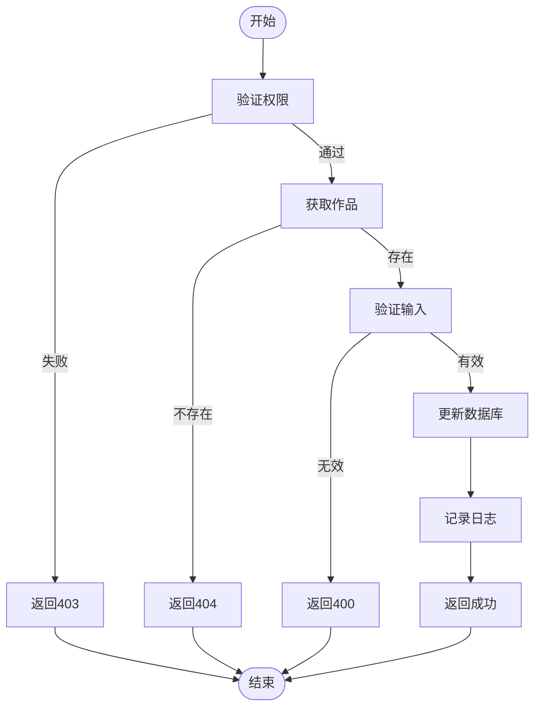
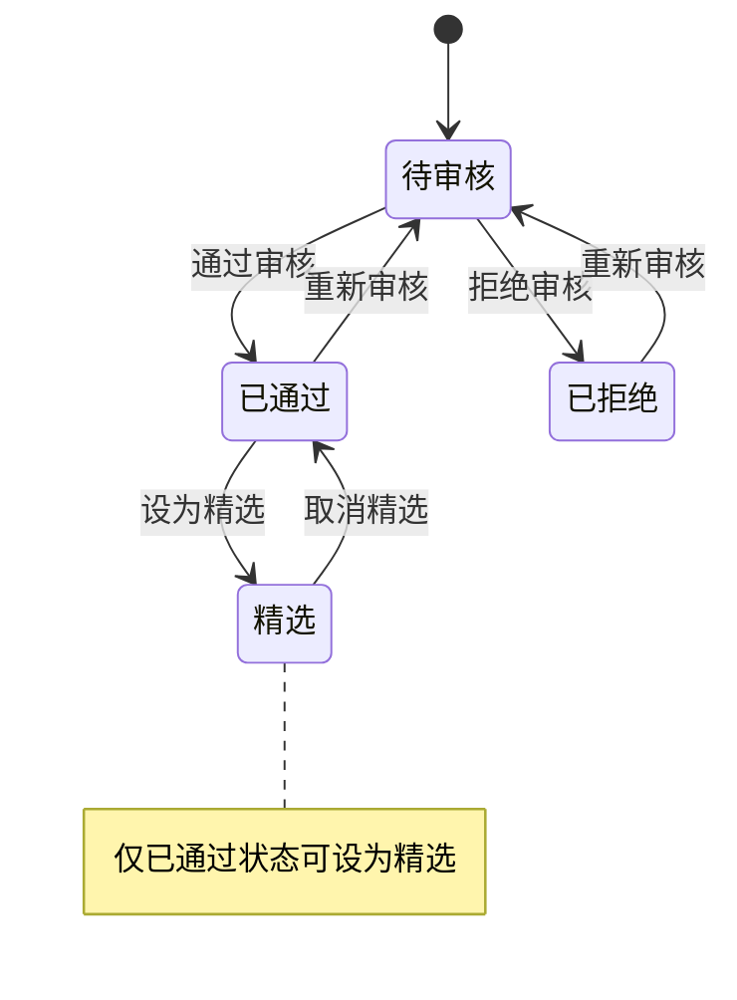
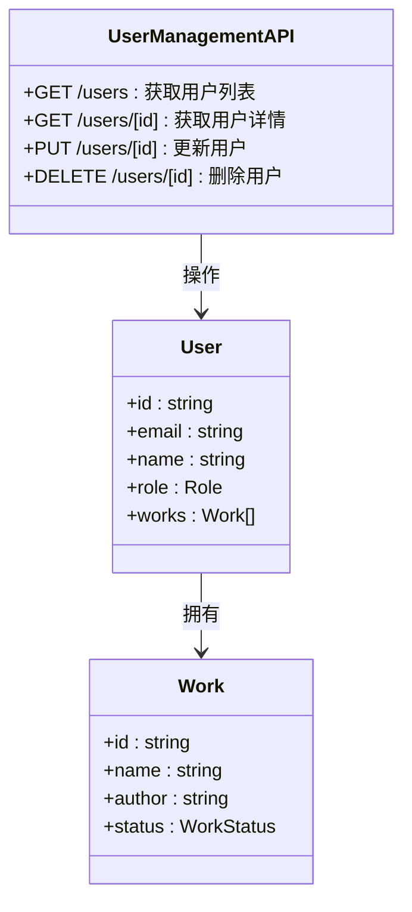
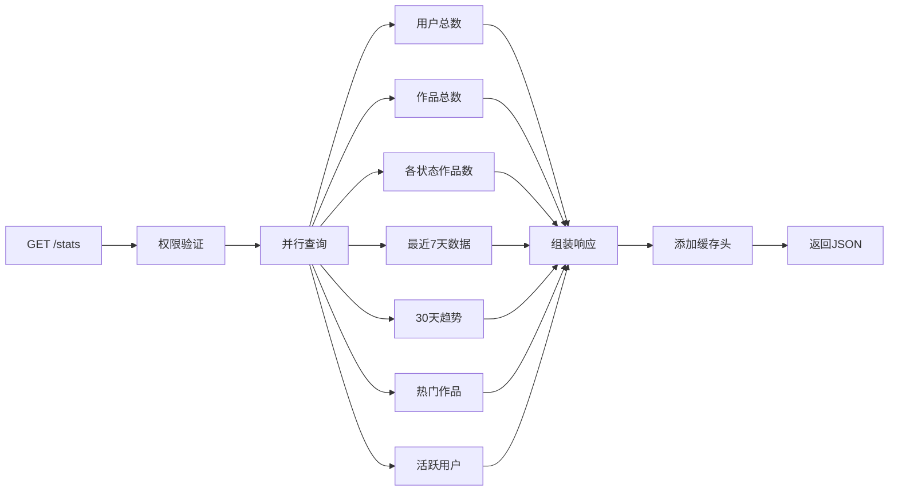
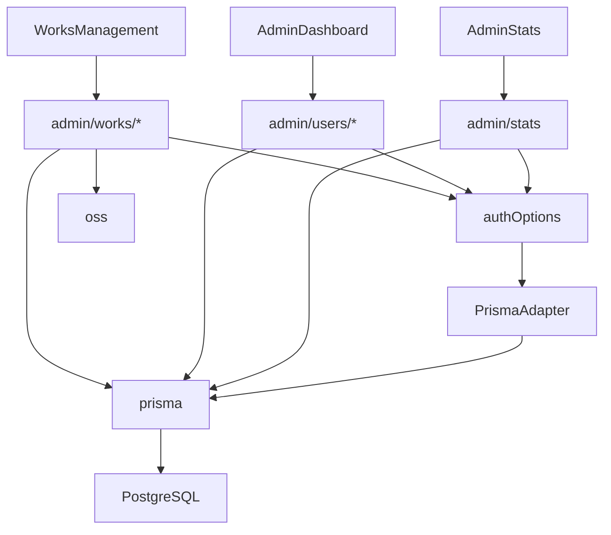

# 管理员API

<cite>
**本文档引用文件**  
- [approve/route.ts](file://src/app/api/admin/works/[id]/approve/route.ts)
- [reject/route.ts](file://src/app/api/admin/works/[id]/reject/route.ts)
- [edit/route.ts](file://src/app/api/admin/works/[id]/edit/route.ts)
- [featured/route.ts](file://src/app/api/admin/works/[id]/featured/route.ts)
- [users/[id]/route.ts](file://src/app/api/admin/users/[id]/route.ts)
- [users/route.ts](file://src/app/api/admin/users/route.ts)
- [stats/route.ts](file://src/app/api/admin/stats/route.ts)
- [works/route.ts](file://src/app/api/admin/works/route.ts)
- [WorksManagement.tsx](file://src/components/admin/WorksManagement.tsx)
- [auth.ts](file://src/lib/auth.ts)
- [work.d.ts](file://src/types/work.d.ts)
- [schema.prisma](file://prisma/schema.prisma)
</cite>

## 目录
1. [简介](#简介)
2. [项目结构](#项目结构)
3. [核心组件](#核心组件)
4. [架构概览](#架构概览)
5. [详细组件分析](#详细组件分析)
6. [依赖分析](#依赖分析)
7. [性能考虑](#性能考虑)
8. [故障排除指南](#故障排除指南)
9. [结论](#结论)

## 简介
本文档全面介绍了数字化作品互动展示平台的管理员专用API，涵盖作品审核（通过/拒绝）、作品编辑、设为推荐、用户管理及统计信息获取等核心功能。所有接口均需管理员角色认证，采用Next.js App Router架构，基于Prisma ORM与PostgreSQL数据库实现。文档详细说明了各接口的HTTP方法、请求/响应结构、状态转换逻辑、权限验证流程及敏感操作日志记录机制，并提供管理后台调用示例与常见错误处理方案。

## 项目结构
管理员API位于`src/app/api/admin`目录下，按功能模块组织。核心管理功能包括作品管理、用户管理和统计信息获取，均通过RESTful风格的API端点实现。前端组件位于`src/components/admin`，使用React客户端组件与自定义Hook（如`useApi`）进行API调用。数据模型定义于Prisma Schema，权限控制通过NextAuth集成实现。

```mermaid
graph TB
subgraph "API端点"
A[/api/admin/works]
B[/api/admin/works/[id]/approve]
C[/api/admin/works/[id]/reject]
D[/api/admin/works/[id]/edit]
E[/api/admin/works/[id]/featured]
F[/api/admin/users]
G[/api/admin/users/[id]]
H[/api/admin/stats]
end
subgraph "前端组件"
I[WorksManagement]
J[AdminDashboard]
K[AdminStats]
end
subgraph "核心库"
L[auth.ts]
M[prisma.ts]
N[oss.ts]
end
subgraph "数据模型"
O[schema.prisma]
end
I --> A
I --> B
I --> C
I --> D
I --> E
J --> F
J --> G
K --> H
A --> L
B --> L
C --> L
D --> L
E --> L
F --> L
G --> L
H --> L
A --> M
B --> M
C --> M
D --> M
E --> M
F --> M
G --> M
H --> M
D --> N
O --> M
```

**图示来源**  
- [works/route.ts](file://src/app/api/admin/works/route.ts)
- [approve/route.ts](file://src/app/api/admin/works/[id]/approve/route.ts)
- [reject/route.ts](file://src/app/api/admin/works/[id]/reject/route.ts)
- [edit/route.ts](file://src/app/api/admin/works/[id]/edit/route.ts)
- [featured/route.ts](file://src/app/api/admin/works/[id]/featured/route.ts)
- [users/route.ts](file://src/app/api/admin/users/route.ts)
- [users/[id]/route.ts](file://src/app/api/admin/users/[id]/route.ts)
- [stats/route.ts](file://src/app/api/admin/stats/route.ts)
- [WorksManagement.tsx](file://src/components/admin/WorksManagement.tsx)
- [auth.ts](file://src/lib/auth.ts)
- [prisma.ts](file://src/lib/prisma.ts)
- [oss.ts](file://src/lib/oss.ts)
- [schema.prisma](file://prisma/schema.prisma)

**本节来源**  
- [src/app/api/admin](file://src/app/api/admin)
- [src/components/admin](file://src/components/admin)

## 核心组件
核心组件包括管理员作品管理API（审核、编辑、精选）、用户管理API（增删改查）和统计信息API。所有操作均通过`getServerSession`进行管理员权限验证，确保只有`Role.ADMIN`用户可访问。作品状态机包含`PENDING`、`APPROVED`、`REJECTED`三种状态，状态转换受严格业务规则约束。敏感操作如删除用户、批量删除作品均记录操作日志并处理关联数据（如删除用户时级联删除其作品）。

**本节来源**  
- [approve/route.ts](file://src/app/api/admin/works/[id]/approve/route.ts#L1-L75)
- [reject/route.ts](file://src/app/api/admin/works/[id]/reject/route.ts#L1-L94)
- [edit/route.ts](file://src/app/api/admin/works/[id]/edit/route.ts#L1-L180)
- [featured/route.ts](file://src/app/api/admin/works/[id]/featured/route.ts#L1-L90)
- [users/[id]/route.ts](file://src/app/api/admin/users/[id]/route.ts#L1-L225)
- [users/route.ts](file://src/app/api/admin/users/route.ts#L1-L94)
- [stats/route.ts](file://src/app/api/admin/stats/route.ts#L1-L162)
- [schema.prisma](file://prisma/schema.prisma#L120-L168)

## 架构概览
系统采用分层架构：前端管理界面通过API路由调用后端服务，服务层通过Prisma Client访问数据库。权限验证在API入口处完成，使用NextAuth的JWT会话策略，管理员角色信息存储在会话令牌中。数据访问层通过Prisma ORM实现类型安全的数据库操作，支持事务和批量操作。文件存储通过OSS服务集成，删除作品时自动清理OSS文件。



**图示来源**  
- [auth.ts](file://src/lib/auth.ts#L1-L71)
- [prisma.ts](file://src/lib/prisma.ts#L1-L50)
- [oss.ts](file://src/lib/oss.ts)
- [approve/route.ts](file://src/app/api/admin/works/[id]/approve/route.ts)
- [reject/route.ts](file://src/app/api/admin/works/[id]/reject/route.ts)
- [edit/route.ts](file://src/app/api/admin/works/[id]/edit/route.ts)
- [featured/route.ts](file://src/app/api/admin/works/[id]/featured/route.ts)
- [users/[id]/route.ts](file://src/app/api/admin/users/[id]/route.ts)
- [users/route.ts](file://src/app/api/admin/users/route.ts)
- [stats/route.ts](file://src/app/api/admin/stats/route.ts)

## 详细组件分析

### 作品审核功能分析
管理员可通过`/api/admin/works/[id]/approve`和`/api/admin/works/[id]/reject`端点审核作品。审核通过时，状态从`PENDING`变为`APPROVED`，并记录`approvedAt`时间；审核拒绝时，需提供拒绝理由，状态变为`REJECTED`，并记录`rejectedAt`和`rejectReason`。仅`PENDING`状态的作品可被审核，确保状态转换的合法性。

#### 作品审核通过序列图


**图示来源**  
- [approve/route.ts](file://src/app/api/admin/works/[id]/approve/route.ts#L1-L75)

#### 作品审核拒绝序列图


**图示来源**  
- [reject/route.ts](file://src/app/api/admin/works/[id]/reject/route.ts#L1-L94)

**本节来源**  
- [approve/route.ts](file://src/app/api/admin/works/[id]/approve/route.ts#L1-L75)
- [reject/route.ts](file://src/app/api/admin/works/[id]/reject/route.ts#L1-L94)
- [WorksManagement.tsx](file://src/components/admin/WorksManagement.tsx#L1-L782)

### 作品编辑功能分析
管理员可通过`/api/admin/works/[id]/edit`端点编辑作品信息。支持PUT方法更新作品名称、作者和提示词，GET方法获取当前作品信息用于填充表单。输入数据通过Zod模式验证，确保数据完整性。编辑操作记录`updatedAt`时间戳，并在控制台输出操作日志。

#### 作品编辑流程图


**图示来源**  
- [edit/route.ts](file://src/app/api/admin/works/[id]/edit/route.ts#L1-L180)

**本节来源**  
- [edit/route.ts](file://src/app/api/admin/works/[id]/edit/route.ts#L1-L180)
- [WorksManagement.tsx](file://src/components/admin/WorksManagement.tsx#L1-L782)

### 作品精选功能分析
管理员可通过`/api/admin/works/[id]/featured`端点设置作品为精选。仅`APPROVED`状态的作品可被设为精选，防止未审核作品进入精选列表。操作使用PATCH方法，接收`{featured: boolean}`请求体，更新`featured`布尔字段。

#### 作品精选状态转换


**图示来源**  
- [featured/route.ts](file://src/app/api/admin/works/[id]/featured/route.ts#L1-L90)
- [schema.prisma](file://prisma/schema.prisma#L120-L168)

**本节来源**  
- [featured/route.ts](file://src/app/api/admin/works/[id]/featured/route.ts#L1-L90)
- [WorksManagement.tsx](file://src/components/admin/WorksManagement.tsx#L1-L782)

### 用户管理功能分析
管理员可通过`/api/admin/users`和`/api/admin/users/[id]`端点管理用户。支持GET查询用户列表（可分页、搜索、按角色筛选），PUT更新用户信息（姓名、邮箱、角色），DELETE删除用户。删除用户时，先删除其所有作品，再删除用户记录，确保数据一致性。

#### 用户管理API类图


**图示来源**  
- [users/route.ts](file://src/app/api/admin/users/route.ts#L1-L94)
- [users/[id]/route.ts](file://src/app/api/admin/users/[id]/route.ts#L1-L225)
- [schema.prisma](file://prisma/schema.prisma#L1-L168)

**本节来源**  
- [users/route.ts](file://src/app/api/admin/users/route.ts#L1-L94)
- [users/[id]/route.ts](file://src/app/api/admin/users/[id]/route.ts#L1-L225)
- [schema.prisma](file://prisma/schema.prisma#L1-L168)

### 统计信息功能分析
管理员可通过`/api/admin/stats`端点获取平台统计数据。包括用户总数、作品总数、各状态作品数量、最近7天新增数据、最近30天每日趋势图、热门作品和活跃用户列表。响应添加缓存头，提高性能。

#### 统计信息API数据流


**图示来源**  
- [stats/route.ts](file://src/app/api/admin/stats/route.ts#L1-L162)

**本节来源**  
- [stats/route.ts](file://src/app/api/admin/stats/route.ts#L1-L162)

## 依赖分析
系统依赖关系清晰，前端组件依赖API端点，API端点依赖认证库和数据库客户端。Prisma Client是核心依赖，连接所有数据操作。NextAuth提供认证服务，其适配器与Prisma集成。OSS服务用于文件存储，与作品管理功能耦合。类型定义文件`work.d.ts`为前后端提供共享类型，确保类型安全。



**图示来源**  
- [WorksManagement.tsx](file://src/components/admin/WorksManagement.tsx)
- [auth.ts](file://src/lib/auth.ts)
- [prisma.ts](file://src/lib/prisma.ts)
- [oss.ts](file://src/lib/oss.ts)
- [schema.prisma](file://prisma/schema.prisma)

**本节来源**  
- [package.json](file://package.json)
- [auth.ts](file://src/lib/auth.ts)
- [prisma.ts](file://src/lib/prisma.ts)

## 性能考虑
系统在多个层面进行了性能优化。数据库连接通过连接池配置优化，适应8核16GB服务器环境。统计API使用`Promise.all`并行查询，减少响应时间。响应添加缓存头，客户端可缓存300秒。作品列表查询支持分页和搜索，避免全表扫描。Prisma日志在生产环境仅记录错误，减少I/O开销。

## 故障排除指南
常见错误场景包括权限不足（403）、资源不存在（404）、输入验证失败（400）和服务器内部错误（500）。越权访问通常因会话无效或角色不符，需检查登录状态和`session.user.role`。输入验证错误由Zod模式捕获，返回`details`字段说明具体问题。