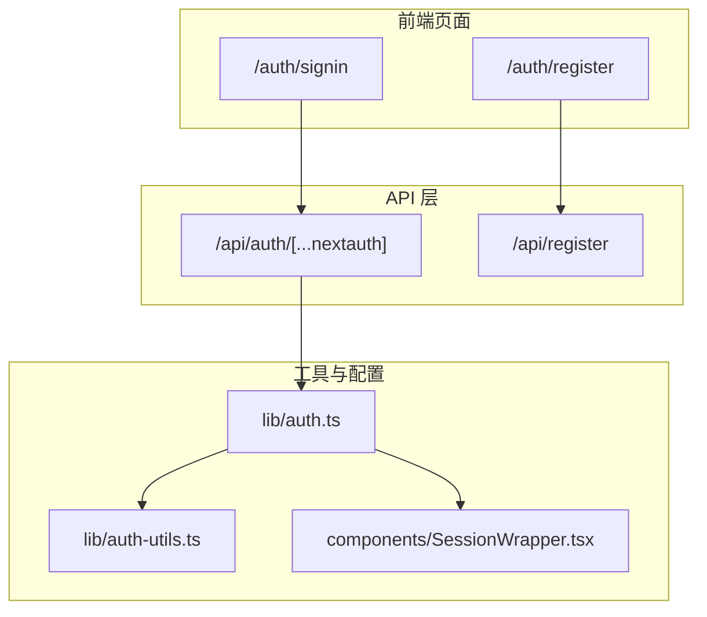
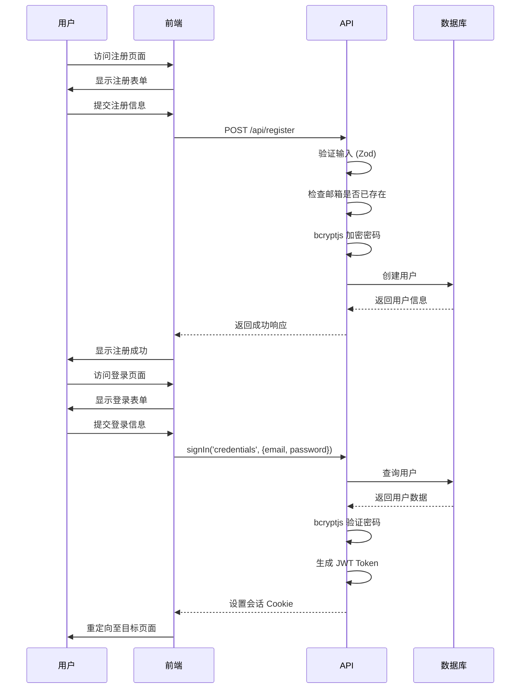
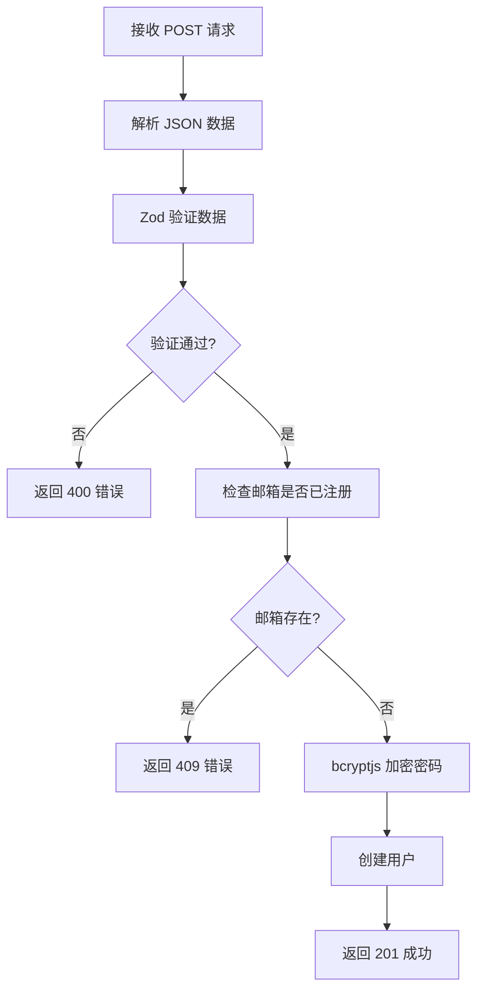
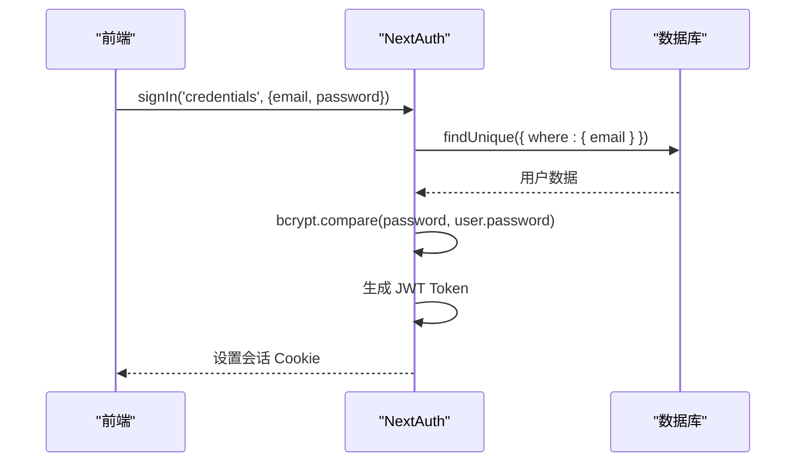

# 认证与注册API

<cite>
**本文档引用的文件**  
- [auth.ts](file://src/lib/auth.ts)
- [register/route.ts](file://src/app/api/register/route.ts)
- [auth/[...nextauth]/route.ts](file://src/app/api/auth/[...nextauth]/route.ts)
- [SessionWrapper.tsx](file://src/components/SessionWrapper.tsx)
- [signin/page.tsx](file://src/app/auth/signin/page.tsx)
- [register/page.tsx](file://src/app/auth/register/page.tsx)
- [auth-utils.ts](file://src/lib/auth-utils.ts)
- [next-auth.d.ts](file://src/types/next-auth.d.ts)
- [测试脚本登陆方式.md](file://src/测试脚本登陆方式.md)
</cite>

## 目录
1. [简介](#简介)
2. [项目结构](#项目结构)
3. [核心组件](#核心组件)
4. [架构概览](#架构概览)
5. [详细组件分析](#详细组件分析)
6. [依赖分析](#依赖分析)
7. [性能考虑](#性能考虑)
8. [故障排除指南](#故障排除指南)
9. [结论](#结论)

## 简介
本文档详细记录了基于 NextAuth 的身份验证系统与注册 API 的工作流程。涵盖本地账户登录机制、会话管理策略、Token 生成与刷新逻辑、注册接口结构、密码加密（bcryptjs）、错误处理机制、前端登录状态维护模式及 CSRF 防护措施。

## 项目结构
项目采用 Next.js App Router 架构，认证相关逻辑集中于 `src/app/api/auth` 和 `src/app/auth` 路径下。API 路由处理认证逻辑，前端页面提供用户交互界面，`lib` 目录封装核心认证工具。



**图示来源**  
- [auth.ts](file://src/lib/auth.ts)
- [auth/[...nextauth]/route.ts](file://src/app/api/auth/[...nextauth]/route.ts)
- [signin/page.tsx](file://src/app/auth/signin/page.tsx)
- [register/page.tsx](file://src/app/auth/register/page.tsx)

**本节来源**  
- [src/app/api](file://src/app/api)
- [src/app/auth](file://src/app/auth)

## 核心组件
核心组件包括：基于 NextAuth 的认证服务、注册 API 接口、会话管理包装器、用户角色权限控制工具及前端登录/注册页面。

**本节来源**  
- [auth.ts](file://src/lib/auth.ts#L1-L71)
- [register/route.ts](file://src/app/api/register/route.ts#L1-L94)
- [SessionWrapper.tsx](file://src/components/SessionWrapper.tsx#L1-L15)

## 架构概览
系统采用 JWT 会话策略，通过 NextAuth 提供本地凭证登录。注册流程独立于 NextAuth，使用 Zod 进行数据验证，bcryptjs 加密密码，Prisma 操作数据库。前端通过 `SessionProvider` 管理会话状态。



**图示来源**  
- [auth.ts](file://src/lib/auth.ts#L43-L71)
- [register/route.ts](file://src/app/api/register/route.ts#L1-L94)
- [signin/page.tsx](file://src/app/auth/signin/page.tsx#L30-L50)

## 详细组件分析

### 注册 API 分析
注册接口接收用户名、邮箱、密码及确认密码，通过 Zod 模式验证数据完整性与一致性。密码使用 bcryptjs 以 12 轮加密存储。若邮箱已存在，返回 409 状态码。

#### 注册请求流程


**图示来源**  
- [register/route.ts](file://src/app/api/register/route.ts#L1-L94)

**本节来源**  
- [register/route.ts](file://src/app/api/register/route.ts#L1-L94)

### 认证系统分析
NextAuth 配置使用 CredentialsProvider 实现本地登录。会话策略为 JWT，用户角色通过回调函数注入 Token 与会话对象。认证流程包括凭证验证、密码比对、Token 签发。

#### 登录认证流程


**图示来源**  
- [auth.ts](file://src/lib/auth.ts#L1-L71)
- [auth/[...nextauth]/route.ts](file://src/app/api/auth/[...nextauth]/route.ts#L1-L5)

**本节来源**  
- [auth.ts](file://src/lib/auth.ts#L1-L71)

### 前端会话管理分析
前端通过 `SessionWrapper` 组件包裹应用，使用 `SessionProvider` 提供会话上下文。登录页面调用 `signIn` 函数提交凭证，根据角色决定重定向路径。

#### 前端登录流程
```mermaid
flowchart TD
A[用户填写邮箱密码] --> B[提交表单]
B --> C[调用 signIn()]
C --> D{登录成功?}
D --> |否| E[显示错误]
D --> |是| F[获取会话]
F --> G{角色为 ADMIN?}
G --> |是| H[跳转至 /admin]
G --> |否| I[跳转至 callbackUrl]
```

**图示来源**  
- [signin/page.tsx](file://src/app/auth/signin/page.tsx#L30-L80)
- [SessionWrapper.tsx](file://src/components/SessionWrapper.tsx#L1-L15)

**本节来源**  
- [signin/page.tsx](file://src/app/auth/signin/page.tsx#L1-L153)
- [SessionWrapper.tsx](file://src/components/SessionWrapper.tsx#L1-L15)

## 依赖分析
系统依赖 NextAuth 实现认证，Prisma 操作数据库，bcryptjs 加密密码，Zod 验证数据。前后端通过 API 路由通信，会话状态由 JWT 维护。

```mermaid
graph LR
A[NextAuth] --> B[CredentialsProvider]
A --> C[JWT Session]
D[bcryptjs] --> E[密码加密]
F[Zod] --> G[数据验证]
H[Prisma] --> I[数据库操作]
B --> A
E --> A
G --> J[/api/register]
I --> J
```

**图示来源**  
- [auth.ts](file://src/lib/auth.ts#L1-L71)
- [register/route.ts](file://src/app/api/register/route.ts#L1-L94)
- [package.json](file://package.json#L1-L10)

**本节来源**  
- [auth.ts](file://src/lib/auth.ts#L1-L71)
- [register/route.ts](file://src/app/api/register/route.ts#L1-L94)

## 性能考虑
- 密码加密使用 12 轮 bcrypt，平衡安全性与性能。
- 数据库查询通过唯一索引优化邮箱查找。
- 前端使用 Suspense 防止加载阻塞。
- 会话状态客户端存储，减少服务器压力。

## 故障排除指南
常见问题包括：
- **邮箱已存在**：检查 `409` 响应，提示用户使用其他邮箱。
- **密码错误**：前端显示“邮箱或密码错误”，不暴露具体原因。
- **CSRF 问题**：自动化脚本需先获取 `/api/auth/csrf` token。
- **会话失效**：检查 `NEXTAUTH_SECRET` 环境变量是否一致。

**本节来源**  
- [register/route.ts](file://src/app/api/register/route.ts#L50-L90)
- [auth.ts](file://src/lib/auth.ts#L30-L40)
- [测试脚本登陆方式.md](file://src/测试脚本登陆方式.md#L1-L87)

## 结论
本系统实现了安全、可扩展的认证与注册流程。通过 NextAuth 与 JWT 管理会话，bcryptjs 保障密码安全，Zod 确保数据完整性。前端与后端职责分离，便于维护与扩展。建议未来增加邮箱验证功能以提升账户安全性。