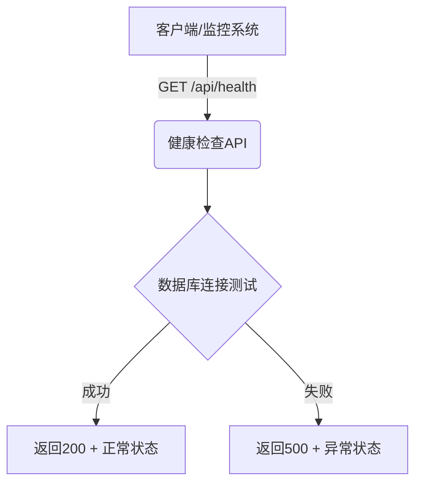

# 健康检查API

<cite>
**本文档引用的文件**  
- [route.ts](file://src/app/api/health/route.ts)
- [prisma.ts](file://src/lib/prisma.ts)
- [README.md](file://README.md)
- [ecosystem.config.js](file://ecosystem.config.js)
- [next.config.ts](file://next.config.ts)
</cite>

## 目录
1. [简介](#简介)
2. [端点详情](#端点详情)
3. [响应格式](#响应格式)
4. [系统集成用途](#系统集成用途)
5. [可扩展性设计](#可扩展性设计)
6. [错误与超时处理](#错误与超时处理)

## 简介
健康检查端点 `/api/health` 是数字化作品互动展示平台的核心监控接口，用于验证系统运行状态和部署健康度。该端点无需身份认证，支持外部系统（如负载均衡器、CI/CD流水线）快速探测服务可用性，确保系统稳定性与高可用性。

**Section sources**
- [README.md](file://README.md#L1-L244)

## 端点详情
健康检查API通过HTTP GET请求访问路径 `/api/health`，返回系统当前状态。该端点设计为轻量级探测接口，响应迅速，适用于高频调用场景。



**Diagram sources**
- [route.ts](file://src/app/api/health/route.ts#L6-L25)

**Section sources**
- [route.ts](file://src/app/api/health/route.ts#L6-L25)

## 响应格式
### 成功响应（HTTP 200）
当系统及数据库均正常时，返回以下JSON结构：

```json
{
  "success": true,
  "message": "API服务正常",
  "timestamp": "2025-09-20T08:30:00.000Z",
  "database": "connected"
}
```

### 失败响应（HTTP 500）
当数据库连接失败或系统异常时，返回以下JSON结构：

```json
{
  "success": false,
  "message": "API服务异常",
  "timestamp": "2025-09-20T08:30:00.000Z",
  "database": "disconnected",
  "error": "连接超时"
}
```

**Section sources**
- [route.ts](file://src/app/api/health/route.ts#L6-L25)

## 系统集成用途
健康检查端点在现代部署架构中扮演关键角色，广泛应用于以下场景：

- **Kubernetes探针**：作为liveness和readiness探针，自动重启异常Pod或暂停流量分发
- **Docker健康检查**：通过`HEALTHCHECK`指令监控容器内部服务状态
- **负载均衡器健康检测**：AWS ALB、Nginx等反向代理定期探测后端实例可用性
- **CI/CD流水线验证**：部署后自动调用健康端点，确认新版本成功启动
- **PM2进程监控**：结合`ecosystem.config.js`配置，实现应用状态监控与自动重启

```mermaid
graph TB
subgraph "部署环境"
K8s[Kubernetes]
Docker[Docker]
LB[负载均衡器]
end
subgraph "CI/CD"
Pipeline[CI/CD流水线]
end
K8s --> |探针| Health[/api/health]
Docker --> |健康检查| Health
LB --> |健康检测| Health
Pipeline --> |部署验证| Health
subgraph "应用服务"
Health[/api/health]
end
```

**Diagram sources**
- [route.ts](file://src/app/api/health/route.ts#L6-L25)
- [ecosystem.config.js](file://ecosystem.config.js#L0-L109)

**Section sources**
- [route.ts](file://src/app/api/health/route.ts#L6-L25)
- [ecosystem.config.js](file://ecosystem.config.js#L0-L109)
- [README.md](file://README.md#L1-L244)

## 可扩展性设计
当前健康检查已集成数据库连接状态检测，未来可扩展以下监控维度：

- **外部服务依赖**：检查OSS对象存储、邮件服务、第三方API连通性
- **缓存系统状态**：Redis连接健康度检测
- **磁盘空间与资源**：监控服务器磁盘、内存使用率
- **自定义业务健康指标**：如在线用户数阈值、任务队列长度等

该设计通过`try-catch`结构实现模块化检测，便于后续添加新的健康检查项而不影响核心逻辑。

**Section sources**
- [route.ts](file://src/app/api/health/route.ts#L6-L25)
- [prisma.ts](file://src/lib/prisma.ts#L0-L19)

## 错误与超时处理
当服务器宕机或数据库不可达时，健康检查将触发以下行为：

- **超时机制**：调用方应设置合理超时（建议3-5秒），避免长时间阻塞
- **错误日志记录**：系统自动将异常写入日志文件（如`logs/error.log`），便于排查
- **降级响应**：即使数据库异常，API仍返回500状态码，确保探测请求不被静默丢弃
- **自动恢复检测**：Kubernetes等平台将持续探测，服务恢复后自动重新纳入流量池

**Section sources**
- [route.ts](file://src/app/api/health/route.ts#L6-L25)
- [ecosystem.config.js](file://ecosystem.config.js#L0-L109)