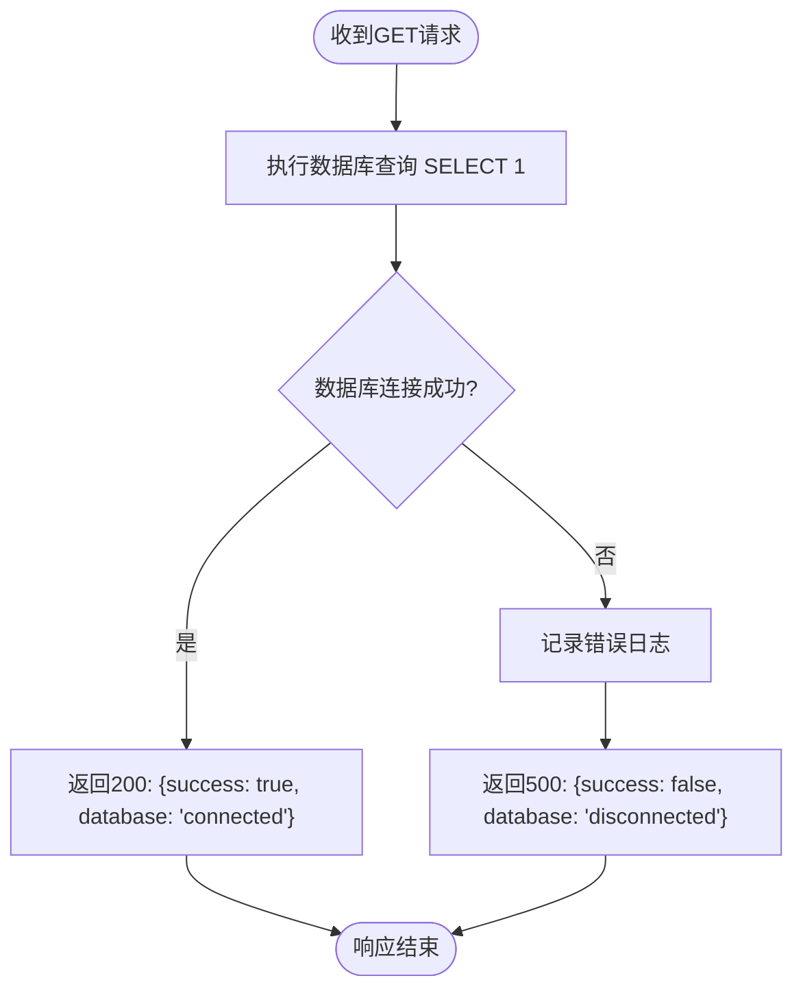

# 平台服务API

<cite>
**本文档引用文件**  
- [health/route.ts](file://src/app/api/health/route.ts)
- [upload/route.ts](file://src/app/api/upload/route.ts)
- [online-counter/route.ts](file://src/app/api/online-counter/route.ts)
- [init-online-counter.ts](file://src/lib/init-online-counter.ts)
- [oss.ts](file://src/lib/oss.ts)
- [add_online_counter_config/migration.sql](file://prisma/migrations/20250905143157_add_online_counter_config/migration.sql)
- [test-oss.ts](file://test-oss.ts)
</cite>

## 目录
1. [简介](#简介)
2. [健康检查接口](#健康检查接口)
3. [文件上传接口](#文件上传接口)
4. [在线人数初始化接口](#在线人数初始化接口)
5. [数据库配置持久化](#数据库配置持久化)
6. [OSS测试脚本使用方法](#oss测试脚本使用方法)
7. [总结](#总结)

## 简介
本文档详细描述了平台级服务的三个核心API：健康检查、文件上传和在线人数初始化接口。涵盖接口功能、安全机制、配置管理及调试方法，为运维和开发提供完整参考。

## 健康检查接口

`/api/health` 接口用于服务健康状态检测，是运维监控的关键组件。该接口通过向数据库发送一个简单的查询（`SELECT 1`）来验证数据库连接状态。

当数据库连接正常时，返回成功响应，包含时间戳和数据库连接状态；若数据库连接失败，则捕获异常并返回500错误状态码，同时提供错误信息。此机制确保了服务整体可用性的准确反映。

**接口详情**
- **路径**: `/api/health`
- **方法**: GET
- **用途**: 服务健康状态检测
- **响应示例（成功）**:
```json
{
  "success": true,
  "message": "API服务正常",
  "timestamp": "2025-09-06T10:00:00.000Z",
  "database": "connected"
}
```
- **响应示例（失败）**:
```json
{
  "success": false,
  "message": "API服务异常",
  "timestamp": "2025-09-06T10:00:00.000Z",
  "database": "disconnected",
  "error": "数据库连接超时"
}
```

**接口流程图**


**接口来源**
- [health/route.ts](file://src/app/api/health/route.ts#L1-L25)

## 文件上传接口

`/api/upload` 接口负责接收用户提交的作品图片，并将其上传至阿里云OSS（对象存储服务），最终返回可公开访问的CDN链接。

### 接口功能与流程
1.  **配置检查**：首先从数据库获取最新的上传配置 `uploadConfig`，若配置不存在则返回错误。
2.  **功能开关**：检查 `uploadConfig.isEnabled`，若为 `false` 则拒绝上传。
3.  **时间窗口**：根据 `startTime` 和 `endTime` 验证当前时间是否在允许的上传时段内。
4.  **文件验证**：对接收到的文件进行类型和大小校验。
5.  **OSS上传**：调用 `uploadToOSS` 工具函数执行上传，并返回CDN链接。

### 文件限制与支持格式
- **文件大小限制**：由数据库中的 `maxFileSize` 字段决定，默认为10MB（10485760字节），最大可配置至100MB。
- **支持格式**：由数据库中的 `allowedFormats` 数组定义，当前支持 `jpg`、`jpeg`、`png`、`gif`、`webp` 等格式。

### OSS凭证与安全机制
OSS客户端的凭证（`accessKeyId`, `accessKeySecret`）通过环境变量（`.env` 文件）注入，确保了密钥的安全性，避免了硬编码。上传时，通过 `headers` 参数设置对象的访问权限为 `public-read`，保证生成的CDN链接可被公开访问。

**接口详情**
- **路径**: `/api/upload`
- **方法**: POST
- **用途**: 上传作品图片至OSS
- **请求体**: `multipart/form-data`，包含 `file` 字段
- **成功响应**:
```json
{
  "success": true,
  "data": {
    "imageUrl": "https://your-bucket.oss-cn-hangzhou.aliyuncs.com/works/1725600000_abc123.jpg",
    "ossKey": "works/1725600000_abc123.jpg",
    "fileSize": 102400,
    "mimeType": "image/jpeg"
  }
}
```

**接口来源**
- [upload/route.ts](file://src/app/api/upload/route.ts#L1-L114)

## 在线人数初始化接口

`/api/init-online-counter` 并非一个独立的API路径，而是一个通过 `initOnlineCounterConfig` 工具函数实现的初始化逻辑，该逻辑被集成在 `/api/online-counter` 的 `GET` 请求处理中。

### 在线人数统计原理
在线人数的统计并非实时连接数，而是一个基于数据库配置的动态模拟值。其核心原理如下：

1.  **配置初始化**：系统启动或首次访问时，会检查数据库中是否存在 `online_counter_configs` 表的记录。若不存在，则调用 `initOnlineCounterConfig` 函数创建一条默认配置。
2.  **动态增长**：当客户端请求 `/api/online-counter` 时，服务端会计算自上次更新以来经过的时间。系统以10秒为一个增长周期，每个周期内根据配置的 `growthRate`（如0.5）生成一个0到`growthRate`之间的随机整数，并累加到 `currentCount` 上。
3.  **边界控制**：增长后的数值会与 `baseCount` 和 `maxCount` 进行比较，确保最终人数在合理范围内。
4.  **状态更新**：计算出新的在线人数后，会更新数据库中的 `currentCount` 和 `lastUpdated` 字段，为下一次计算提供基准。

此设计模拟了真实场景中在线人数的自然波动，同时避免了维护大量实时连接状态的复杂性。

**接口详情**
- **路径**: `/api/online-counter`
- **方法**: GET
- **用途**: 获取当前模拟的在线人数
- **成功响应**:
```json
{
  "success": true,
  "data": {
    "count": 1082,
    "displayText": "人正在云栖大会创作",
    "isEnabled": true,
    "lastUpdated": "2025-09-06T10:00:00.000Z"
  }
}
```

**工具函数来源**
- [init-online-counter.ts](file://src/lib/init-online-counter.ts#L6-L34)

## 数据库配置持久化

在线人数的配置信息（如基础人数、最大人数、增长率等）需要持久化存储，以便在服务重启后保持状态。这一需求通过Prisma数据库迁移文件实现。

### 迁移文件分析
`20250905143157_add_online_counter_config/migration.sql` 文件创建了名为 `online_counter_configs` 的数据表，其核心字段定义了在线计数器的行为：

- `currentCount`: 当前在线人数，是动态变化的核心值。
- `baseCount`: 基础人数，用于重置或作为增长的下限。
- `maxCount`: 最大人数，作为增长的上限。
- `growthRate`: 增长率，决定了人数增长的快慢。
- `isEnabled`: 开关，控制在线计数器功能是否启用。
- `displayText`: 显示文本，用于前端展示。

**数据库表结构**
```mermaid
erDiagram
online_counter_configs {
TEXT id PK
INTEGER currentCount
INTEGER baseCount
INTEGER maxCount
DOUBLE PRECISION growthRate
BOOLEAN isEnabled
TEXT displayText
TIMESTAMP lastUpdated
TIMESTAMP createdAt
TIMESTAMP updatedAt
TEXT createdBy FK
}
```

**迁移文件来源**
- [add_online_counter_config/migration.sql](file://prisma/migrations/20250905143157_add_online_counter_config/migration.sql#L1-L18)

## OSS测试脚本使用方法

`test-oss.ts` 是一个用于调试和验证OSS功能的独立测试脚本，开发者可利用它来排查上传问题。

### 使用步骤
1.  **配置环境变量**：在项目根目录创建 `.env` 文件，并填入以下OSS配置：
    ```
    ALI_OSS_REGION=oss-cn-hangzhou
    ALI_OSS_ACCESS_KEY_ID=your_access_key_id
    ALI_OSS_ACCESS_KEY_SECRET=your_access_key_secret
    ALI_OSS_BUCKET=your_bucket_name
    ALI_OSS_ENDPOINT=https://your_bucket_endpoint
    ```
2.  **安装依赖**：确保已安装 `ali-oss` 和 `dotenv` 等依赖包。
3.  **运行脚本**：执行命令 `npx ts-node test-oss.ts` 或 `node run-oss-test.js`。
4.  **查看结果**：脚本会依次执行一系列测试（列出存储空间、上传、下载、删除等），并在控制台输出详细日志。成功会显示绿色的✅，失败则显示红色的❌并附带错误信息。

该脚本是验证OSS集成是否成功的有力工具，尤其在部署新环境或更换凭证时非常有用。

**测试脚本来源**
- [test-oss.ts](file://test-oss.ts#L1-L452)

## 总结
本文档全面阐述了平台的三大核心服务API。`/api/health` 提供了基础的健康监控能力；`/api/upload` 实现了安全、可配置的文件上传至OSS；而在线人数功能则通过 `initOnlineCounterConfig` 工具函数和数据库持久化配置，巧妙地模拟了一个动态变化的在线用户数。整个系统设计考虑了可维护性、安全性和可扩展性，为平台的稳定运行提供了保障。