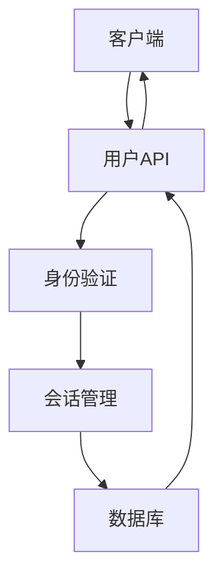
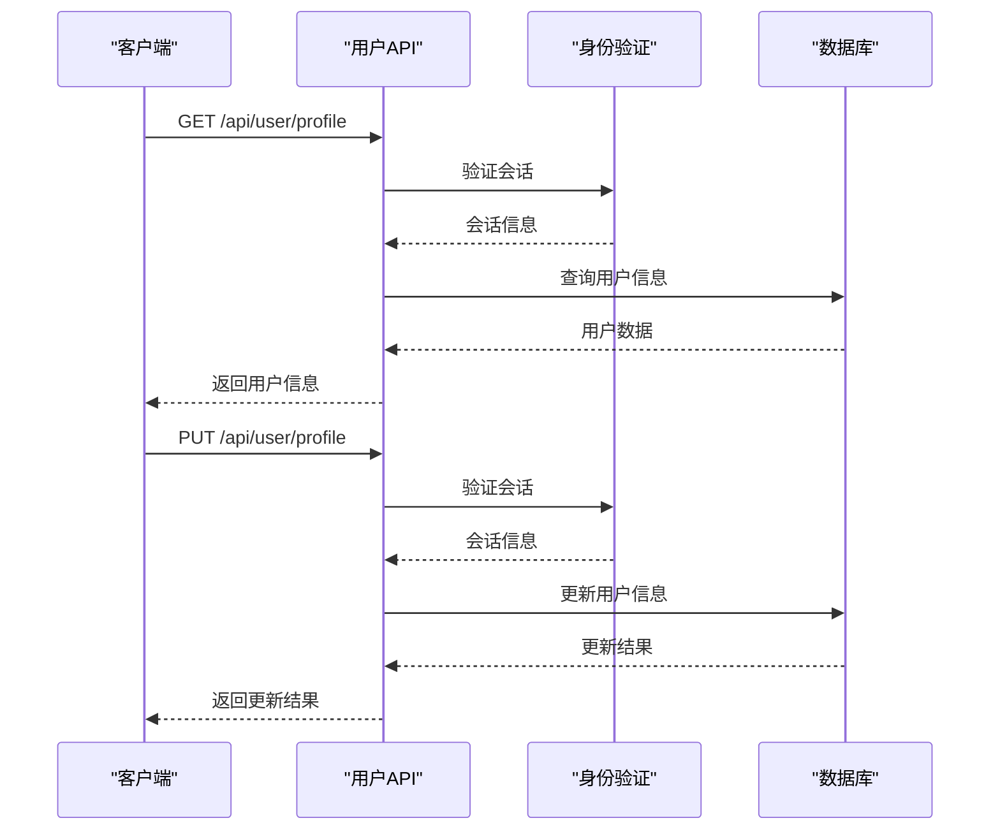
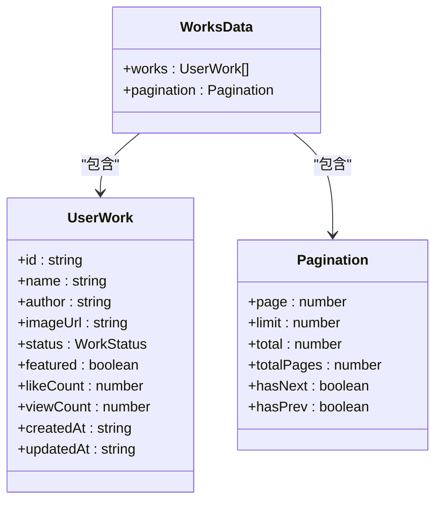
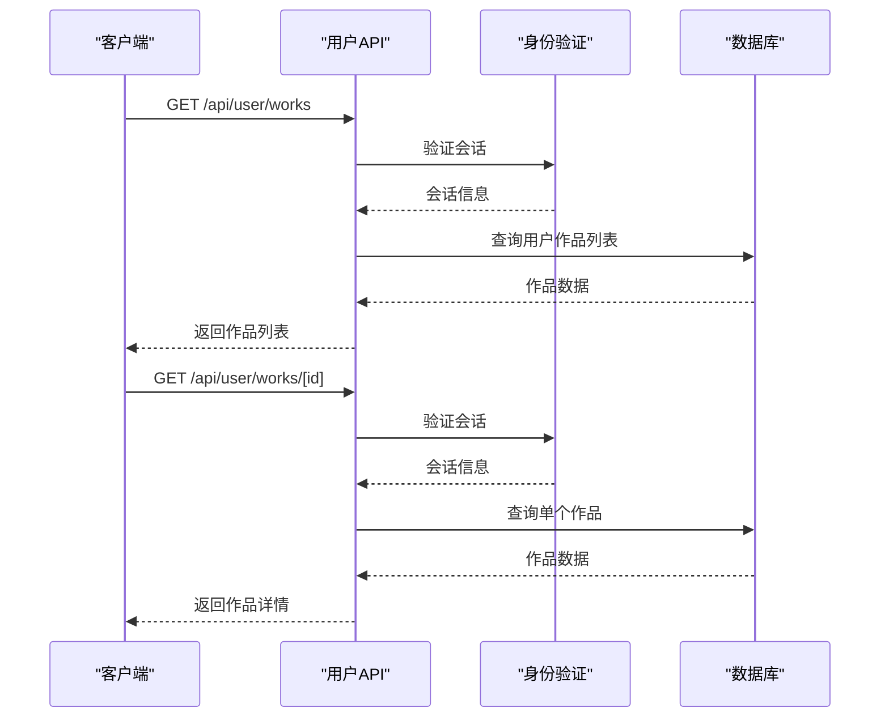
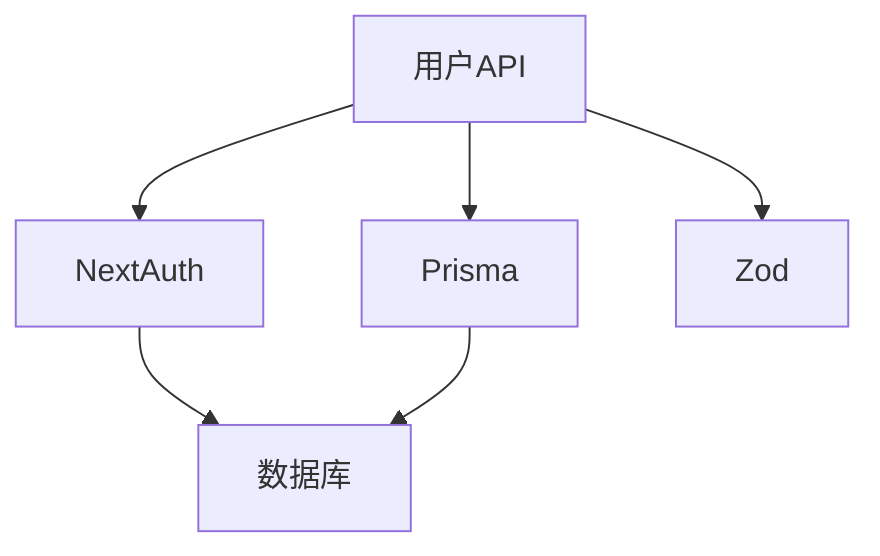

# 用户API

<cite>
**本文档引用的文件**
- [work.d.ts](file://src/types/work.d.ts)
- [auth-utils.ts](file://src/lib/auth-utils.ts)
- [profile/route.ts](file://src/app/api/user/profile/route.ts)
- [works/route.ts](file://src/app/api/user/works/route.ts)
- [works/[id]/route.ts](file://src/app/api/user/works/[id]/route.ts)
- [next-auth.d.ts](file://src/types/next-auth.d.ts)
- [auth.ts](file://src/lib/auth.ts)
</cite>

## 目录
1. [简介](#简介)
2. [项目结构](#项目结构)
3. [核心组件](#核心组件)
4. [架构概述](#架构概述)
5. [详细组件分析](#详细组件分析)
6. [依赖分析](#依赖分析)
7. [性能考虑](#性能考虑)
8. [故障排除指南](#故障排除指南)
9. [结论](#结论)

## 简介
本文档详细描述了数字化作品互动展示平台的用户个人相关API，涵盖用户资料获取与更新、用户作品列表查询及单个作品访问。文档详细说明了每个端点的HTTP方法、路径参数、请求头和请求/响应数据结构，以及身份验证机制，确保只有登录用户能访问自己的数据。

## 项目结构
用户API相关文件位于`src/app/api/user`目录下，包括用户资料和作品管理两个主要模块。

```mermaid
graph TD
A[src/app/api/user] --> B[profile/route.ts]
A --> C[works/route.ts]
A --> D[works/[id]/route.ts]
```

**图示来源**
- [profile/route.ts](file://src/app/api/user/profile/route.ts)
- [works/route.ts](file://src/app/api/user/works/route.ts)
- [works/[id]/route.ts](file://src/app/api/user/works/[id]/route.ts)

**本节来源**
- [profile/route.ts](file://src/app/api/user/profile/route.ts)
- [works/route.ts](file://src/app/api/user/works/route.ts)

## 核心组件
用户API的核心组件包括用户资料管理、用户作品列表查询和单个作品访问，所有操作都通过JWT认证确保安全性。

**本节来源**
- [profile/route.ts](file://src/app/api/user/profile/route.ts#L1-L235)
- [works/route.ts](file://src/app/api/user/works/route.ts#L1-L125)

## 架构概述
用户API采用Next.js App Router架构，通过中间件进行身份验证，确保只有授权用户才能访问个人数据。



**图示来源**
- [auth-utils.ts](file://src/lib/auth-utils.ts#L1-L23)
- [auth.ts](file://src/lib/auth.ts#L1-L51)

## 详细组件分析

### 用户资料管理分析
用户资料管理API提供获取和更新用户信息的功能，包括姓名、邮箱和密码的修改。

#### 类图
```mermaid
classDiagram
class UserProfile {
+id : string
+name : string
+email : string
+role : string
+image? : string
+createdAt : string
+updatedAt : string
+_count : { works : number }
}
class ProfileUpdateSchema {
+name : string
+email : string
+currentPassword : string
+newPassword : string
+confirmNewPassword : string
}
UserProfile <|-- ProfileUpdateSchema : "extends"
```

**图示来源**
- [work.d.ts](file://src/types/work.d.ts#L16-L27)
- [profile/route.ts](file://src/app/api/user/profile/route.ts#L8-L24)

#### 序列图


**图示来源**
- [profile/route.ts](file://src/app/api/user/profile/route.ts#L29-L235)

**本节来源**
- [profile/route.ts](file://src/app/api/user/profile/route.ts#L1-L235)

### 用户作品管理分析
用户作品管理API提供查询用户作品列表和访问单个作品的功能，支持分页和搜索。

#### 类图


**图示来源**
- [work.d.ts](file://src/types/work.d.ts#L30-L73)

#### 序列图


**图示来源**
- [works/route.ts](file://src/app/api/user/works/route.ts#L1-L125)
- [works/[id]/route.ts](file://src/app/api/user/works/[id]/route.ts#L1-L139)

**本节来源**
- [works/route.ts](file://src/app/api/user/works/route.ts#L1-L125)
- [works/[id]/route.ts](file://src/app/api/user/works/[id]/route.ts#L1-L139)

## 依赖分析
用户API依赖于NextAuth进行身份验证，Prisma进行数据库操作，以及Zod进行数据验证。



**图示来源**
- [auth-utils.ts](file://src/lib/auth-utils.ts#L1-L23)
- [profile/route.ts](file://src/app/api/user/profile/route.ts#L1-L235)

**本节来源**
- [auth-utils.ts](file://src/lib/auth-utils.ts#L1-L23)
- [profile/route.ts](file://src/app/api/user/profile/route.ts#L1-L235)

## 性能考虑
用户API在查询作品列表时使用分页，避免一次性加载过多数据。同时，通过Prisma的select选项只查询必要的字段，减少数据库负载。

## 故障排除指南
常见错误包括401未授权、404用户不存在和409邮箱已被使用。开发者应检查JWT令牌是否有效，用户ID是否存在，以及邮箱是否已被注册。

**本节来源**
- [profile/route.ts](file://src/app/api/user/profile/route.ts#L81-L235)
- [works/route.ts](file://src/app/api/user/works/route.ts#L81-L125)

## 结论
用户API提供了完整的用户资料和作品管理功能，通过JWT认证确保数据安全。API设计合理，支持分页和搜索，适合大规模用户使用。