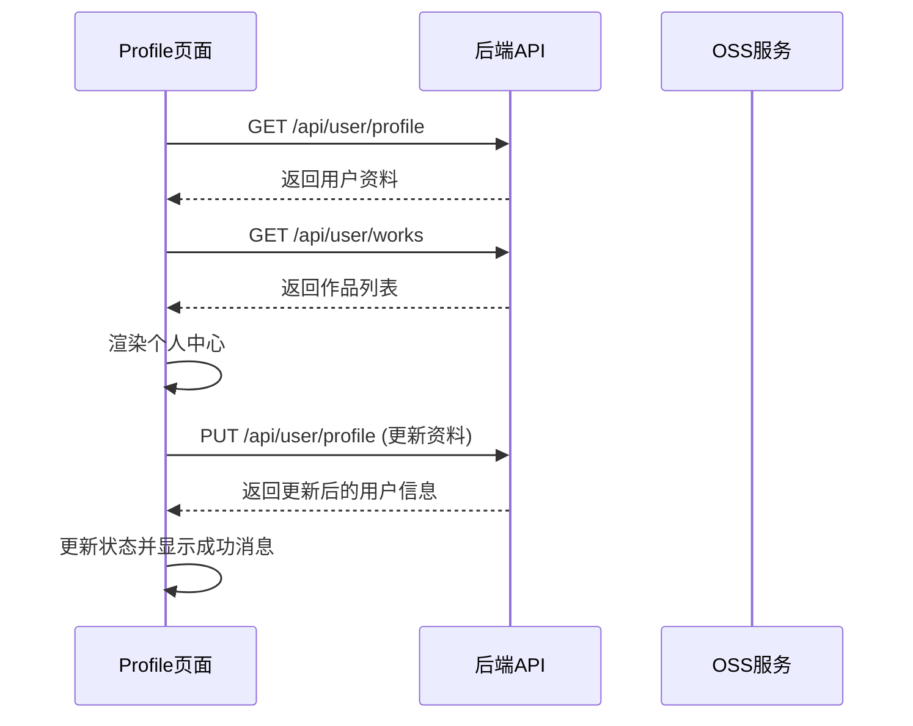

# 用户API

<cite>
**本文档中引用的文件**  
- [profile.tsx](file://src/app/profile/page.tsx)
- [route.ts](file://src/app/api/user/profile/route.ts)
- [route.ts](file://src/app/api/user/works/route.ts)
- [work.d.ts](file://src/types/work.d.ts)
- [oss.ts](file://src/lib/oss.ts)
- [route.ts](file://src/app/api/upload/route.ts)
</cite>

## 目录
1. [简介](#简介)
2. [用户资料管理接口](#用户资料管理接口)
3. [用户作品查询接口](#用户作品查询接口)
4. [个人中心页面数据绑定](#个人中心页面数据绑定)
5. [头像上传与OSS集成](#头像上传与oss集成)
6. [常见错误场景与解决方案](#常见错误场景与解决方案)

## 简介
本文档详细说明数字化作品互动展示平台中与用户相关的API接口，聚焦于个人资料管理和用户作品查询功能。文档涵盖 `/api/user/profile` 和 `/api/user/works` 两个核心API端点，明确其认证要求、请求结构、响应格式及错误处理机制。同时，结合前端 `Profile` 页面组件说明数据绑定流程，并引用 `User` 和 `Work` 的TypeScript类型定义以确保前后端类型一致。此外，文档还提供了头像上传与OSS集成的流程说明，以及常见错误场景的解决方案。

## 用户资料管理接口

`/api/user/profile` 接口提供用户个人资料的获取与更新功能，支持 `GET` 和 `PUT` 两种HTTP方法。

### GET /api/user/profile - 获取当前用户资料
- **方法**: GET
- **认证要求**: 必须登录
- **请求头**: `Authorization: Bearer <token>`
- **请求体**: 无
- **成功响应**:
```json
{
  "success": true,
  "data": {
    "id": "usr123",
    "name": "张三",
    "email": "zhangsan@example.com",
    "role": "USER",
    "image": "https://oss.example.com/avatar.jpg",
    "createdAt": "2025-08-01T08:00:00Z",
    "updatedAt": "2025-08-05T14:30:00Z",
    "_count": {
      "works": 5
    }
  },
  "message": "获取用户信息成功"
}
```
- **错误响应**:
  - `401 Unauthorized`: 未登录或会话过期
  - `404 Not Found`: 用户不存在
  - `500 Internal Server Error`: 服务器内部错误
- **TypeScript 类型定义**:
```typescript
interface UserProfile {
  id: string;
  name: string;
  email: string;
  role: string;
  image?: string;
  createdAt: string;
  updatedAt: string;
  _count: {
    works: number;
  };
}
```

### PUT /api/user/profile - 更新用户资料
- **方法**: PUT
- **认证要求**: 必须登录
- **请求头**: `Authorization: Bearer <token>`
- **请求体 (JSON Schema)**:
```json
{
  "name": "张三三",
  "email": "zhangsan_new@example.com",
  "currentPassword": "old_password",
  "newPassword": "new_password",
  "confirmNewPassword": "new_password"
}
```
- **字段说明**:
  - `name`: 用户姓名，可选，长度1-50字符
  - `email`: 邮箱地址，可选，必须为有效邮箱格式
  - `currentPassword`: 当前密码，修改密码时必填
  - `newPassword`: 新密码，修改密码时必填，长度6-100字符
  - `confirmNewPassword`: 确认新密码，必须与 `newPassword` 一致
- **成功响应**:
```json
{
  "success": true,
  "data": { /* 更新后的用户信息 */ },
  "message": "用户信息更新成功"
}
```
- **错误响应**:
  - `400 Bad Request`: 输入数据无效（如密码不一致、邮箱格式错误）
  - `401 Unauthorized`: 未登录
  - `404 Not Found`: 用户不存在
  - `409 Conflict`: 邮箱已被使用
  - `500 Internal Server Error`: 服务器内部错误
- **验证逻辑**:
  - 使用 `zod` 库进行请求体验证，确保数据格式正确
  - 更新邮箱时，检查新邮箱是否已被其他用户使用
  - 修改密码时，验证当前密码是否正确，并使用 `bcryptjs` 对新密码进行哈希处理

**Section sources**
- [route.ts](file://src/app/api/user/profile/route.ts#L45-L235)
- [profile.tsx](file://src/app/profile/page.tsx#L16-L35)

## 用户作品查询接口

`/api/user/works` 接口提供当前用户所有作品的查询功能，用于个人中心展示。

### GET /api/user/works - 获取当前用户所有作品
- **方法**: GET
- **认证要求**: 必须登录
- **请求头**: `Authorization: Bearer <token>`
- **查询参数**:
  - `page` (可选): 页码，默认为1
  - `limit` (可选): 每页数量，默认为10
  - `status` (可选): 作品状态过滤（PENDING/APPROVED/REJECTED）
  - `search` (可选): 搜索关键词，按作品名称或描述模糊匹配
- **成功响应**:
```json
{
  "success": true,
  "data": {
    "works": [
      {
        "id": "wk123",
        "name": "artwork1.jpg",
        "title": "我的作品",
        "author": "AI创作者",
        "imageUrl": "https://oss.example.com/artwork1.jpg",
        "status": "APPROVED",
        "featured": false,
        "likeCount": 10,
        "viewCount": 50,
        "createdAt": "2025-08-05T10:00:00Z",
        "updatedAt": "2025-08-05T10:00:00Z"
      }
    ],
    "pagination": {
      "page": 1,
      "limit": 10,
      "total": 15,
      "totalPages": 2,
      "hasNext": true,
      "hasPrev": false
    }
  },
  "message": "获取作品列表成功"
}
```
- **错误响应**:
  - `400 Bad Request`: 查询参数无效
  - `401 Unauthorized`: 未登录
  - `500 Internal Server Error`: 服务器内部错误
- **TypeScript 类型定义**:
```typescript
export interface UserWork {
  id: string;
  name: string;
  author: string;
  imageUrl: string;
  status: WorkStatus;
  featured: boolean;
  likeCount: number;
  viewCount: number;
  createdAt: string;
  updatedAt: string;
}

export interface WorksData {
  works: UserWork[];
  pagination: {
    page: number;
    limit: number;
    total: number;
    totalPages: number;
    hasNext: boolean;
    hasPrev: boolean;
  };
}
```

**Section sources**
- [route.ts](file://src/app/api/user/works/route.ts#L30-L125)
- [work.d.ts](file://src/types/work.d.ts#L12-L49)

## 个人中心页面数据绑定

`Profile` 页面组件（`profile/page.tsx`）负责展示和管理用户个人资料及作品，通过 `useSession` 和自定义 `useApi` Hook 与后端API进行数据交互。

### 数据流与状态管理
- **用户会话**: 使用 `useSession()` 获取当前用户会话信息，判断登录状态并重定向。
- **用户资料**: 通过 `GET /api/user/profile` 获取用户资料，存储在 `profile` 状态中，并初始化表单数据。
- **作品列表**: 通过 `GET /api/user/works` 获取用户作品列表，存储在 `works` 状态中，支持分页和搜索。
- **表单交互**: 用户修改资料时，通过 `handleInputChange` 更新 `formData` 状态，并在提交时调用 `PUT /api/user/profile`。

### 组件交互流程


**Diagram sources**
- [profile.tsx](file://src/app/profile/page.tsx#L1-L625)

**Section sources**
- [profile.tsx](file://src/app/profile/page.tsx#L1-L625)

## 头像上传与OSS集成

头像上传流程通过调用 `/api/upload` 接口实现，该接口将文件上传至阿里云OSS（对象存储服务）。

### 上传流程
1. 前端通过 `FormData` 构造包含文件的请求体。
2. 调用 `POST /api/upload` 接口。
3. 后端验证用户权限、上传配置（如文件类型、大小限制）。
4. 调用 `uploadToOSS` 函数将文件上传至OSS。
5. 返回包含 `imageUrl`、`ossKey` 等信息的响应。

### OSS集成核心函数
- **`uploadToOSS`**: 负责将文件上传至OSS，支持生成唯一文件名、添加文件夹前缀、设置自定义头信息（如ACL、Cache-Control）。
- **`getSignedUrl`**: 生成OSS文件的签名URL，用于安全访问私有文件。
- **`deleteFromOSS`**: 从OSS删除文件。

**Section sources**
- [route.ts](file://src/app/api/upload/route.ts#L1-L114)
- [oss.ts](file://src/lib/oss.ts#L50-L106)

## 常见错误场景与解决方案

### 未授权访问 (401 Unauthorized)
- **场景**: 用户未登录或JWT令牌过期。
- **解决方案**: 
  - 前端检查 `useSession()` 返回的状态，若未登录则重定向至登录页。
  - 实现自动刷新令牌机制（如使用 `refresh_token`），或在捕获401错误后提示用户重新登录。

### 数据更新冲突 (409 Conflict)
- **场景**: 更新用户邮箱时，新邮箱已被其他用户注册。
- **解决方案**:
  - 前端在提交前增加邮箱唯一性检查（可选）。
  - 后端在 `PUT /api/user/profile` 中捕获 `PrismaClientKnownRequestError`（代码 `P2002`），返回 `409 Conflict` 状态码和明确错误信息。
  - 前端捕获409错误，在邮箱输入框下方显示“该邮箱已被使用”的提示。

### 并发更新导致计数错误
- **场景**: 多个用户同时点赞同一作品，可能导致 `likeCount` 计数不准确。
- **解决方案**:
  - 使用Prisma的原子操作 `{ increment: 1 }` 更新 `likeCount`，避免“读取-修改-写入”的竞态条件。
  - 在 `src/app/api/works/[id]/like/route.ts` 中实现此逻辑，确保高并发下的数据一致性。

**Section sources**
- [route.ts](file://src/app/api/user/profile/route.ts#L150-L200)
- [route.ts](file://src/app/api/works/[id]/like/route.ts#L45-L75)