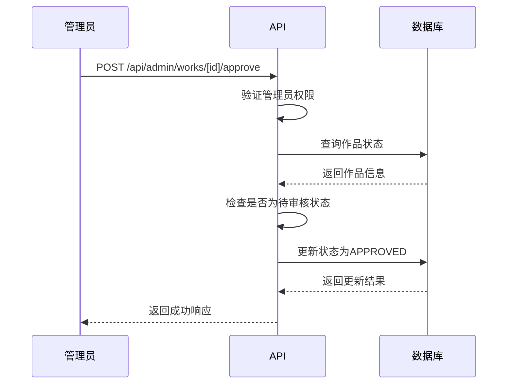
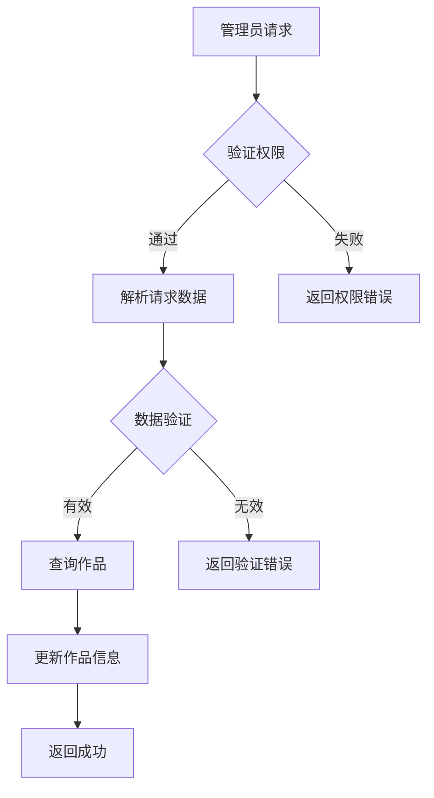
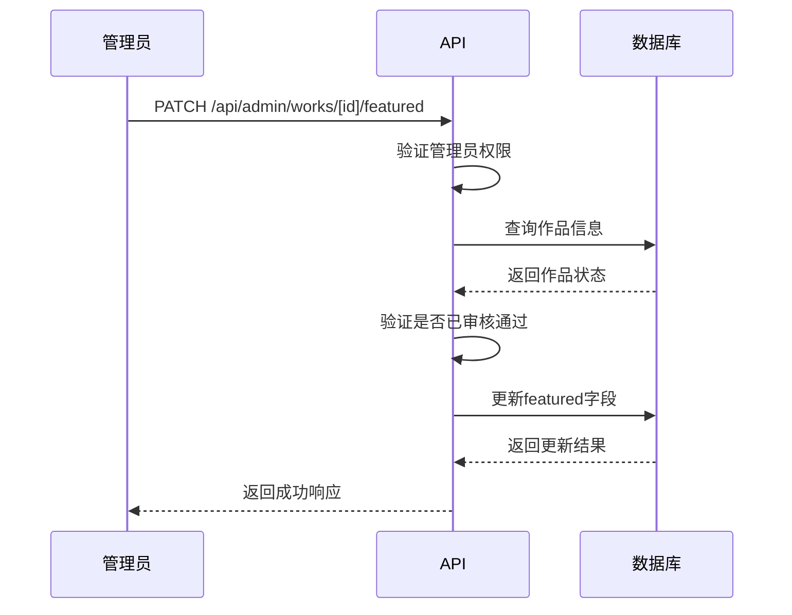
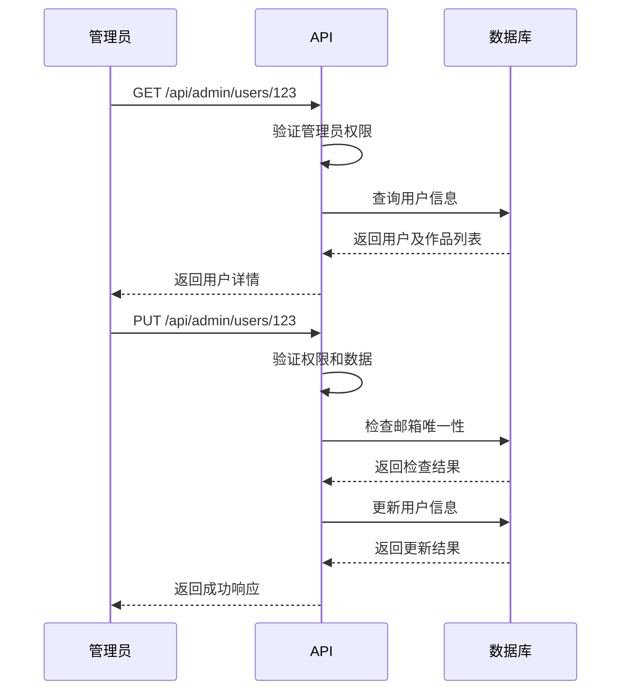
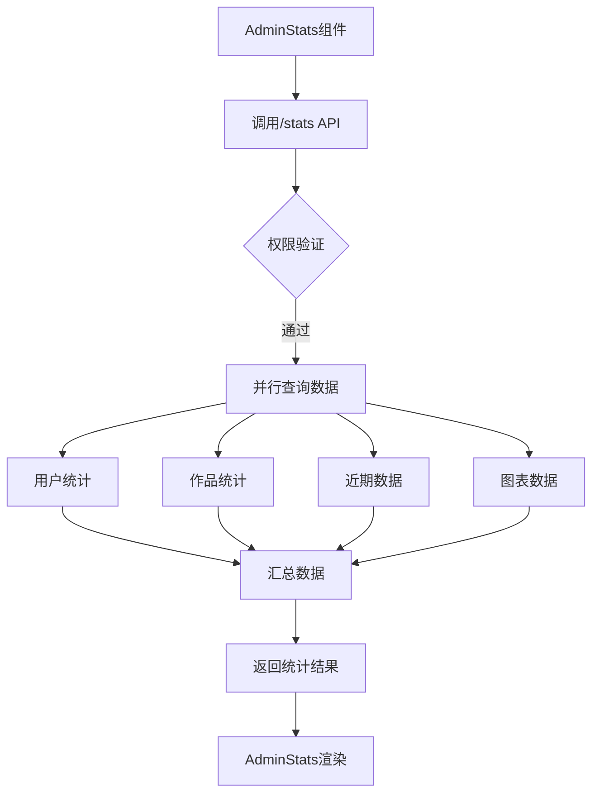
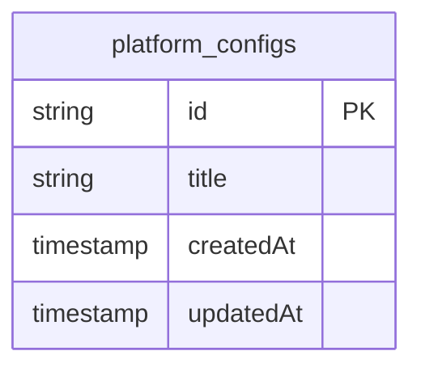

# 管理API

<cite>
**本文档引用的文件**   
- [approve/route.ts](file://src/app/api/admin/works/[id]/approve/route.ts)
- [reject/route.ts](file://src/app/api/admin/works/[id]/reject/route.ts)
- [edit/route.ts](file://src/app/api/admin/works/[id]/edit/route.ts)
- [featured/route.ts](file://src/app/api/admin/works/[id]/featured/route.ts)
- [users/[id]/route.ts](file://src/app/api/admin/users/[id]/route.ts)
- [stats/route.ts](file://src/app/api/admin/stats/route.ts)
- [upload-config/route.ts](file://src/app/api/admin/upload-config/route.ts)
- [online-counter/route.ts](file://src/app/api/admin/online-counter/route.ts)
- [platform-config/route.ts](file://src/app/api/platform-config/route.ts)
- [AdminStats.tsx](file://src/components/admin/AdminStats.tsx)
- [add_platform_config/migration.sql](file://prisma/migrations/20250905150839_add_platform_config/migration.sql)
</cite>

## 目录
1. [简介](#简介)
2. [作品管理类API](#作品管理类api)
3. [用户管理类API](#用户管理类api)
4. [统计类API](#统计类api)
5. [配置类API](#配置类api)
6. [安全注意事项](#安全注意事项)

## 简介
本文档为管理员专用API文档，涵盖作品审核、用户管理、数据统计和平台配置四大功能模块。所有API端点均需管理员权限访问，通过中间件进行身份验证。文档详细说明了各功能的业务逻辑、调用示例及系统联动机制。

## 作品管理类API

### 作品审核 (/approve, /reject)
管理员可对用户提交的作品进行审核操作，审核通过后更新作品状态并通知用户。



**业务逻辑**：
- 审核通过：将作品状态从PENDING更新为APPROVED，记录审核时间
- 审核拒绝：需提供拒绝理由，状态更新为REJECTED，并记录拒绝原因
- 仅能审核处于待审核(PENDING)状态的作品

**curl示例**：
```bash
# 审核通过
curl -X POST https://example.com/api/admin/works/123/approve \
  -H "Authorization: Bearer <admin_token>"

# 审核拒绝
curl -X POST https://example.com/api/admin/works/123/reject \
  -H "Authorization: Bearer <admin_token>" \
  -H "Content-Type: application/json" \
  -d '{"reason": "内容不符合规范"}'
```

**端点说明**：
- `POST /api/admin/works/[id]/approve`：审核通过作品
- `POST /api/admin/works/[id]/reject`：拒绝作品并提供理由

**Section sources**
- [approve/route.ts](file://src/app/api/admin/works/[id]/approve/route.ts)
- [reject/route.ts](file://src/app/api/admin/works/[id]/reject/route.ts)

### 作品编辑 (/edit)
管理员可编辑作品的基本信息，包括名称、作者和提示词描述。



**业务逻辑**：
- 验证管理员身份和作品存在性
- 对输入数据进行严格验证（长度、格式等）
- 更新作品信息并记录修改时间
- 处理唯一性约束冲突（如作品名称重复）

**curl示例**：
```bash
curl -X PUT https://example.com/api/admin/works/123/edit \
  -H "Authorization: Bearer <admin_token>" \
  -H "Content-Type: application/json" \
  -d '{
    "name": "新作品名称",
    "author": "新作者名",
    "prompt": "新的提示词描述"
  }'
```

**端点说明**：
- `PUT /api/admin/works/[id]/edit`：更新作品信息
- `GET /api/admin/works/[id]/edit`：获取作品编辑信息

**Section sources**
- [edit/route.ts](file://src/app/api/admin/works/[id]/edit/route.ts)

### 作品精选 (/featured)
管理员可将已通过审核的作品设为精选，提升其展示优先级。



**业务逻辑**：
- 仅已审核通过(APPROVED)的作品可设为精选
- 更新作品的featured状态字段
- 返回相应的成功消息（设为精选/取消精选）

**curl示例**：
```bash
# 设为精选
curl -X PATCH https://example.com/api/admin/works/123/featured \
  -H "Authorization: Bearer <admin_token>" \
  -H "Content-Type: application/json" \
  -d '{"featured": true}'

# 取消精选
curl -X PATCH https://example.com/api/admin/works/123/featured \
  -H "Authorization: Bearer <admin_token>" \
  -H "Content-Type: application/json" \
  -d '{"featured": false}'
```

**端点说明**：
- `PATCH /api/admin/works/[id]/featured`：设置作品精选状态

**Section sources**
- [featured/route.ts](file://src/app/api/admin/works/[id]/featured/route.ts)

## 用户管理类API

### 用户详情管理 (/users/[id])
管理员可查看、更新和删除用户信息。



**业务逻辑**：
- 获取用户详情时包含其作品列表
- 更新用户信息时验证邮箱唯一性
- 删除用户时级联删除其所有作品
- 禁止删除管理员自己的账户

**curl示例**：
```bash
# 获取用户详情
curl -X GET https://example.com/api/admin/users/123 \
  -H "Authorization: Bearer <admin_token>"

# 更新用户信息
curl -X PUT https://example.com/api/admin/users/123 \
  -H "Authorization: Bearer <admin_token>" \
  -H "Content-Type: application/json" \
  -d '{
    "name": "新姓名",
    "email": "newemail@example.com",
    "role": "ADMIN"
  }'

# 删除用户
curl -X DELETE https://example.com/api/admin/users/123 \
  -H "Authorization: Bearer <admin_token>"
```

**端点说明**：
- `GET /api/admin/users/[id]`：获取用户详情
- `PUT /api/admin/users/[id]`：更新用户信息
- `DELETE /api/admin/users/[id]`：删除用户

**Section sources**
- [users/[id]/route.ts](file://src/app/api/admin/users/[id]/route.ts)

## 统计类API

### 数据统计 (/stats)
提供平台运营数据统计，供管理员仪表盘使用。



**业务逻辑**：
- 通过`AdminStats`组件调用`/api/admin/stats`接口获取数据
- 返回总用户数、总作品数、待审核作品等关键指标
- 包含最近7天的新用户和新作品数据
- 提供最近30天的每日数据用于图表展示

**curl示例**：
```bash
curl -X GET https://example.com/api/admin/stats \
  -H "Authorization: Bearer <admin_token>"
```

**数据结构**：
```json
{
  "overview": {
    "totalUsers": 150,
    "totalWorks": 200,
    "pendingWorks": 5,
    "approvedWorks": 180,
    "rejectedWorks": 15,
    "recentUsers": 20,
    "recentWorks": 30
  }
}
```

**Section sources**
- [stats/route.ts](file://src/app/api/admin/stats/route.ts)
- [AdminStats.tsx](file://src/components/admin/AdminStats.tsx)

## 配置类API

### 上传配置 (/upload-config)
管理用户上传作品的各项配置。

**业务逻辑**：
- 获取当前上传配置，若无配置则返回默认值
- 创建新的配置记录而非更新，保留配置历史
- 验证时间逻辑（开始时间早于结束时间）
- 记录配置创建者信息

**curl示例**：
```bash
curl -X POST https://example.com/api/admin/upload-config \
  -H "Authorization: Bearer <admin_token>" \
  -H "Content-Type: application/json" \
  -d '{
    "isEnabled": true,
    "startTime": "2025-09-01T00:00:00Z",
    "endTime": "2025-09-30T23:59:59Z",
    "maxUploadsPerUser": 5,
    "maxFileSize": 52428800,
    "allowedFormats": ["jpg", "jpeg", "png", "gif", "webp"],
    "announcement": "新版本上传功能上线！"
  }'
```

**Section sources**
- [upload-config/route.ts](file://src/app/api/admin/upload-config/route.ts)

### 在线人数配置 (/online-counter)
管理在线人数显示的相关配置。

**业务逻辑**：
- 支持启用/禁用在线人数显示功能
- 可设置基础人数、最大人数和增长速率
- 提供重置人数功能，重置为基础人数
- 系统每10秒自动增加随机人数（0到增长速率之间）

**curl示例**：
```bash
# 更新配置
curl -X PUT https://example.com/api/admin/online-counter \
  -H "Authorization: Bearer <admin_token>" \
  -H "Content-Type: application/json" \
  -d '{
    "currentCount": 1500,
    "baseCount": 1000,
    "maxCount": 3000,
    "growthRate": 2.5,
    "isEnabled": true,
    "displayText": "人正在创作"
  }'

# 重置人数
curl -X POST https://example.com/api/admin/online-counter \
  -H "Authorization: Bearer <admin_token>"
```

**Section sources**
- [online-counter/route.ts](file://src/app/api/admin/online-counter/route.ts)

### 平台配置 (/platform-config)
管理平台的基本配置，如主标题。

**业务逻辑**：
- 与数据库迁移`add_platform_config`联动
- 创建`platform_configs`表存储配置
- 若无配置则创建默认配置
- 更新配置后刷新页面以更新Header显示
- 配置变更影响全站标题显示



**curl示例**：
```bash
curl -X POST https://example.com/api/platform-config \
  -H "Authorization: Bearer <admin_token>" \
  -H "Content-Type: application/json" \
  -d '{"title": "新平台标题"}'
```

**Diagram sources**
- [platform-config/route.ts](file://src/app/api/platform-config/route.ts)
- [add_platform_config/migration.sql](file://prisma/migrations/20250905150839_add_platform_config/migration.sql)

**Section sources**
- [platform-config/route.ts](file://src/app/api/platform-config/route.ts)

## 安全注意事项
1. **权限验证**：所有管理员API均通过中间件验证`session.user.role === 'ADMIN'`
2. **防止越权**：禁止管理员删除自己的账户，确保操作者身份合法
3. **输入验证**：使用Zod对所有请求数据进行严格验证，防止注入攻击
4. **外键约束**：删除用户时级联删除其作品，维护数据完整性
5. **敏感操作**：配置更新等敏感操作记录操作者信息，便于审计追踪
6. **错误处理**：区分不同错误类型，避免泄露敏感信息给客户端