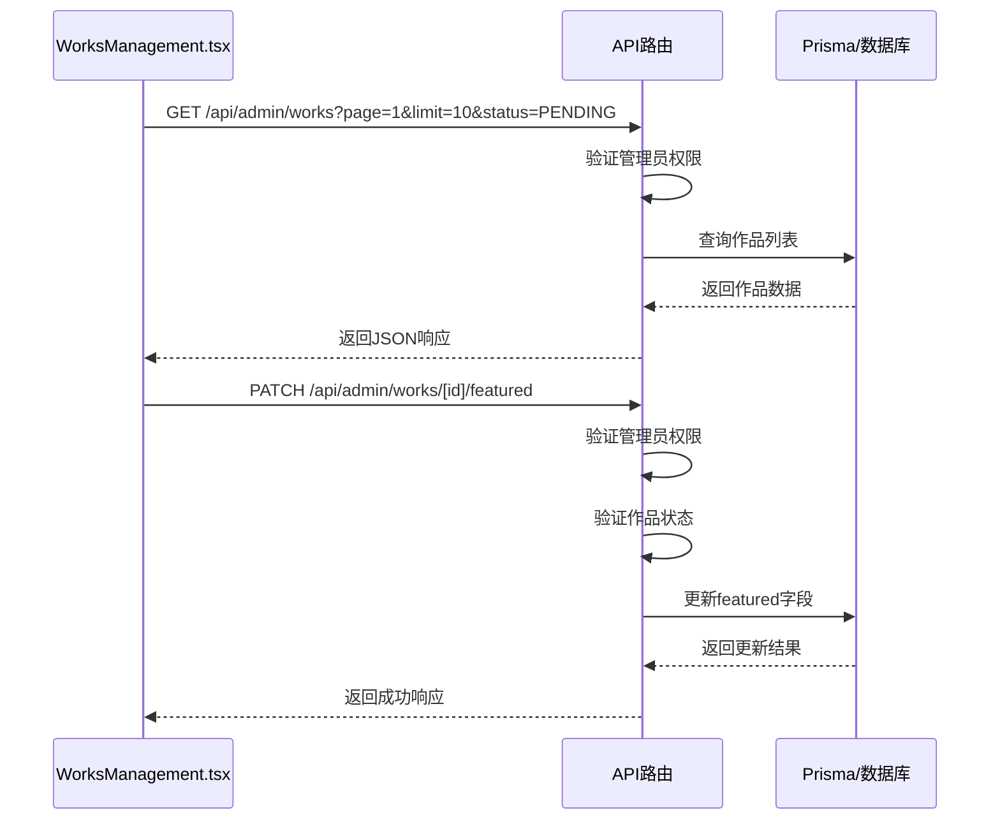
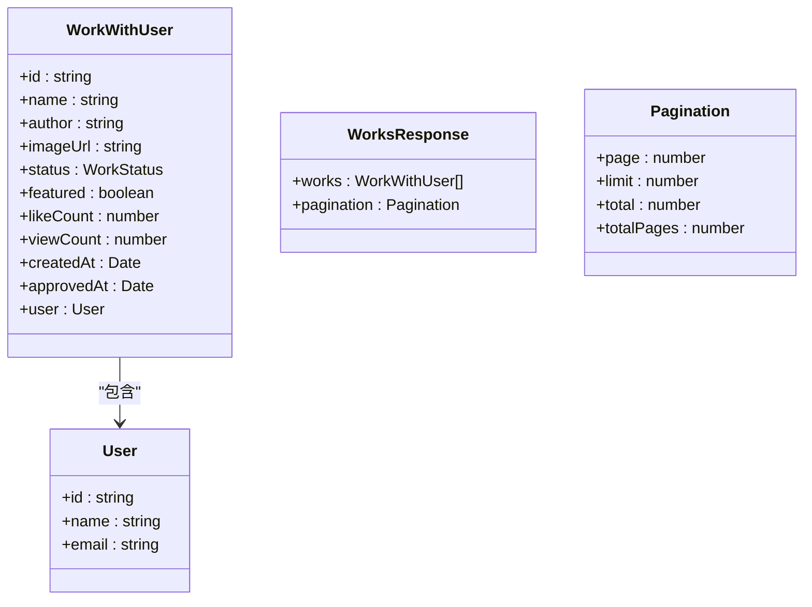
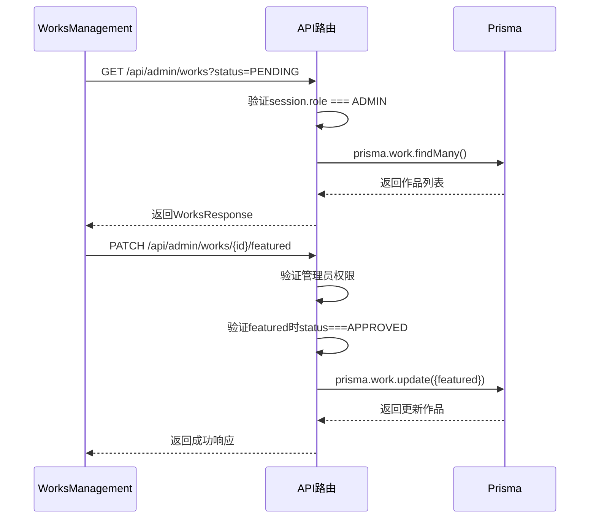
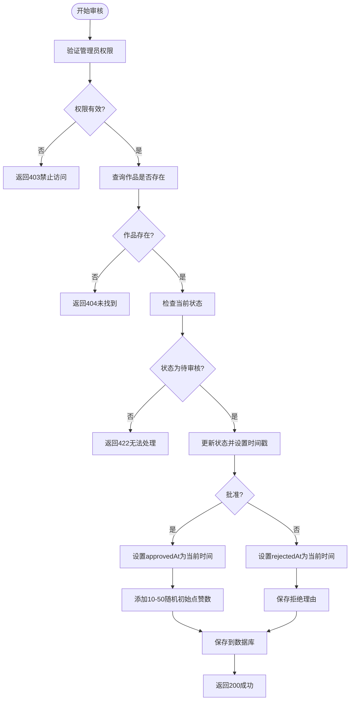
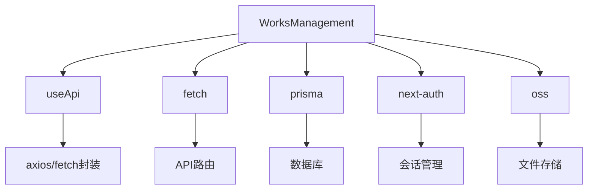

# 作品管理API

<cite>
**本文档引用的文件**   
- [WorksManagement.tsx](file://src/components/admin/WorksManagement.tsx)
- [route.ts](file://src/app/api/admin/works/route.ts)
- [route.ts](file://src/app/api/admin/works/[id]/route.ts)
- [route.ts](file://src/app/api/admin/works/[id]/approve/route.ts)
- [route.ts](file://src/app/api/admin/works/[id]/reject/route.ts)
- [route.ts](file://src/app/api/admin/works/[id]/featured/route.ts)
- [work.d.ts](file://src/types/work.d.ts)
- [migration.sql](file://prisma/migrations/20250831084947_add_featured_field/migration.sql)
</cite>

## 目录
1. [简介](#简介)
2. [项目结构](#项目结构)
3. [核心组件](#核心组件)
4. [架构概述](#架构概述)
5. [详细组件分析](#详细组件分析)
6. [依赖分析](#依赖分析)
7. [性能考虑](#性能考虑)
8. [故障排除指南](#故障排除指南)
9. [结论](#结论)

## 简介
本文档详细描述了数字化作品互动展示平台中的作品管理API，涵盖作品列表查询、状态审核（批准/拒绝）、精选设置等功能。API设计遵循RESTful原则，所有管理员端点均要求管理员权限认证。前端通过`useApi`钩子和`fetch`请求集成这些接口，确保数据一致性与操作安全性。业务规则包括审批时间自动更新、精选作品排序优先等。

## 项目结构
作品管理功能的API路由采用Next.js的文件系统路由机制，位于`src/app/api/admin/works`目录下，支持RESTful操作。前端组件位于`src/components/admin/`，使用React客户端组件实现交互逻辑。

```mermaid
graph TB
subgraph "API 路由"
A[/api/admin/works] --> B[/api/admin/works/[id]]
B --> C[/api/admin/works/[id]/approve]
B --> D[/api/admin/works/[id]/reject]
B --> E[/api/admin/works/[id]/featured]
end
subgraph "前端组件"
F[WorksManagement.tsx]
G[useApi.ts]
end
F --> G
F --> A
F --> B
F --> C
F --> D
F --> E
```

**图示来源**
- [route.ts](file://src/app/api/admin/works/route.ts#L1-L201)
- [route.ts](file://src/app/api/admin/works/[id]/route.ts#L1-L252)
- [WorksManagement.tsx](file://src/components/admin/WorksManagement.tsx#L1-L571)

**本节来源**
- [src/app/api/admin/works](file://src/app/api/admin/works)
- [src/components/admin/WorksManagement.tsx](file://src/components/admin/WorksManagement.tsx#L1-L571)

## 核心组件
作品管理API的核心功能包括分页获取作品列表、审核作品状态（批准/拒绝）、设置精选状态。所有操作均需管理员身份认证，通过`getServerSession`验证用户角色。数据模型基于Prisma定义，包含作品名称、作者、状态、精选标志、点赞量、浏览量等字段。

**本节来源**
- [route.ts](file://src/app/api/admin/works/route.ts#L1-L201)
- [work.d.ts](file://src/types/work.d.ts#L1-L96)
- [migration.sql](file://prisma/migrations/20250831084947_add_featured_field/migration.sql#L1-L123)

## 架构概述
系统采用前后端分离架构，前端通过fetch调用后端API，后端使用Next.js API路由处理请求，Prisma作为ORM操作数据库。认证通过NextAuth实现，会话中携带用户角色信息用于权限控制。



**图示来源**
- [WorksManagement.tsx](file://src/components/admin/WorksManagement.tsx#L1-L571)
- [route.ts](file://src/app/api/admin/works/route.ts#L1-L201)
- [route.ts](file://src/app/api/admin/works/[id]/featured/route.ts#L1-L91)

## 详细组件分析
### 作品管理组件分析
该组件实现管理员对作品的全面管理，包括列表展示、状态审核、精选设置等。

#### 对象关系图


**图示来源**
- [work.d.ts](file://src/types/work.d.ts#L1-L96)
- [route.ts](file://src/app/api/admin/works/route.ts#L1-L201)

#### API调用流程


**图示来源**
- [WorksManagement.tsx](file://src/components/admin/WorksManagement.tsx#L1-L571)
- [route.ts](file://src/app/api/admin/works/[id]/featured/route.ts#L1-L91)

#### 审核状态变更逻辑


**图示来源**
- [route.ts](file://src/app/api/admin/works/[id]/route.ts#L1-L252)
- [route.ts](file://src/app/api/admin/works/[id]/approve/route.ts#L1-L76)
- [route.ts](file://src/app/api/admin/works/[id]/reject/route.ts#L1-L95)

**本节来源**
- [WorksManagement.tsx](file://src/components/admin/WorksManagement.tsx#L1-L571)
- [route.ts](file://src/app/api/admin/works/route.ts#L1-L201)
- [route.ts](file://src/app/api/admin/works/[id]/route.ts#L1-L252)
- [route.ts](file://src/app/api/admin/works/[id]/approve/route.ts#L1-L76)
- [route.ts](file://src/app/api/admin/works/[id]/reject/route.ts#L1-L95)
- [route.ts](file://src/app/api/admin/works/[id]/featured/route.ts#L1-L91)

## 依赖分析
作品管理功能依赖多个核心模块，包括认证、数据库访问、对象存储等。



**图示来源**
- [WorksManagement.tsx](file://src/components/admin/WorksManagement.tsx#L1-L571)
- [route.ts](file://src/app/api/admin/works/route.ts#L1-L201)
- [lib/prisma.ts](file://src/lib/prisma.ts#L1-L20)
- [lib/auth.ts](file://src/lib/auth.ts#L1-L72)

**本节来源**
- [go.mod](file://package.json)
- [WorksManagement.tsx](file://src/components/admin/WorksManagement.tsx#L1-L571)
- [lib/prisma.ts](file://src/lib/prisma.ts#L1-L20)
- [lib/auth.ts](file://src/lib/auth.ts#L1-L72)

## 性能考虑
- 使用Prisma的`findMany`和`count`并行查询提高列表加载效率
- 通过`skip`和`take`实现分页，避免全量数据加载
- 在更新精选状态时仅更新必要字段，减少数据库写入开销
- 前端使用`useDebounce`优化搜索请求频率，避免频繁API调用

## 故障排除指南
### 常见错误及解决方案
- **403禁止访问**：确保请求携带有效管理员会话，检查`session.user.role`是否为`ADMIN`
- **404未找到作品**：确认作品ID存在且未被删除
- **422无法处理**：只能对状态为`PENDING`的作品进行审核操作
- **400参数无效**：检查请求体是否符合Zod验证模式，如`featured`必须为布尔值
- **500服务器错误**：查看服务端日志，检查数据库连接或Prisma查询异常

**本节来源**
- [route.ts](file://src/app/api/admin/works/[id]/route.ts#L1-L252)
- [route.ts](file://src/app/api/admin/works/[id]/featured/route.ts#L1-L91)
- [WorksManagement.tsx](file://src/components/admin/WorksManagement.tsx#L1-L571)

## 结论
作品管理API设计合理，功能完整，权限控制严格。通过RESTful端点实现作品的全生命周期管理，前端组件与后端API紧密配合，确保了数据一致性和操作安全性。业务规则如审批时间自动更新、精选状态限制等均得到有效实施，为平台的内容管理提供了可靠支持。