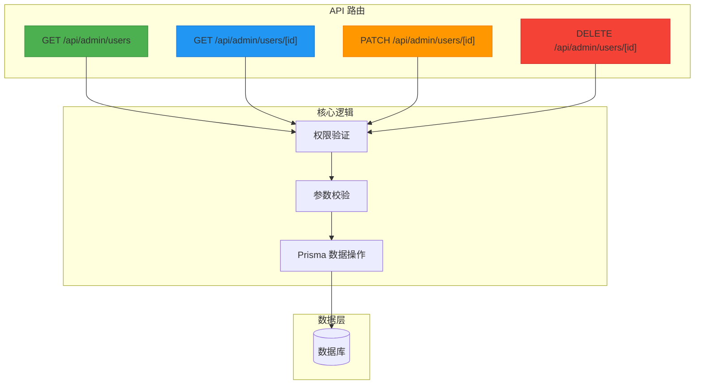
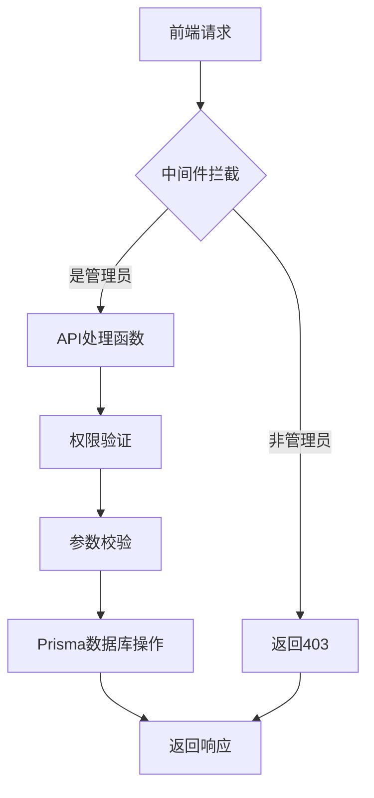
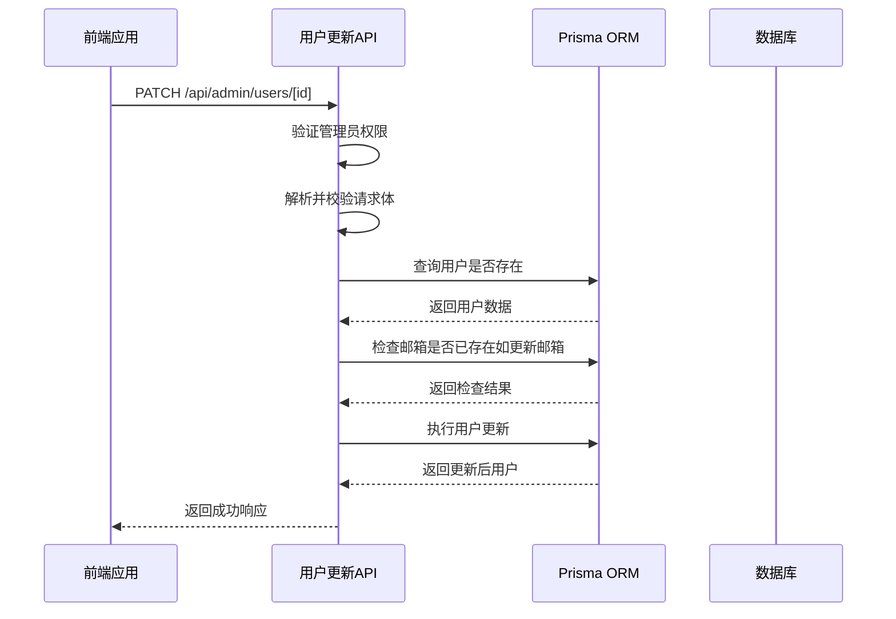
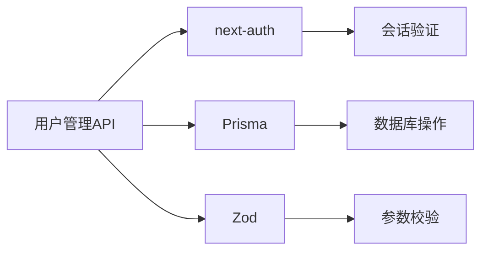

# 用户管理API

<cite>
**本文档引用文件**  
- [src/app/api/admin/users/route.ts](file://src/app/api/admin/users/route.ts)
- [src/app/api/admin/users/[id]/route.ts](file://src/app/api/admin/users/[id]/route.ts)
- [prisma/seed.ts](file://prisma/seed.ts)
- [middleware.ts](file://middleware.ts)
</cite>

## 目录
1. [简介](#简介)
2. [项目结构](#项目结构)
3. [核心组件](#核心组件)
4. [架构概览](#架构概览)
5. [详细组件分析](#详细组件分析)
6. [依赖分析](#依赖分析)
7. [性能考虑](#性能考虑)
8. [故障排除指南](#故障排除指南)
9. [结论](#结论)

## 简介
本文档详细说明数字化作品互动展示平台中的用户管理API，涵盖管理员获取用户列表与更新用户信息的核心功能。重点解析 `GET /api/admin/users` 的分页、搜索与过滤能力，以及 `PATCH /api/admin/users/[id]` 的字段更新机制。文档结合前端调用场景（如封禁用户、提升为管理员），提供实际请求/响应示例，并阐述与Prisma模型的映射关系、敏感字段访问控制策略及安全防护措施。

## 项目结构
用户管理API位于 `src/app/api/admin/users` 目录下，采用Next.js App Router的路由处理模式。该模块包含两个主要路由文件：`route.ts` 处理用户列表请求，`[id]/route.ts` 处理单个用户的增删改查操作。系统权限控制通过中间件和会话验证实现，数据持久化依赖Prisma ORM与数据库交互。



**图示来源**  
- [src/app/api/admin/users/route.ts](file://src/app/api/admin/users/route.ts)
- [src/app/api/admin/users/[id]/route.ts](file://src/app/api/admin/users/[id]/route.ts)

**本节来源**  
- [src/app/api/admin/users](file://src/app/api/admin/users)

## 核心组件
用户管理API的核心功能包括：管理员权限下的用户列表分页查询、用户信息更新、用户详情获取与用户删除。所有操作均通过 `getServerSession` 验证管理员身份，使用Zod进行请求参数校验，并通过Prisma客户端执行数据库操作。敏感字段如邮箱具备唯一性校验，角色变更需管理员权限。

**本节来源**  
- [src/app/api/admin/users/route.ts](file://src/app/api/admin/users/route.ts#L1-L95)
- [src/app/api/admin/users/[id]/route.ts](file://src/app/api/admin/users/[id]/route.ts#L1-L226)

## 架构概览
系统采用分层架构，前端通过API路由发起请求，中间件进行初步权限拦截，API处理函数执行具体业务逻辑。业务逻辑层包含权限验证、输入校验、数据库查询与更新，最终返回标准化JSON响应。数据层由Prisma ORM抽象，与底层数据库交互。



**图示来源**  
- [middleware.ts](file://middleware.ts#L1-L51)
- [src/app/api/admin/users/route.ts](file://src/app/api/admin/users/route.ts#L1-L95)

## 详细组件分析

### 用户列表获取分析
`GET /api/admin/users` 接口支持分页、按角色过滤和关键词搜索。查询参数经Zod验证后构建Prisma查询条件，支持对用户名和邮箱的不区分大小写模糊匹配。响应包含用户基本信息、作品数量统计及分页元数据。

#### 请求参数说明
| 参数 | 类型 | 必需 | 描述 |
|------|------|------|------|
| `page` | 整数 | 否 | 当前页码，默认为1 |
| `limit` | 整数 | 否 | 每页数量，默认为10 |
| `role` | 字符串 | 否 | 过滤角色（USER/ADMIN） |
| `search` | 字符串 | 否 | 搜索关键词（匹配用户名或邮箱） |

#### 响应示例
```json
{
  "success": true,
  "data": {
    "users": [
      {
        "id": "clxyz123",
        "name": "张三",
        "email": "user1@yunqi.com",
        "role": "USER",
        "createdAt": "2025-08-31T08:49:47.000Z",
        "_count": { "works": 5 }
      }
    ],
    "pagination": {
      "page": 1,
      "limit": 10,
      "total": 15,
      "totalPages": 2
    }
  }
}
```

**本节来源**  
- [src/app/api/admin/users/route.ts](file://src/app/api/admin/users/route.ts#L1-L95)

### 用户信息更新分析
`PATCH /api/admin/users/[id]` 接口允许管理员更新指定用户的角色、姓名或邮箱。系统校验管理员权限后，对输入数据进行Zod验证，并检查邮箱唯一性。更新成功后返回最新用户信息。

#### 可更新字段
| 字段 | 类型 | 说明 |
|------|------|------|
| `name` | 字符串 | 用户姓名，不能为空 |
| `email` | 字符串 | 邮箱地址，需符合格式且唯一 |
| `role` | 字符串 | 角色（USER/ADMIN），用于权限提升或降级 |

#### 前端调用场景示例
- **封禁用户**：将用户角色从 `USER` 改为 `ADMIN` 或反之
- **信息修正**：更新用户邮箱或姓名

#### 请求示例
```http
PATCH /api/admin/users/clxyz123
Content-Type: application/json

{
  "role": "ADMIN",
  "name": "超级管理员"
}
```

#### 成功响应
```json
{
  "success": true,
  "data": {
    "id": "clxyz123",
    "name": "超级管理员",
    "email": "user1@yunqi.com",
    "role": "ADMIN",
    "createdAt": "2025-08-31T08:49:47.000Z"
  },
  "message": "用户信息更新成功"
}
```

#### 错误响应
```json
{
  "success": false,
  "error": "该邮箱已被使用",
  "code": "CONFLICT"
}
```



**图示来源**  
- [src/app/api/admin/users/[id]/route.ts](file://src/app/api/admin/users/[id]/route.ts#L1-L226)

**本节来源**  
- [src/app/api/admin/users/[id]/route.ts](file://src/app/api/admin/users/[id]/route.ts#L1-L226)

## 依赖分析
用户管理API依赖多个核心模块：`next-auth` 提供会话管理，`prisma` 实现数据库访问，`zod` 负责数据验证。这些依赖通过 `lib` 目录下的工具类统一暴露，确保API层与底层实现解耦。



**图示来源**  
- [src/app/api/admin/users/route.ts](file://src/app/api/admin/users/route.ts#L1-L95)
- [src/app/api/admin/users/[id]/route.ts](file://src/app/api/admin/users/[id]/route.ts#L1-L226)

**本节来源**  
- [src/app/api/admin/users/route.ts](file://src/app/api/admin/users/route.ts#L1-L95)
- [src/app/api/admin/users/[id]/route.ts](file://src/app/api/admin/users/[id]/route.ts#L1-L226)

## 性能考虑
用户列表查询采用分页机制，避免全量加载。`findMany` 与 `count` 操作并行执行，减少数据库往返延迟。建议在 `email` 和 `role` 字段上建立数据库索引以优化查询性能。对于高频搜索场景，可考虑引入缓存层。

## 故障排除指南
常见问题包括权限不足、参数校验失败和邮箱冲突。开发时应检查会话是否有效，确保请求头包含正确认证信息。生产环境需监控数据库连接状态与API响应时间。调试时可查看服务端日志中的错误堆栈。

**本节来源**  
- [src/app/api/admin/users/route.ts](file://src/app/api/admin/users/route.ts#L1-L95)
- [src/app/api/admin/users/[id]/route.ts](file://src/app/api/admin/users/[id]/route.ts#L1-L226)

## 结论
用户管理API设计合理，功能完整，具备良好的安全性与可扩展性。通过严格的权限控制、输入验证和错误处理，保障了系统稳定。建议后续增加操作日志记录，进一步提升管理透明度。