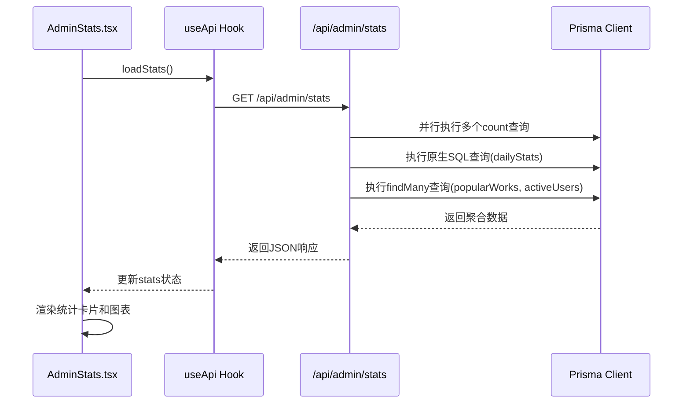
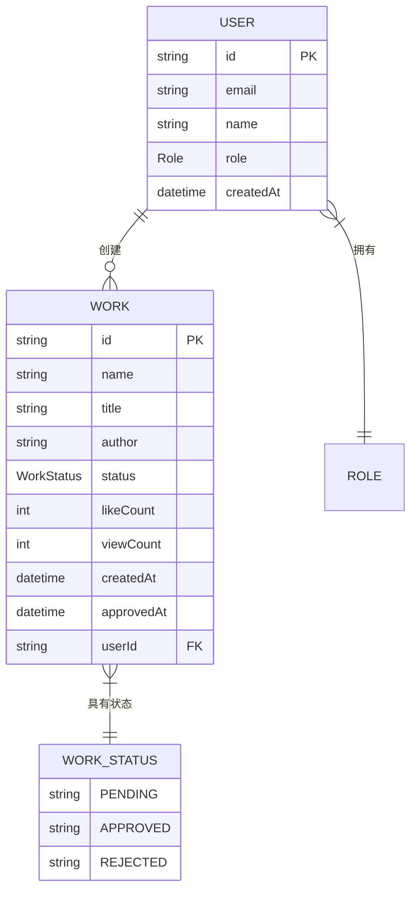

# 统计API

<cite>
**本文档引用的文件**
- [route.ts](file://src/app/api/admin/stats/route.ts)
- [AdminStats.tsx](file://src/components/admin/AdminStats.tsx)
- [prisma.ts](file://src/lib/prisma.ts)
</cite>

## 目录
1. [简介](#简介)
2. [核心功能](#核心功能)
3. [响应结构](#响应结构)
4. [前端集成](#前端集成)
5. [性能与缓存策略](#性能与缓存策略)
6. [数据聚合实现](#数据聚合实现)
7. [成功响应示例](#成功响应示例)
8. [错误码说明](#错误码说明)
9. [监控建议](#监控建议)

## 简介
本API端点 `GET /api/admin/stats` 为管理后台提供平台核心运营指标的聚合数据。该接口专为管理员设计，返回包括总作品数、待审核作品数、总用户数、最近7天新增作品等关键业务指标。数据通过高效的数据库查询聚合生成，并采用服务端缓存策略以确保高性能。

**Section sources**
- [route.ts](file://src/app/api/admin/stats/route.ts#L1-L163)

## 核心功能
`GET /api/admin/stats` 端点提供全面的平台运营数据概览，主要功能包括：
- **基础统计**：获取平台的总用户数、总作品数及按状态（待审核、已通过、已拒绝）分类的作品数量。
- **近期趋势**：统计最近7天内注册的新用户和提交的新作品数量。
- **时间序列数据**：获取最近30天内每日作品和用户增长的详细数据，用于图表展示。
- **排行榜数据**：获取最新的已通过作品列表和按作品数量排序的活跃用户列表。

该接口是管理后台仪表盘的核心数据源，为管理员提供决策支持。

**Section sources**
- [route.ts](file://src/app/api/admin/stats/route.ts#L1-L163)

## 响应结构
API返回一个包含成功状态和数据对象的JSON响应。数据对象分为三个主要部分：`overview`（概览）、`charts`（图表数据）和`lists`（列表数据）。

### 概览 (overview)
包含核心运营指标。

| 字段名 | 数据类型 | 业务含义 |
| :--- | :--- | :--- |
| `totalUsers` | number | 平台注册用户的总数 |
| `totalWorks` | number | 所有作品的总数 |
| `pendingWorks` | number | 当前处于“待审核”状态的作品数量 |
| `approvedWorks` | number | 当前处于“已通过”状态的作品数量 |
| `rejectedWorks` | number | 当前处于“已拒绝”状态的作品数量 |
| `recentUsers` | number | 最近7天内注册的新用户数量 |
| `recentWorks` | number | 最近7天内提交的新作品数量 |

### 图表数据 (charts)
包含用于绘制趋势图的时间序列数据。

| 字段名 | 数据类型 | 业务含义 |
| :--- | :--- | :--- |
| `dailyWorks` | Array<{date: Date, count: number, type: string}> | 最近30天每日作品提交数量数组，`type` 固定为 "works" |
| `dailyUsers` | Array<{date: Date, count: number, type: string}> | 最近30天每日用户注册数量数组，`type` 固定为 "users" |

### 列表数据 (lists)
包含排行榜信息。

| 字段名 | 数据类型 | 业务含义 |
| :--- | :--- | :--- |
| `popularWorks` | Array<any> | 最新的10个已通过审核的作品列表，按创建时间倒序排列 |
| `activeUsers` | Array<any> | 最活跃的10个用户列表，按其创建的作品数量倒序排列 |

**Section sources**
- [route.ts](file://src/app/api/admin/stats/route.ts#L1-L163)
- [AdminStats.tsx](file://src/components/admin/AdminStats.tsx#L1-L175)

## 前端集成
该API被 `src/components/admin/AdminStats.tsx` 组件用于渲染管理后台的仪表盘。

### 组件工作流程
1.  **数据获取**：组件在挂载时调用 `useApi` Hook，向 `/api/admin/stats` 发起GET请求。
2.  **状态管理**：使用 `useState` 管理获取到的统计数据、加载状态和错误信息。
3.  **UI渲染**：
    *   **统计卡片**：将 `overview` 中的数据映射为一组视觉化的卡片，显示总作品数、待审核数、总用户数等。
    *   **趋势图表**：虽然当前代码未直接展示图表，但 `charts` 中的 `dailyWorks` 和 `dailyUsers` 数据为绘制折线图或柱状图提供了基础。
    *   **加载与错误处理**：在请求期间显示加载动画，请求失败时显示错误信息并提供重试按钮。



**Diagram sources**
- [AdminStats.tsx](file://src/components/admin/AdminStats.tsx#L1-L175)
- [route.ts](file://src/app/api/admin/stats/route.ts#L1-L163)

**Section sources**
- [AdminStats.tsx](file://src/components/admin/AdminStats.tsx#L1-L175)

## 性能与缓存策略
为了保障管理后台的流畅体验，此API采用了明确的缓存策略。

### 服务端缓存
在API响应中设置了HTTP缓存头：
```typescript
response.headers.set('Cache-Control', 'public, s-maxage=300, stale-while-revalidate=600');
```
- **`s-maxage=300`**：表示在CDN或代理服务器上，响应可以被缓存300秒（5分钟）。
- **`stale-while-revalidate=600`**：允许在缓存过期后的600秒（10分钟）内，先返回旧的（stale）数据，同时在后台异步重新验证和更新缓存。

此策略确保了在高并发访问下，服务器不会被重复的统计查询压垮，同时保证了数据的相对实时性。

**Section sources**
- [route.ts](file://src/app/api/admin/stats/route.ts#L138-L140)

## 数据聚合实现
API通过Prisma ORM和原生SQL查询高效地从数据库聚合所需数据。

### 查询方式
1.  **并行基础查询**：使用 `Promise.all` 并行执行多个 `prisma.work.count()` 和 `prisma.user.count()` 查询，以获取总数量和按状态分类的数量。这显著减少了数据库往返时间。
2.  **原生SQL查询**：对于需要按日期分组的统计（如每日新增），使用 `prisma.$queryRaw` 执行原生SQL。这比在应用层处理更高效，尤其是在处理大量数据时。
    ```sql
    SELECT DATE("createdAt") as date, COUNT(*) as count, 'works' as type
    FROM "works" 
    WHERE "createdAt" >= $1
    GROUP BY DATE("createdAt")
    ORDER BY date DESC
    LIMIT 30
    ```
3.  **关联查询**：使用 `prisma.work.findMany` 和 `prisma.user.findMany` 获取排行榜数据，并通过 `select` 和 `_count` 选项精确控制返回的字段和关联数据量。



**Diagram sources**
- [route.ts](file://src/app/api/admin/stats/route.ts#L1-L163)
- [prisma.ts](file://src/lib/prisma.ts#L1-L20)

**Section sources**
- [route.ts](file://src/app/api/admin/stats/route.ts#L1-L163)

## 成功响应示例
```json
{
  "success": true,
  "data": {
    "overview": {
      "totalUsers": 150,
      "totalWorks": 320,
      "pendingWorks": 15,
      "approvedWorks": 290,
      "rejectedWorks": 15,
      "recentUsers": 8,
      "recentWorks": 12
    },
    "charts": {
      "dailyWorks": [
        { "date": "2025-09-20T00:00:00.000Z", "count": 2, "type": "works" },
        { "date": "2025-09-19T00:00:00.000Z", "count": 3, "type": "works" }
        // ... 更多数据点
      ],
      "dailyUsers": [
        { "date": "2025-09-20T00:00:00.000Z", "count": 1, "type": "users" },
        { "date": "2025-09-19T00:00:00.000Z", "count": 2, "type": "users" }
        // ... 更多数据点
      ]
    },
    "lists": {
      "popularWorks": [
        {
          "id": "cl2a1b2c3d4e5f",
          "name": "数字作品1",
          "title": "一个美丽的数字艺术",
          "author": "张三",
          "createdAt": "2025-09-20T10:00:00.000Z",
          "user": { "name": "李四" }
        }
        // ... 更多作品
      ],
      "activeUsers": [
        {
          "id": "cl1x2y3z4w5v",
          "name": "王五",
          "email": "wangwu@example.com",
          "createdAt": "2025-08-01T08:00:00.000Z",
          "_count": { "works": 15 }
        }
        // ... 更多用户
      ]
    }
  }
}
```

**Section sources**
- [route.ts](file://src/app/api/admin/stats/route.ts#L1-L163)

## 错误码说明
API在发生错误时会返回相应的HTTP状态码和JSON错误信息。

| HTTP状态码 | 错误码 (code) | 错误信息 (error) | 触发条件 |
| :--- | :--- | :--- | :--- |
| 403 | FORBIDDEN | 权限不足 | 请求用户未登录或其角色不是管理员 (ADMIN) |
| 500 | INTERNAL_ERROR | 服务器内部错误 | 服务器在处理请求时发生未预期的错误，例如数据库连接失败 |

**Section sources**
- [route.ts](file://src/app/api/admin/stats/route.ts#L1-L163)

## 监控建议
为了保障管理后台的流畅体验，强烈建议对 `GET /api/admin/stats` 接口进行监控：
- **响应时间监控**：设置告警，当接口平均响应时间超过200ms时通知运维人员。长时间的响应可能表明数据库查询性能下降或缓存失效。
- **错误率监控**：监控5xx错误的发生频率。持续的500错误可能意味着数据库或后端服务出现严重问题。
- **缓存命中率**：监控CDN或反向代理的缓存命中率。低命中率可能意味着缓存策略需要调整，或者存在大量缓存穿透的请求。

**Section sources**
- [route.ts](file://src/app/api/admin/stats/route.ts#L1-L163)