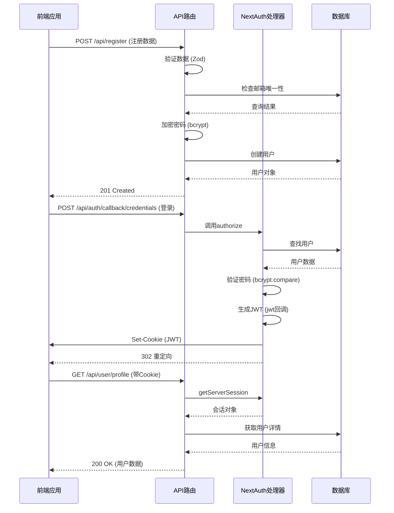
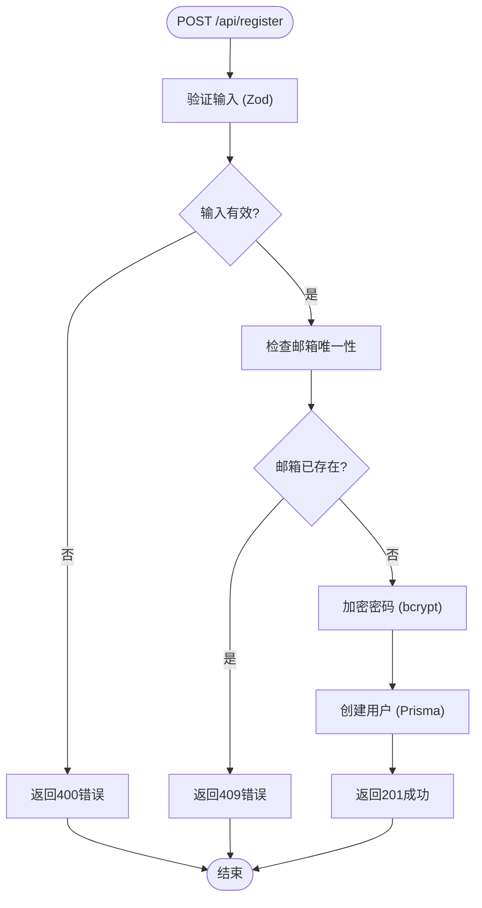
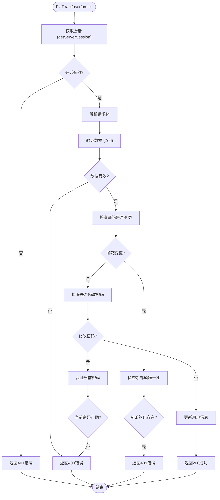
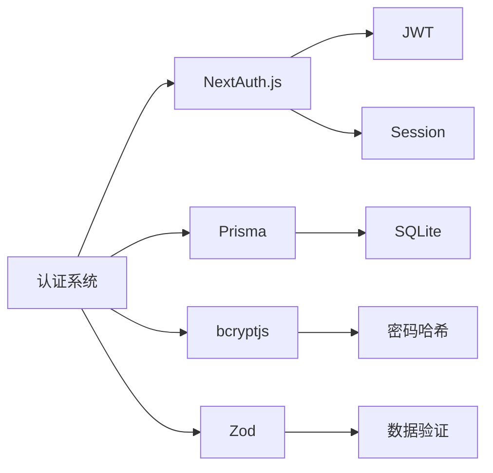

# 认证API

<cite>
**本文档中引用的文件**  
- [auth.ts](file://src/lib/auth.ts)
- [auth-utils.ts](file://src/lib/auth-utils.ts)
- [route.ts](file://src/app/api/auth/[...nextauth]/route.ts)
- [register/route.ts](file://src/app/api/register/route.ts)
- [profile/route.ts](file://src/app/api/user/profile/route.ts)
- [next-auth.d.ts](file://src/types/next-auth.d.ts)
- [page.tsx](file://src/app/auth/register/page.tsx)
- [数字化作品互动展示平台 - 开发文档.md](file://src/数字化作品互动展示平台 - 开发文档.md)
</cite>

## 目录
1. [简介](#简介)
2. [项目结构](#项目结构)
3. [核心组件](#核心组件)
4. [架构概述](#架构概述)
5. [详细组件分析](#详细组件分析)
6. [依赖分析](#依赖分析)
7. [性能考虑](#性能考虑)
8. [故障排除指南](#故障排除指南)
9. [结论](#结论)

## 简介
本文档详细描述了基于NextAuth.js的身份认证系统，涵盖用户注册、登录、会话管理和个人资料访问等核心功能。系统采用JWT会话策略，通过Credentials Provider实现基于邮箱和密码的认证机制。文档重点解析了动态路由`[...nextauth]`的配置机制、注册API的数据验证规则、JWT令牌的生成与传递方式，以及相关错误码的处理逻辑。结合`auth.ts`和`auth-utils.ts`中的实现细节，阐述了完整的认证流程和安全最佳实践。

## 项目结构
认证功能主要分布在`src/app/api/auth`、`src/app/api/register`和`src/app/api/user/profile`等API路由中，核心逻辑封装在`src/lib/auth.ts`和`src/lib/auth-utils.ts`中。前端页面位于`src/app/auth`目录下，包括注册和登录界面。类型定义扩展了NextAuth的默认类型，以支持角色权限管理。

```mermaid
graph TB
subgraph "API 路由"
A[/api/auth/[...nextauth]/route.ts\] --> B[NextAuth 主处理器]
C[/api/register/route.ts\] --> D[用户注册]
E[/api/user/profile/route.ts\] --> F[用户资料管理]
end
subgraph "核心逻辑"
G[src/lib/auth.ts] --> H[NextAuth 配置]
I[src/lib/auth-utils.ts] --> J[认证辅助函数]
end
subgraph "前端界面"
K[src/app/auth/register/page.tsx] --> L[注册页面]
M[src/app/auth/signin/page.tsx] --> N[登录页面]
end
B --> G
D --> G
F --> G
L --> C
N --> A
```

**Diagram sources**
- [route.ts](file://src/app/api/auth/[...nextauth]/route.ts)
- [register/route.ts](file://src/app/api/register/route.ts)
- [profile/route.ts](file://src/app/api/user/profile/route.ts)
- [auth.ts](file://src/lib/auth.ts)
- [page.tsx](file://src/app/auth/register/page.tsx)

**Section sources**
- [auth.ts](file://src/lib/auth.ts)
- [auth-utils.ts](file://src/lib/auth-utils.ts)
- [route.ts](file://src/app/api/auth/[...nextauth]/route.ts)
- [register/route.ts](file://src/app/api/register/route.ts)
- [profile/route.ts](file://src/app/api/user/profile/route.ts)

## 核心组件
核心认证组件包括：`authOptions`配置对象，定义了Credentials Provider和JWT会话策略；`getCurrentUser`和`requireAuth`等辅助函数，用于在服务端获取和验证用户会话；动态API路由`[...nextauth]`，作为NextAuth的统一入口；以及独立的`/api/register`和`/api/user/profile`端点，分别处理用户注册和资料管理。

**Section sources**
- [auth.ts](file://src/lib/auth.ts#L1-L71)
- [auth-utils.ts](file://src/lib/auth-utils.ts#L1-L23)
- [route.ts](file://src/app/api/auth/[...nextauth]/route.ts#L1-L6)

## 架构概述
系统采用Next.js App Router与NextAuth.js集成的架构。认证流程始于前端发起请求，经由API路由转发至NextAuth核心处理器。JWT令牌在认证成功后生成，通过HTTP Only Cookie安全传递。用户角色信息通过回调函数注入令牌和会话，实现细粒度的权限控制。



**Diagram sources**
- [auth.ts](file://src/lib/auth.ts#L1-L71)
- [register/route.ts](file://src/app/api/register/route.ts#L1-L95)
- [profile/route.ts](file://src/app/api/user/profile/route.ts#L1-L236)
- [route.ts](file://src/app/api/auth/[...nextauth]/route.ts#L1-L6)

## 详细组件分析

### NextAuth配置分析
`authOptions`对象配置了基于凭证的认证方式，使用邮箱作为唯一标识。会话策略设置为JWT，通过`jwt`和`session`回调函数将用户角色信息注入令牌和会话对象，确保权限信息在客户端和服务端的一致性。

```mermaid
classDiagram
class authOptions {
+adapter : PrismaAdapter
+providers : CredentialsProvider[]
+session : {strategy : 'jwt'}
+callbacks : {jwt(), session()}
+pages : {signIn : '/auth/signin'}
+secret : string
}
class CredentialsProvider {
+name : 'credentials'
+credentials : {email, password}
+authorize(credentials) : User | null
}
class jwtCallback {
+jwt({token, user}) : JWT
+session({session, token}) : Session
}
authOptions --> CredentialsProvider : 包含
authOptions --> jwtCallback : 使用回调
```

**Diagram sources**
- [auth.ts](file://src/lib/auth.ts#L1-L71)

**Section sources**
- [auth.ts](file://src/lib/auth.ts#L1-L71)

### 注册API分析
`/api/register`端点接收包含姓名、邮箱、密码和确认密码的POST请求。使用Zod进行严格的数据验证，确保密码强度（至少6位）和两次输入的一致性。通过Prisma检查邮箱唯一性，使用bcrypt进行密码哈希（盐值12），最后创建用户并返回成功响应。



**Diagram sources**
- [register/route.ts](file://src/app/api/register/route.ts#L1-L95)

**Section sources**
- [register/route.ts](file://src/app/api/register/route.ts#L1-L95)
- [page.tsx](file://src/app/auth/register/page.tsx#L1-L159)

### 个人资料管理分析
`/api/user/profile`端点支持GET和PUT方法。GET请求返回当前登录用户的详细信息，包括作品统计。PUT请求允许用户更新姓名、邮箱和密码。修改密码时需提供当前密码进行验证，并使用bcrypt重新哈希新密码。所有操作均通过`getServerSession`确保用户已认证。



**Diagram sources**
- [profile/route.ts](file://src/app/api/user/profile/route.ts#L1-L236)

**Section sources**
- [profile/route.ts](file://src/app/api/user/profile/route.ts#L1-L236)
- [auth-utils.ts](file://src/lib/auth-utils.ts#L1-L23)

## 依赖分析
认证系统依赖于NextAuth.js、Prisma、bcryptjs和Zod等核心库。NextAuth提供认证框架，Prisma用于数据库操作，bcryptjs处理密码安全，Zod负责数据验证。类型系统通过`next-auth.d.ts`扩展，将用户角色（Role）集成到会话和JWT令牌中。



**Diagram sources**
- [auth.ts](file://src/lib/auth.ts#L1-L71)
- [register/route.ts](file://src/app/api/register/route.ts#L1-L95)
- [profile/route.ts](file://src/app/api/user/profile/route.ts#L1-L236)
- [next-auth.d.ts](file://src/types/next-auth.d.ts#L1-L22)

**Section sources**
- [auth.ts](file://src/lib/auth.ts#L1-L71)
- [register/route.ts](file://src/app/api/register/route.ts#L1-L95)
- [profile/route.ts](file://src/app/api/user/profile/route.ts#L1-L236)
- [next-auth.d.ts](file://src/types/next-auth.d.ts#L1-L22)

## 性能考虑
密码哈希使用bcrypt（盐值12），在安全性和性能间取得平衡。数据库查询通过Prisma的`findUnique`和`select`优化，仅获取必要字段。JWT令牌避免了频繁的数据库查询，提升了会话验证的效率。Zod的同步验证确保了快速的错误响应。

## 故障排除指南
- **401 Unauthorized**: 用户未登录或会话已过期。检查`getServerSession`调用和Cookie设置。
- **409 Conflict**: 邮箱已被注册或使用。检查`findUnique`查询和Prisma的唯一约束。
- **500 Internal Error**: 服务器内部错误。检查环境变量（如`NEXTAUTH_SECRET`）和数据库连接。
- **密码验证失败**: 确保bcrypt的`compare`函数正确使用，且哈希时的盐值一致。

**Section sources**
- [register/route.ts](file://src/app/api/register/route.ts#L1-L95)
- [profile/route.ts](file://src/app/api/user/profile/route.ts#L1-L236)
- [auth.ts](file://src/lib/auth.ts#L1-L71)

## 结论
本认证系统通过NextAuth.js与Next.js App Router的深度集成，实现了安全、可扩展的用户管理功能。动态路由`[...nextauth]`简化了认证入口，JWT策略确保了会话的安全性。详细的错误处理和数据验证机制提升了用户体验和系统健壮性。未来可考虑增加OAuth2.0支持和多因素认证以进一步增强安全性。