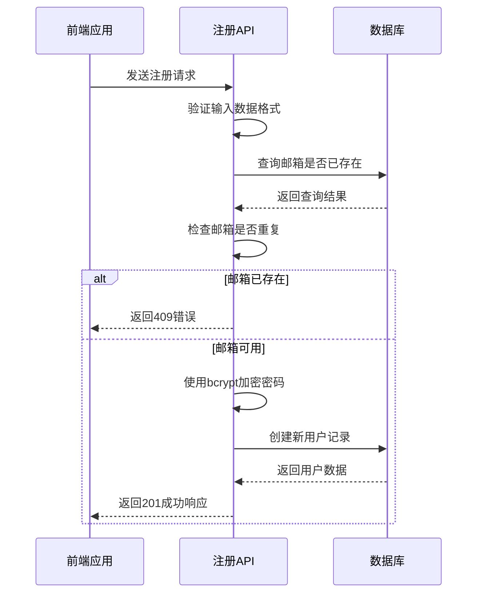
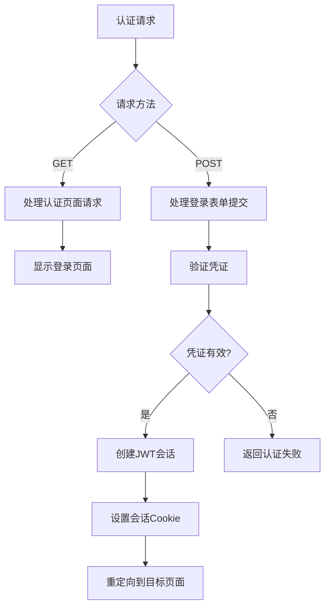

# 认证API

<cite>
**本文档引用的文件**   
- [src/app/api/register/route.ts](file://src/app/api/register/route.ts)
- [src/app/api/auth/[...nextauth]/route.ts](file://src/app/api/auth/[...nextauth]/route.ts)
- [src/lib/auth.ts](file://src/lib/auth.ts)
- [src/types/next-auth.d.ts](file://src/types/next-auth.d.ts)
- [src/app/auth/register/page.tsx](file://src/app/auth/register/page.tsx)
- [src/app/auth/signin/page.tsx](file://src/app/auth/signin/page.tsx)
- [prisma/schema.prisma](file://prisma/schema.prisma)
- [src/测试脚本登陆方式.md](file://src/测试脚本登陆方式.md)
</cite>

## 目录
1. [简介](#简介)
2. [注册接口](#注册接口)
3. [认证路由](#认证路由)
4. [会话管理](#会话管理)
5. [前端调用示例](#前端调用示例)
6. [常见问题与解决方案](#常见问题与解决方案)

## 简介

本文档详细说明了数字化作品互动展示平台的认证API，涵盖用户注册、登录及会话管理功能。系统基于NextAuth.js构建，采用JWT会话策略，确保安全的身份验证机制。核心接口包括`/api/register`用于用户注册和`/api/auth/[...nextauth]`处理认证流程。文档将解释各接口的HTTP方法、请求/响应结构、认证头使用方式，并结合TypeScript类型定义和前端调用示例进行说明。

**Section sources**
- [src/app/api/register/route.ts](file://src/app/api/register/route.ts)
- [src/lib/auth.ts](file://src/lib/auth.ts)

## 注册接口

### 接口详情
- **端点**: `POST /api/register`
- **功能**: 创建新用户账户
- **认证要求**: 无需认证

### 请求体结构
请求必须包含以下JSON字段：
- `name`: 用户姓名（字符串，1-50字符）
- `email`: 邮箱地址（有效邮箱格式）
- `password`: 密码（6-100字符）
- `confirmPassword`: 确认密码（必须与password一致）

### 响应格式
**成功响应 (HTTP 201)**:
```json
{
  "success": true,
  "data": {
    "id": "用户ID",
    "name": "用户姓名",
    "email": "邮箱地址",
    "role": "用户角色",
    "createdAt": "创建时间"
  },
  "message": "注册成功，请登录"
}
```

**失败响应**:
- `400 Bad Request`: 输入数据无效，返回`VALIDATION_ERROR`代码
- `409 Conflict`: 邮箱已被注册，返回`EMAIL_EXISTS`代码
- `500 Internal Server Error`: 服务器内部错误

### 密码加密与邮箱校验
注册接口在创建用户前执行以下安全处理：
1. **邮箱唯一性校验**: 使用`prisma.user.findUnique()`检查邮箱是否已存在
2. **密码加密**: 通过`bcryptjs`库使用12轮哈希对密码进行加密处理



**Diagram sources **
- [src/app/api/register/route.ts](file://src/app/api/register/route.ts#L1-L94)
- [src/lib/auth.ts](file://src/lib/auth.ts#L1-L71)

**Section sources**
- [src/app/api/register/route.ts](file://src/app/api/register/route.ts#L1-L94)
- [src/app/auth/register/page.tsx](file://src/app/auth/register/page.tsx#L1-L278)

## 认证路由

### NextAuth.js集成
`/api/auth/[...nextauth]`是NextAuth.js的标准认证路由，处理所有认证相关请求。

```typescript
import NextAuth from 'next-auth';
import { authOptions } from '@/lib/auth';

const handler = NextAuth(authOptions);

export { handler as GET, handler as POST };
```

### 认证配置
在`src/lib/auth.ts`中定义了认证选项，使用凭证提供者（CredentialsProvider）实现邮箱密码登录。



**Diagram sources **
- [src/app/api/auth/[...nextauth]/route.ts](file://src/app/api/auth/[...nextauth]/route.ts#L1-L6)
- [src/lib/auth.ts](file://src/lib/auth.ts#L1-L71)

**Section sources**
- [src/app/api/auth/[...nextauth]/route.ts](file://src/app/api/auth/[...nextauth]/route.ts#L1-L6)
- [src/lib/auth.ts](file://src/lib/auth.ts#L1-L71)

## 会话管理

### JWT会话策略
系统采用JWT（JSON Web Token）进行会话管理，具体实现如下：

1. **会话创建**: 在`authOptions`的`callbacks.jwt`中，将用户角色添加到JWT令牌
2. **会话扩展**: 在`callbacks.session`中，从JWT令牌提取角色信息并注入会话对象

```typescript
callbacks: {
  async jwt({ token, user }) {
    if (user) {
      token.role = user.role;
    }
    return token;
  },
  async session({ session, token }) {
    if (token) {
      session.user.id = token.sub!;
      session.user.role = token.role as Role;
    }
    return session;
  }
}
```

### 认证头使用
受保护的API端点需要在请求头中包含Bearer Token：
```
Authorization: Bearer <JWT_TOKEN>
```

### TypeScript类型定义
通过模块扩展确保类型安全，扩展了NextAuth.js的默认类型：

```typescript
declare module 'next-auth' {
  interface Session {
    user: {
      id: string;
      email: string;
      name?: string | null;
      role: Role;
    };
  }
}

declare module 'next-auth/jwt' {
  interface JWT {
    role: Role;
  }
}
```

**Section sources**
- [src/lib/auth.ts](file://src/lib/auth.ts#L43-L71)
- [src/types/next-auth.d.ts](file://src/types/next-auth.d.ts#L1-L22)

## 前端调用示例

### Fetch API调用
```typescript
// 注册请求
const register = async (userData) => {
  const response = await fetch('/api/register', {
    method: 'POST',
    headers: {
      'Content-Type': 'application/json',
    },
    body: JSON.stringify(userData),
  });

  const result = await response.json();
  return result;
};

// 登录请求
const login = async (email, password) => {
  const result = await signIn('credentials', {
    email,
    password,
    redirect: false,
  });
  return result;
};
```

### Axios调用
```typescript
import axios from 'axios';

const apiClient = axios.create({
  baseURL: '/api',
});

// 注册请求
const registerUser = async (userData) => {
  try {
    const response = await apiClient.post('/register', userData);
    return response.data;
  } catch (error) {
    console.error('注册失败:', error.response?.data);
    throw error;
  }
};
```

### 自定义Hook使用
```typescript
// 使用useApi自定义Hook
const { execute } = useApi<RegisterResponse>();

const handleSubmit = async () => {
  const response = await execute('/api/register', {
    method: 'POST',
    headers: { 'Content-Type': 'application/json' },
    body: JSON.stringify(formData)
  });
  
  if (response?.success) {
    // 处理成功
  }
};
```

**Section sources**
- [src/app/auth/register/page.tsx](file://src/app/auth/register/page.tsx#L1-L278)
- [src/app/auth/signin/page.tsx](file://src/app/auth/signin/page.tsx#L1-L153)
- [src/测试脚本登陆方式.md](file://src/测试脚本登陆方式.md#L1-L87)

## 常见问题与解决方案

### OAuth回调配置错误
**问题**: OAuth登录后无法正确重定向
**解决方案**: 
1. 确保`NEXTAUTH_URL`环境变量正确设置
2. 在`authOptions`中正确配置`pages.signIn`指向登录页面
3. 检查OAuth提供者的回调URL是否包含`/api/auth/callback/[provider]`

### 会话失效问题
**问题**: 用户频繁被登出或会话无法保持
**解决方案**:
1. 确保`NEXTAUTH_SECRET`环境变量已设置且稳定
2. 检查JWT令牌的过期时间配置
3. 确认浏览器Cookie设置允许跨站点Cookie

### 跨域问题
**问题**: 开发环境下API调用出现CORS错误
**解决方案**:
1. 确保前端和后端服务在同一域名下运行
2. 在开发环境中正确配置代理
3. 检查`middleware.ts`中的CORS设置

### 数据库连接问题
**问题**: 认证过程中数据库操作失败
**解决方案**:
1. 验证`DATABASE_URL`环境变量配置正确
2. 检查Prisma客户端连接状态
3. 确保数据库服务正在运行

**Section sources**
- [src/lib/auth.ts](file://src/lib/auth.ts#L1-L71)
- [src/测试脚本登陆方式.md](file://src/测试脚本登陆方式.md#L1-L87)
- [middleware.ts](file://middleware.ts#L1-L10)