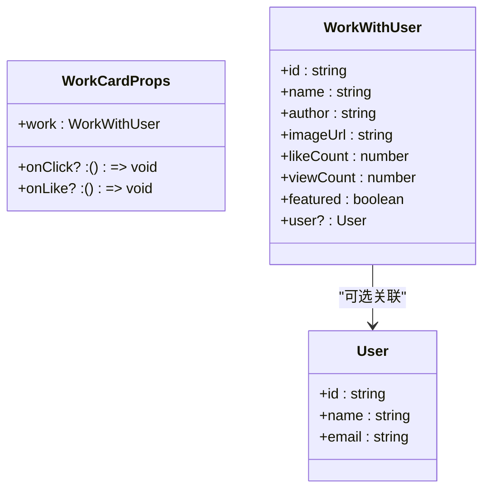
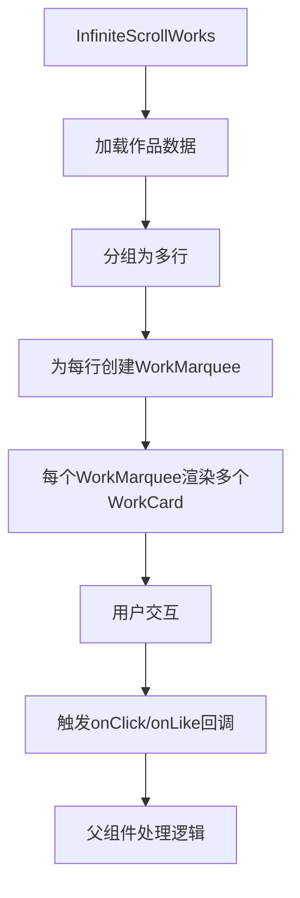

# 作品卡片 (WorkCard)

<cite>
**本文档中引用的文件**  
- [WorkCard.tsx](file://src/components/WorkCard.tsx)
- [work.d.ts](file://src/types/work.d.ts)
- [WorkMarquee.tsx](file://src/components/WorkMarquee.tsx)
- [InfiniteScrollWorks.tsx](file://src/components/InfiniteScrollWorks.tsx)
</cite>

## 目录
1. [简介](#简介)
2. [核心功能](#核心功能)
3. [Props 详细说明](#props-详细说明)
4. [点赞交互处理机制](#点赞交互处理机制)
5. [集成使用示例](#集成使用示例)
6. [响应式布局设计](#响应式布局设计)
7. [可访问性实现](#可访问性实现)
8. [结论](#结论)

## 简介
`WorkCard` 组件是数字化作品互动展示平台中的核心UI组件，用于在作品列表和走马灯（Marquee）中展示单个AI创作作品的缩略图、作者信息、点赞数和浏览量等关键信息。该组件具备良好的视觉反馈、图片加载状态管理和响应式设计，支持深色模式，并通过精选徽章突出优质内容。

**Section sources**
- [WorkCard.tsx](file://src/components/WorkCard.tsx#L1-L92)

## 核心功能
`WorkCard` 组件主要实现以下功能：
- 展示作品缩略图（支持加载中、加载失败状态）
- 显示作品名称、作者、点赞数和浏览量
- 支持“精选”状态徽章展示
- 提供点击卡片跳转详情、点击点赞按钮触发交互的能力
- 内置图片懒加载与错误处理机制
- 响应式设计适配移动端与桌面端

组件通过 `WorkWithUser` 类型接收作品数据，结合 Next.js 的 `Image` 组件实现高性能图片渲染，并利用 Tailwind CSS 实现现代化UI与交互动效。

**Section sources**
- [WorkCard.tsx](file://src/components/WorkCard.tsx#L1-L92)
- [work.d.ts](file://src/types/work.d.ts#L69-L73)

## Props 详细说明
`WorkCard` 组件接受以下 Props，定义于 `WorkCardProps` 接口：

| 属性名 | 类型 | 是否必填 | 说明 |
|--------|------|----------|------|
| `work` | `WorkWithUser` | 是 | 作品数据对象，包含名称、作者、图片URL、点赞数、浏览量、是否精选等信息 |
| `onClick` | `() => void` | 否 | 卡片点击回调函数，通常用于跳转到作品详情页 |
| `onLike` | `() => void` | 否 | 点赞按钮点击回调函数，触发点赞/取消点赞逻辑 |

其中 `WorkWithUser` 类型扩展自 Prisma 的 `Work` 模型，包含关联的用户信息。



**Diagram sources**
- [work.d.ts](file://src/types/work.d.ts#L69-L73)
- [WorkCard.tsx](file://src/components/WorkCard.tsx#L7-L92)

## 点赞交互处理机制
组件内部通过 `handleLikeClick` 函数处理点赞交互：

```ts
const handleLikeClick = (e: React.MouseEvent) => {
  e.stopPropagation(); // 阻止事件冒泡，避免触发卡片整体点击
  onLike?.(); // 安全调用 onLike 回调
};
```

当用户点击点赞按钮时：
1. 调用 `e.stopPropagation()` 防止触发外层 `onClick` 事件（即不跳转详情页）
2. 安全调用 `onLike` 回调（使用可选链 `?.` 避免未提供时出错）
3. 外部组件（如 `WorkMarquee` 或 `InfiniteScrollWorks`）负责实现实际的点赞逻辑（如调用API）

点赞按钮的禁用状态由 `disabled={!onLike}` 控制，确保在未提供 `onLike` 回调时按钮不可点击。

**Section sources**
- [WorkCard.tsx](file://src/components/WorkCard.tsx#L10-L14)
- [WorkCard.tsx](file://src/components/WorkCard.tsx#L67-L75)

## 集成使用示例
### 在 WorkMarquee 中的集成
`WorkMarquee` 组件将 `WorkCard` 用于水平滚动的作品展示：

```tsx
<WorkCard 
  work={work} 
  onClick={() => onWorkClick(work)}
/>
```

`WorkMarquee` 接收 `works` 数组和 `onWorkClick` 回调，为每个作品创建 `WorkCard` 实例，并传递点击事件。

### 在 InfiniteScrollWorks 中的集成
`InfiniteScrollWorks` 组件通过多行 `WorkMarquee` 实现无限滚动加载：

```tsx
{workRows.map((rowWorks, rowIndex) => (
  <WorkMarquee 
    works={rowWorks} 
    onWorkClick={onWorkClick}
    direction={rowIndex % 2 === 0 ? 'left' : 'right'}
    speed={25 + (rowIndex % 3) * 5}
  />
))}
```

每行作品作为一个独立的 `WorkMarquee`，实现交错滚动效果，提升视觉层次感。



**Diagram sources**
- [InfiniteScrollWorks.tsx](file://src/components/InfiniteScrollWorks.tsx#L210-L249)
- [WorkMarquee.tsx](file://src/components/WorkMarquee.tsx#L36-L59)

**Section sources**
- [InfiniteScrollWorks.tsx](file://src/components/InfiniteScrollWorks.tsx#L1-L267)
- [WorkMarquee.tsx](file://src/components/WorkMarquee.tsx#L1-L59)

## 响应式布局设计
`WorkCard` 组件采用响应式设计，确保在不同设备上均有良好展示效果：

- **图片容器**：使用 `aspect-video` 保持 16:9 宽高比，避免布局偏移
- **字体与间距**：使用相对单位（如 `text-sm`, `p-4`）适配不同屏幕
- **行数控制**：`InfiniteScrollWorks` 支持 `worksPerRow` 参数动态调整每行作品数
- **图片加载优化**：通过 `sizes` 属性为不同视口宽度指定合适的图片尺寸：
  ```tsx
  sizes="(max-width: 768px) 100vw, (max-width: 1200px) 50vw, 33vw"
  ```
- **触摸友好**：增大点击区域，适配移动端操作

在移动端，作品卡片会自动调整为单列或双列布局；在桌面端则可支持多列展示，充分利用屏幕空间。

**Section sources**
- [WorkCard.tsx](file://src/components/WorkCard.tsx#L31-L69)
- [InfiniteScrollWorks.tsx](file://src/components/InfiniteScrollWorks.tsx#L21-L25)

## 可访问性实现
`WorkCard` 组件在设计时考虑了基本的可访问性需求：

- **语义化标签**：使用 `<h3>` 标签包裹作品名称，正确表达内容层级
- **图片替代文本**：为 `Image` 组件提供 `alt` 属性（`work.name || '作品图片'`），供屏幕阅读器使用
- **焦点管理**：卡片整体可点击，按钮元素天然支持键盘导航
- **状态提示**：通过视觉反馈（如悬停缩放、颜色变化）增强交互感知
- **ARIA 支持**：虽未显式添加 ARIA 标签，但按钮和链接语义清晰

建议在实际使用中，若需更高可访问性标准，可进一步为点赞按钮添加 `aria-label="点赞"` 等属性，明确其功能。

**Section sources**
- [WorkCard.tsx](file://src/components/WorkCard.tsx#L31-L69)
- [WorkCard.tsx](file://src/components/WorkCard.tsx#L67-L92)

## 结论
`WorkCard` 是一个功能完整、设计精良的UI组件，作为作品展示的核心单元，广泛应用于作品列表、走马灯和无限滚动等场景。其清晰的 Props 设计、良好的交互处理、响应式布局和基础可访问性支持，使其成为平台中可复用性极高的基础组件。通过与 `WorkMarquee` 和 `InfiniteScrollWorks` 的组合，实现了丰富多样的作品展示效果，提升了用户体验。