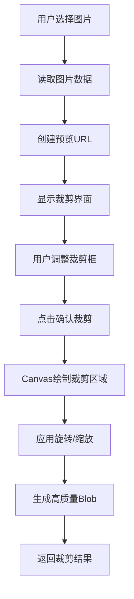
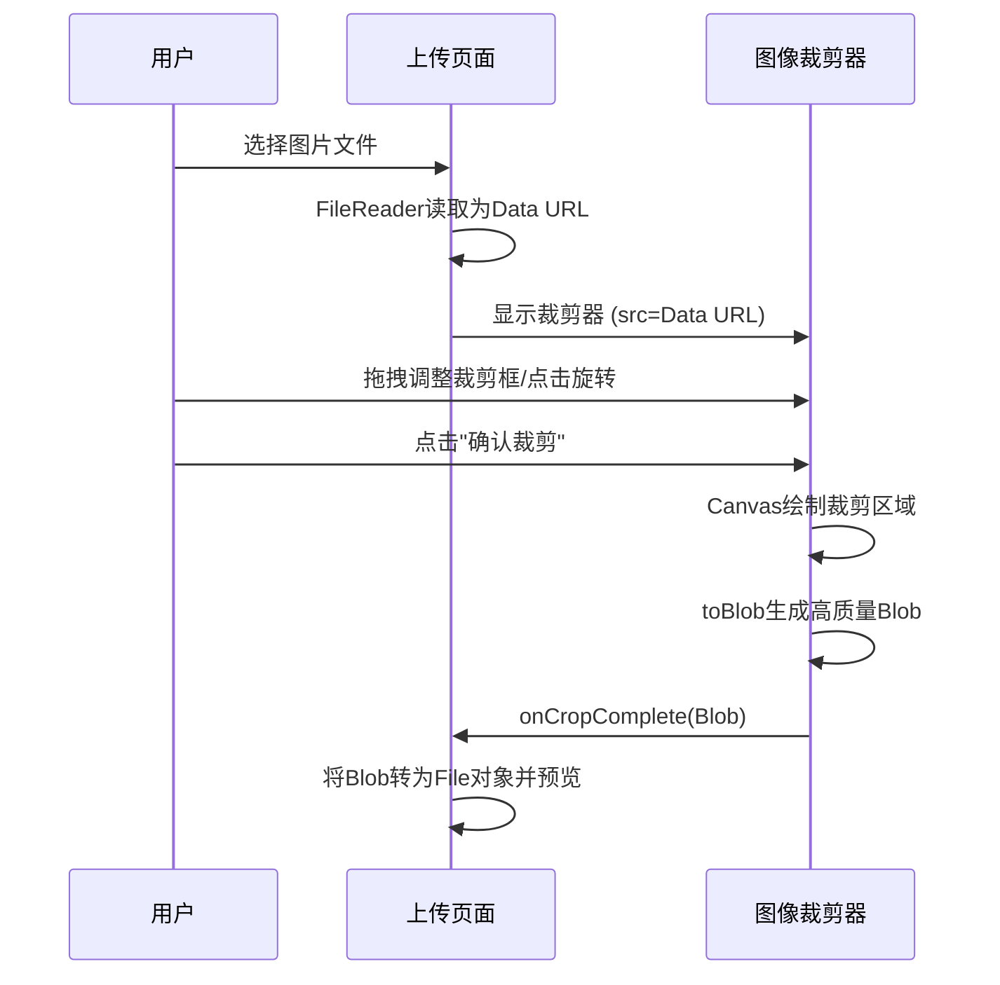

# 图像裁剪器 (ImageCropper)

<cite>
**本文档引用文件**   
- [ImageCropper.tsx](file://src/components/ImageCropper.tsx)
- [page.tsx](file://src/app/upload/page.tsx)
</cite>

## 目录
1. [简介](#简介)
2. [实现原理](#实现原理)
3. [Props 说明](#props-说明)
4. [用户交互流程](#用户交互流程)
5. [与上传流程集成示例](#与上传流程集成示例)
6. [错误处理机制](#错误处理机制)
7. [用户体验与数据一致性](#用户体验与数据一致性)

## 简介
图像裁剪器 (ImageCropper) 是一个用于在用户上传作品时裁剪和调整图片尺寸的组件，确保图片符合平台展示要求（16:9 比例）。该组件提供直观的用户界面，支持图片旋转、缩放、拖拽裁剪等操作，并能高质量输出裁剪后的图片。

**Section sources**
- [ImageCropper.tsx](file://src/components/ImageCropper.tsx#L0-L311)

## 实现原理
图像裁剪器基于 `react-image-crop` 第三方库实现，结合 HTML5 Canvas 进行图片处理。其核心原理如下：

1. **裁剪区域计算**：使用 `react-image-crop` 提供的 `centerCrop` 和 `makeAspectCrop` 函数，根据图片原始尺寸和指定的宽高比（16:9）自动计算居中裁剪区域。
2. **Canvas 图像处理**：通过隐藏的 `<canvas>` 元素，将裁剪区域内的图像绘制到 Canvas 上，并应用旋转、缩放等变换。
3. **高质量输出**：利用 `canvas.toBlob()` 方法将处理后的图像转换为高质量的 JPEG Blob（质量设置为 0.95），确保输出图片清晰。
4. **设备像素比适配**：通过 `window.devicePixelRatio` 调整 Canvas 的渲染分辨率，避免在高 DPI 屏幕上出现模糊。



**Diagram sources **
- [ImageCropper.tsx](file://src/components/ImageCropper.tsx#L122-L176)
- [ImageCropper.tsx](file://src/components/ImageCropper.tsx#L178-L211)

## Props 说明
ImageCropper 组件接受以下 Props：

| Prop 名称 | 类型 | 必需 | 默认值 | 说明 |
| :--- | :--- | :--- | :--- | :--- |
| `src` | `string` | 是 | - | 图片的源地址（Data URL 或网络 URL），用于在裁剪器中显示预览。 |
| `onCropComplete` | `(croppedImageBlob: Blob) => void` | 是 | - | 裁剪完成后的回调函数，参数为裁剪后生成的高质量图片 Blob 对象。 |
| `onSkipCrop` | `(originalImageBlob: Blob) => void` | 是 | - | 不进行裁剪，直接使用原图的回调函数。如果图片有旋转，会先应用旋转再输出高质量 Blob。 |
| `onCancel` | `() => void` | 是 | - | 用户取消裁剪操作时的回调函数，用于关闭裁剪器并清理状态。 |

**Section sources**
- [ImageCropper.tsx](file://src/components/ImageCropper.tsx#L10-L15)

## 用户交互流程
用户使用图像裁剪器的完整交互流程如下：

1. **图片加载**：
   - 用户在上传页面点击“选择图片”按钮，选择一张图片。
   - 前端使用 `FileReader` 将文件读取为 Data URL。
   - 触发 `handleImageChange` 函数，设置 `originalImageSrc` 并显示裁剪器 (`showCropper = true`)。

2. **图片预览与调整**：
   - 裁剪器弹出，图片自动居中并以 16:9 的比例创建初始裁剪框。
   - 用户可以通过鼠标拖拽来移动裁剪框，调整需要保留的区域。
   - 用户可以点击“旋转 90°”按钮，对图片进行顺时针旋转。旋转后，裁剪框会自动重新居中。

3. **裁剪决策**：
   - **确认裁剪**：点击“确认裁剪”按钮，组件会调用 `getCroppedImg()` 函数，使用 Canvas 绘制裁剪区域并生成 Blob，然后通过 `onCropComplete` 回调返回结果。
   - **不裁剪**：点击“不裁剪”按钮，组件会直接获取原图 Blob。如果图片有旋转，会先在 Canvas 上应用旋转，再生成高质量 Blob，最后通过 `onSkipCrop` 回调返回结果。
   - **取消**：点击“取消”按钮，会触发 `onCancel` 回调，关闭裁剪器并清空已选择的文件。



**Diagram sources **
- [ImageCropper.tsx](file://src/components/ImageCropper.tsx#L213-L238)
- [ImageCropper.tsx](file://src/components/ImageCropper.tsx#L240-L265)
- [page.tsx](file://src/app/upload/page.tsx#L158-L201)

## 与上传流程集成示例
以下代码展示了 `ImageCropper` 组件如何在 `/app/upload/page.tsx` 中集成使用：

```tsx
// 在上传页面中
const [showCropper, setShowCropper] = useState(false);
const [originalImageSrc, setOriginalImageSrc] = useState('');

// 处理文件选择
const handleImageChange = (e: React.ChangeEvent<HTMLInputElement>) => {
  const file = e.target.files?.[0];
  if (!file) return;
  // ... (文件大小和格式校验)
  
  // 读取文件并显示裁剪器
  const reader = new FileReader();
  reader.onload = (e) => {
    const imageSrc = e.target?.result as string;
    setOriginalImageSrc(imageSrc);
    setShowCropper(true); // 显示裁剪器
  };
  reader.readAsDataURL(file);
};

// 裁剪完成回调
const handleCropComplete = (croppedImageBlob: Blob) => {
  const croppedFile = new File([croppedImageBlob], 'cropped-image.jpg', {
    type: 'image/jpeg',
    lastModified: Date.now(),
  });
  setImageFile(croppedFile);
  const previewUrl = URL.createObjectURL(croppedImageBlob);
  setImagePreview(previewUrl);
  setShowCropper(false); // 关闭裁剪器
};

// 不裁剪回调
const handleSkipCrop = (originalImageBlob: Blob) => {
  const originalFile = new File([originalImageBlob], 'original-image.jpg', {
    type: 'image/jpeg',
    lastModified: Date.now(),
  });
  setImageFile(originalFile);
  const previewUrl = URL.createObjectURL(originalImageBlob);
  setImagePreview(previewUrl);
  setShowCropper(false);
};

// 取消裁剪回调
const handleCropCancel = () => {
  setShowCropper(false);
  setOriginalImageSrc('');
  // 清空文件输入框
  const fileInput = document.getElementById('image-upload') as HTMLInputElement;
  if (fileInput) fileInput.value = '';
};

// 在JSX中渲染
{showCropper && (
  <ImageCropper
    src={originalImageSrc}
    onCropComplete={handleCropComplete}
    onSkipCrop={handleSkipCrop}
    onCancel={handleCropCancel}
  />
)}
```

**Section sources**
- [page.tsx](file://src/app/upload/page.tsx#L158-L201)
- [page.tsx](file://src/app/upload/page.tsx#L619-L644)

## 错误处理机制
组件内置了完善的错误处理机制，以确保用户体验的健壮性：

1. **无效图片格式**：
   - 在 `handleImageChange` 函数中，会检查文件扩展名是否在 `uploadConfig.allowedFormats` 列表内。
   - 如果格式不支持，会通过 `setErrors` 设置错误信息，并阻止裁剪器的显示。
   ```ts
   if (uploadConfig && !uploadConfig.allowedFormats.includes(fileExtension || '')) {
     setErrors(prev => ({ 
       ...prev, 
       image: `只支持以下格式：${uploadConfig.allowedFormats.join(', ')}` 
     }));
     return;
   }
   ```

2. **裁剪区域未选择**：
   - 在 `handleCropComplete` 函数中，会检查 `completedCrop` 是否存在。
   - 如果用户未选择裁剪区域就点击“确认裁剪”，会通过 `toast.error('请先选择裁剪区域')` 提示用户。
   ```ts
   if (!completedCrop) {
     toast.error('请先选择裁剪区域');
     return;
   }
   ```

3. **图片处理失败**：
   - 在 `getCroppedImg` 和 `handleSkipCrop` 函数中，使用 `try-catch` 捕获异步操作中的错误。
   - 如果 Canvas 绘制或 Blob 生成失败，会通过 `toast.error('处理图片失败，请重试')` 向用户报告错误。
   ```ts
   catch (error) {
     console.error('裁剪图片时出错:', error);
     toast.error('裁剪失败，请重试');
   } finally {
     setIsProcessing(false);
   }
   ```

4. **加载状态管理**：
   - 使用 `isProcessing` 状态变量，在处理图片时禁用所有操作按钮，防止用户重复点击。
   - 按钮上会显示“处理中...”的加载动画，提供明确的反馈。

**Section sources**
- [ImageCropper.tsx](file://src/components/ImageCropper.tsx#L178-L211)
- [ImageCropper.tsx](file://src/components/ImageCropper.tsx#L65-L104)
- [page.tsx](file://src/app/upload/page.tsx#L158-L201)

## 用户体验与数据一致性
图像裁剪器在提升用户体验和保证数据一致性方面发挥着关键作用：

- **提升用户体验 (UX)**：
  - **直观的操作**：提供拖拽、旋转等直观的交互方式，降低用户学习成本。
  - **即时反馈**：实时预览裁剪效果，让用户所见即所得。
  - **灵活的选择**：提供“不裁剪”选项，尊重用户对原图的偏好，同时保证输出质量。
  - **清晰的提示**：通过 Toast 消息和错误提示，及时告知用户操作结果或问题。

- **保证数据一致性**：
  - **标准化尺寸**：强制要求 16:9 的裁剪比例，确保所有上传的作品在平台展示时具有统一、美观的视觉效果。
  - **高质量输出**：无论用户选择裁剪还是跳过，最终输出的图片都是经过 Canvas 重新编码的高质量 JPEG (0.95)，避免了直接上传的低质量图片。
  - **格式统一**：内部将所有图片转换为 JPEG 格式，简化了后端的存储和处理逻辑。
  - **流程可控**：通过组件化的封装，将复杂的图片处理逻辑与上传表单解耦，保证了上传流程的稳定性和可维护性。

综上所述，`ImageCropper` 组件不仅是一个功能性的工具，更是连接用户创作意图与平台展示标准的桥梁，有效平衡了用户自由度与平台规范性。

**Section sources**
- [ImageCropper.tsx](file://src/components/ImageCropper.tsx#L0-L311)
- [page.tsx](file://src/app/upload/page.tsx#L0-L644)