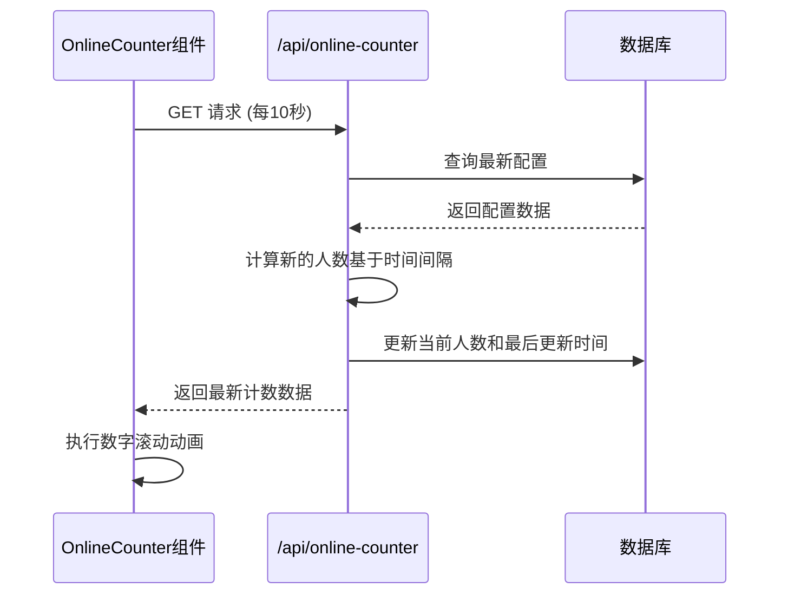
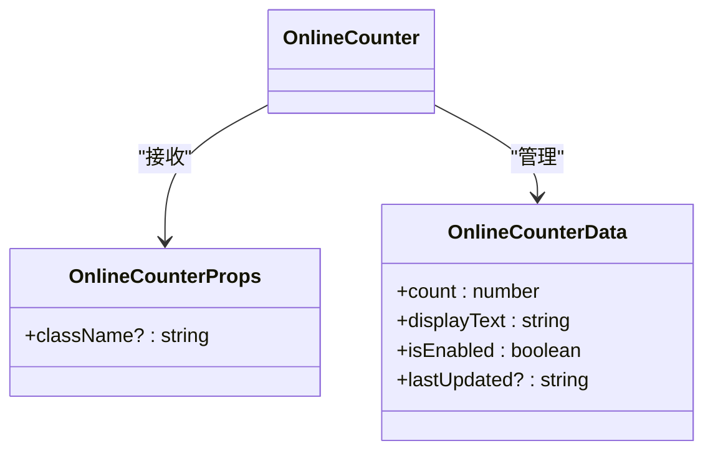
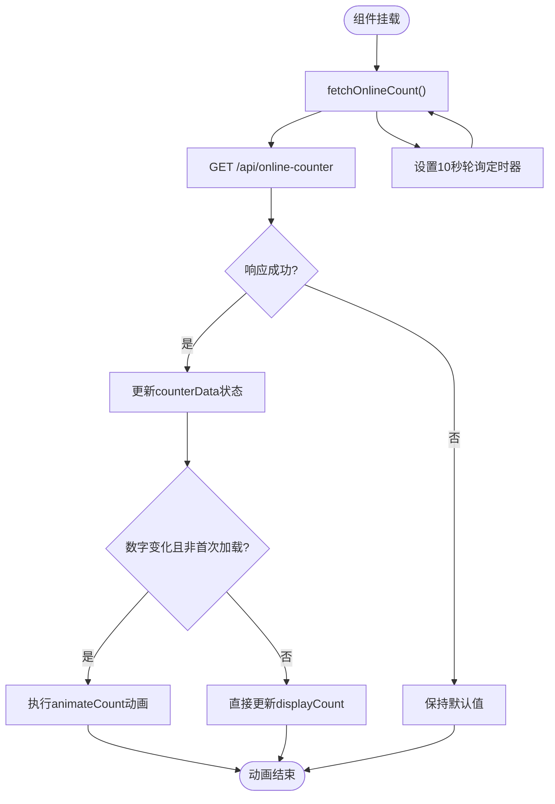
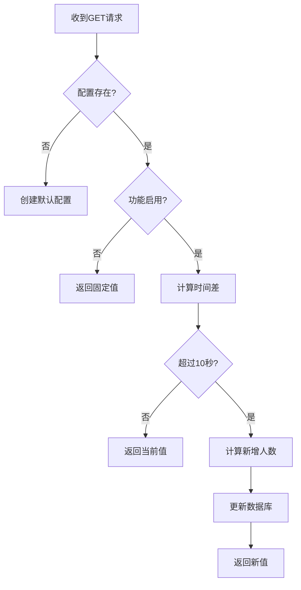
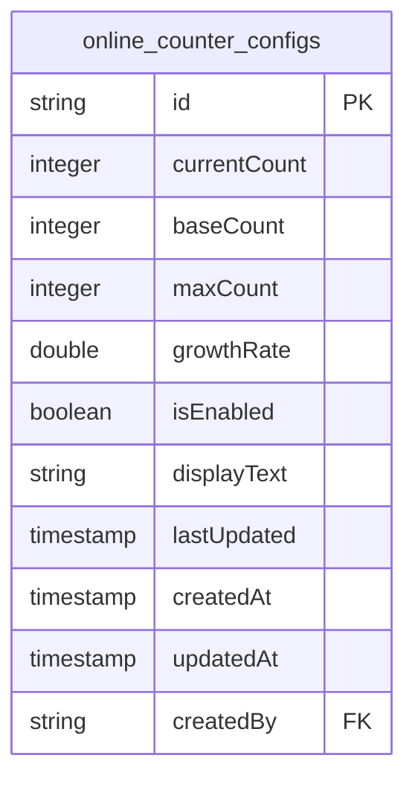
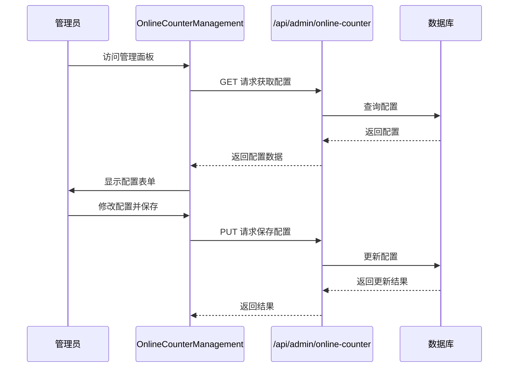
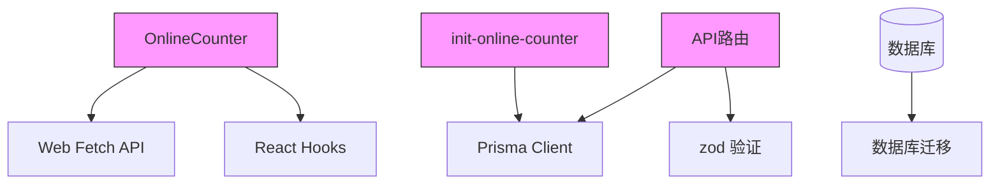

# 在线人数计数器 (OnlineCounter)

<cite>
**本文档引用的文件**
- [OnlineCounter.tsx](file://src/components/OnlineCounter.tsx)
- [init-online-counter.ts](file://src/lib/init-online-counter.ts)
- [route.ts](file://src/app/api/online-counter/route.ts)
- [migration.sql](file://prisma/migrations/20250905143157_add_online_counter_config/migration.sql)
- [OnlineCounterManagement.tsx](file://src/components/admin/OnlineCounterManagement.tsx)
- [page.tsx](file://src/app/page.tsx)
</cite>

## 目录
1. [简介](#简介)
2. [项目结构](#项目结构)
3. [核心组件](#核心组件)
4. [架构概述](#架构概述)
5. [详细组件分析](#详细组件分析)
6. [依赖分析](#依赖分析)
7. [性能考虑](#性能考虑)
8. [故障排除指南](#故障排除指南)
9. [结论](#结论)

## 简介
在线人数计数器（OnlineCounter）是一个用于实时显示平台当前在线用户数量的React组件。该组件通常展示在首页或作品详情页，通过API轮询机制从后端获取数据，并以平滑的动画效果呈现数字变化。系统支持管理员通过管理面板动态配置计数器的各项参数，包括显示文本、增长速率和启用状态等。

## 项目结构
在线人数计数器功能分布在多个目录中，主要包括组件、API路由、数据库迁移和管理界面。

```mermaid
graph TB
subgraph "组件"
OC[OnlineCounter.tsx]
OCM[OnlineCounterManagement.tsx]
end
subgraph "API路由"
AOC[/api/online-counter/route.ts]
AAOC[/api/admin/online-counter/route.ts]
end
subgraph "数据层"
MIG[add_online_counter_config/migration.sql]
INIT[init-online-counter.ts]
end
OC --> AOC
OCM --> AAOC
AOC --> DB[(数据库)]
AAOC --> DB
INIT --> DB
MIG --> DB
```

**Diagram sources**
- [OnlineCounter.tsx](file://src/components/OnlineCounter.tsx)
- [route.ts](file://src/app/api/online-counter/route.ts)
- [migration.sql](file://prisma/migrations/20250905143157_add_online_counter_config/migration.sql)

**Section sources**
- [OnlineCounter.tsx](file://src/components/OnlineCounter.tsx)
- [route.ts](file://src/app/api/online-counter/route.ts)

## 核心组件
`OnlineCounter` 组件是系统的核心展示部分，负责从 `/api/online-counter` 接口获取数据并以动画形式展示在线人数。组件通过 `useState` 管理多个状态变量，包括当前计数值、加载状态和动画状态。数字变化采用缓动函数实现平滑的滚动动画效果，提升用户体验。

**Section sources**
- [OnlineCounter.tsx](file://src/components/OnlineCounter.tsx#L15-L157)

## 架构概述
系统采用前后端分离架构，前端组件通过定时轮询与后端API交互，后端基于Prisma ORM操作数据库存储计数器配置。



**Diagram sources**
- [OnlineCounter.tsx](file://src/components/OnlineCounter.tsx#L15-L157)
- [route.ts](file://src/app/api/online-counter/route.ts#L1-L188)

## 详细组件分析

### OnlineCounter 组件分析
`OnlineCounter` 组件实现了完整的在线人数显示功能，包含数据获取、状态管理和视觉动画。

#### 组件属性 (Props)


**Diagram sources**
- [OnlineCounter.tsx](file://src/components/OnlineCounter.tsx#L4-L13)

#### 内部状态管理
组件使用多个 `useState` 钩子管理复杂状态：
- `counterData`: 存储从API获取的完整计数器数据
- `loading`: 控制加载状态显示
- `displayCount`: 当前显示的精确计数值
- `isAnimating`: 标记动画是否正在进行
- `currentAnimatedValue`: 动画过程中的实时变化值

#### 数据获取与更新流程


**Diagram sources**
- [OnlineCounter.tsx](file://src/components/OnlineCounter.tsx#L15-L157)

**Section sources**
- [OnlineCounter.tsx](file://src/components/OnlineCounter.tsx#L15-L157)

### 后端API交互逻辑
`/api/online-counter/route.ts` 文件定义了处理前端请求的逻辑，实现了计数器的核心业务规则。

#### GET 请求处理流程


**Diagram sources**
- [route.ts](file://src/app/api/online-counter/route.ts#L1-L188)

#### 数据库交互
系统通过Prisma ORM与数据库交互，`online_counter_configs` 表存储所有计数器配置。



**Diagram sources**
- [migration.sql](file://prisma/migrations/20250905143157_add_online_counter_config/migration.sql#L1-L20)

**Section sources**
- [route.ts](file://src/app/api/online-counter/route.ts#L1-L188)

### 管理面板集成
管理员可以通过 `/admin` 页面的在线人数管理模块调整计数器配置。



**Diagram sources**
- [OnlineCounterManagement.tsx](file://src/components/admin/OnlineCounterManagement.tsx#L1-L323)

**Section sources**
- [OnlineCounterManagement.tsx](file://src/components/admin/OnlineCounterManagement.tsx#L1-L323)

## 依赖分析
在线人数计数器功能依赖于多个系统组件和外部库。



**Diagram sources**
- [OnlineCounter.tsx](file://src/components/OnlineCounter.tsx)
- [init-online-counter.ts](file://src/lib/init-online-counter.ts)
- [route.ts](file://src/app/api/online-counter/route.ts)

**Section sources**
- [init-online-counter.ts](file://src/lib/init-online-counter.ts#L6-L34)

## 性能考虑
尽管当前实现已能满足基本需求，但仍有一些性能优化建议：

1. **防抖机制**: 当前实现中未使用防抖，但在高频率请求场景下，可考虑在 `fetchOnlineCount` 调用前添加防抖逻辑。
2. **缓存策略**: 前端可以实现简单的内存缓存，避免在短时间内重复请求相同数据。
3. **WebSocket替代**: 当前使用轮询机制（每10秒），在高并发场景下可考虑升级为WebSocket实现实时推送，减少不必要的HTTP请求。
4. **错误处理优化**: 当API请求失败时，当前实现会继续使用旧值，但可以添加重试机制和退避策略。
5. **动画性能**: 数字滚动动画使用 `requestAnimationFrame`，这是性能友好的实现方式，避免了 `setInterval` 可能导致的性能问题。

**Section sources**
- [OnlineCounter.tsx](file://src/components/OnlineCounter.tsx#L15-L157)
- [route.ts](file://src/app/api/online-counter/route.ts#L1-L188)

## 故障排除指南
### 常见问题及解决方案

| 问题现象 | 可能原因 | 解决方案 |
|--------|--------|--------|
| 计数器不显示 | `isEnabled` 设置为 `false` | 通过管理员面板启用功能 |
| 数字不更新 | API轮询失败 | 检查网络连接和API端点状态 |
| 动画卡顿 | 浏览器性能问题 | 优化动画实现或降低更新频率 |
| 数据不一致 | 多实例竞争更新 | 在数据库层面添加乐观锁机制 |

**Section sources**
- [OnlineCounter.tsx](file://src/components/OnlineCounter.tsx#L15-L157)
- [route.ts](file://src/app/api/online-counter/route.ts#L1-L188)

## 结论
在线人数计数器组件通过简洁而有效的设计实现了实时用户数量展示功能。系统采用定时轮询机制与后端API交互，后端基于时间间隔计算并更新在线人数。组件提供了平滑的数字滚动动画效果，提升了用户体验。管理员可以通过专门的管理界面动态调整计数器的各项参数。虽然当前实现已能满足需求，但在高并发场景下，建议考虑升级为WebSocket实现实时推送，以减少服务器负载和网络开销。