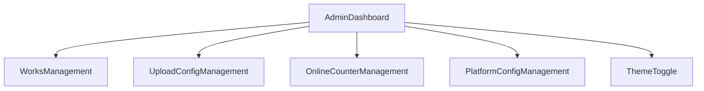
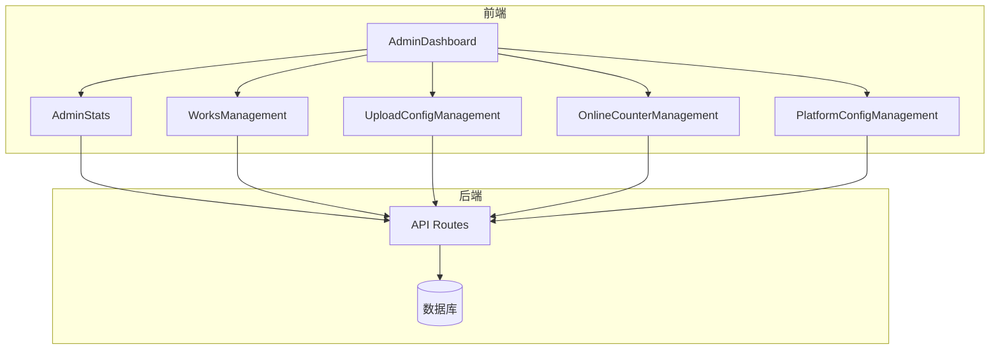
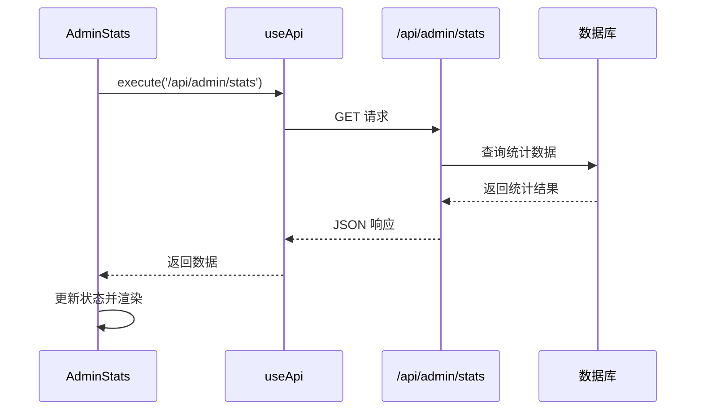
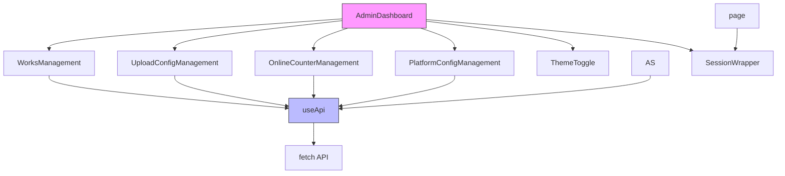
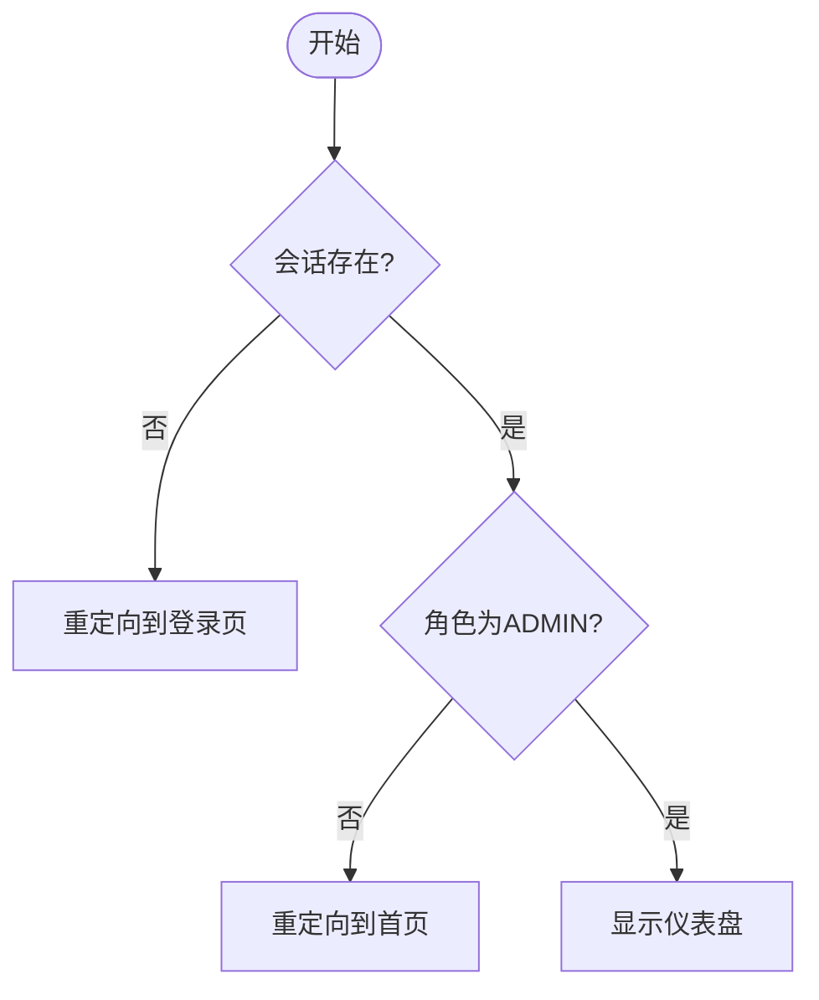

# 管理员仪表盘 (AdminDashboard)

<cite>
**本文档引用的文件**  
- [AdminDashboard.tsx](file://src/components/admin/AdminDashboard.tsx)
- [AdminStats.tsx](file://src/components/admin/AdminStats.tsx)
- [route.ts](file://src/app/api/admin/stats/route.ts)
- [SessionWrapper.tsx](file://src/components/SessionWrapper.tsx)
- [page.tsx](file://src/app/admin/page.tsx)
- [useApi.ts](file://src/hooks/useApi.ts)
- [WorksManagement.tsx](file://src/components/admin/WorksManagement.tsx)
- [UploadConfigManagement.tsx](file://src/components/admin/UploadConfigManagement.tsx)
- [OnlineCounterManagement.tsx](file://src/components/admin/OnlineCounterManagement.tsx)
- [PlatformConfigManagement.tsx](file://src/components/admin/PlatformConfigManagement.tsx)
- [work.d.ts](file://src/types/work.d.ts)
- [auth.ts](file://src/lib/auth.ts)
</cite>

## 目录
1. [简介](#简介)
2. [项目结构](#项目结构)
3. [核心组件](#核心组件)
4. [架构概览](#架构概览)
5. [详细组件分析](#详细组件分析)
6. [依赖分析](#依赖分析)
7. [性能考虑](#性能考虑)
8. [故障排除指南](#故障排除指南)
9. [结论](#结论)

## 简介
管理员仪表盘（AdminDashboard）是平台管理员的核心操作界面，集成了作品管理、上传配置、在线人数统计和平台配置等关键功能。该组件通过标签页形式组织不同管理模块，提供直观的后台操作体验。仪表盘通过权限校验确保只有管理员可访问，并集成暗色模式切换和退出登录功能。

## 项目结构
管理员仪表盘组件位于 `src/components/admin/` 目录下，作为独立的可复用组件实现。其功能模块通过子组件形式组织，各管理功能分别由独立组件实现，保持高内聚低耦合的设计原则。

**图表来源**  
- [AdminDashboard.tsx](file://src/components/admin/AdminDashboard.tsx#L1-L89)

**本节来源**  
- [AdminDashboard.tsx](file://src/components/admin/AdminDashboard.tsx#L1-L89)

## 核心组件
`AdminDashboard` 组件是管理员后台的主界面，采用客户端组件实现，通过状态管理控制标签页切换。组件包含顶部导航栏和内容区域，支持主题切换和管理员退出功能。各功能模块通过动态渲染方式集成，确保按需加载。

**本节来源**  
- [AdminDashboard.tsx](file://src/components/admin/AdminDashboard.tsx#L1-L89)

## 架构概览
管理员仪表盘采用模块化架构设计，主组件负责布局和导航，具体功能由子组件实现。数据获取通过自定义 `useApi` Hook 统一处理，权限控制在页面级别和组件级别双重保障。

**图表来源**  
- [AdminDashboard.tsx](file://src/components/admin/AdminDashboard.tsx#L1-L89)
- [route.ts](file://src/app/api/admin/stats/route.ts#L1-L162)

## 详细组件分析

### 作品管理模块分析
作品管理模块提供作品审核、状态变更和精选设置功能。组件支持分页、搜索和排序，通过模态框展示作品详情。状态变更操作通过 PATCH 请求实现，精选状态通过独立接口管理。

**本节来源**  
- [WorksManagement.tsx](file://src/components/admin/WorksManagement.tsx#L1-L570)

### 数据统计模块分析
数据统计模块展示平台核心运营指标，包括作品和用户统计数据。

**图表来源**  
- [AdminStats.tsx](file://src/components/admin/AdminStats.tsx#L28-L174)
- [route.ts](file://src/app/api/admin/stats/route.ts#L1-L162)

**本节来源**  
- [AdminStats.tsx](file://src/components/admin/AdminStats.tsx#L28-L174)

### 上传配置管理模块分析
上传配置模块允许管理员设置作品上传的各项参数，包括时间范围、文件大小限制和格式要求。配置信息通过表单提交，支持实时预览和保存。

**本节来源**  
- [UploadConfigManagement.tsx](file://src/components/admin/UploadConfigManagement.tsx#L1-L333)

### 在线人数管理模块分析
在线人数管理模块提供虚拟在线人数的配置功能，支持基础人数、增长速率和显示文本的自定义设置。

**本节来源**  
- [OnlineCounterManagement.tsx](file://src/components/admin/OnlineCounterManagement.tsx#L1-L323)

### 平台配置管理模块分析
平台配置模块允许管理员修改平台主标题，配置变更后通过页面刷新生效。

**本节来源**  
- [PlatformConfigManagement.tsx](file://src/components/admin/PlatformConfigManagement.tsx#L1-L143)

## 依赖分析
管理员仪表盘组件依赖多个核心模块和工具函数，形成完整的管理功能体系。

**图表来源**  
- [AdminDashboard.tsx](file://src/components/admin/AdminDashboard.tsx#L1-L89)
- [useApi.ts](file://src/hooks/useApi.ts#L1-L85)

**本节来源**  
- [AdminDashboard.tsx](file://src/components/admin/AdminDashboard.tsx#L1-L89)
- [useApi.ts](file://src/hooks/useApi.ts#L1-L85)

## 性能考虑
管理员仪表盘在性能方面采取了多项优化措施：
- 采用按需加载策略，仅在切换标签页时渲染对应内容
- 数据请求添加缓存头，减少重复请求
- 使用防抖技术优化搜索功能
- 分页加载大量数据，避免一次性加载过多内容
- 组件拆分合理，避免单个组件过于臃肿

## 故障排除指南
### 权限校验问题
当管理员无法访问仪表盘时，请检查：
1. 用户会话是否有效
2. 用户角色是否为 ADMIN
3. JWT 令牌是否包含正确角色信息

**图表来源**  
- [page.tsx](file://src/app/admin/page.tsx#L1-L47)
- [auth.ts](file://src/lib/auth.ts#L1-L71)

**本节来源**  
- [page.tsx](file://src/app/admin/page.tsx#L1-L47)
- [auth.ts](file://src/lib/auth.ts#L1-L71)

### 数据加载失败
当统计数据无法加载时，请检查：
1. API 路径是否正确
2. 后端服务是否正常运行
3. 数据库连接是否正常
4. 用户权限是否足够

## 结论
管理员仪表盘是一个功能完整、结构清晰的后台管理界面，通过模块化设计实现了高可维护性。组件遵循最佳实践，包含完善的权限校验、错误处理和用户体验优化。未来扩展新功能模块时，建议遵循现有架构模式，保持代码风格一致性和功能完整性。