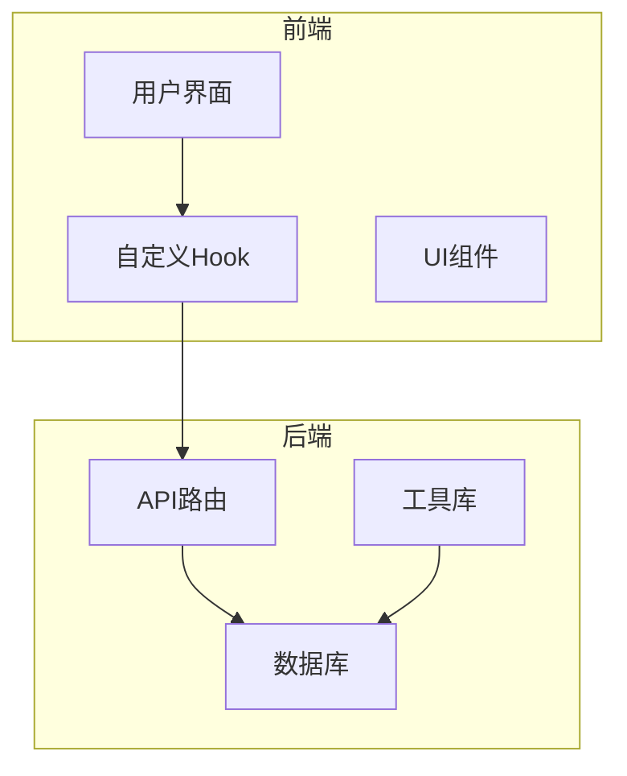
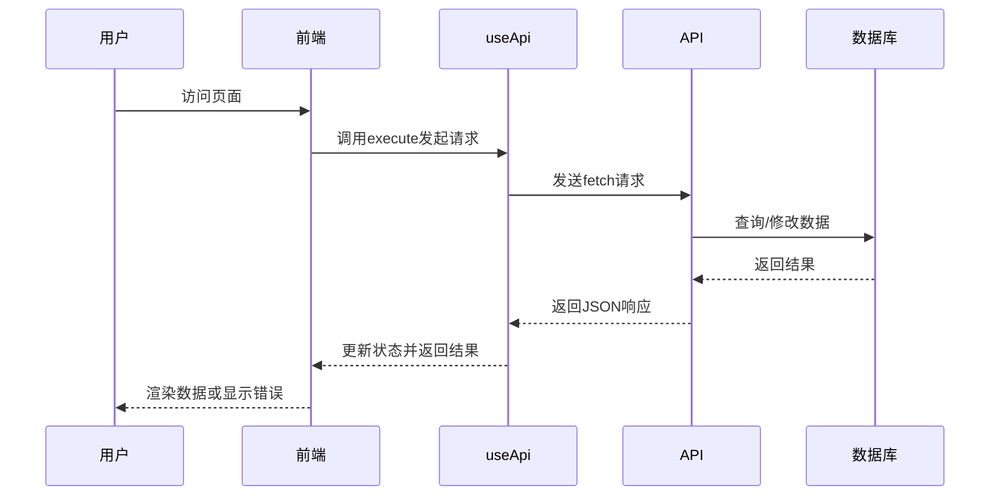
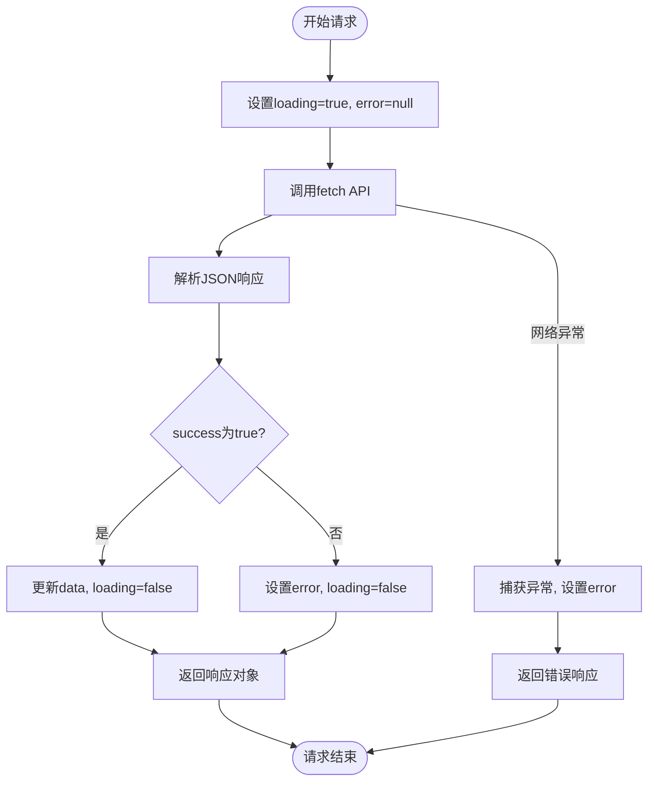
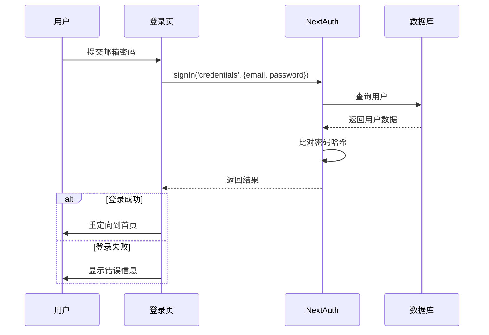
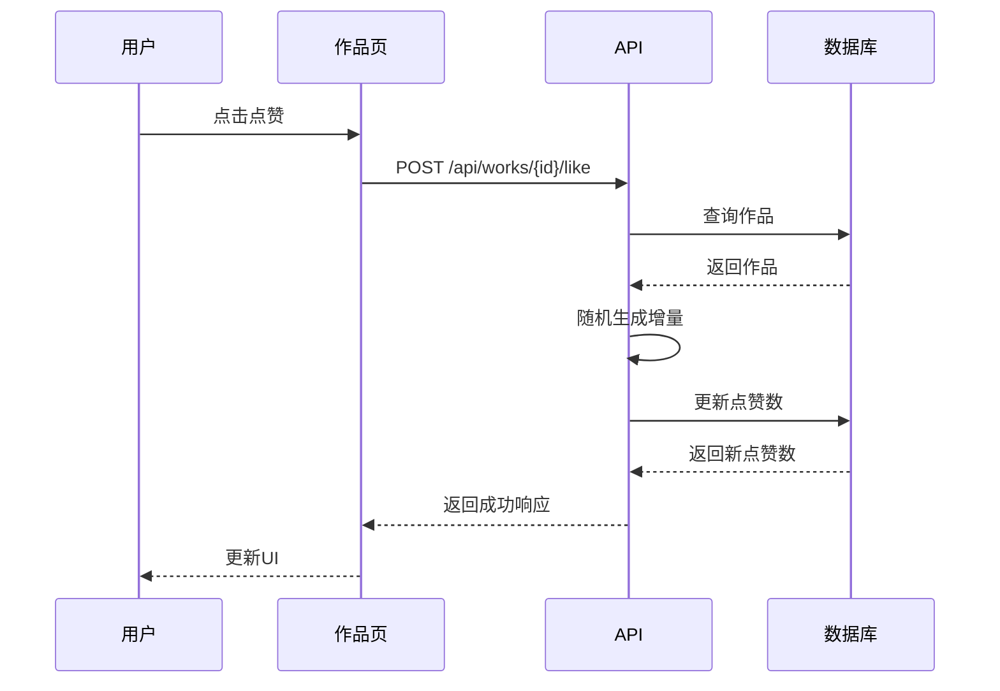
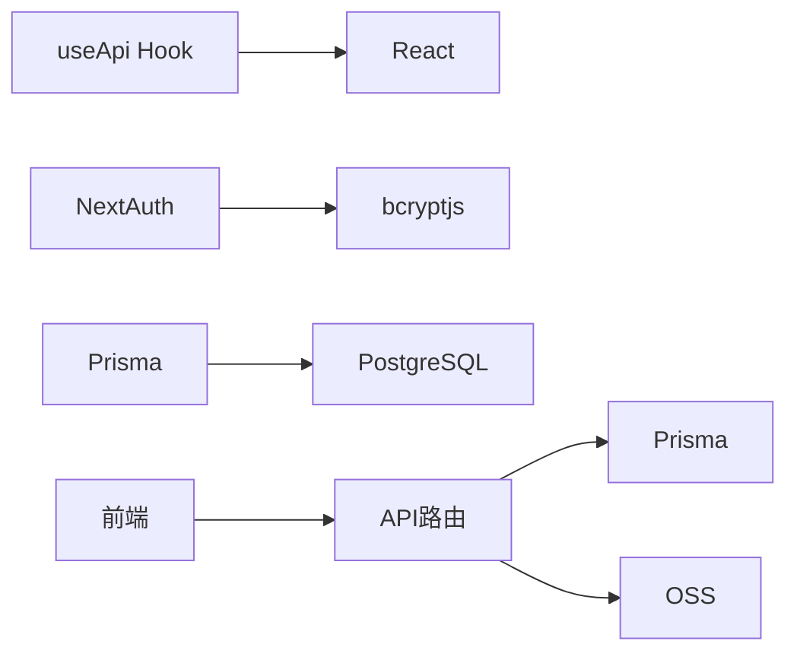

# API客户端集成

<cite>
**本文档引用的文件**
- [useApi.ts](file://src/hooks/useApi.ts)
- [auth.ts](file://src/lib/auth.ts)
- [route.ts](file://src/app/api/auth/[...nextauth]/route.ts)
- [upload/route.ts](file://src/app/api/upload/route.ts)
- [works/[id]/like/route.ts](file://src/app/api/works/[id]/like/route.ts)
- [page.tsx](file://src/app/page.tsx)
- [signin/page.tsx](file://src/app/auth/signin/page.tsx)
- [测试脚本登陆方式.md](file://src/测试脚本登陆方式.md)
</cite>

## 目录
1. [简介](#简介)
2. [项目结构](#项目结构)
3. [核心组件](#核心组件)
4. [架构概览](#架构概览)
5. [详细组件分析](#详细组件分析)
6. [依赖分析](#依赖分析)
7. [性能考虑](#性能考虑)
8. [故障排除指南](#故障排除指南)
9. [结论](#结论)

## 简介
本项目为“数字化作品互动展示平台”，采用Next.js 15构建，集成NextAuth.js实现用户认证，通过Prisma操作PostgreSQL数据库。前端通过`useApi` Hook封装API请求，统一处理认证、错误、加载状态等逻辑。后端API路由位于`src/app/api`目录下，涵盖作品上传、点赞、用户管理、健康检查等核心功能。系统支持游客上传作品，同时为管理员提供审核与配置管理界面。

## 项目结构
项目采用标准Next.js App Router架构，主要目录包括：
- `src/app`：页面与API路由
- `src/components`：可复用UI组件
- `src/hooks`：自定义Hook（如`useApi`）
- `src/lib`：工具函数与库配置（如Prisma、OSS、认证）
- `src/types`：TypeScript类型定义
- `prisma`：数据库模型与迁移

**Diagram sources**
- [useApi.ts](file://src/hooks/useApi.ts)
- [auth.ts](file://src/lib/auth.ts)

**Section sources**
- [useApi.ts](file://src/hooks/useApi.ts)
- [auth.ts](file://src/lib/auth.ts)

## 核心组件
`useApi` Hook是前端API客户端的核心，提供统一的请求执行、状态管理与错误处理机制。它封装了`fetch`调用，自动设置`Content-Type`头，并返回标准化的响应格式。`auth.ts`文件配置NextAuth.js，使用Credentials Provider实现邮箱密码登录，会话策略为JWT，并将用户角色信息注入会话。

**Section sources**
- [useApi.ts](file://src/hooks/useApi.ts#L19-L85)
- [auth.ts](file://src/lib/auth.ts#L43-L71)

## 架构概览
系统采用前后端分离架构，前端通过API路由与后端交互。认证流程基于NextAuth.js，登录后生成JWT会话。API请求通过`useApi` Hook发起，自动携带认证信息（若已登录）。后端API对敏感操作（如管理员接口）进行权限校验。

**Diagram sources**
- [useApi.ts](file://src/hooks/useApi.ts#L19-L85)
- [upload/route.ts](file://src/app/api/upload/route.ts)

## 详细组件分析

### useApi Hook 分析
`useApi`是一个泛型Hook，为任意类型的API响应提供类型安全的状态管理。

#### 实现机制

**Diagram sources**
- [useApi.ts](file://src/hooks/useApi.ts#L19-L85)

#### 请求与响应格式
- **请求头**：默认`Content-Type: application/json`，可被`options.headers`覆盖。
- **响应格式**：统一为`{ success: boolean, data?: T, error?: string }`，便于前端统一处理。

**Section sources**
- [useApi.ts](file://src/hooks/useApi.ts#L19-L85)

### 认证集成分析
`useApi`本身不直接处理认证头注入，认证由NextAuth.js的会话机制和后端API共同完成。

#### NextAuth.js 集成
- **登录流程**：用户在`/auth/signin`页面提交邮箱密码，`CredentialsProvider`验证后生成JWT会话。
- **会话持久化**：会话通过Cookie存储，`SessionProvider`在客户端提供会话上下文。
- **角色信息**：`jwt`和`session`回调将用户角色（`role`）注入会话对象。

**Diagram sources**
- [auth.ts](file://src/lib/auth.ts#L43-L71)
- [signin/page.tsx](file://src/app/auth/signin/page.tsx)

#### 认证头与后端校验
- **前端**：`useApi`不自动注入`Authorization`头。NextAuth.js通过Cookie自动发送会话。
- **后端**：API路由（如`/api/upload`）使用`getServerSession(authOptions)`获取会话，从而识别用户身份。

**Section sources**
- [auth.ts](file://src/lib/auth.ts#L43-L71)
- [upload/route.ts](file://src/app/api/upload/route.ts)

### 实际调用场景分析

#### 作品上传
1. **前端**：用户在`/upload`页面选择文件并填写信息。
2. **API调用**：点击上传，构造`FormData`，通过`fetch('/api/upload', { method: 'POST', body: formData })`提交。
3. **后端**：`/api/upload/route.ts`验证会话（可为空，支持游客）、上传配置、文件类型大小，上传至OSS并存入数据库。

#### 点赞互动
1. **前端**：用户点击作品卡片的点赞按钮，触发`handleLike`函数。
2. **API调用**：`fetch('/api/works/${id}/like', { method: 'POST' })`。
3. **后端**：`/api/works/[id]/like/route.ts`验证作品存在且已审核，随机增加1-10个点赞数并更新数据库。

**Diagram sources**
- [page.tsx](file://src/app/page.tsx#L164-L215)
- [works/[id]/like/route.ts](file://src/app/api/works/[id]/like/route.ts)

**Section sources**
- [page.tsx](file://src/app/page.tsx#L164-L215)
- [works/[id]/like/route.ts](file://src/app/api/works/[id]/like/route.ts)

## 依赖分析
项目依赖清晰，核心依赖包括：
- **Next.js**：框架基础。
- **NextAuth.js**：认证。
- **Prisma**：数据库ORM。
- **Tailwind CSS**：样式。
- **TypeScript**：类型安全。

**Diagram sources**
- [package.json](file://package.json)

**Section sources**
- [package.json](file://package.json)

## 性能考虑
- **缓存策略**：OSS上传时设置`Cache-Control: public, max-age=31536000`，实现长期CDN缓存。
- **并发控制**：`useApi`通过`loading`状态防止同一操作的重复提交（如防重复点赞）。
- **懒加载**：Next.js自动对页面和组件进行代码分割。

## 故障排除指南
- **请求失败**：检查网络连接，确认API路由路径正确。
- **认证问题**：确保登录成功，检查Cookie是否被阻止。
- **上传失败**：检查文件类型、大小是否符合配置，确认OSS服务正常。
- **数据库错误**：运行`verify-database.ts`脚本检查连接。

**Section sources**
- [health/route.ts](file://src/app/api/health/route.ts)
- [verify-database.ts](file://verify-database.ts)

## 结论
`useApi` Hook为前端提供了简洁、类型安全的API调用方式，有效管理了请求状态。系统通过NextAuth.js实现了安全的用户认证，并与后端API紧密结合。整体架构清晰，功能完整，具备良好的可维护性和扩展性。