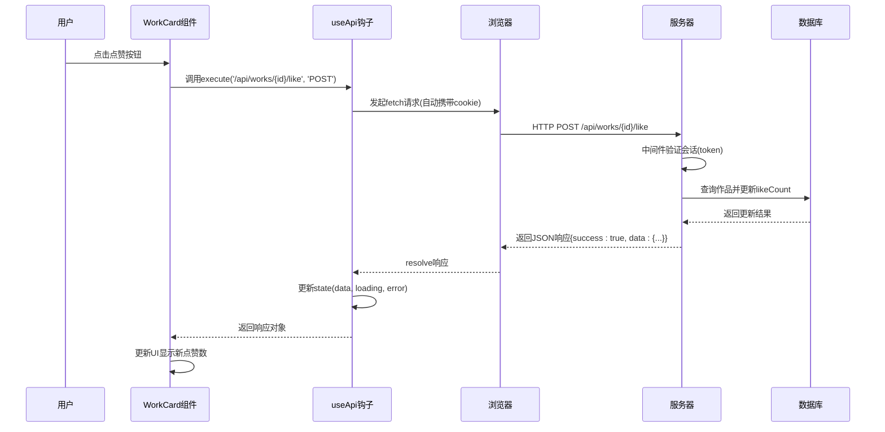

# API集成

<cite>
**本文档引用的文件**  
- [useApi.ts](file://src/hooks/useApi.ts)
- [auth-utils.ts](file://src/lib/auth-utils.ts)
- [image-url.ts](file://src/lib/image-url.ts)
- [middleware.ts](file://middleware.ts)
- [WorkCard.tsx](file://src/components/WorkCard.tsx)
</cite>

## 目录
1. [简介](#简介)
2. [核心API钩子实现](#核心api钩子实现)
3. [认证流程与会话管理](#认证流程与会话管理)
4. [作品点赞功能全流程分析](#作品点赞功能全流程分析)
5. [图片URL生成与OSS集成](#图片url生成与oss集成)
6. [API调用序列图](#api调用序列图)
7. [错误处理与最佳实践](#错误处理与最佳实践)
8. [加载状态与缓存策略](#加载状态与缓存策略)
9. [调试技巧](#调试技巧)

## 简介
本文档系统化说明前端如何与后端RESTful接口通信，重点解析`useApi.ts`钩子的内部实现机制。涵盖基于fetch封装的GET/POST请求、自动认证token注入、401重定向处理、全局错误提示等核心功能。结合`auth-utils.ts`说明会话状态如何影响API请求的认证流程，并以作品点赞功能为例展示端到端交互过程。同时解释`image-url.ts`如何根据OSS存储策略生成安全的图片访问链接。

## 核心API钩子实现
`useApi`钩子是前端与后端通信的核心工具，基于React的`useState`和`useCallback`构建，提供类型安全的API调用能力。

该钩子返回包含`data`、`loading`、`error`三个状态属性的对象，以及`execute`和`reset`两个方法。`execute`方法接收URL和可选的请求选项，自动设置`Content-Type: application/json`头部并执行请求。无论请求成功或失败，均返回标准化的`ApiResponse<T>`结构，包含`success`、`data`、`error`等字段。

状态管理采用不可变更新模式，通过`setState`的函数形式确保状态更新基于最新状态。错误被捕获后转换为用户友好的消息，并通过`error`状态暴露给UI层进行提示。

**Section sources**
- [useApi.ts](file://src/hooks/useApi.ts#L1-L85)

## 认证流程与会话管理
认证流程由NextAuth.js驱动，`auth-utils.ts`提供服务器端会话管理工具函数。`getCurrentUser`用于获取当前用户信息，`requireAuth`和`requireAdmin`分别用于强制用户和管理员身份验证，未通过验证时自动重定向至登录页或首页。

中间件`middleware.ts`在请求层面拦截路由访问，根据用户角色和路径前缀进行权限控制。例如，已登录用户访问认证页面时，根据角色重定向至管理后台或首页；访问个人中心但未登录时重定向至登录页。

前端组件通过`useApi`发起请求时，浏览器自动携带认证cookie，无需手动注入token。服务端通过`getServerSession`验证会话有效性，实现无缝认证集成。

**Section sources**
- [auth-utils.ts](file://src/lib/auth-utils.ts#L1-L23)
- [middleware.ts](file://middleware.ts#L1-L50)

## 作品点赞功能全流程分析
作品点赞功能展示了从UI交互到后端处理的完整流程。`WorkCard`组件接收`onLike`回调函数作为prop，在用户点击点赞按钮时触发。

`onLike`函数内部调用`useApi`的`execute`方法，发送POST请求至`/api/works/${id}/like`。请求自动携带认证信息，后端验证用户身份后更新数据库中的点赞计数，并返回更新后的作品数据。

前端根据响应结果更新本地状态，实时反映点赞数变化。整个过程无需页面刷新，提供流畅的用户体验。该设计体现了前后端分离架构下，状态同步与数据一致性的重要实践。

**Section sources**
- [WorkCard.tsx](file://src/components/WorkCard.tsx#L1-L92)
- [useApi.ts](file://src/hooks/useApi.ts#L1-L85)

## 图片URL生成与OSS集成
`image-url.ts`模块负责处理各种来源的图片URL，确保前端能够正确加载和显示图片资源。支持多种URL格式：完整HTTP/HTTPS链接、本地路径、Cloudinary和阿里云OSS。

对于OSS存储，模块读取环境变量中的`NEXT_PUBLIC_ALI_OSS_ENDPOINT`和`NEXT_PUBLIC_ALI_OSS_BUCKET`，动态构造安全的访问链接。提供`getImageUrl`主函数和`extractOSSKey`辅助函数，支持图片类型判断和OSS key提取。

该模块设计为纯函数式，不依赖任何外部SDK，仅通过字符串操作生成URL，确保轻量且高效。同时提供占位符机制，当图片URL无效时显示默认占位图。

**Section sources**
- [image-url.ts](file://src/lib/image-url.ts#L1-L95)

## API调用序列图

**Diagram sources**
- [WorkCard.tsx](file://src/components/WorkCard.tsx#L1-L92)
- [useApi.ts](file://src/hooks/useApi.ts#L1-L85)
- [middleware.ts](file://middleware.ts#L1-L50)

## 错误处理与最佳实践
错误处理采用分层策略：`useApi`钩子捕获网络异常和解析错误，统一转换为`error`状态；UI组件通过条件渲染展示错误提示；全局`ErrorBoundary`捕获未预期的运行时错误。

最佳实践包括：
- 所有API响应遵循统一格式，便于前端处理
- 不抛出异常，而是通过状态传递错误信息
- 提供`reset`方法允许用户重置状态并重试
- 使用TypeScript接口确保类型安全
- 敏感信息不暴露在错误消息中

**Section sources**
- [useApi.ts](file://src/hooks/useApi.ts#L1-L85)
- [ErrorMessage.tsx](file://src/components/ErrorMessage.tsx#L1-L32)

## 加载状态与缓存策略
`useApi`钩子内置`loading`状态，用于控制UI加载指示器。组件可根据`loading`值显示骨架屏或禁用按钮，防止重复提交。

缓存策略建议：
- 对于频繁访问的静态资源（如作品列表），使用`SWR`或`React Query`实现客户端缓存
- 启用HTTP缓存头，利用浏览器缓存机制
- 对于实时性要求高的数据（如在线人数），关闭缓存或设置短TTL
- 利用`localStorage`缓存用户偏好设置

## 调试技巧
调试API集成问题时，推荐使用浏览器开发者工具的Network面板：
- 检查请求URL、方法、头部和载荷是否正确
- 验证响应状态码和数据格式
- 查看cookie是否正确发送
- 使用Console面板查看错误日志
- 通过Performance面板分析请求耗时
- 利用Sources面板设置断点调试异步流程