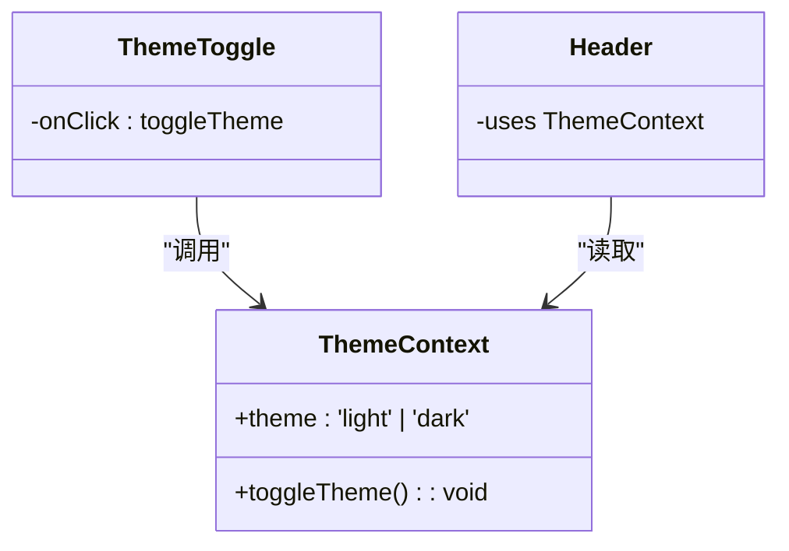
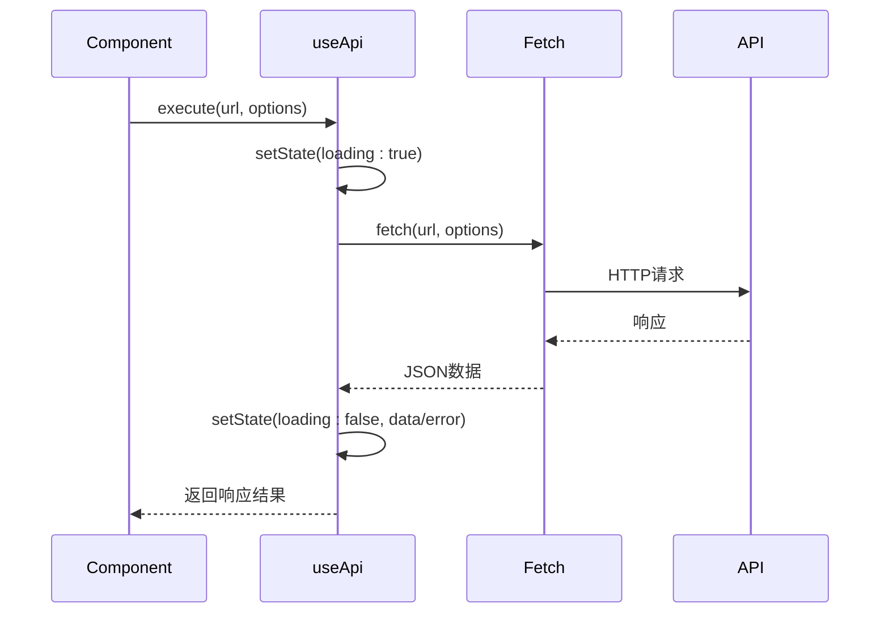
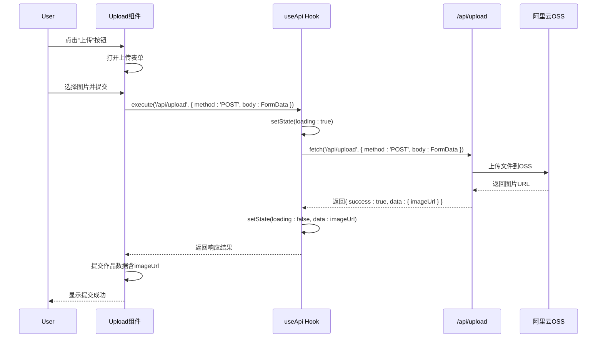

# 前端架构

<cite>
**本文档引用文件**  
- [ThemeContext.tsx](file://src/contexts/ThemeContext.tsx)
- [useApi.ts](file://src/hooks/useApi.ts)
- [WorkCard.tsx](file://src/components/WorkCard.tsx)
- [Header.tsx](file://src/components/Header.tsx)
- [ThemeToggle.tsx](file://src/components/ThemeToggle.tsx)
- [auth-utils.ts](file://src/lib/auth-utils.ts)
- [image-url.ts](file://src/lib/image-url.ts)
- [InfiniteScrollWorks.tsx](file://src/components/InfiniteScrollWorks.tsx)
- [upload/page.tsx](file://src/app/upload/page.tsx)
- [api/upload/route.ts](file://src/app/api/upload/route.ts)
</cite>

## 目录
1. [项目结构与关注点分离](#项目结构与关注点分离)
2. [App Router下的页面与API共存机制](#app-router下的页面与api共存机制)
3. [组件体系设计](#组件体系设计)
4. [状态管理方案](#状态管理方案)
5. [关键工具库](#关键工具库)
6. [用户上传流程序列图](#用户上传流程序列图)
7. [代码复用性与可维护性](#代码复用性与可维护性)
8. [开发模式指导](#开发模式指导)

## 项目结构与关注点分离

本项目基于Next.js App Router构建，采用清晰的目录结构实现关注点分离。`/src/app`目录作为应用入口，包含页面路由和API端点。`/src/components`存放可复用UI组件，`/src/hooks`封装自定义Hook，`/src/lib`存放工具函数，`/src/contexts`管理全局状态，各层职责分明，便于维护和扩展。

**Section sources**
- [app/page.tsx](file://src/app/page.tsx)
- [components/Header.tsx](file://src/components/Header.tsx)
- [hooks/useApi.ts](file://src/hooks/useApi.ts)

## App Router下的页面与API共存机制

Next.js App Router允许在`/app`目录下同时存放页面组件（page.tsx）和API路由（route.ts）。通过文件系统即路由的方式，`/app/upload/page.tsx`对应`/upload`页面，而`/app/api/upload/route.ts`对应`/api/upload`接口。两者共享同一目录层级，便于功能模块的聚合管理，同时保持前后端逻辑的物理分离。

```mermaid
graph TD
A[/app/upload] --> B[page.tsx]
A --> C[route.ts]
B --> D["GET /upload (渲染页面)"]
C --> E["POST /api/upload (处理上传)"]
```

**Diagram sources**
- [upload/page.tsx](file://src/app/upload/page.tsx)
- [api/upload/route.ts](file://src/app/api/upload/route.ts)

## 组件体系设计

项目采用分层组件体系，基础UI组件位于`/components`，管理后台专用组件位于`/components/admin`，实现组件的分类管理与复用。

### 基础UI组件

- **Header.tsx**：全局页头组件，集成平台名称、在线人数、导航按钮
- **WorkCard.tsx**：作品卡片组件，展示作品缩略图、名称、作者及互动数据
- **ThemeToggle.tsx**：主题切换组件，提供浅色/深色模式切换UI

### 管理后台组件

- **AdminDashboard.tsx**：管理后台仪表盘
- **WorksManagement.tsx**：作品管理界面
- **UploadConfigManagement.tsx**：上传配置管理组件

**Section sources**
- [components/Header.tsx](file://src/components/Header.tsx)
- [components/WorkCard.tsx](file://src/components/WorkCard.tsx)
- [components/ThemeToggle.tsx](file://src/components/ThemeToggle.tsx)
- [components/admin/WorksManagement.tsx](file://src/components/admin/WorksManagement.tsx)

## 状态管理方案

### 主题状态管理

使用`ThemeContext.tsx`创建主题上下文，通过`useTheme` Hook在组件中消费主题状态，实现全局主题切换。



**Diagram sources**
- [contexts/ThemeContext.tsx](file://src/contexts/ThemeContext.tsx)
- [components/ThemeToggle.tsx](file://src/components/ThemeToggle.tsx)

### API状态管理

`useApi.ts`封装通用API请求逻辑，返回`data`、`loading`、`error`状态及`execute`执行函数，统一处理请求生命周期。



**Diagram sources**
- [hooks/useApi.ts](file://src/hooks/useApi.ts)

## 关键工具库

### 认证工具

`auth-utils.ts`提供服务端认证辅助函数：
- `getCurrentUser()`：获取当前用户
- `requireAuth()`：强制认证，未登录则跳转
- `requireAdmin()`：强制管理员权限

**Section sources**
- [lib/auth-utils.ts](file://src/lib/auth-utils.ts)

### 图片URL处理

`image-url.ts`提供OSS图片URL生成与解析功能：
- `getImageUrl()`：根据环境变量生成OSS完整URL
- `extractOSSKey()`：从完整URL提取OSS对象Key
- `isOSSUrl()`：判断URL是否为OSS格式

**Section sources**
- [lib/image-url.ts](file://src/lib/image-url.ts)

## 用户上传流程序列图



**Diagram sources**
- [components/Header.tsx](file://src/components/Header.tsx)
- [app/upload/page.tsx](file://src/app/upload/page.tsx)
- [hooks/useApi.ts](file://src/hooks/useApi.ts)
- [app/api/upload/route.ts](file://src/app/api/upload/route.ts)

## 代码复用性与可维护性

### 高复用组件

- **InfiniteScrollWorks.tsx**：无限滚动作品列表组件，支持分页加载、错误重试、手动加载
- **WorkCard.tsx**：标准化作品展示单元，支持点赞、查看等交互
- **ThemeToggle.tsx**：可复用的主题切换按钮，支持大小配置

### 可维护性设计

- **类型安全**：使用TypeScript定义`WorkCardProps`、`UploadConfig`等接口
- **逻辑分离**：页面组件仅负责UI渲染，业务逻辑由Hook和工具函数处理
- **配置驱动**：平台标题、上传限制等通过API动态获取，便于运营调整

**Section sources**
- [components/InfiniteScrollWorks.tsx](file://src/components/InfiniteScrollWorks.tsx)
- [components/WorkCard.tsx](file://src/components/WorkCard.tsx)
- [types/work.d.ts](file://src/types/work.d.ts)

## 开发模式指导

1. **新增页面**：在`/app`下创建新目录，添加`page.tsx`
2. **新增API**：在`/app/api`下创建新路径，添加`route.ts`
3. **新增组件**：根据用途选择`/components`或`/components/admin`
4. **状态管理**：全局状态使用Context，局部状态使用useState
5. **API调用**：统一使用`useApi` Hook，避免重复代码
6. **工具函数**：通用逻辑放入`/lib`，避免组件内冗余

**Section sources**
- [app/page.tsx](file://src/app/page.tsx)
- [app/api/works/route.ts](file://src/app/api/works/route.ts)
- [components/WorkCard.tsx](file://src/components/WorkCard.tsx)
- [hooks/useApi.ts](file://src/hooks/useApi.ts)