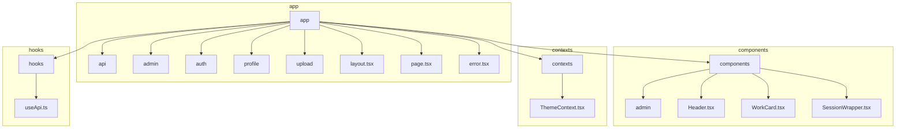
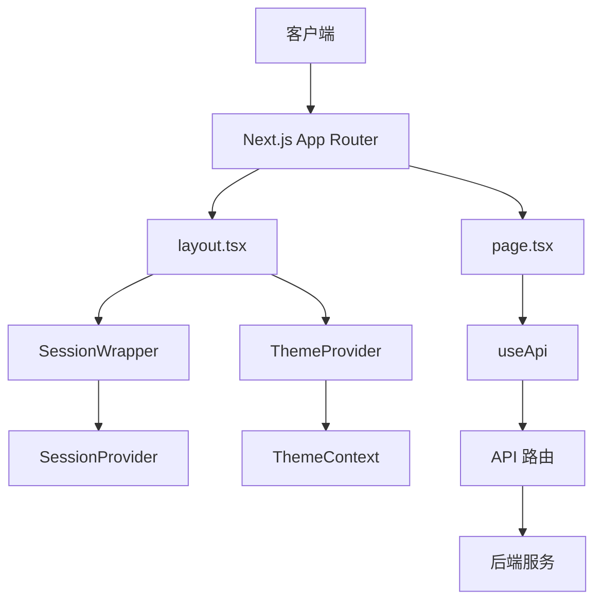
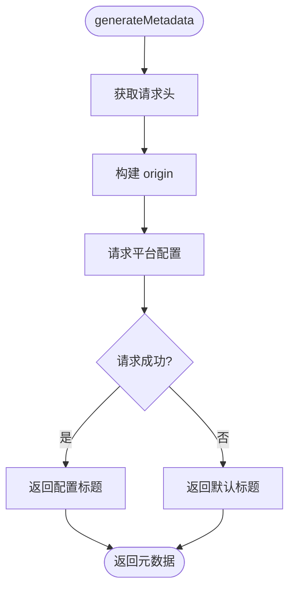
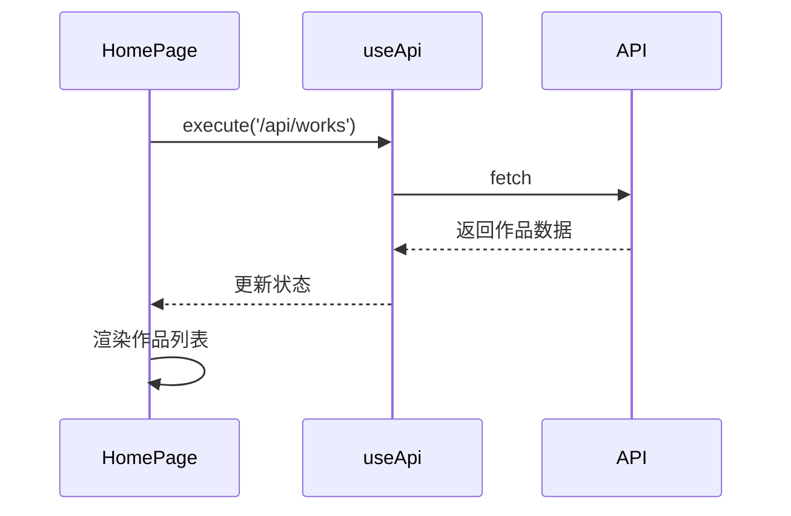
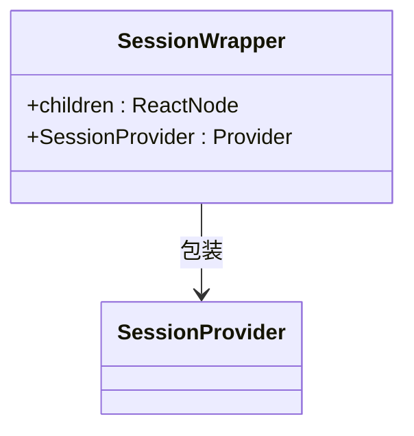
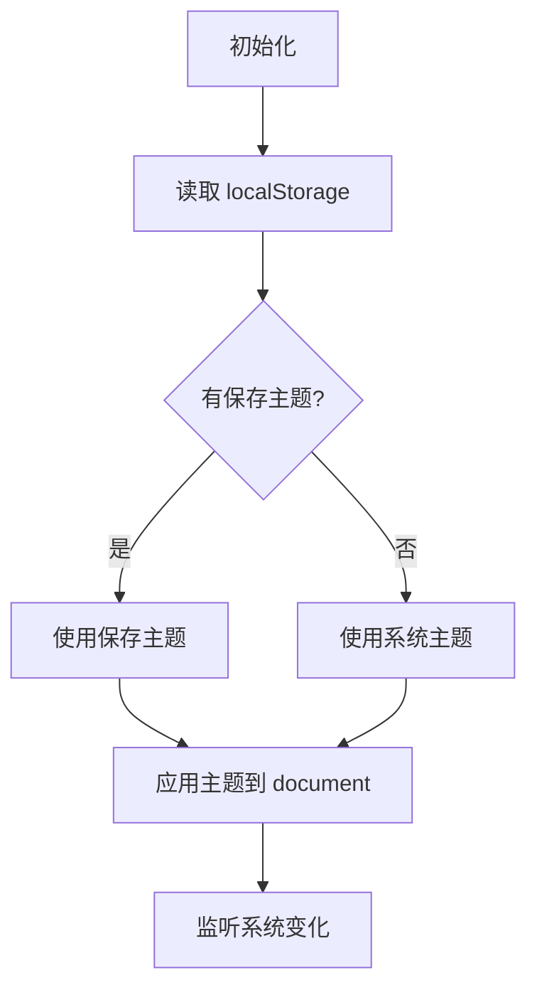
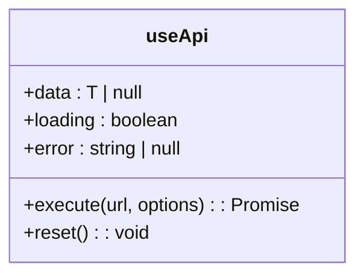
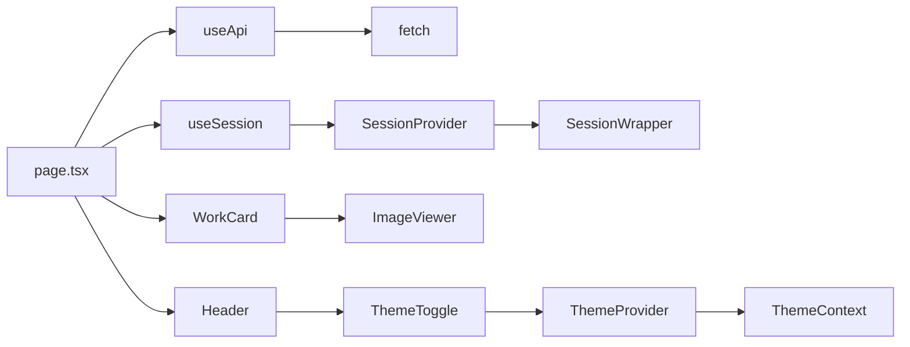

# 前端架构

<cite>
**本文档中引用的文件**  
- [layout.tsx](file://src/app/layout.tsx)
- [page.tsx](file://src/app/page.tsx)
- [SessionWrapper.tsx](file://src/components/SessionWrapper.tsx)
- [ThemeContext.tsx](file://src/contexts/ThemeContext.tsx)
- [useApi.ts](file://src/hooks/useApi.ts)
- [Header.tsx](file://src/components/Header.tsx)
- [PlatformConfigManagement.tsx](file://src/components/admin/PlatformConfigManagement.tsx)
</cite>

## 目录
1. [简介](#简介)
2. [项目结构](#项目结构)
3. [核心组件](#核心组件)
4. [架构概述](#架构概述)
5. [详细组件分析](#详细组件分析)
6. [依赖分析](#依赖分析)
7. [性能考虑](#性能考虑)
8. [故障排除指南](#故障排除指南)
9. [结论](#结论)

## 简介
本文档深入分析基于 Next.js App Router 模式的前端架构设计。重点阐述 app 目录下的路由组织方式、`layout.tsx` 和 `page.tsx` 的职责划分，以及服务端渲染（SSR）与静态生成（SSG）的实现机制。同时，文档将解析组件分层结构（UI 组件与业务组件）、状态管理机制（如 ThemeContext 和 useApi 自定义 Hook），以及前后端通信模式。此外，还将说明前端如何通过 SessionWrapper 集成认证状态，并与后端 API 协同工作。

## 项目结构

**图示来源**  
- [layout.tsx](file://src/app/layout.tsx#L1-L84)
- [SessionWrapper.tsx](file://src/components/SessionWrapper.tsx#L1-L15)
- [ThemeContext.tsx](file://src/contexts/ThemeContext.tsx#L1-L77)
- [useApi.ts](file://src/hooks/useApi.ts#L1-L85)

**本节来源**  
- [layout.tsx](file://src/app/layout.tsx#L1-L84)
- [page.tsx](file://src/app/page.tsx#L1-L386)

## 核心组件

前端架构的核心组件包括 `layout.tsx`、`page.tsx`、`SessionWrapper`、`ThemeContext` 和 `useApi`。这些组件共同构成了应用的骨架，实现了路由、状态管理、主题切换和 API 通信等关键功能。

**本节来源**  
- [layout.tsx](file://src/app/layout.tsx#L1-L84)
- [page.tsx](file://src/app/page.tsx#L1-L386)
- [SessionWrapper.tsx](file://src/components/SessionWrapper.tsx#L1-L15)
- [ThemeContext.tsx](file://src/contexts/ThemeContext.tsx#L1-L77)
- [useApi.ts](file://src/hooks/useApi.ts#L1-L85)

## 架构概述

**图示来源**  
- [layout.tsx](file://src/app/layout.tsx#L56-L84)
- [page.tsx](file://src/app/page.tsx#L27-L386)
- [SessionWrapper.tsx](file://src/components/SessionWrapper.tsx#L9-L15)
- [ThemeContext.tsx](file://src/contexts/ThemeContext.tsx#L12-L12)
- [useApi.ts](file://src/hooks/useApi.ts#L19-L85)

## 详细组件分析

### layout.tsx 分析

`layout.tsx` 是应用的根布局文件，负责定义全局结构和共享组件。它通过 `generateMetadata` 函数动态生成页面元数据，优先使用平台配置的标题，若失败则回退到默认标题。布局中集成了 `SessionWrapper` 和 `ThemeProvider`，为子组件提供认证和主题上下文。

**图示来源**  
- [layout.tsx](file://src/app/layout.tsx#L25-L54)

**本节来源**  
- [layout.tsx](file://src/app/layout.tsx#L1-L84)

### page.tsx 分析

`page.tsx` 是首页的主组件，使用客户端组件模式（'use client'）。它通过 `useSession` 获取用户会话状态，并使用 `useApi` Hook 发起 API 请求获取作品数据。组件实现了自动刷新机制，每 3 分钟无缝刷新最新作品，每 10 分钟刷新热门作品。

**图示来源**  
- [page.tsx](file://src/app/page.tsx#L27-L386)

**本节来源**  
- [page.tsx](file://src/app/page.tsx#L1-L386)

### SessionWrapper 分析

`SessionWrapper` 组件封装了 NextAuth 的 `SessionProvider`，为整个应用提供认证上下文。它确保所有需要认证信息的组件都能访问到当前用户的会话状态。

**图示来源**  
- [SessionWrapper.tsx](file://src/components/SessionWrapper.tsx#L9-L15)

**本节来源**  
- [SessionWrapper.tsx](file://src/components/SessionWrapper.tsx#L1-L15)

### ThemeContext 分析

`ThemeContext` 实现了主题切换功能，支持亮色和暗色模式。它从 localStorage 读取用户偏好，监听系统主题变化，并在主题切换时更新 document 的 class。

**图示来源**  
- [ThemeContext.tsx](file://src/contexts/ThemeContext.tsx#L12-L12)

**本节来源**  
- [ThemeContext.tsx](file://src/contexts/ThemeContext.tsx#L1-L77)

### useApi 分析

`useApi` 是一个自定义 Hook，封装了 API 请求逻辑。它提供加载状态、错误处理和数据缓存功能，简化了组件中的 API 调用。

**图示来源**  
- [useApi.ts](file://src/hooks/useApi.ts#L19-L85)

**本节来源**  
- [useApi.ts](file://src/hooks/useApi.ts#L1-L85)

## 依赖分析

**图示来源**  
- [page.tsx](file://src/app/page.tsx#L27-L386)
- [useApi.ts](file://src/hooks/useApi.ts#L19-L85)
- [SessionWrapper.tsx](file://src/components/SessionWrapper.tsx#L9-L15)
- [ThemeContext.tsx](file://src/contexts/ThemeContext.tsx#L12-L12)

**本节来源**  
- [page.tsx](file://src/app/page.tsx#L1-L386)
- [useApi.ts](file://src/hooks/useApi.ts#L1-L85)
- [SessionWrapper.tsx](file://src/components/SessionWrapper.tsx#L1-L15)
- [ThemeContext.tsx](file://src/contexts/ThemeContext.tsx#L1-L77)

## 性能考虑

应用通过多种方式优化性能：使用 `generateMetadata` 动态生成元数据，避免不必要的重渲染；通过 `cache: 'no-store'` 确保平台配置的实时性；在客户端组件中使用 `useEffect` 管理定时刷新，避免服务端频繁请求。此外，主题切换状态通过 localStorage 持久化，减少重复计算。

## 故障排除指南

常见问题包括：
- **元数据生成失败**：检查 `generateMetadata` 中的 fetch 请求是否能正确获取平台配置。
- **主题不生效**：确认 `ThemeProvider` 是否正确包裹了需要主题的组件。
- **API 请求失败**：检查 `useApi` 的 `execute` 函数是否正确处理了 headers 和错误响应。
- **会话状态丢失**：验证 `SessionWrapper` 是否在根布局中正确包裹了所有子组件。

**本节来源**  
- [layout.tsx](file://src/app/layout.tsx#L25-L54)
- [ThemeContext.tsx](file://src/contexts/ThemeContext.tsx#L1-L77)
- [useApi.ts](file://src/hooks/useApi.ts#L19-L85)
- [SessionWrapper.tsx](file://src/components/SessionWrapper.tsx#L1-L15)

## 结论

该前端架构基于 Next.js App Router 模式，实现了清晰的组件分层和高效的状态管理。通过 `layout.tsx` 和 `page.tsx` 的合理分工，结合 `SessionWrapper` 和 `ThemeContext` 提供的上下文支持，以及 `useApi` 封装的 API 通信，构建了一个可维护、可扩展的现代化 Web 应用。架构充分考虑了 SSR/SSG 的优势，同时通过客户端组件实现了丰富的交互体验。