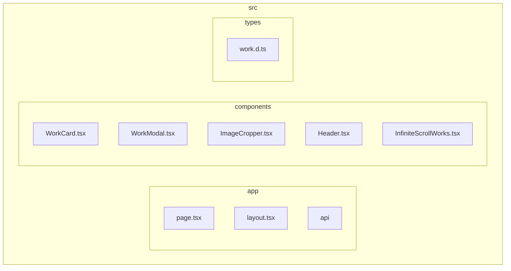
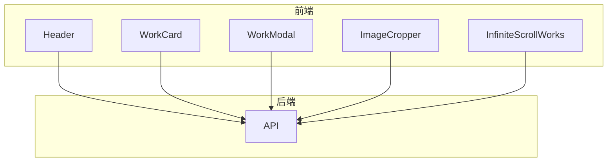
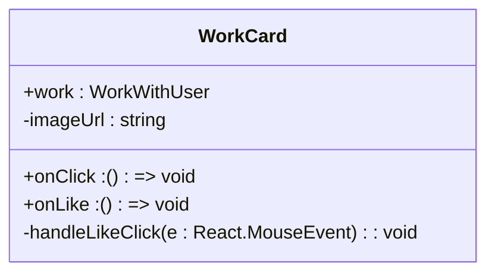
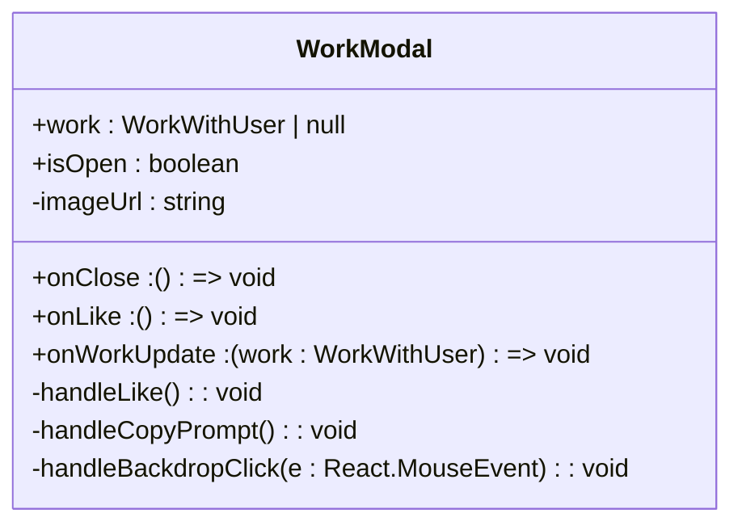
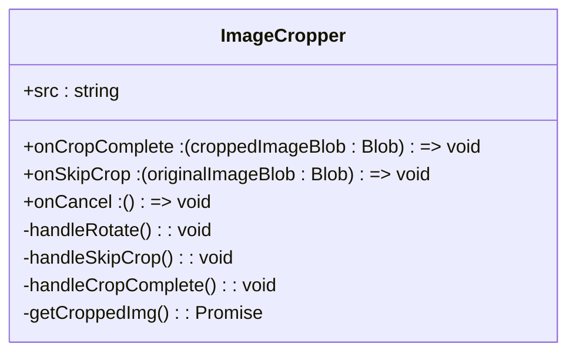
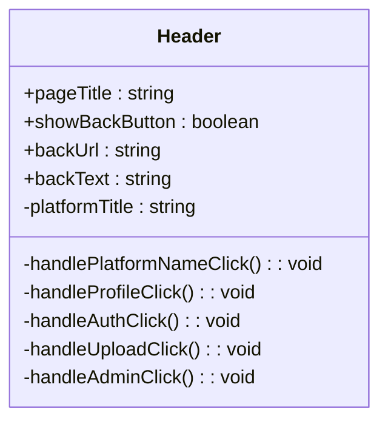
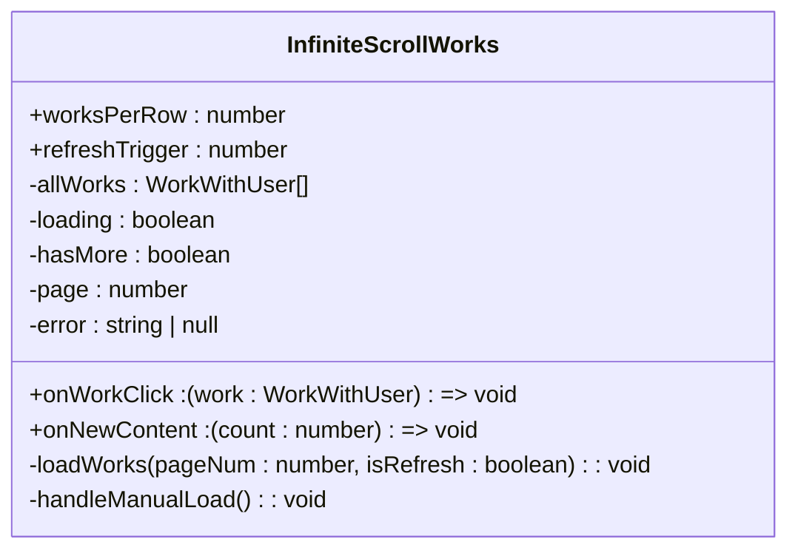
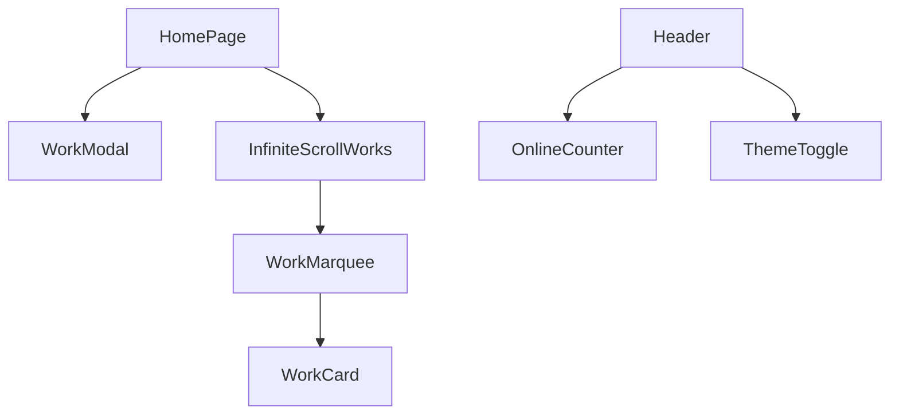

# 前端组件体系

<cite>
**本文档引用的文件**
- [WorkCard.tsx](file://src/components/WorkCard.tsx)
- [WorkModal.tsx](file://src/components/WorkModal.tsx)
- [ImageCropper.tsx](file://src/components/ImageCropper.tsx)
- [Header.tsx](file://src/components/Header.tsx)
- [InfiniteScrollWorks.tsx](file://src/components/InfiniteScrollWorks.tsx)
- [work.d.ts](file://src/types/work.d.ts)
- [page.tsx](file://src/app/page.tsx)
- [tailwind.config.js](file://tailwind.config.js)
</cite>

## 目录
1. [介绍](#介绍)
2. [项目结构](#项目结构)
3. [核心组件](#核心组件)
4. [架构概述](#架构概述)
5. [详细组件分析](#详细组件分析)
6. [依赖分析](#依赖分析)
7. [性能考虑](#性能考虑)
8. [故障排除指南](#故障排除指南)
9. [结论](#结论)

## 介绍
本文件深入分析了基于Next.js App Router和React 19函数式组件模式的前端组件架构设计。文档详细说明了UI组件的分类，包括展示型组件（如WorkCard）、交互型组件（如ImageCropper）和布局型组件（如Header），并解释了它们的职责划分。此外，文档还探讨了组件复用机制与组合模式，例如WorkCard与WorkModal之间的数据联动。结合Tailwind CSS，阐述了响应式设计的实现方式，并说明了组件如何通过props和事件实现松耦合通信。提供了组件使用示例，如InfiniteScrollWorks如何集成API分页数据。文档包含组件依赖关系图、渲染性能优化建议（如懒加载、memo化）以及常见问题（如样式冲突、状态不同步）的解决方案。

## 项目结构
项目采用模块化结构，主要分为以下几个部分：
- `src/app`：Next.js App Router的页面和路由配置。
- `src/components`：所有可复用的UI组件。
- `src/contexts`：React上下文提供者。
- `src/hooks`：自定义React Hook。
- `src/lib`：工具函数和库。
- `src/types`：TypeScript类型定义。
- `src/app/api`：API路由。

**图表来源**
- [WorkCard.tsx](file://src/components/WorkCard.tsx)
- [WorkModal.tsx](file://src/components/WorkModal.tsx)
- [ImageCropper.tsx](file://src/components/ImageCropper.tsx)
- [Header.tsx](file://src/components/Header.tsx)
- [InfiniteScrollWorks.tsx](file://src/components/InfiniteScrollWorks.tsx)
- [work.d.ts](file://src/types/work.d.ts)

**章节来源**
- [WorkCard.tsx](file://src/components/WorkCard.tsx)
- [WorkModal.tsx](file://src/components/WorkModal.tsx)
- [ImageCropper.tsx](file://src/components/ImageCropper.tsx)
- [Header.tsx](file://src/components/Header.tsx)
- [InfiniteScrollWorks.tsx](file://src/components/InfiniteScrollWorks.tsx)
- [work.d.ts](file://src/types/work.d.ts)

## 核心组件
核心组件包括WorkCard、WorkModal、ImageCropper、Header和InfiniteScrollWorks。这些组件通过props和事件实现松耦合通信，并利用Tailwind CSS实现响应式设计。

**章节来源**
- [WorkCard.tsx](file://src/components/WorkCard.tsx)
- [WorkModal.tsx](file://src/components/WorkModal.tsx)
- [ImageCropper.tsx](file://src/components/ImageCropper.tsx)
- [Header.tsx](file://src/components/Header.tsx)
- [InfiniteScrollWorks.tsx](file://src/components/InfiniteScrollWorks.tsx)

## 架构概述
系统架构基于Next.js App Router，采用函数式组件模式。组件通过props和事件进行通信，确保了松耦合和高内聚。

**图表来源**
- [WorkCard.tsx](file://src/components/WorkCard.tsx)
- [WorkModal.tsx](file://src/components/WorkModal.tsx)
- [ImageCropper.tsx](file://src/components/ImageCropper.tsx)
- [Header.tsx](file://src/components/Header.tsx)
- [InfiniteScrollWorks.tsx](file://src/components/InfiniteScrollWorks.tsx)
- [page.tsx](file://src/app/page.tsx)

## 详细组件分析
### WorkCard 分析
WorkCard 是一个展示型组件，用于展示作品的缩略图、名称、作者、点赞数和浏览量。它通过props接收作品数据，并通过onClick和onLike事件与父组件通信。

**图表来源**
- [WorkCard.tsx](file://src/components/WorkCard.tsx#L7-L92)
- [work.d.ts](file://src/types/work.d.ts#L50-L54)

### WorkModal 分析
WorkModal 是一个交互型组件，用于展示作品的详细信息，包括图片、名称、作者、提示词、创建时间等。它通过props接收作品数据，并通过onClose和onWorkUpdate事件与父组件通信。

**图表来源**
- [WorkModal.tsx](file://src/components/WorkModal.tsx#L10-L308)
- [work.d.ts](file://src/types/work.d.ts#L55-L59)

### ImageCropper 分析
ImageCropper 是一个交互型组件，用于裁剪图片。它通过props接收图片源，并通过onCropComplete和onSkipCrop事件与父组件通信。

**图表来源**
- [ImageCropper.tsx](file://src/components/ImageCropper.tsx#L40-L309)
- [work.d.ts](file://src/types/work.d.ts)

### Header 分析
Header 是一个布局型组件，用于展示平台名称、页面标题和在线人数。它通过props接收页面标题，并通过useSession和useRouter与Next.js的认证和路由系统集成。

**图表来源**
- [Header.tsx](file://src/components/Header.tsx#L21-L115)
- [work.d.ts](file://src/types/work.d.ts)

### InfiniteScrollWorks 分析
InfiniteScrollWorks 是一个复合组件，用于无限滚动加载作品。它通过props接收作品点击事件，并通过IntersectionObserver实现懒加载。

**图表来源**
- [InfiniteScrollWorks.tsx](file://src/components/InfiniteScrollWorks.tsx#L7-L267)
- [work.d.ts](file://src/types/work.d.ts#L70-L74)

**章节来源**
- [InfiniteScrollWorks.tsx](file://src/components/InfiniteScrollWorks.tsx#L7-L267)
- [work.d.ts](file://src/types/work.d.ts#L70-L74)

## 依赖分析
组件之间的依赖关系如下：
- WorkCard 被 WorkMarquee 和 InfiniteScrollWorks 使用。
- WorkModal 被 HomePage 使用。
- ImageCropper 被上传功能使用。
- Header 被所有页面使用。
- InfiniteScrollWorks 被 HomePage 使用。

**图表来源**
- [WorkCard.tsx](file://src/components/WorkCard.tsx)
- [WorkModal.tsx](file://src/components/WorkModal.tsx)
- [ImageCropper.tsx](file://src/components/ImageCropper.tsx)
- [Header.tsx](file://src/components/Header.tsx)
- [InfiniteScrollWorks.tsx](file://src/components/InfiniteScrollWorks.tsx)
- [page.tsx](file://src/app/page.tsx)

**章节来源**
- [WorkCard.tsx](file://src/components/WorkCard.tsx)
- [WorkModal.tsx](file://src/components/WorkModal.tsx)
- [ImageCropper.tsx](file://src/components/ImageCropper.tsx)
- [Header.tsx](file://src/components/Header.tsx)
- [InfiniteScrollWorks.tsx](file://src/components/InfiniteScrollWorks.tsx)
- [page.tsx](file://src/app/page.tsx)

## 性能考虑
为了优化渲染性能，采用了以下策略：
- 使用React.memo对组件进行记忆化，避免不必要的重新渲染。
- 使用IntersectionObserver实现懒加载，减少初始加载时间。
- 使用Tailwind CSS的响应式设计，确保在不同设备上都有良好的用户体验。

**章节来源**
- [InfiniteScrollWorks.tsx](file://src/components/InfiniteScrollWorks.tsx)
- [tailwind.config.js](file://tailwind.config.js)

## 故障排除指南
### 样式冲突
确保在`tailwind.config.js`中正确配置了content路径，以避免样式冲突。

### 状态不同步
使用useRef来避免闭包问题，确保状态同步。

**章节来源**
- [InfiniteScrollWorks.tsx](file://src/components/InfiniteScrollWorks.tsx)
- [tailwind.config.js](file://tailwind.config.js)

## 结论
本文档详细分析了前端组件架构设计，涵盖了组件分类、职责划分、复用机制、组合模式、响应式设计、松耦合通信、性能优化和常见问题解决方案。通过这些分析，可以更好地理解和维护前端代码库。