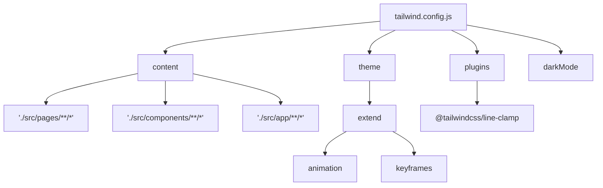
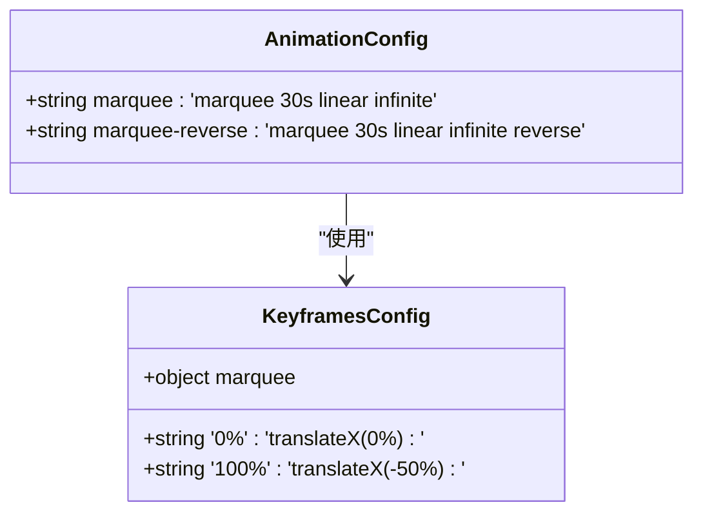
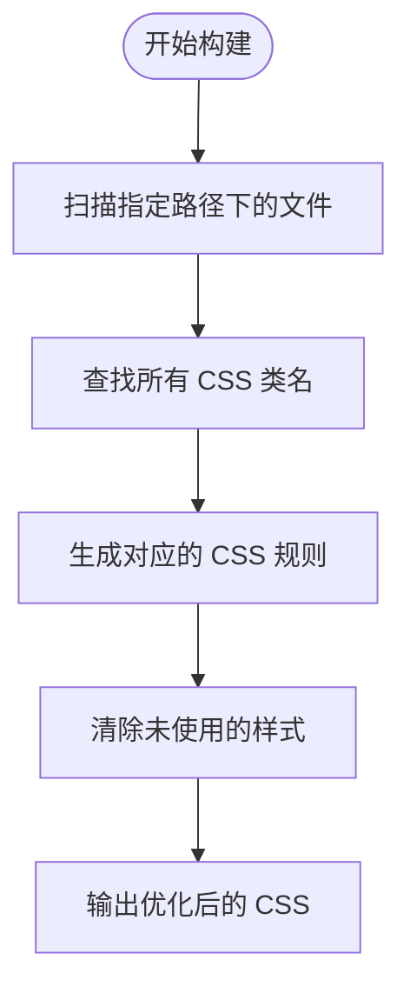
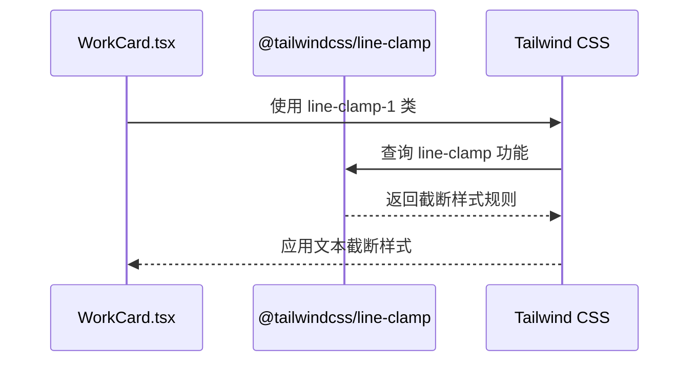
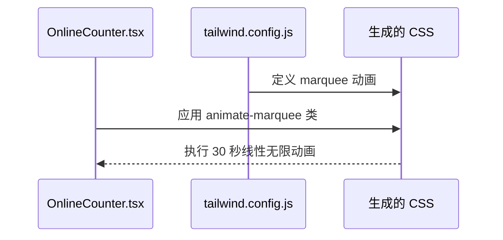
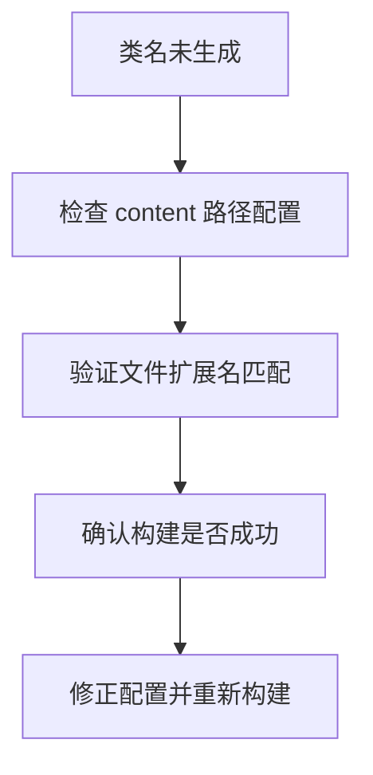

# Tailwind 配置

<cite>
**本文档中引用的文件**  
- [tailwind.config.js](file://tailwind.config.js)
- [src/components/WorkCard.tsx](file://src/components/WorkCard.tsx)
- [src/components/OnlineCounter.tsx](file://src/components/OnlineCounter.tsx)
- [src/app/globals.css](file://src/app/globals.css)
- [postcss.config.js](file://postcss.config.js)
</cite>

## 目录
1. [简介](#简介)
2. [配置结构概述](#配置结构概述)
3. [主题扩展详解](#主题扩展详解)
4. [内容扫描与按需生成](#内容扫描与按需生成)
5. [插件系统与组件集成](#插件系统与组件集成)
6. [构建流程影响](#构建流程影响)
7. [常见配置问题排查](#常见配置问题排查)

## 简介
本项目采用 Tailwind CSS 作为核心样式框架，通过 `tailwind.config.js` 文件进行全局配置。该配置文件定义了设计系统的扩展规则、内容扫描路径、深色模式策略以及插件集成方式。Tailwind 的按需生成机制确保只生成实际使用的 CSS 类，有效优化了最终打包体积。

## 配置结构概述

**图示来源**  
- [tailwind.config.js](file://tailwind.config.js#L1-L25)

**本节来源**  
- [tailwind.config.js](file://tailwind.config.js#L1-L25)

## 主题扩展详解
通过 `theme.extend` 配置项，项目扩展了默认的设计系统，自定义了动画、关键帧等设计令牌。

### 动画与关键帧扩展
配置文件中定义了两个自定义动画：`marquee` 和 `marquee-reverse`，用于实现作品滚动展示效果。这些动画基于自定义的关键帧 `marquee`，通过平移变换实现无缝滚动。

**图示来源**  
- [tailwind.config.js](file://tailwind.config.js#L10-L18)

**本节来源**  
- [tailwind.config.js](file://tailwind.config.js#L10-L18)

## 内容扫描与按需生成
`content` 配置项定义了 Tailwind 扫描源文件的路径模式，确保只生成在指定文件中实际使用的 CSS 类。

### 扫描路径配置
配置包含三个主要路径模式：
- `./src/pages/**/*.{js,ts,jsx,tsx,mdx}`：扫描所有页面组件
- `./src/components/**/*.{js,ts,jsx,tsx,mdx}`：扫描所有可复用组件
- `./src/app/**/*.{js,ts,jsx,tsx,mdx}`：扫描 App Router 架构下的所有文件

这种配置确保了 Tailwind 能够发现所有潜在的类名使用，同时避免了未使用样式的生成。

**图示来源**  
- [tailwind.config.js](file://tailwind.config.js#L3-L7)

**本节来源**  
- [tailwind.config.js](file://tailwind.config.js#L3-L7)

## 插件系统与组件集成
项目通过插件系统扩展了 Tailwind 的功能，特别是与自定义组件的样式集成。

### Line Clamp 插件
项目引入了 `@tailwindcss/line-clamp` 插件，为 `WorkCard` 组件提供了文本截断功能。该插件允许使用 `line-clamp-1` 和 `line-clamp-2` 类来限制文本行数。

**图示来源**  
- [tailwind.config.js](file://tailwind.config.js#L23-L25)
- [src/components/WorkCard.tsx](file://src/components/WorkCard.tsx#L7-L92)

**本节来源**  
- [tailwind.config.js](file://tailwind.config.js#L23-L25)
- [src/components/WorkCard.tsx](file://src/components/WorkCard.tsx#L7-L92)

### OnlineCounter 组件动画集成
`OnlineCounter` 组件利用配置中定义的 `marquee` 动画实现数字滚动效果。组件通过 `animate-marquee` 类应用自定义动画，实现平滑的在线人数变化展示。

**图示来源**  
- [tailwind.config.js](file://tailwind.config.js#L10-L18)
- [src/components/OnlineCounter.tsx](file://src/components/OnlineCounter.tsx#L15-L157)

**本节来源**  
- [tailwind.config.js](file://tailwind.config.js#L10-L18)
- [src/components/OnlineCounter.tsx](file://src/components/OnlineCounter.tsx#L15-L157)

## 构建流程影响
Tailwind 配置的变更会直接影响构建流程和最终输出。

### 配置变更的构建影响
当修改 `tailwind.config.js` 文件时，构建系统会重新扫描所有内容路径下的文件，重新生成 CSS 规则。特别是 `theme.extend` 的修改会立即反映在生成的样式表中。

**本节来源**  
- [tailwind.config.js](file://tailwind.config.js#L1-L25)
- [postcss.config.js](file://postcss.config.js#L1-L5)

## 常见配置问题排查
针对 Tailwind 配置中可能出现的问题，提供以下排查方法。

### 类名未生成问题
当自定义类名未生成时，应检查以下方面：
1. 确认相关文件路径是否包含在 `content` 配置中
2. 检查类名拼写是否正确
3. 确认构建过程是否正常完成

### 动画不生效问题
若自定义动画不生效，应验证：
1. `animation` 和 `keyframes` 配置是否正确对应
2. 组件中是否正确应用了动画类名
3. 浏览器是否支持相关 CSS 属性

**本节来源**  
- [tailwind.config.js](file://tailwind.config.js#L1-L25)
- [src/components/WorkCard.tsx](file://src/components/WorkCard.tsx#L7-L92)
- [src/components/OnlineCounter.tsx](file://src/components/OnlineCounter.tsx#L15-L157)