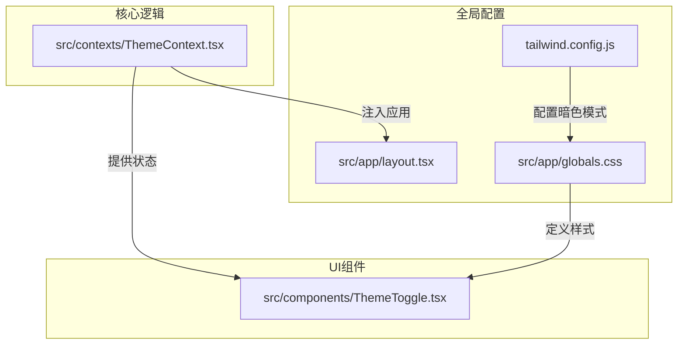
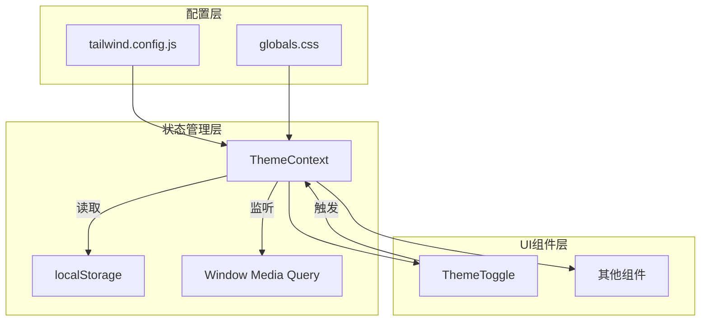
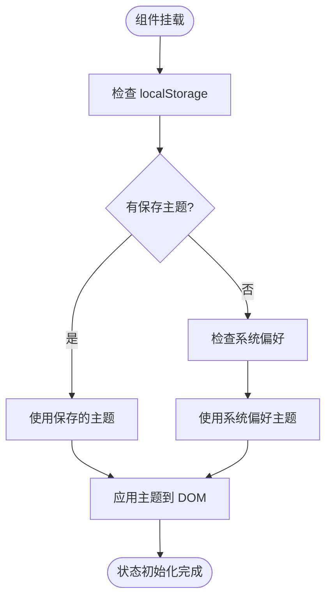
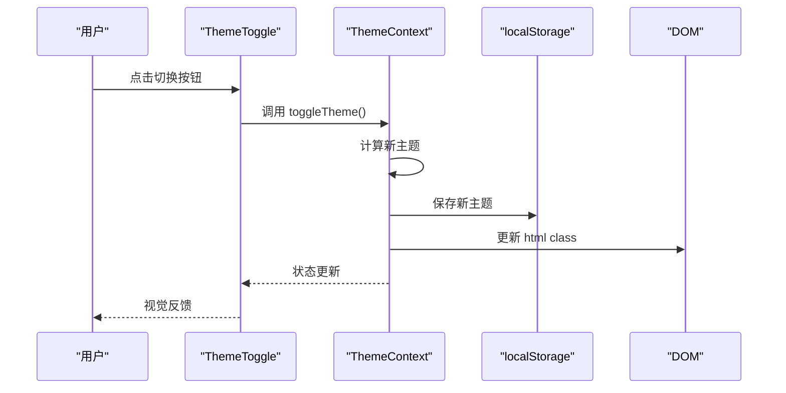
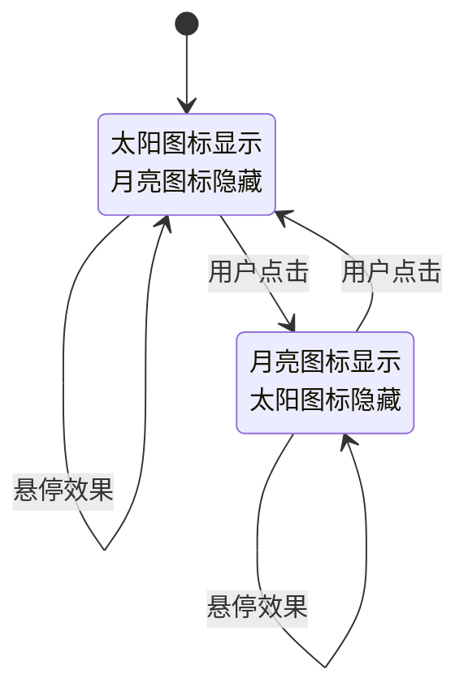
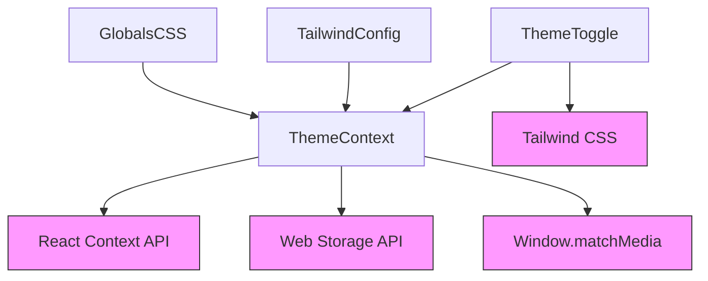

# 主题系统

<cite>
**Referenced Files in This Document**   
- [ThemeContext.tsx](file://src/contexts/ThemeContext.tsx)
- [ThemeToggle.tsx](file://src/components/ThemeToggle.tsx)
- [layout.tsx](file://src/app/layout.tsx)
- [tailwind.config.js](file://tailwind.config.js)
- [globals.css](file://src/app/globals.css)
</cite>

## 目录
1. [简介](#简介)
2. [项目结构](#项目结构)
3. [核心组件](#核心组件)
4. [架构概述](#架构概述)
5. [详细组件分析](#详细组件分析)
6. [依赖分析](#依赖分析)
7. [性能考虑](#性能考虑)
8. [故障排除指南](#故障排除指南)
9. [结论](#结论)

## 简介

本项目实现了一套完整的暗色模式切换功能，基于React Context API构建全局主题管理系统。系统通过`ThemeContext`管理light/dark两种主题状态，并在应用启动时根据localStorage设置或系统偏好自动初始化。用户可通过`ThemeToggle`组件切换主题，切换状态会持久化存储于localStorage中。前端样式通过Tailwind CSS的class模式实现，当主题切换时动态修改html元素的class属性来驱动视觉变化。整个系统还包含了对系统偏好变化的监听、无障碍访问支持以及平滑的过渡动画效果。

## 项目结构

主题系统相关文件分布在项目的不同目录中，遵循功能分离的设计原则。核心逻辑位于contexts目录，UI组件位于components目录，而全局配置则分散在根目录和app目录中。

**Diagram sources**
- [ThemeContext.tsx](file://src/contexts/ThemeContext.tsx)
- [ThemeToggle.tsx](file://src/components/ThemeToggle.tsx)
- [tailwind.config.js](file://tailwind.config.js)
- [globals.css](file://src/app/globals.css)
- [layout.tsx](file://src/app/layout.tsx)

**Section sources**
- [ThemeContext.tsx](file://src/contexts/ThemeContext.tsx)
- [ThemeToggle.tsx](file://src/components/ThemeToggle.tsx)
- [tailwind.config.js](file://tailwind.config.js)

## 核心组件

主题系统由两个核心组件构成：`ThemeContext`负责状态管理与逻辑处理，`ThemeToggle`负责用户交互与状态展示。`ThemeContext`使用React的createContext创建全局可访问的主题上下文，包含当前主题状态、切换函数和设置函数。`ThemeToggle`组件则通过useTheme Hook订阅该上下文，实现按钮的交互逻辑和视觉反馈。

**Section sources**
- [ThemeContext.tsx](file://src/contexts/ThemeContext.tsx#L6-L10)
- [ThemeToggle.tsx](file://src/components/ThemeToggle.tsx#L3-L7)

## 架构概述

系统采用分层架构设计，从下至上分别为配置层、状态管理层、UI组件层。配置层定义了Tailwind的暗色模式行为；状态管理层实现主题状态的存储、持久化和广播；UI组件层提供用户交互界面。各层之间通过明确的接口进行通信，确保了系统的可维护性和扩展性。

**Diagram sources**
- [tailwind.config.js](file://tailwind.config.js#L4-L4)
- [globals.css](file://src/app/globals.css#L10-L10)
- [ThemeContext.tsx](file://src/contexts/ThemeContext.tsx#L14-L69)
- [ThemeToggle.tsx](file://src/components/ThemeToggle.tsx#L10-L74)

## 详细组件分析

### ThemeContext 分析

`ThemeContext`是整个主题系统的核心，负责管理全局主题状态。它使用useState存储当前主题，通过useEffect在组件挂载时初始化状态，优先使用localStorage中的保存值，若无则根据系统偏好进行设置。

#### 状态管理流程

**Diagram sources**
- [ThemeContext.tsx](file://src/contexts/ThemeContext.tsx#L14-L28)

#### 主题切换流程

**Diagram sources**
- [ThemeContext.tsx](file://src/contexts/ThemeContext.tsx#L50-L58)
- [ThemeToggle.tsx](file://src/components/ThemeToggle.tsx#L20-L25)

### ThemeToggle 分析

`ThemeToggle`组件提供用户友好的主题切换界面，包含太阳/月亮图标动画和悬停效果。组件通过useTheme Hook订阅主题状态，并在用户交互时触发状态变更。

#### 组件属性定义
| 属性 | 类型 | 默认值 | 描述 |
|------|------|--------|------|
| className | string | "" | 自定义CSS类名 |
| size | "sm" \| "md" \| "lg" | "md" | 按钮尺寸 |

**Section sources**
- [ThemeToggle.tsx](file://src/components/ThemeToggle.tsx#L3-L7)

#### 视觉状态转换

**Diagram sources**
- [ThemeToggle.tsx](file://src/components/ThemeToggle.tsx#L40-L74)

## 依赖分析

主题系统依赖于多个外部机制和配置，形成了一个完整的生态系统。系统通过模块化设计将不同职责分离，降低了组件间的耦合度。

**Diagram sources**
- [ThemeContext.tsx](file://src/contexts/ThemeContext.tsx#L1-L7)
- [ThemeToggle.tsx](file://src/components/ThemeToggle.tsx#L1-L2)
- [tailwind.config.js](file://tailwind.config.js#L4-L4)
- [globals.css](file://src/app/globals.css#L10-L10)

## 性能考虑

主题系统在设计时充分考虑了性能优化，避免了不必要的重渲染和DOM操作。系统采用多种策略确保流畅的用户体验。

### 水合不匹配避免
系统通过`mounted`状态标志来区分服务端渲染和客户端渲染阶段，确保只有在客户端才执行DOM操作和localStorage读写，避免了Next.js水合过程中的不匹配错误。

### 条件持久化
主题状态的持久化操作仅在组件已挂载后执行，防止在服务端尝试访问浏览器API导致的错误。

### 事件监听优化
系统偏好变化的监听器在组件卸载时被正确清理，防止内存泄漏。同时，监听逻辑仅在用户未手动设置主题时生效，尊重用户的个性化选择。

**Section sources**
- [ThemeContext.tsx](file://src/contexts/ThemeContext.tsx#L15-L16)
- [ThemeContext.tsx](file://src/contexts/ThemeContext.tsx#L52-L54)
- [ThemeContext.tsx](file://src/contexts/ThemeContext.tsx#L39-L47)

## 故障排除指南

### 常见问题

#### 主题不保存
**问题**: 切换主题后刷新页面，主题恢复默认
**原因**: 可能由于`mounted`状态未正确设置，导致localStorage写入失败
**解决方案**: 确保`setMounted(true)`在useEffect中正确执行

#### 系统偏好不生效
**问题**: 系统主题变化时，应用主题未同步更新
**原因**: localStorage中存在用户手动设置的主题
**说明**: 这是预期行为，系统设计为优先尊重用户手动选择

#### 初始主题错误
**问题**: 页面首次加载时主题与预期不符
**原因**: localStorage和系统偏好都未正确读取
**检查点**: 确认浏览器支持localStorage和matchMedia API

**Section sources**
- [ThemeContext.tsx](file://src/contexts/ThemeContext.tsx#L20-L27)
- [ThemeContext.tsx](file://src/contexts/ThemeContext.tsx#L41-L45)

## 结论

本主题系统实现了一套完整、健壮的暗色模式切换解决方案。系统通过React Context API实现了全局状态管理，结合localStorage实现了状态持久化，并利用Tailwind CSS的class模式实现了高效的样式切换。架构设计充分考虑了用户体验、性能优化和可维护性，包含了对系统偏好变化的响应、无障碍访问支持和平滑的过渡动画。未来可扩展方向包括：多主题支持、主题同步到云端、更精细的动画控制等。