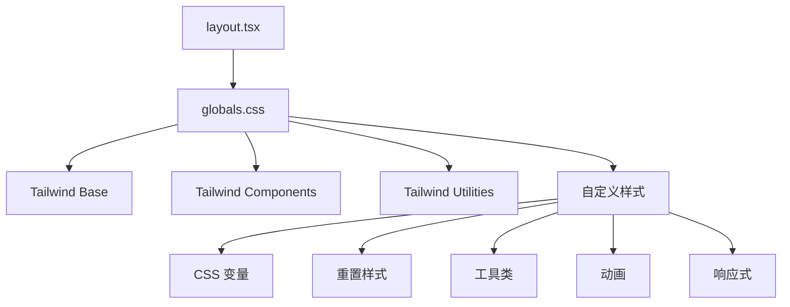
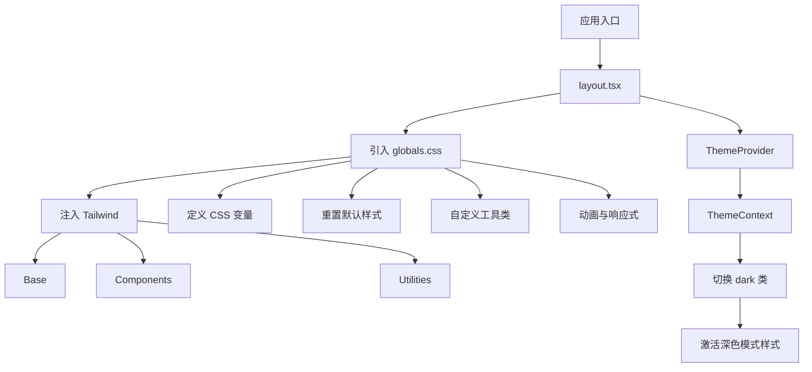
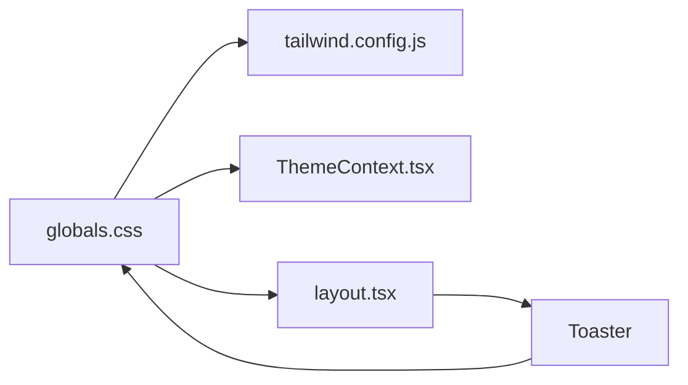

# 全局样式

<cite>
**本文档中引用的文件**  
- [globals.css](file://src/app/globals.css)
- [tailwind.config.js](file://tailwind.config.js)
- [layout.tsx](file://src/app/layout.tsx)
- [ThemeContext.tsx](file://src/contexts/ThemeContext.tsx)
- [ThemeToggle.tsx](file://src/components/ThemeToggle.tsx)
</cite>

## 目录
1. [简介](#简介)
2. [项目结构](#项目结构)
3. [核心组件](#核心组件)
4. [架构概述](#架构概述)
5. [详细组件分析](#详细组件分析)
6. [依赖分析](#依赖分析)
7. [性能考虑](#性能考虑)
8. [故障排除指南](#故障排除指南)
9. [结论](#结论)
10. [附录](#附录)（如有必要）

## 简介
本文档详细说明了 `src/app/globals.css` 文件中定义的全局样式，解释其在 Next.js 15 App Router 架构下的加载机制与作用范围。文档涵盖通过 CSS 自定义属性（CSS Variables）实现主题化支持，并与 Tailwind 的 theme 配置协同工作的机制。同时描述了基础样式重置、排版设置、布局间距、响应式断点的设计原则，提供实际类名使用示例，并阐明与组件内联样式的优先级关系及冲突解决策略。

## 项目结构
`src/app/globals.css` 是 Next.js 15 App Router 架构中的全局样式入口文件，由 `layout.tsx` 引入并应用于整个应用。该文件通过 `@tailwind` 指令注入 Tailwind CSS 的 base、components 和 utilities 层，并在此基础上扩展自定义样式。项目采用模块化结构，`globals.css` 位于 `src/app/` 目录下，与页面和布局文件同级，确保样式在应用初始化时即被加载。



**图示来源**  
- [layout.tsx](file://src/app/layout.tsx#L25-L54)
- [globals.css](file://src/app/globals.css#L1-L10)

**本节来源**
- [src/app](file://src/app)
- [globals.css](file://src/app/globals.css)

## 核心组件
`globals.css` 的核心功能包括：通过 CSS 变量实现主题化支持，重置浏览器默认样式，定义基础排版与布局规范，创建可复用的工具类（utility classes），以及实现动画与响应式设计。这些样式通过 `layout.tsx` 中的 `html` 标签全局注入，作用于所有页面组件。

**本节来源**
- [globals.css](file://src/app/globals.css#L1-L583)
- [layout.tsx](file://src/app/layout.tsx#L1-L84)

## 架构概述
全局样式架构遵循 Tailwind CSS 的三层注入原则（base, components, utilities），并在其基础上进行扩展。`globals.css` 首先引入 Tailwind 的基础样式，然后定义项目特有的 CSS 变量、重置规则、自定义组件样式和工具类。主题切换通过 `ThemeProvider` 和 `ThemeContext` 实现，利用 `document.documentElement.classList` 切换 `dark` 类来激活深色模式。



**图示来源**  
- [globals.css](file://src/app/globals.css#L1-L10)
- [layout.tsx](file://src/app/layout.tsx#L1-L84)
- [ThemeContext.tsx](file://src/contexts/ThemeContext.tsx#L1-L77)

## 详细组件分析
### CSS 变量与主题化
`globals.css` 使用 `:root` 定义浅色模式下的 CSS 变量（如 `--toast-bg` 和 `--toast-color`），并通过 `.dark` 选择器覆盖这些变量以实现深色模式。这种机制与 Tailwind 的 `darkMode: 'class'` 配置协同工作，确保主题切换时所有依赖这些变量的组件（如 `Toaster`）能自动更新。

```mermaid
classDiagram
class : root {
+--toast-bg : #ffffff
+--toast-color : #374151
}
class .dark {
+--toast-bg : #374151
+--toast-color : #f9fafb
}
: root <|-- .dark : "覆盖"
```

**图示来源**  
- [globals.css](file://src/app/globals.css#L3-L14)

**本节来源**
- [globals.css](file://src/app/globals.css#L3-L14)
- [tailwind.config.js](file://tailwind.config.js#L4-L5)
- [layout.tsx](file://src/app/layout.tsx#L75-L80)

### 基础样式重置
文件通过 `*` 选择器统一 `box-sizing`，并为 `html` 和 `body` 元素重置 `margin` 和 `padding`，设置统一的字体栈和行高。此外，禁用页面滚动溢出行为（`overscroll-behavior`），并为 WebKit 浏览器定义自定义滚动条样式，提升跨浏览器一致性。

**本节来源**
- [globals.css](file://src/app/globals.css#L16-L45)

### 工具类与实用样式
`globals.css` 定义了一系列工具类，如 `line-clamp-*` 用于文本截断，`animate-*` 用于动画控制，`gradient-*` 用于渐变背景，`glass` 用于玻璃态效果。这些类可直接在 JSX 中使用，提供比 Tailwind 原生类更高级或项目特定的样式封装。

**本节来源**
- [globals.css](file://src/app/globals.css#L47-L390)

### 响应式与无障碍
文件包含针对移动端、平板和桌面端的媒体查询，定义响应式网格和间距。同时，遵循无障碍最佳实践，提供 `.sr-only` 类隐藏视觉元素但保留其对屏幕阅读器的可访问性，以及 `skip-link` 用于跳过导航。还支持 `prefers-reduced-motion` 和 `prefers-contrast` 等用户偏好。

**本节来源**
- [globals.css](file://src/app/globals.css#L312-L390)

## 依赖分析
`globals.css` 依赖于 Tailwind CSS 框架，其功能通过 `tailwind.config.js` 中的配置得到增强，例如启用了 `@tailwindcss/line-clamp` 插件。主题化功能依赖于 `ThemeContext.tsx` 提供的 React Context，而 `Toaster` 组件则通过 `var(--toast-bg)` 等 CSS 变量与全局样式通信。



**图示来源**  
- [globals.css](file://src/app/globals.css)
- [tailwind.config.js](file://tailwind.config.js)
- [ThemeContext.tsx](file://src/contexts/ThemeContext.tsx)
- [layout.tsx](file://src/app/layout.tsx)

**本节来源**
- [tailwind.config.js](file://tailwind.config.js#L1-L25)
- [ThemeContext.tsx](file://src/contexts/ThemeContext.tsx#L1-L77)
- [layout.tsx](file://src/app/layout.tsx#L1-L84)

## 性能考虑
全局样式文件被设计为一次性加载，避免了组件级 CSS 的重复下载。通过使用 CSS 变量和工具类，减少了 CSS 文件的总体积。动画和过渡效果使用 `transform` 和 `opacity` 等高性能属性，并通过 `prefers-reduced-motion` 媒体查询为偏好减少动画的用户提供优化体验。

## 故障排除指南
- **主题不切换**：检查 `ThemeContext` 是否正确包裹应用，`document.documentElement` 是否正确添加/移除 `dark` 类。
- **样式未生效**：确认 `globals.css` 已在 `layout.tsx` 中正确导入，且 `tailwind.config.js` 的 `content` 字段包含所有相关文件路径。
- **滚动条不显示**：确保浏览器为 WebKit 内核（Chrome, Safari），或为其他浏览器提供回退样式。
- **Toaster 颜色错误**：验证 `Toaster` 组件的 `style` 属性是否正确引用了 `var(--toast-bg)` 和 `var(--toast-color)`。

**本节来源**
- [globals.css](file://src/app/globals.css)
- [ThemeContext.tsx](file://src/contexts/ThemeContext.tsx)
- [layout.tsx](file://src/app/layout.tsx)

## 结论
`src/app/globals.css` 是项目样式系统的核心，它有效地结合了 Tailwind CSS 的实用优先方法与自定义 CSS 的灵活性。通过精心设计的 CSS 变量、重置规则、工具类和响应式断点，该文件为整个应用提供了统一、可维护且可主题化的视觉基础。其与 Next.js App Router 和 React Context 的集成，确保了样式在服务端和客户端的正确渲染与交互。