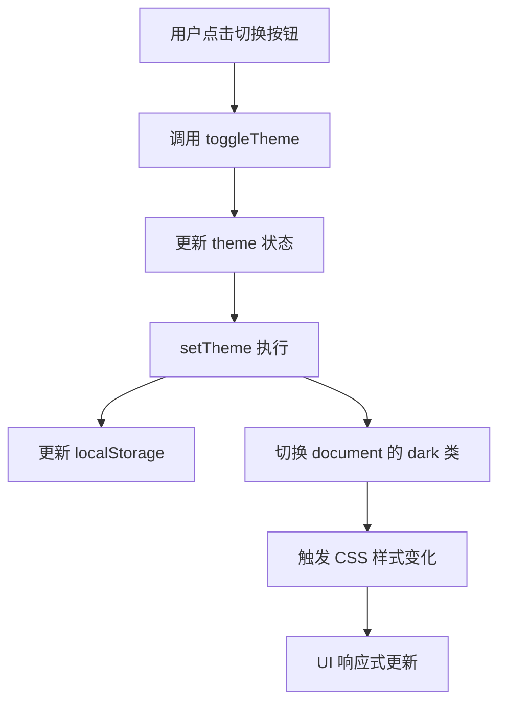
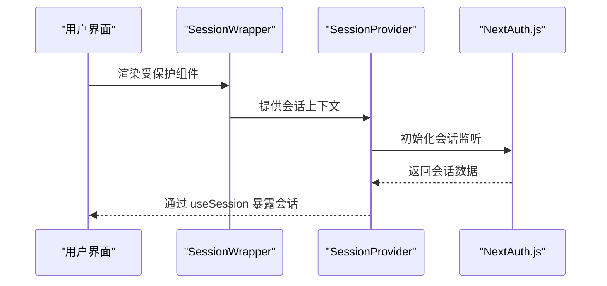
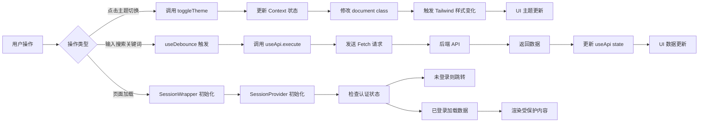

# 状态管理

<cite>
**本文档引用的文件**  
- [ThemeContext.tsx](file://src/contexts/ThemeContext.tsx)
- [SessionWrapper.tsx](file://src/components/SessionWrapper.tsx)
- [useApi.ts](file://src/hooks/useApi.ts)
- [useDebounce.ts](file://src/hooks/useDebounce.ts)
- [ThemeToggle.tsx](file://src/components/ThemeToggle.tsx)
- [profile/page.tsx](file://src/app/profile/page.tsx)
</cite>

## 目录
1. [引言](#引言)
2. [主题状态管理](#主题状态管理)
3. [会话状态集成](#会话状态集成)
4. [API 请求封装](#api-请求封装)
5. [防抖逻辑实现](#防抖逻辑实现)
6. [状态流图示](#状态流图示)
7. [性能优化与边界处理](#性能优化与边界处理)
8. [总结](#总结)

## 引言
本文档深入解析项目中基于 React Context 的状态管理模式，涵盖主题切换、身份验证、API 调用封装及输入防抖等核心功能。通过 useReducer 与 useContext 的结合，实现高效的状态更新与组件响应。文档将详细阐述各状态管理模块的设计原理与实际应用，并提供状态流转的可视化图示，帮助开发者理解从用户操作到 UI 更新的完整链条。

## 主题状态管理

`ThemeContext.tsx` 实现了基于 React Context 的全局主题状态管理，支持亮色/暗色模式的动态切换。该模块通过 `ThemeProvider` 组件封装应用根节点，利用 `useState` 管理当前主题状态，并结合 `useEffect` 在客户端挂载时读取本地存储或系统偏好设置以初始化主题。

主题切换逻辑由 `toggleTheme` 函数实现，调用时会更新状态并同步至 `localStorage` 和 `document.documentElement` 的类名，从而触发 Tailwind CSS 的暗色模式样式生效。同时，组件监听 `prefers-color-scheme` 媒体查询变化，在用户未手动设置主题时自动响应系统主题变更。

为避免服务端渲染（SSR）与客户端水合（hydration）时的主题不一致，组件通过 `mounted` 状态标记客户端挂载完成，确保仅在客户端执行 DOM 操作和事件监听。



**图示来源**  
- [ThemeContext.tsx](file://src/contexts/ThemeContext.tsx#L39-L77)
- [ThemeToggle.tsx](file://src/components/ThemeToggle.tsx#L10-L15)

**本节来源**  
- [ThemeContext.tsx](file://src/contexts/ThemeContext.tsx#L0-L77)
- [ThemeToggle.tsx](file://src/components/ThemeToggle.tsx#L0-L39)

## 会话状态集成

`SessionWrapper` 组件封装了 NextAuth.js 的 `SessionProvider`，用于在应用中统一管理用户会话状态。该组件作为客户端组件，通过 `SessionProvider` 将认证上下文注入 React 组件树，使得所有子组件可通过 `useSession` Hook 安全地访问当前用户会话信息。

该设计确保了页面级身份验证的统一处理，避免重复初始化认证逻辑。结合 Next.js 的 App Router 架构，`SessionWrapper` 可在布局或页面层级包裹需要认证的组件，实现细粒度的访问控制。



**图示来源**  
- [SessionWrapper.tsx](file://src/components/SessionWrapper.tsx#L9-L15)

**本节来源**  
- [SessionWrapper.tsx](file://src/components/SessionWrapper.tsx#L0-L15)
- [profile/page.tsx](file://src/app/profile/page.tsx#L82-L126)

## API 请求封装

`useApi.ts` 封装了自定义 Hook `useApi`，用于统一处理应用中的 API 调用。该 Hook 使用 `useState` 管理请求的 `data`、`loading` 和 `error` 状态，并通过 `execute` 函数发起请求。

`execute` 函数在请求前自动设置 `Content-Type: application/json` 头部，并支持传入自定义请求头。响应处理中，根据后端返回的 `success` 字段判断结果，更新本地状态并返回完整响应对象，便于调用者进行进一步处理。错误被捕获后统一设置为字符串错误信息，确保调用层逻辑简洁。

此外，`reset` 函数可用于重置请求状态，适用于表单提交后清空状态的场景。

```mermaid
flowchart TD
I[调用 execute(url, options)] --> J[设置 loading = true]
J --> K[发送 fetch 请求]
K --> L{响应成功?}
L --> |是| M[解析 JSON]
M --> N{result.success?}
N --> |是| O[更新 data, loading = false]
N --> |否| P[更新 error, loading = false]
L --> |否| Q[捕获异常, 设置 error]
Q --> R[返回错误响应]
O --> S[返回成功响应]
```

**图示来源**  
- [useApi.ts](file://src/hooks/useApi.ts#L19-L85)

**本节来源**  
- [useApi.ts](file://src/hooks/useApi.ts#L0-L85)
- [profile/page.tsx](file://src/app/profile/page.tsx#L82-L126)

## 防抖逻辑实现

`useDebounce.ts` 提供了通用的防抖 Hook `useDebounce`，用于延迟值的更新，常用于搜索输入等高频触发场景。该 Hook 接收任意类型的 `value` 和 `delay`（毫秒），返回一个延迟更新的 `debouncedValue`。

内部通过 `useEffect` 监听 `value` 和 `delay` 的变化，设置定时器延迟更新状态。组件卸载时自动清除定时器，防止内存泄漏。在作品搜索功能中，可将用户输入绑定到 `useDebounce`，仅在用户停止输入指定时间后才触发搜索请求，显著减少无效 API 调用。

**本节来源**  
- [useDebounce.ts](file://src/hooks/useDebounce.ts#L0-L16)

## 状态流图示

以下图示展示了从用户操作触发状态变更到 UI 响应的完整链条：



**图示来源**  
- [ThemeContext.tsx](file://src/contexts/ThemeContext.tsx#L39-L77)
- [useDebounce.ts](file://src/hooks/useDebounce.ts#L2-L16)
- [useApi.ts](file://src/hooks/useApi.ts#L19-L85)
- [SessionWrapper.tsx](file://src/components/SessionWrapper.tsx#L9-L15)

## 性能优化与边界处理

### 避免重渲染
- `useApi` 和 `useDebounce` 均使用 `useCallback` 缓存函数引用，防止因函数重新创建导致子组件不必要的重渲染。
- `ThemeProvider` 仅在 `theme`、`toggleTheme`、`setTheme` 变化时重新提供值，确保 Context 变更的精确性。

### 服务端渲染兼容性
- `ThemeContext` 中的 `mounted` 状态确保 DOM 操作仅在客户端执行，避免 SSR 时 `window` 或 `localStorage` 未定义的错误。
- 主题初始化逻辑延迟至 `useEffect`，保证服务端使用默认的 `light` 主题，客户端再根据本地设置同步，避免水合不匹配。

### 边界情况处理
- `useApi` 捕获网络异常并提供友好错误信息，确保 UI 不会因请求失败而崩溃。
- `useDebounce` 在组件卸载时清除定时器，防止状态更新到已卸载的组件。
- `ThemeContext` 监听系统主题变化时检查 `localStorage` 是否存在用户偏好，仅在无手动设置时才自动切换，尊重用户选择。

**本节来源**  
- [ThemeContext.tsx](file://src/contexts/ThemeContext.tsx#L15-L38)
- [useApi.ts](file://src/hooks/useApi.ts#L45-L85)
- [useDebounce.ts](file://src/hooks/useDebounce.ts#L10-L16)

## 总结
本项目通过 React Context 与自定义 Hook 构建了高效、可维护的状态管理体系。`ThemeContext` 实现了主题的持久化与动态切换，`SessionWrapper` 集成了 NextAuth.js 的会话管理，`useApi` 统一了 API 调用逻辑，`useDebounce` 优化了高频输入场景。各模块职责清晰，结合 Mermaid 图示可直观理解状态流转，为后续功能扩展提供了坚实基础。