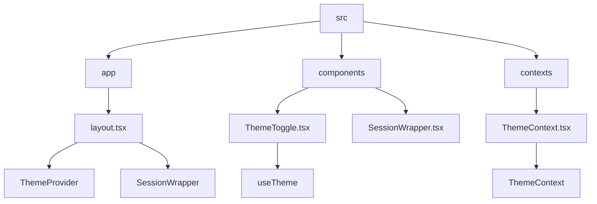
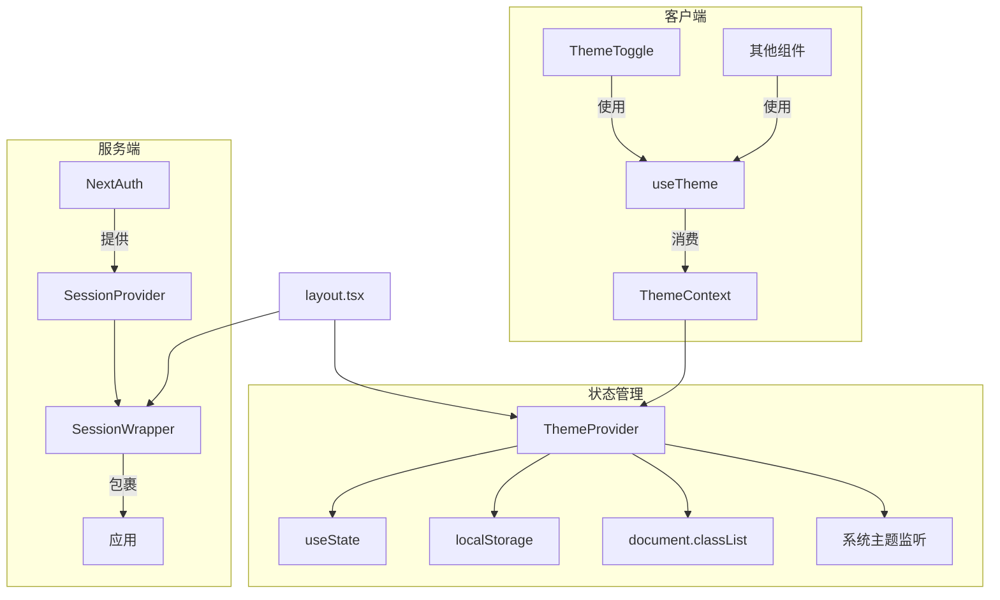
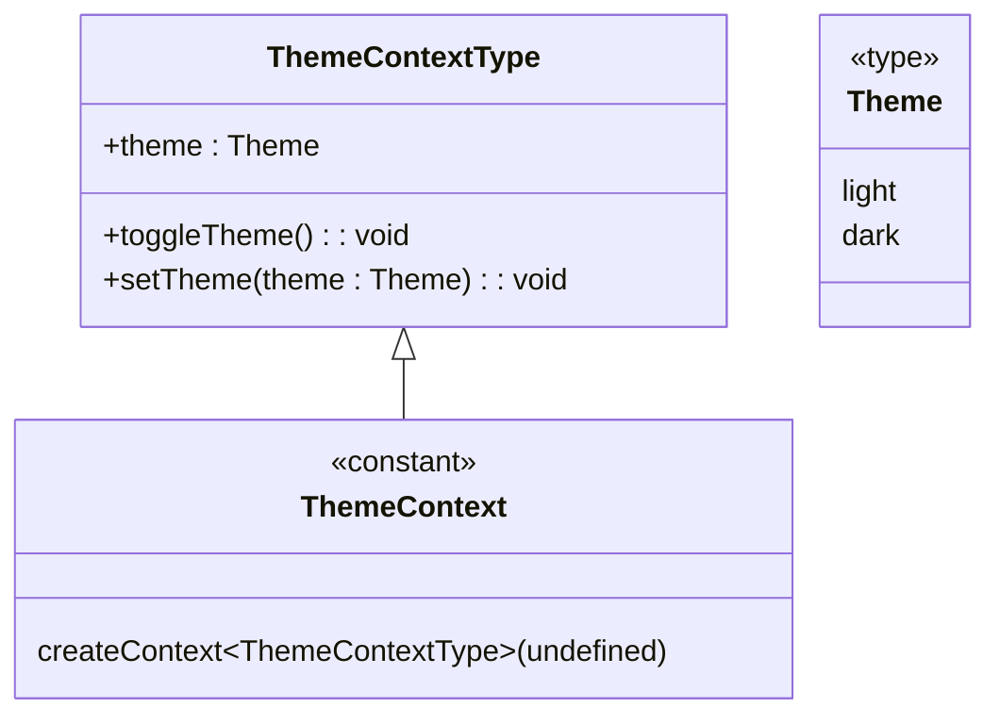
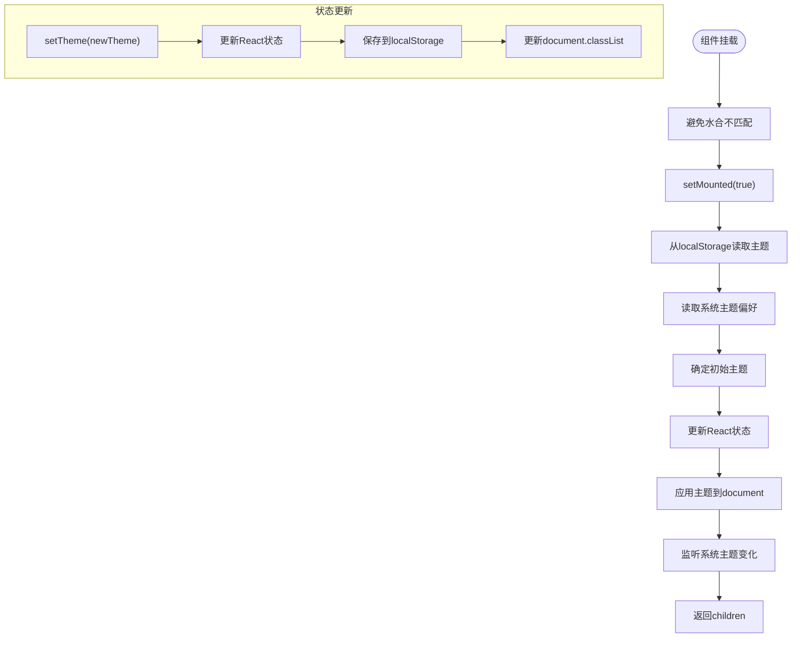
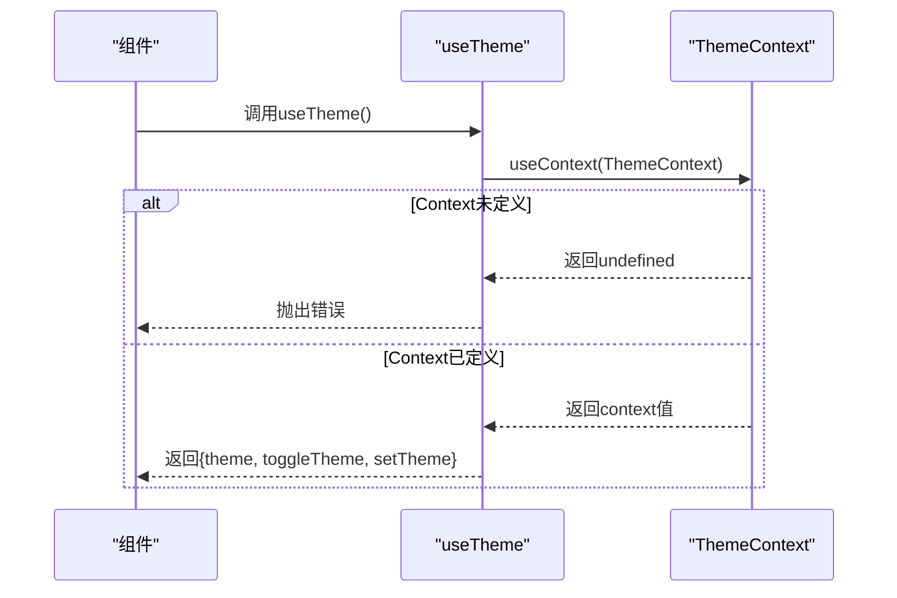
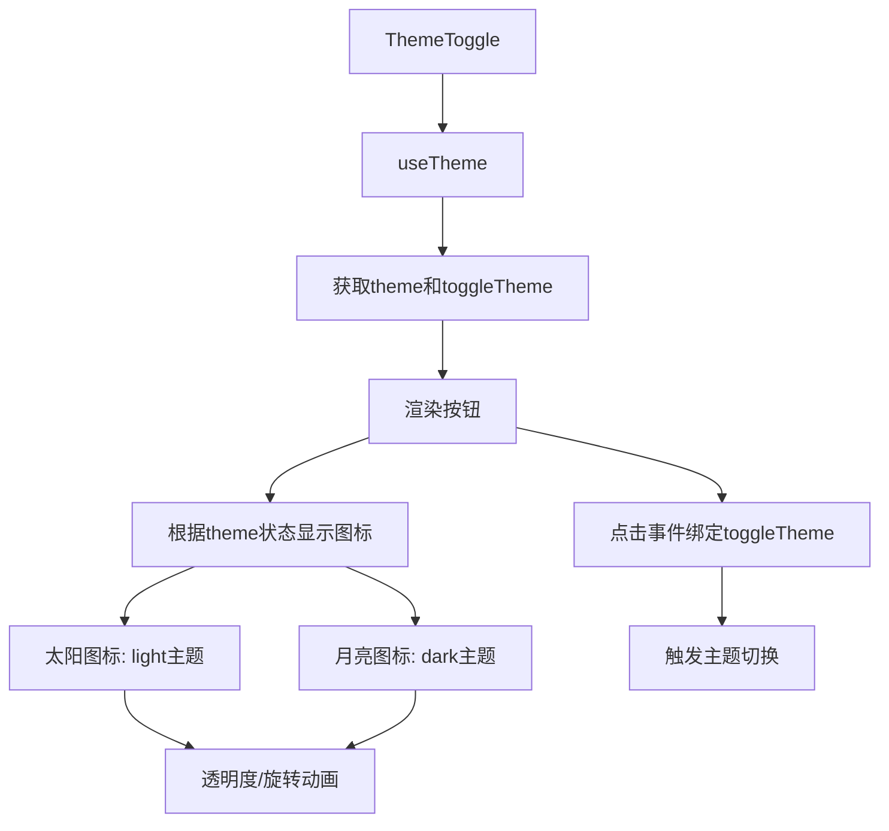
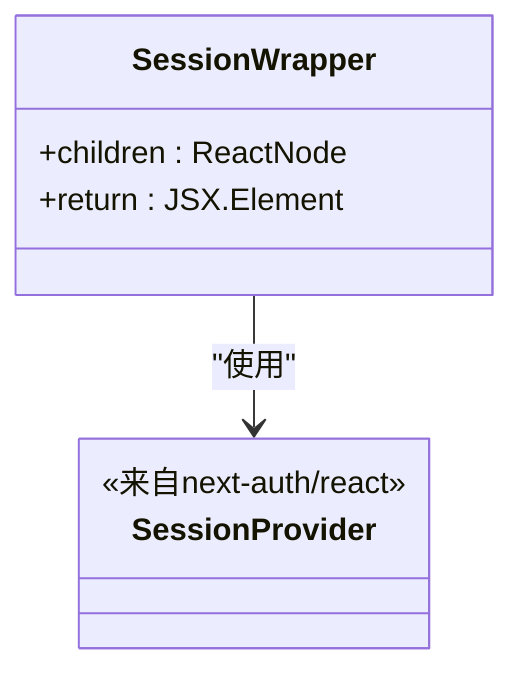
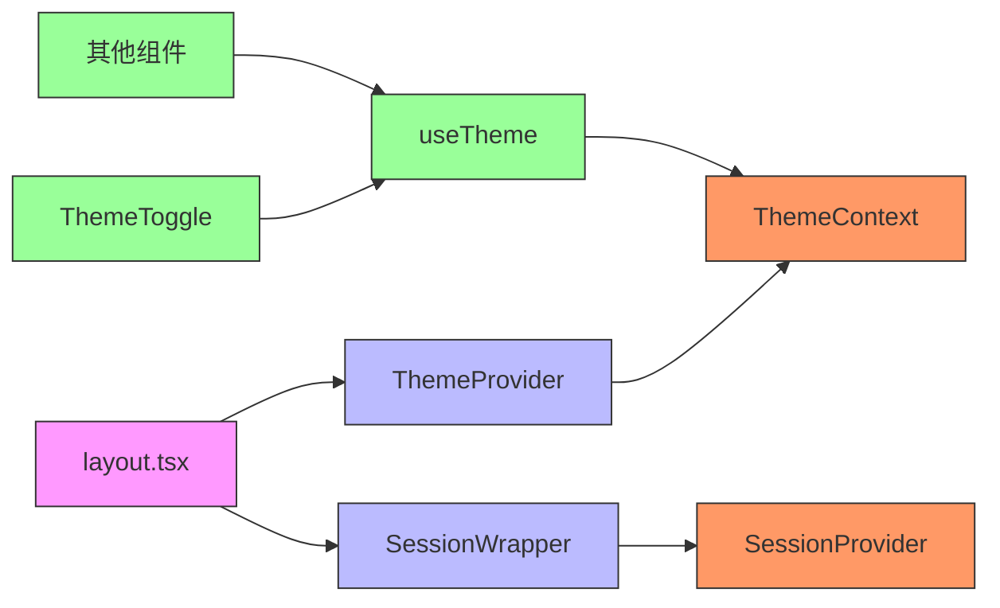

# React Context 状态管理

<cite>
**本文档引用的文件**
- [ThemeContext.tsx](file://src/contexts/ThemeContext.tsx)
- [ThemeToggle.tsx](file://src/components/ThemeToggle.tsx)
- [SessionWrapper.tsx](file://src/components/SessionWrapper.tsx)
- [layout.tsx](file://src/app/layout.tsx)
- [globals.css](file://src/app/globals.css)
</cite>

## 目录
1. [简介](#简介)
2. [项目结构](#项目结构)
3. [核心组件](#核心组件)
4. [架构概述](#架构概述)
5. [详细组件分析](#详细组件分析)
6. [依赖分析](#依赖分析)
7. [性能考虑](#性能考虑)
8. [故障排除指南](#故障排除指南)
9. [结论](#结论)

## 简介
本文档详细阐述了基于React Context的状态管理实现，重点分析了ThemeContext如何在应用中实现主题状态的全局共享与更新。文档说明了ThemeContext.tsx中createContext的初始化方式及其TypeScript类型定义，解释了useTheme自定义Hook的封装逻辑。结合ThemeToggle组件展示了UI如何通过Context消费主题状态并触发切换，描述了状态更新时的重新渲染机制与性能优化策略。同时说明了SessionWrapper如何集成NextAuth的SessionProvider，实现用户会话状态的全局管理。文档还包含Context的Provider组件在布局中的挂载位置、跨层级组件通信流程、错误边界处理以及与Next.js服务端渲染的兼容性考虑。

## 项目结构
项目采用标准的Next.js应用结构，状态管理相关文件位于`src`目录下。核心状态管理逻辑分布在`contexts`和`components`目录中，其中`ThemeContext.tsx`负责主题状态管理，`SessionWrapper.tsx`负责会话状态管理。这些状态管理组件通过`layout.tsx`在应用根层级挂载，确保全局可用性。

**图示来源**
- [layout.tsx](file://src/app/layout.tsx#L1-L85)
- [ThemeContext.tsx](file://src/contexts/ThemeContext.tsx#L1-L78)
- [ThemeToggle.tsx](file://src/components/ThemeToggle.tsx#L1-L75)
- [SessionWrapper.tsx](file://src/components/SessionWrapper.tsx#L1-L16)

**本节来源**
- [layout.tsx](file://src/app/layout.tsx#L1-L85)
- [ThemeContext.tsx](file://src/contexts/ThemeContext.tsx#L1-L78)

## 核心组件
核心状态管理组件包括ThemeContext和SessionWrapper。ThemeContext实现了主题状态的全局管理，支持用户偏好、系统偏好和持久化存储的综合处理。SessionWrapper封装了NextAuth的会话管理功能，为应用提供统一的认证状态访问接口。这两个组件通过Provider模式在应用根层级挂载，确保所有子组件都能访问到相应的状态。

**本节来源**
- [ThemeContext.tsx](file://src/contexts/ThemeContext.tsx#L1-L78)
- [SessionWrapper.tsx](file://src/components/SessionWrapper.tsx#L1-L16)

## 架构概述
应用采用分层的状态管理架构，将主题状态和会话状态分离管理。主题状态管理包含客户端状态（React state）、持久化存储（localStorage）和DOM状态（document.documentElement.classList）的同步。会话状态管理则通过NextAuth提供的SessionProvider实现。两种状态管理机制都遵循React Context的最佳实践，确保状态更新的高效性和可预测性。

**图示来源**
- [ThemeContext.tsx](file://src/contexts/ThemeContext.tsx#L1-L78)
- [SessionWrapper.tsx](file://src/components/SessionWrapper.tsx#L1-L16)
- [layout.tsx](file://src/app/layout.tsx#L1-L85)

## 详细组件分析
### ThemeContext分析
ThemeContext组件实现了完整的主题状态管理解决方案，包括状态定义、初始化、更新和持久化。

#### 类型定义与Context创建

**图示来源**
- [ThemeContext.tsx](file://src/contexts/ThemeContext.tsx#L6-L12)

#### ThemeProvider实现
ThemeProvider组件负责初始化主题状态，处理服务端渲染兼容性，并同步状态到多个存储位置。

**图示来源**
- [ThemeContext.tsx](file://src/contexts/ThemeContext.tsx#L14-L69)

**本节来源**
- [ThemeContext.tsx](file://src/contexts/ThemeContext.tsx#L1-L78)

### useTheme自定义Hook
useTheme Hook封装了Context消费逻辑，提供类型安全的主题状态访问接口。

**图示来源**
- [ThemeContext.tsx](file://src/contexts/ThemeContext.tsx#L71-L77)

**本节来源**
- [ThemeContext.tsx](file://src/contexts/ThemeContext.tsx#L71-L77)

### ThemeToggle组件
ThemeToggle组件展示了如何在UI中消费主题状态并提供切换功能。

**图示来源**
- [ThemeToggle.tsx](file://src/components/ThemeToggle.tsx#L1-L75)

**本节来源**
- [ThemeToggle.tsx](file://src/components/ThemeToggle.tsx#L1-L75)

### SessionWrapper组件
SessionWrapper组件封装了NextAuth的会话管理功能。

**图示来源**
- [SessionWrapper.tsx](file://src/components/SessionWrapper.tsx#L1-L16)

**本节来源**
- [SessionWrapper.tsx](file://src/components/SessionWrapper.tsx#L1-L16)

## 依赖分析
状态管理组件之间存在清晰的依赖关系，确保了架构的可维护性和可扩展性。

**图示来源**
- [layout.tsx](file://src/app/layout.tsx#L1-L85)
- [ThemeContext.tsx](file://src/contexts/ThemeContext.tsx#L1-L78)
- [SessionWrapper.tsx](file://src/components/SessionWrapper.tsx#L1-L16)
- [ThemeToggle.tsx](file://src/components/ThemeToggle.tsx#L1-L75)

**本节来源**
- [layout.tsx](file://src/app/layout.tsx#L1-L85)
- [ThemeContext.tsx](file://src/contexts/ThemeContext.tsx#L1-L78)
- [SessionWrapper.tsx](file://src/components/SessionWrapper.tsx#L1-L16)

## 性能考虑
主题状态管理实现了多项性能优化策略：

1. **避免不必要的重新渲染**：通过将ThemeProvider放置在应用根层级，减少Provider组件的重复挂载。
2. **状态更新优化**：在setTheme方法中检查mounted状态，避免在组件未挂载时进行DOM操作。
3. **事件监听优化**：使用useEffect的清理函数正确移除事件监听器，防止内存泄漏。
4. **服务端渲染兼容**：通过mounted状态区分服务端和客户端渲染，避免水合不匹配。
5. **CSS类切换**：直接操作document.documentElement.classList，利用CSS的高效样式计算。

**本节来源**
- [ThemeContext.tsx](file://src/contexts/ThemeContext.tsx#L1-L78)

## 故障排除指南
### 常见问题及解决方案
1. **主题切换无效**：检查localStorage权限是否被阻止，或浏览器是否处于隐私模式。
2. **水合不匹配错误**：确保ThemeProvider正确处理服务端渲染，使用mounted状态进行客户端特有操作。
3. **系统主题监听失效**：验证浏览器是否支持matchMedia API，检查事件监听器是否正确添加和移除。
4. **Context未定义错误**：确保组件在ThemeProvider内部使用，检查组件树结构是否正确。

**本节来源**
- [ThemeContext.tsx](file://src/contexts/ThemeContext.tsx#L71-L77)
- [layout.tsx](file://src/app/layout.tsx#L1-L85)

## 结论
本文档详细分析了项目中基于React Context的状态管理实现。ThemeContext提供了完整的主题状态管理解决方案，支持用户偏好、系统偏好和持久化存储的综合处理。通过useTheme自定义Hook，实现了类型安全的状态访问。SessionWrapper组件则成功集成了NextAuth的会话管理功能。这些状态管理机制通过Provider模式在应用根层级挂载，确保了全局状态的一致性和可访问性。整体架构遵循React最佳实践，兼顾了功能完整性、性能优化和开发体验。