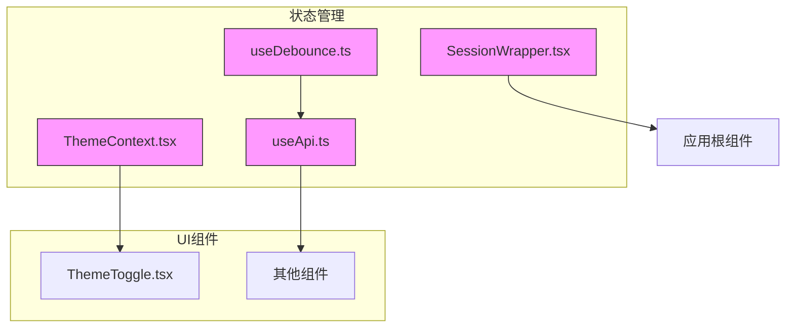
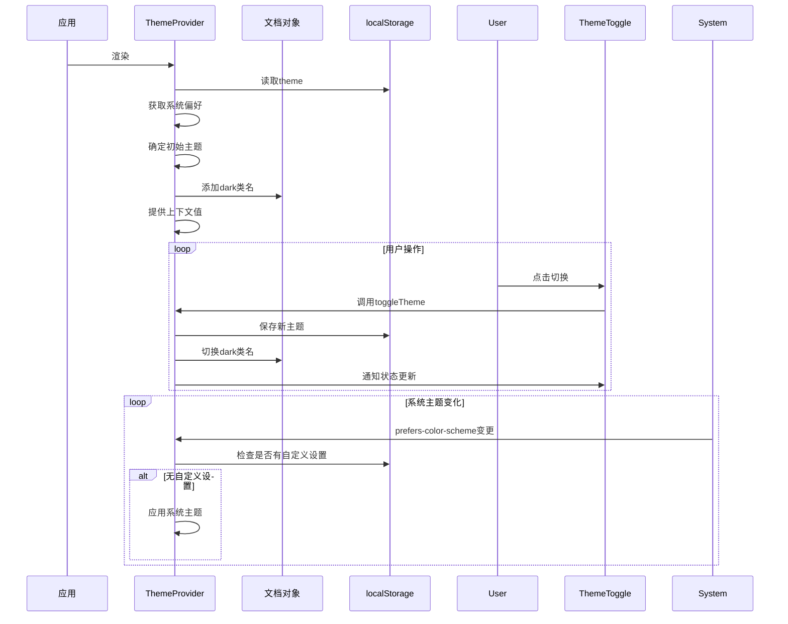
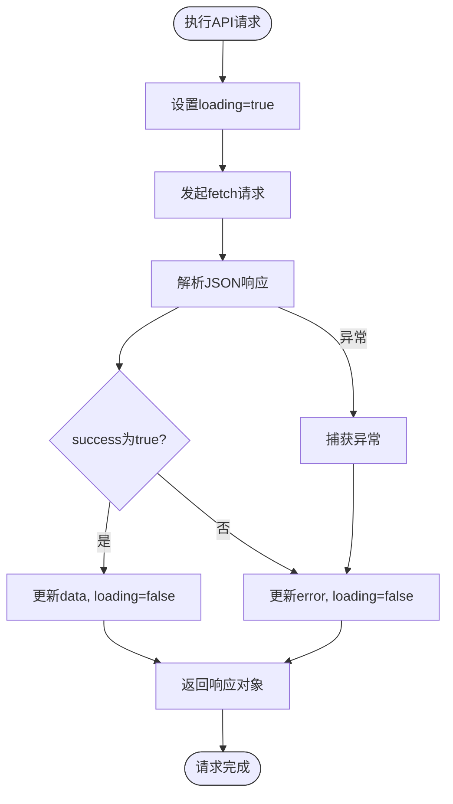
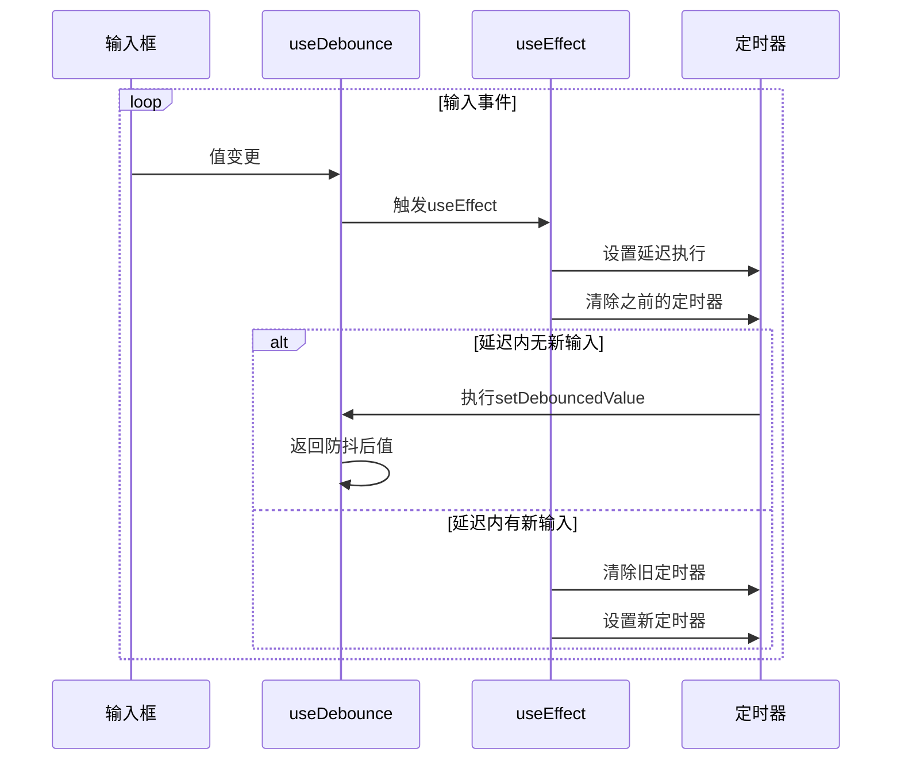
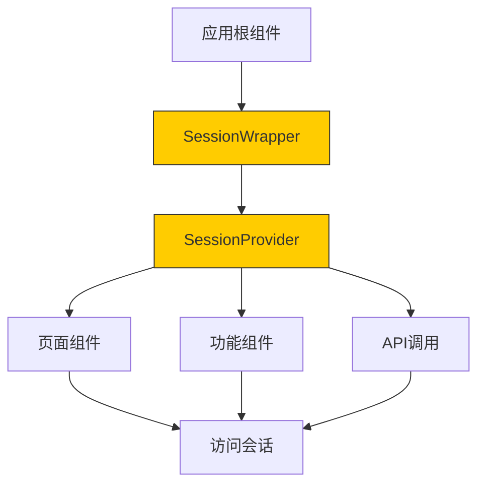
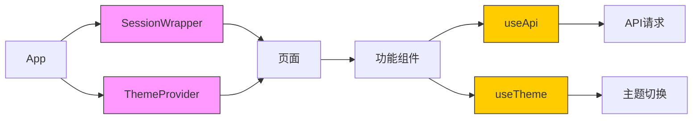

# 状态管理

<cite>
**本文档引用的文件**
- [ThemeContext.tsx](file://src/contexts/ThemeContext.tsx)
- [useApi.ts](file://src/hooks/useApi.ts)
- [useDebounce.ts](file://src/hooks/useDebounce.ts)
- [SessionWrapper.tsx](file://src/components/SessionWrapper.tsx)
- [ThemeToggle.tsx](file://src/components/ThemeToggle.tsx)
</cite>

## 目录
1. [项目结构](#项目结构)
2. [核心状态管理方案](#核心状态管理方案)
3. [主题状态管理机制](#主题状态管理机制)
4. [API请求状态封装](#api请求状态封装)
5. [防抖逻辑与性能优化](#防抖逻辑与性能优化)
6. [用户会话一致性保障](#用户会话一致性保障)
7. [跨组件状态传递路径](#跨组件状态传递路径)
8. [总结](#总结)

## 项目结构

本项目采用模块化结构，将状态管理相关逻辑集中于特定目录中。核心状态管理功能分布在`src/contexts`和`src/hooks`目录下，分别负责上下文状态管理和通用逻辑封装。

**图示来源**
- [ThemeContext.tsx](file://src/contexts/ThemeContext.tsx)
- [useApi.ts](file://src/hooks/useApi.ts)
- [useDebounce.ts](file://src/hooks/useDebounce.ts)
- [SessionWrapper.tsx](file://src/components/SessionWrapper.tsx)
- [ThemeToggle.tsx](file://src/components/ThemeToggle.tsx)

**本节来源**
- [src/contexts](file://src/contexts)
- [src/hooks](file://src/hooks)
- [src/components](file://src/components)

## 核心状态管理方案

本项目采用多层次状态管理架构，结合React Context、自定义Hook和第三方认证库，实现主题、认证、API请求等多维度状态的高效管理。通过`ThemeProvider`提供主题上下文，`useApi`封装通用请求逻辑，`useDebounce`优化高频操作，`SessionWrapper`集成认证会话，形成完整的状态管理体系。

**本节来源**
- [ThemeContext.tsx](file://src/contexts/ThemeContext.tsx#L1-L77)
- [useApi.ts](file://src/hooks/useApi.ts#L1-L85)
- [useDebounce.ts](file://src/hooks/useDebounce.ts#L1-L16)
- [SessionWrapper.tsx](file://src/components/SessionWrapper.tsx#L1-L15)

## 主题状态管理机制

`ThemeContext`通过React Context实现主题状态的全局管理。`ThemeProvider`组件在初始化时读取localStorage中的主题设置，若无则根据系统偏好自动选择。状态变更时同步更新DOM类名和存储，确保页面样式即时响应。

**图示来源**
- [ThemeContext.tsx](file://src/contexts/ThemeContext.tsx#L15-L77)
- [ThemeToggle.tsx](file://src/components/ThemeToggle.tsx#L10-L39)

**本节来源**
- [ThemeContext.tsx](file://src/contexts/ThemeContext.tsx#L1-L77)
- [ThemeToggle.tsx](file://src/components/ThemeToggle.tsx#L1-L39)

## API请求状态封装

`useApi`自定义Hook封装了API请求的完整生命周期管理，包括加载状态、数据存储和错误处理。通过泛型支持不同类型响应数据，返回状态对象和执行函数，简化组件中的异步操作处理。

**图示来源**
- [useApi.ts](file://src/hooks/useApi.ts#L19-L85)

**本节来源**
- [useApi.ts](file://src/hooks/useApi.ts#L1-L85)

## 防抖逻辑与性能优化

`useDebounce`Hook通过setTimeout实现防抖机制，有效减少高频状态变更带来的性能开销。在搜索、输入等场景中，可避免不必要的重复请求，提升应用响应速度和用户体验。

**图示来源**
- [useDebounce.ts](file://src/hooks/useDebounce.ts#L2-L16)

**本节来源**
- [useDebounce.ts](file://src/hooks/useDebounce.ts#L1-L16)

## 用户会话一致性保障

`SessionWrapper`组件封装了NextAuth的SessionProvider，为整个应用提供统一的认证会话上下文。通过包裹应用根组件，确保所有子组件都能访问到最新的用户会话状态，实现跨页面的会话一致性。

**图示来源**
- [SessionWrapper.tsx](file://src/components/SessionWrapper.tsx#L9-L15)

**本节来源**
- [SessionWrapper.tsx](file://src/components/SessionWrapper.tsx#L1-L15)

## 跨组件状态传递路径

项目中的状态通过多层机制在组件间传递：主题状态通过Context全局共享，API状态通过Hook在组件内管理，认证状态由SessionProvider统一提供。这种分层架构既保证了状态的一致性，又避免了过度的全局状态污染。

**图示来源**
- [ThemeContext.tsx](file://src/contexts/ThemeContext.tsx)
- [useApi.ts](file://src/hooks/useApi.ts)
- [SessionWrapper.tsx](file://src/components/SessionWrapper.tsx)

**本节来源**
- [ThemeContext.tsx](file://src/contexts/ThemeContext.tsx#L1-L77)
- [useApi.ts](file://src/hooks/useApi.ts#L1-L85)
- [SessionWrapper.tsx](file://src/components/SessionWrapper.tsx#L1-L15)

## 总结

本项目通过React Context、自定义Hook和第三方库的有机结合，构建了高效、可维护的状态管理体系。`ThemeContext`实现了主题的持久化和响应式切换，`useApi`统一了API请求处理逻辑，`useDebounce`优化了高频操作性能，`SessionWrapper`保障了用户会话的一致性。这些方案共同支撑起应用的核心功能，为用户提供流畅的交互体验。