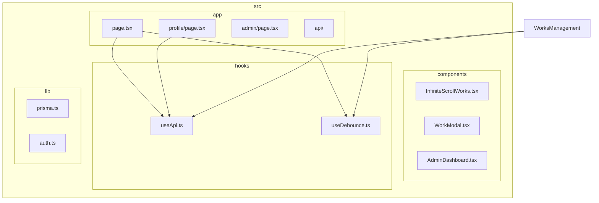
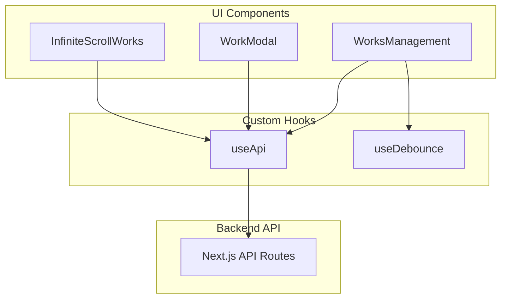
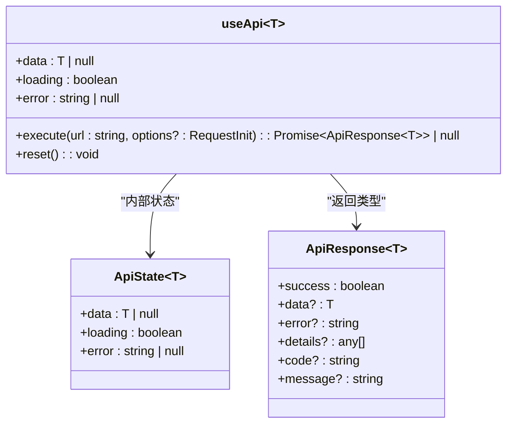
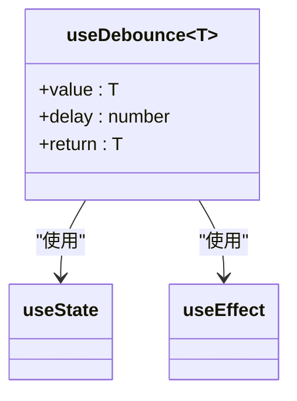
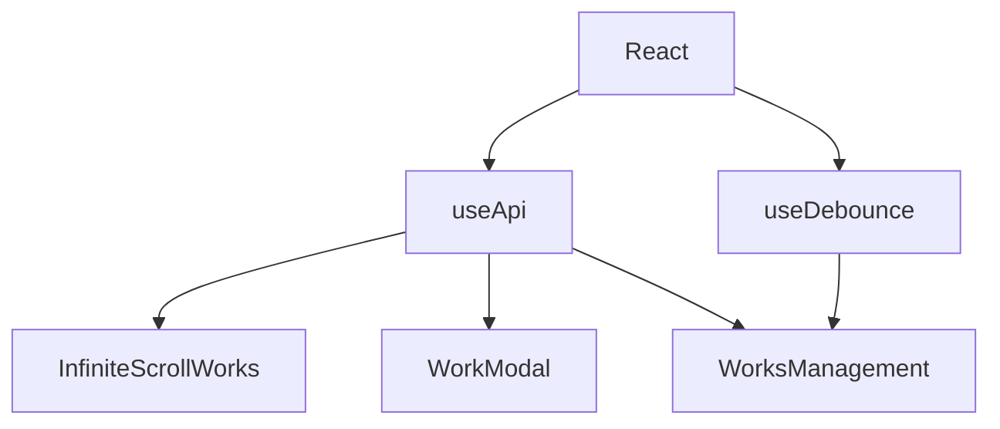

# 自定义 Hook 状态封装

<cite>
**本文档引用的文件**   
- [useApi.ts](file://src/hooks/useApi.ts)
- [useDebounce.ts](file://src/hooks/useDebounce.ts)
- [InfiniteScrollWorks.tsx](file://src/components/InfiniteScrollWorks.tsx)
- [WorkModal.tsx](file://src/components/WorkModal.tsx)
- [page.tsx](file://src/app/page.tsx)
- [profile/page.tsx](file://src/app/profile/page.tsx)
- [WorksManagement.tsx](file://src/components/admin/WorksManagement.tsx)
</cite>

## 目录
1. [引言](#引言)
2. [项目结构](#项目结构)
3. [核心组件](#核心组件)
4. [架构概述](#架构概述)
5. [详细组件分析](#详细组件分析)
6. [依赖分析](#依赖分析)
7. [性能考虑](#性能考虑)
8. [故障排除指南](#故障排除指南)
9. [结论](#结论)

## 引言
本文档深入解析项目中自定义 Hook 的设计与实现，重点分析 `useApi.ts` 如何封装通用的 API 请求状态管理，包括 loading、error、data 三态控制及 execute 异步执行函数的实现机制。详细说明 `useDebounce.ts` 中利用 `useEffect` 和 `setTimeout` 实现防抖的原理，及其在搜索输入、频繁请求等场景下的性能优化作用。结合实际调用案例（如作品列表加载、用户信息获取）展示这些 Hook 如何在组件中复用并简化状态逻辑。文档涵盖 Hook 的类型泛型设计、错误处理策略、与 React 生命周期的协同、以及如何避免闭包陷阱和内存泄漏等常见问题。

## 项目结构
项目采用 Next.js 15 架构，遵循标准的分层组织模式。核心功能模块包括：`app` 目录下的页面路由、`components` 中的 UI 组件、`hooks` 中的状态逻辑封装、`lib` 中的工具函数与配置、`types` 中的类型定义以及 `prisma` 中的数据库模型与迁移。

**图表来源**
- [useApi.ts](file://src/hooks/useApi.ts#L1-L85)
- [useDebounce.ts](file://src/hooks/useDebounce.ts#L1-L16)
- [page.tsx](file://src/app/page.tsx#L1-L387)
- [profile/page.tsx](file://src/app/profile/page.tsx#L1-L626)
- [WorksManagement.tsx](file://src/components/admin/WorksManagement.tsx#L1-L783)

**章节来源**
- [src/hooks](file://src/hooks)
- [src/app](file://src/app)
- [src/components](file://src/components)

## 核心组件
本项目的核心状态管理由两个自定义 Hook 驱动：`useApi` 和 `useDebounce`。`useApi` 封装了所有 API 请求的通用状态（数据、加载中、错误）和执行逻辑，实现了对 `fetch` 的统一包装与错误处理。`useDebounce` 则通过 `useEffect` 和 `setTimeout` 实现了值的防抖，有效控制了因频繁状态变化（如搜索输入）导致的性能问题和不必要的网络请求。这两个 Hook 被广泛应用于 `InfiniteScrollWorks`、`WorkModal`、`WorksManagement` 等组件中，极大地提升了代码的复用性和可维护性。

**章节来源**
- [useApi.ts](file://src/hooks/useApi.ts#L19-L85)
- [useDebounce.ts](file://src/hooks/useDebounce.ts#L2-L16)

## 架构概述
系统的前端架构以 React 和 Next.js 为核心，采用客户端组件模式。状态管理分为两层：全局状态由 NextAuth 管理用户会话，而局部状态则通过自定义 Hook 进行精细化控制。`useApi` Hook 作为数据获取的统一入口，负责与后端 API 交互，并将结果以结构化的状态（data, loading, error）暴露给组件。`useDebounce` Hook 作为性能优化工具，被集成在需要响应式输入的组件中。这种分层设计使得业务逻辑与 UI 逻辑清晰分离，同时通过 Hook 的复用，避免了状态逻辑的重复编写。

**图表来源**
- [useApi.ts](file://src/hooks/useApi.ts#L19-L85)
- [useDebounce.ts](file://src/hooks/useDebounce.ts#L2-L16)
- [InfiniteScrollWorks.tsx](file://src/components/InfiniteScrollWorks.tsx#L1-L268)
- [WorkModal.tsx](file://src/components/WorkModal.tsx#L1-L309)
- [WorksManagement.tsx](file://src/components/admin/WorksManagement.tsx#L1-L783)

## 详细组件分析
本节将深入分析 `useApi` 和 `useDebounce` 两个核心 Hook 的实现细节、使用方式及最佳实践。

### useApi Hook 分析
`useApi` 是一个泛型 Hook，用于封装所有 API 请求的三态管理（数据、加载、错误）和执行逻辑。

#### 类图

**图表来源**
- [useApi.ts](file://src/hooks/useApi.ts#L1-L85)

#### 实现机制
`useApi` 使用 `useState` 维护一个包含 `data`、`loading` 和 `error` 的状态对象。其核心是 `execute` 函数，该函数被 `useCallback` 包裹以避免在组件重渲染时重新创建。当 `execute` 被调用时，它首先更新状态为 `loading: true` 并清空 `error`。随后，它发起 `fetch` 请求，并在 `try...catch` 块中处理响应。如果请求成功，它会解析 JSON 响应，并根据响应中的 `success` 字段来决定是更新 `data` 还是设置 `error`。无论成功与否，`execute` 函数都会返回完整的响应对象，以便调用者进行更精细的错误处理。`reset` 函数用于将状态重置为初始值。

**章节来源**
- [useApi.ts](file://src/hooks/useApi.ts#L19-L85)

### useDebounce Hook 分析
`useDebounce` 是一个用于实现值防抖的 Hook，常用于搜索框等需要延迟响应用户输入的场景。

#### 类图

**图表来源**
- [useDebounce.ts](file://src/hooks/useDebounce.ts#L2-L16)

#### 实现原理
`useDebounce` 的实现基于 `useState` 和 `useEffect`。它接收一个 `value` 和一个 `delay`（毫秒）。内部使用 `useState` 创建一个 `debouncedValue` 状态。`useEffect` 的依赖项为 `[value, delay]`，这意味着每当 `value` 或 `delay` 发生变化时，该 effect 都会执行。在 effect 内部，它设置一个 `setTimeout`，在 `delay` 毫秒后将 `debouncedValue` 更新为当前的 `value`。关键的清理函数 `return () => clearTimeout(handler);` 确保了在下一次 effect 执行前，上一次的定时器会被清除。这样，如果 `value` 在 `delay` 时间内再次发生变化，旧的定时器会被取消，只有最后一次变化会触发 `debouncedValue` 的更新，从而实现了防抖。

**章节来源**
- [useDebounce.ts](file://src/hooks/useDebounce.ts#L2-L16)

### 实际调用案例分析
本节通过具体组件的使用，展示这两个 Hook 如何在实际开发中简化状态逻辑。

#### 作品列表加载（InfiniteScrollWorks）
在 `InfiniteScrollWorks` 组件中，`useApi` 被用于加载分页的作品数据。组件通过 `const { data, loading, error, execute } = useApi<WorksApiResponse>();` 获取状态和执行函数。当需要加载新页面时，组件调用 `execute('/api/works?page=...')`。组件的 UI 根据 `loading` 状态显示加载动画，根据 `error` 状态显示错误提示，根据 `data` 状态渲染作品列表。这使得数据加载的逻辑非常简洁，无需在组件内手动管理 `setLoading`、`setData` 等繁琐的状态操作。

**章节来源**
- [InfiniteScrollWorks.tsx](file://src/components/InfiniteScrollWorks.tsx#L1-L268)
- [useApi.ts](file://src/hooks/useApi.ts#L19-L85)

#### 搜索输入防抖（WorksManagement）
在管理员的 `WorksManagement` 组件中，`useDebounce` 被用于处理搜索输入框。用户的输入被绑定到 `searchTerm` 状态，而 `debouncedSearchTerm = useDebounce(searchTerm, 500)` 则提供了一个防抖后的值。组件的 `loadWorks` 函数使用 `debouncedSearchTerm` 作为搜索参数。这样，当用户快速输入时，不会立即触发 API 请求，只有在用户停止输入 500 毫秒后，才会用最新的搜索词去请求数据，有效减少了不必要的网络请求，提升了性能和用户体验。

**章节来源**
- [WorksManagement.tsx](file://src/components/admin/WorksManagement.tsx#L1-L783)
- [useDebounce.ts](file://src/hooks/useDebounce.ts#L2-L16)

#### 用户信息获取（profile/page.tsx）
在用户个人中心页面，`useApi` 被多次使用。组件通过 `const { execute } = useApi<UserProfile>();` 获取执行函数，并在 `loadProfile` 函数中调用 `execute('/api/user/profile')` 来获取用户信息。同样，它使用另一个 `useApi` 实例来加载用户的作品列表。这展示了 `useApi` 的复用性，同一个 Hook 可以用于不同类型的 API 请求，只需通过泛型指定返回的数据类型。

**章节来源**
- [profile/page.tsx](file://src/app/profile/page.tsx#L1-L626)
- [useApi.ts](file://src/hooks/useApi.ts#L19-L85)

## 依赖分析
项目依赖关系清晰，自定义 Hook 作为独立的逻辑单元，被上层 UI 组件所依赖。`useApi` 依赖于 React 的 `useState` 和 `useCallback`，而 `useDebounce` 依赖于 `useState` 和 `useEffect`。UI 组件如 `InfiniteScrollWorks`、`WorkModal` 和 `WorksManagement` 则直接依赖于这两个 Hook。这种依赖关系确保了状态逻辑的集中管理和复用，避免了在多个组件中重复编写相似的请求和防抖代码。

**图表来源**
- [useApi.ts](file://src/hooks/useApi.ts#L1-L85)
- [useDebounce.ts](file://src/hooks/useDebounce.ts#L1-L16)
- [InfiniteScrollWorks.tsx](file://src/components/InfiniteScrollWorks.tsx#L1-L268)
- [WorkModal.tsx](file://src/components/WorkModal.tsx#L1-L309)
- [WorksManagement.tsx](file://src/components/admin/WorksManagement.tsx#L1-L783)

**章节来源**
- [src/hooks](file://src/hooks)
- [src/components](file://src/components)

## 性能考虑
`useDebounce` Hook 是性能优化的关键。它通过延迟对频繁变化状态的响应，显著减少了 `useEffect` 的执行次数和 API 请求的频率。在 `WorksManagement` 组件中，如果没有防抖，每次用户输入都会触发一次 API 调用，这在用户快速打字时会产生大量无用的请求。通过防抖，系统只在用户输入暂停后才发起请求，大大降低了服务器负载和网络开销。此外，`useApi` 中的 `useCallback` 确保了 `execute` 函数的引用稳定，避免了因函数引用变化导致的子组件不必要的重渲染。

## 故障排除指南
在使用这些 Hook 时，可能会遇到一些常见问题。

1.  **`useApi` 请求未触发**：检查 `execute` 函数是否被正确调用。确保 `useCallback` 的依赖项正确，避免因依赖项问题导致函数未更新。
2.  **`useDebounce` 未生效**：检查 `useEffect` 的依赖项是否包含了 `value` 和 `delay`。如果依赖项不完整，effect 可能不会在预期时执行。
3.  **内存泄漏**：`useDebounce` 中的 `useEffect` 清理函数至关重要。它确保了在组件卸载或 `value` 快速变化时，过期的 `setTimeout` 会被清除，防止了在已卸载的组件上设置状态，从而避免内存泄漏。
4.  **闭包陷阱**：在 `useDebounce` 中，`setTimeout` 回调函数捕获的是 `value` 的快照。由于 `useEffect` 的清理机制，这确保了最终更新的是最新的 `value`，避免了因异步操作导致的旧值问题。

**章节来源**
- [useDebounce.ts](file://src/hooks/useDebounce.ts#L2-L16)
- [useApi.ts](file://src/hooks/useApi.ts#L19-L85)

## 结论
`useApi` 和 `useDebounce` 两个自定义 Hook 是本项目前端状态管理的基石。`useApi` 通过封装 API 请求的三态和执行逻辑，提供了简洁、一致的数据获取接口，极大地简化了组件的状态管理。`useDebounce` 则通过 `useEffect` 的清理机制，优雅地实现了防抖功能，有效优化了性能。两者结合，不仅提高了代码的复用性和可维护性，还增强了应用的健壮性和用户体验。这种将通用逻辑抽象为 Hook 的设计模式，是现代 React 应用开发的最佳实践。