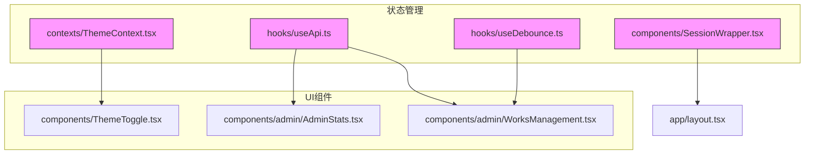
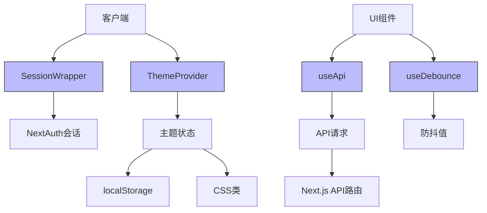
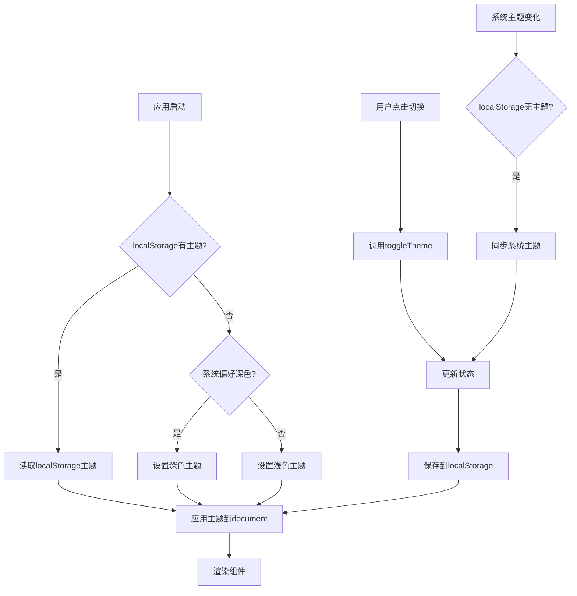
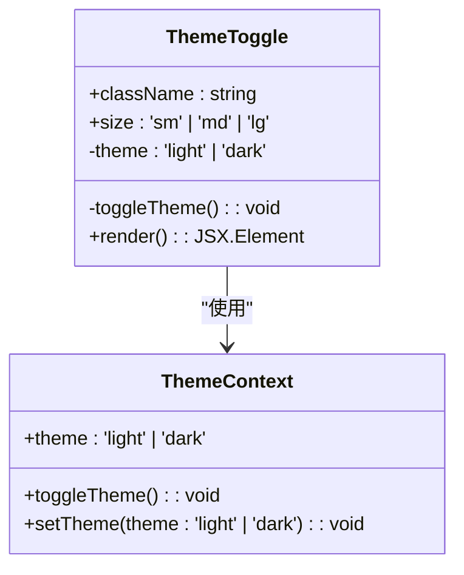
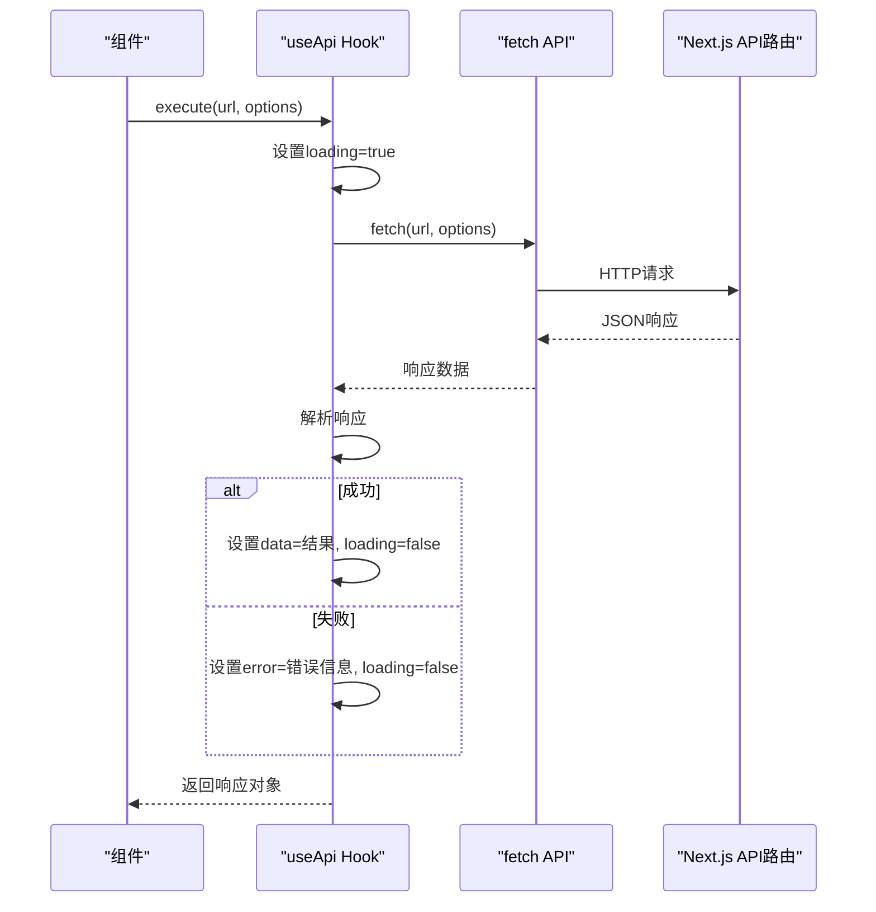
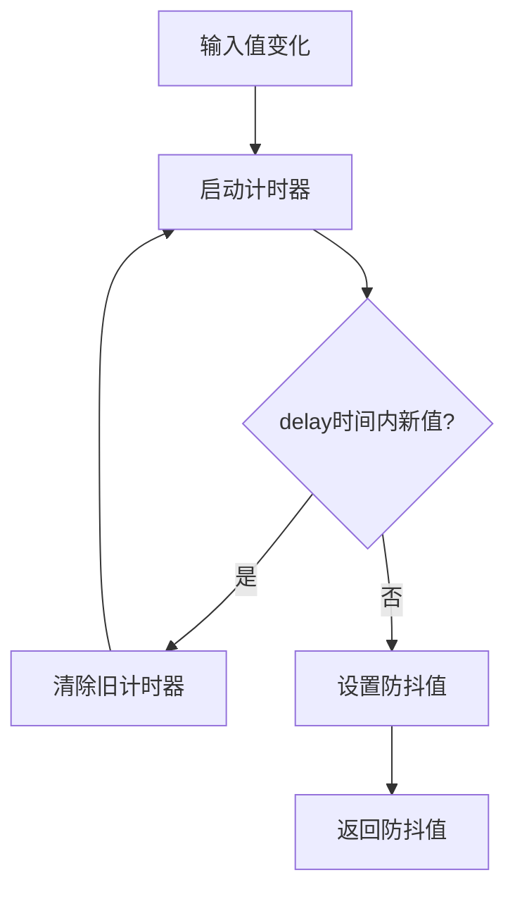
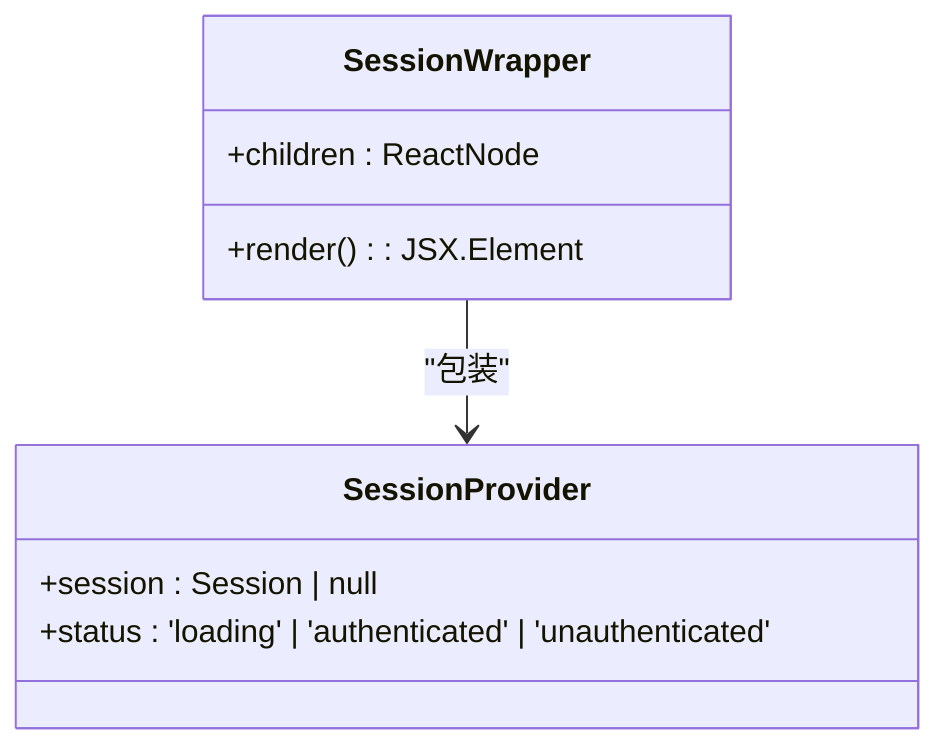
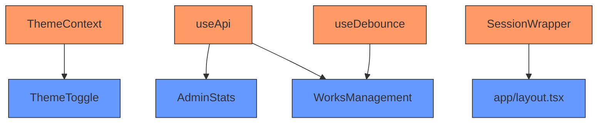

# 状态管理机制

<cite>
**本文档引用的文件**
- [ThemeContext.tsx](file://src/contexts/ThemeContext.tsx)
- [useApi.ts](file://src/hooks/useApi.ts)
- [useDebounce.ts](file://src/hooks/useDebounce.ts)
- [SessionWrapper.tsx](file://src/components/SessionWrapper.tsx)
- [ThemeToggle.tsx](file://src/components/ThemeToggle.tsx)
- [AdminStats.tsx](file://src/components/admin/AdminStats.tsx)
- [WorksManagement.tsx](file://src/components/admin/WorksManagement.tsx)
</cite>

## 目录
1. [简介](#简介)
2. [项目结构](#项目结构)
3. [核心组件](#核心组件)
4. [架构概览](#架构概览)
5. [详细组件分析](#详细组件分析)
6. [依赖分析](#依赖分析)
7. [性能考虑](#性能考虑)
8. [故障排除指南](#故障排除指南)
9. [结论](#结论)

## 简介
本文档全面解析数字化作品互动展示平台的前端状态管理机制。重点阐述React Context（ThemeContext）与自定义Hook（useApi、useDebounce）的协同工作机制，以及SessionWrapper如何通过NextAuth.js管理会话状态。文档涵盖主题切换持久化、API请求封装、防抖优化和权限控制等核心功能的设计与实现。

## 项目结构
项目采用标准的Next.js应用结构，状态管理相关代码集中于`src/contexts`和`src/hooks`目录。`src/components`包含使用这些状态管理机制的UI组件。

**图示来源**
- [ThemeContext.tsx](file://src/contexts/ThemeContext.tsx#L1-L77)
- [useApi.ts](file://src/hooks/useApi.ts#L1-L85)
- [useDebounce.ts](file://src/hooks/useDebounce.ts#L1-L16)
- [SessionWrapper.tsx](file://src/components/SessionWrapper.tsx#L1-L15)
- [ThemeToggle.tsx](file://src/components/ThemeToggle.tsx#L1-L74)
- [AdminStats.tsx](file://src/components/admin/AdminStats.tsx#L1-L174)
- [WorksManagement.tsx](file://src/components/admin/WorksManagement.tsx#L1-L570)

**本节来源**
- [src/contexts/ThemeContext.tsx](file://src/contexts/ThemeContext.tsx)
- [src/hooks/useApi.ts](file://src/hooks/useApi.ts)
- [src/hooks/useDebounce.ts](file://src/hooks/useDebounce.ts)
- [src/components/SessionWrapper.tsx](file://src/components/SessionWrapper.tsx)

## 核心组件
本项目的核心状态管理由四个关键组件构成：ThemeContext提供主题状态管理，useApi封装API请求逻辑，useDebounce优化输入处理，SessionWrapper集成认证会话。这些组件协同工作，为应用提供一致、高效的状态管理解决方案。

**本节来源**
- [ThemeContext.tsx](file://src/contexts/ThemeContext.tsx#L1-L77)
- [useApi.ts](file://src/hooks/useApi.ts#L1-L85)
- [useDebounce.ts](file://src/hooks/useDebounce.ts#L1-L16)
- [SessionWrapper.tsx](file://src/components/SessionWrapper.tsx#L1-L15)

## 架构概览
系统采用分层状态管理架构，将全局状态（主题、会话）与局部状态（API请求、输入防抖）分离。React Context用于跨组件共享主题和会话状态，自定义Hook封装可复用的逻辑。

**图示来源**
- [SessionWrapper.tsx](file://src/components/SessionWrapper.tsx#L9-L15)
- [ThemeContext.tsx](file://src/contexts/ThemeContext.tsx#L14-L69)
- [useApi.ts](file://src/hooks/useApi.ts#L19-L85)
- [useDebounce.ts](file://src/hooks/useDebounce.ts#L2-L16)

## 详细组件分析
### ThemeContext分析
ThemeContext组件实现了一个完整的主题管理系统，支持用户手动切换和系统偏好同步，并将选择持久化到localStorage。

#### 主题状态流图

**图示来源**
- [ThemeContext.tsx](file://src/contexts/ThemeContext.tsx#L14-L69)

#### 主题切换组件

**图示来源**
- [ThemeToggle.tsx](file://src/components/ThemeToggle.tsx#L1-L74)
- [ThemeContext.tsx](file://src/contexts/ThemeContext.tsx#L71-L77)

**本节来源**
- [ThemeContext.tsx](file://src/contexts/ThemeContext.tsx#L1-L77)
- [ThemeToggle.tsx](file://src/components/ThemeToggle.tsx#L1-L74)

### useApi分析
useApi Hook提供了一套完整的API请求管理方案，封装了加载状态、错误处理和响应解析。

#### API请求序列图

**图示来源**
- [useApi.ts](file://src/hooks/useApi.ts#L19-L85)
- [AdminStats.tsx](file://src/components/admin/AdminStats.tsx#L28-L46)
- [WorksManagement.tsx](file://src/components/admin/WorksManagement.tsx#L28-L570)

**本节来源**
- [useApi.ts](file://src/hooks/useApi.ts#L1-L85)
- [AdminStats.tsx](file://src/components/admin/AdminStats.tsx#L1-L174)
- [WorksManagement.tsx](file://src/components/admin/WorksManagement.tsx#L1-L570)

### useDebounce分析
useDebounce Hook通过延迟状态更新来优化频繁触发的事件处理，特别适用于搜索和输入场景。

#### 防抖逻辑流程图

**图示来源**
- [useDebounce.ts](file://src/hooks/useDebounce.ts#L2-L16)
- [WorksManagement.tsx](file://src/components/admin/WorksManagement.tsx#L28-L570)

**本节来源**
- [useDebounce.ts](file://src/hooks/useDebounce.ts#L1-L16)
- [WorksManagement.tsx](file://src/components/admin/WorksManagement.tsx#L1-L570)

### SessionWrapper分析
SessionWrapper组件封装NextAuth.js的SessionProvider，为整个应用提供认证会话上下文。

**图示来源**
- [SessionWrapper.tsx](file://src/components/SessionWrapper.tsx#L9-L15)

**本节来源**
- [SessionWrapper.tsx](file://src/components/SessionWrapper.tsx#L1-L15)

## 依赖分析
系统状态管理组件之间存在清晰的依赖关系，每个组件职责单一，通过标准的React模式进行通信。

**图示来源**
- [ThemeContext.tsx](file://src/contexts/ThemeContext.tsx#L1-L77)
- [useApi.ts](file://src/hooks/useApi.ts#L1-L85)
- [useDebounce.ts](file://src/hooks/useDebounce.ts#L1-L16)
- [SessionWrapper.tsx](file://src/components/SessionWrapper.tsx#L1-L15)
- [ThemeToggle.tsx](file://src/components/ThemeToggle.tsx#L1-L74)
- [AdminStats.tsx](file://src/components/admin/AdminStats.tsx#L1-L174)
- [WorksManagement.tsx](file://src/components/admin/WorksManagement.tsx#L1-L570)

## 性能考虑
### 避免过度重渲染
- **ThemeContext**: 使用`useContext`和`useState`的组合，确保只有主题相关的组件会重新渲染。
- **useApi**: `execute`函数使用`useCallback`缓存，避免不必要的函数重建。
- **useDebounce**: 通过延迟状态更新，显著减少因频繁输入导致的渲染次数。

### 优化建议
1. 对于大型列表组件，考虑使用React.memo进行组件记忆化
2. 在useApi中，可以添加响应缓存机制避免重复请求
3. 对于复杂的主题切换动画，可以使用CSS transition而非JavaScript控制

**本节来源**
- [ThemeContext.tsx](file://src/contexts/ThemeContext.tsx#L1-L77)
- [useApi.ts](file://src/hooks/useApi.ts#L1-L85)
- [useDebounce.ts](file://src/hooks/useDebounce.ts#L1-L16)

## 故障排除指南
### 常见问题及解决方案
| 问题现象 | 可能原因 | 解决方案 |
|--------|--------|--------|
| 主题切换后未持久化 | localStorage写入失败 | 检查浏览器隐私设置，确保localStorage可用 |
| Context未更新 | 组件未在Provider内 | 确保组件树在相应的Context Provider内部 |
| Hook依赖遗漏 | useEffect依赖数组不完整 | 使用ESLint的react-hooks插件检查依赖 |
| API请求失败 | 认证令牌过期 | 实现JWT自动刷新机制 |
| 防抖无效 | 延迟时间设置过短 | 调整delay参数至300-500ms |

### 调试方法
1. **主题调试**: 在浏览器控制台检查`document.documentElement.classList`是否包含`dark`类
2. **API调试**: 使用`execute`返回的完整响应对象进行错误分析
3. **防抖调试**: 在`useEffect`中添加console.log观察值的变化时机
4. **会话调试**: 检查`SessionProvider`是否正确包裹了需要认证的组件

**本节来源**
- [ThemeContext.tsx](file://src/contexts/ThemeContext.tsx#L1-L77)
- [useApi.ts](file://src/hooks/useApi.ts#L1-L85)
- [useDebounce.ts](file://src/hooks/useDebounce.ts#L1-L16)
- [SessionWrapper.tsx](file://src/components/SessionWrapper.tsx#L1-L15)

## 结论
本项目实现了完整且高效的状态管理方案。ThemeContext提供了优雅的主题切换和持久化体验，useApi封装了健壮的API交互逻辑，useDebounce优化了用户输入体验，SessionWrapper集成了安全的认证机制。这些组件共同构成了应用的稳定基础，既保证了功能完整性，又兼顾了性能和可维护性。建议在后续开发中保持这种职责分离的设计模式，并根据需要扩展更多自定义Hook以提高代码复用性。