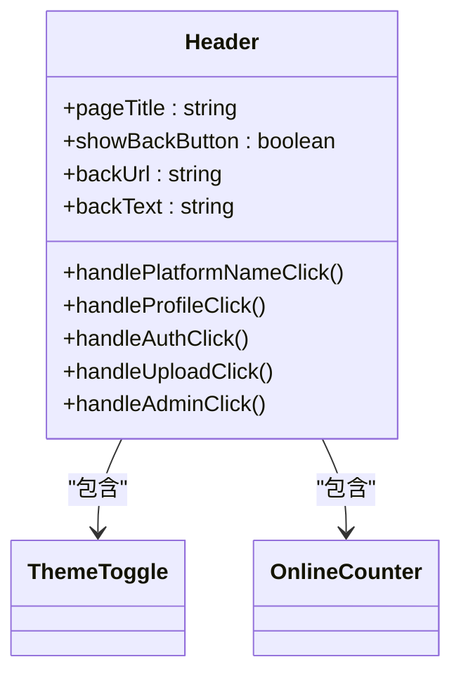
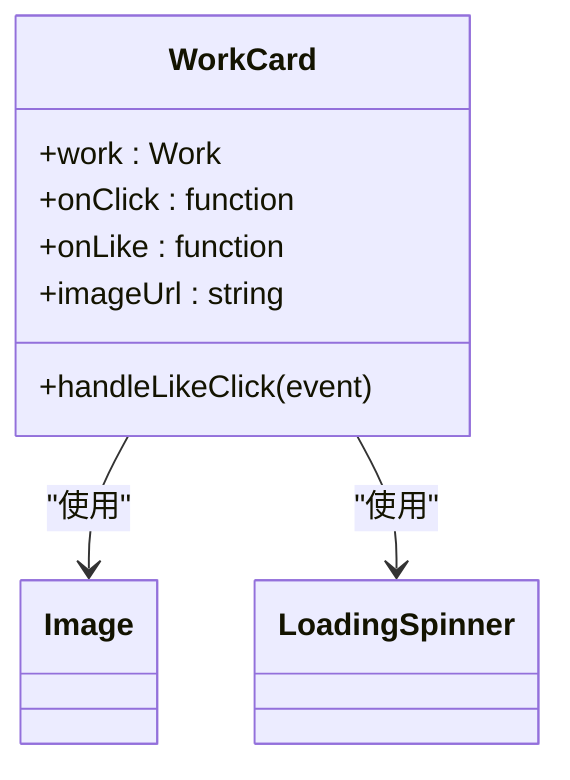
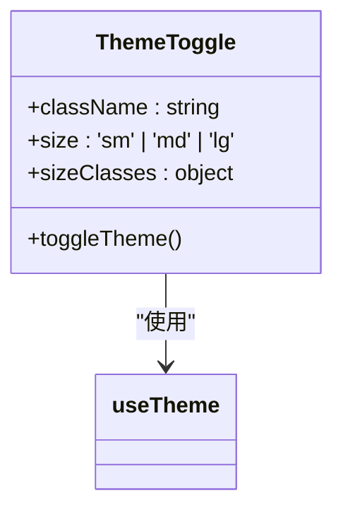
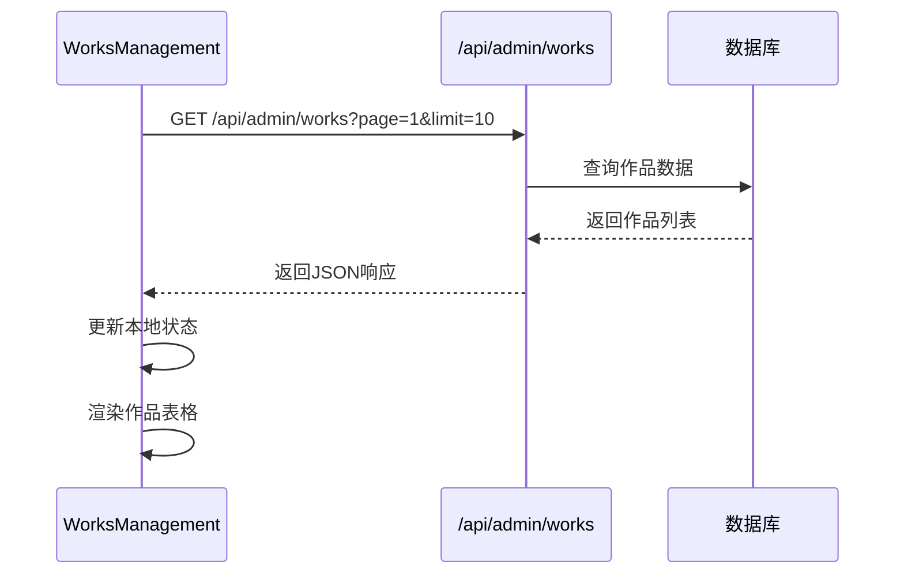
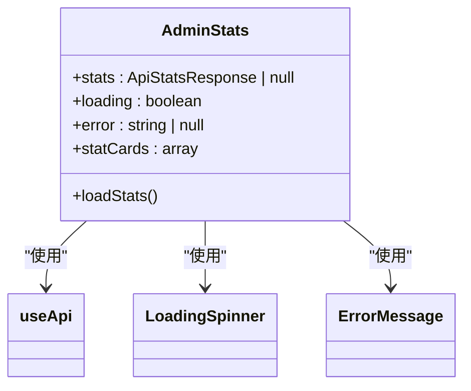
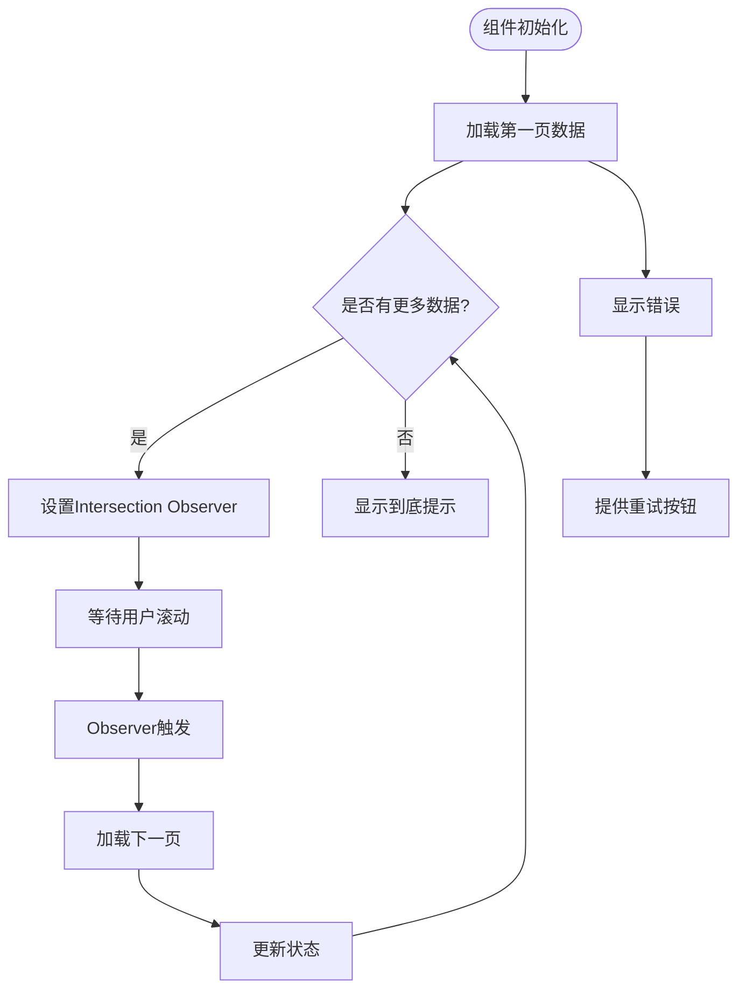
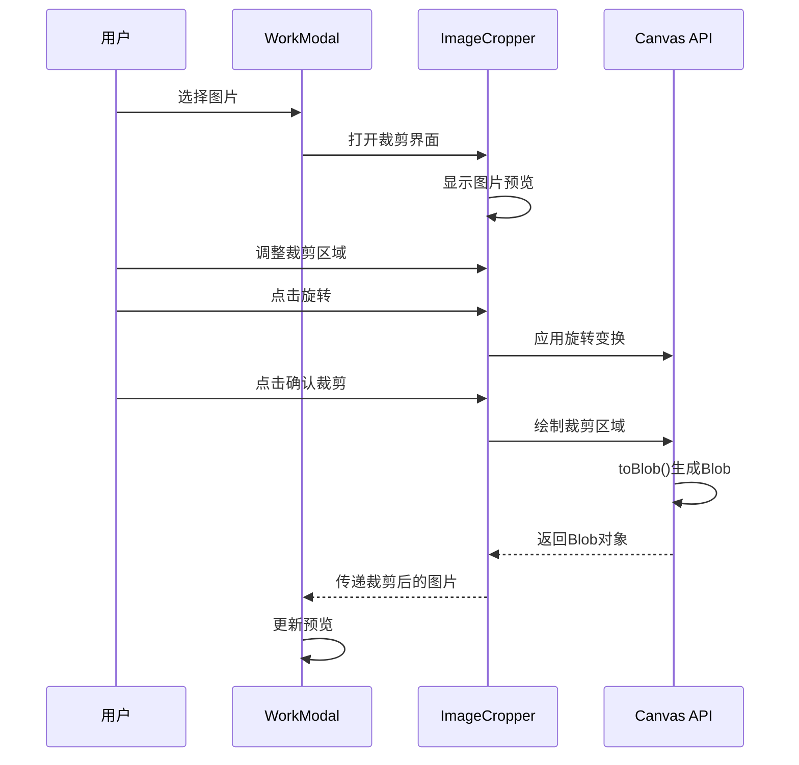

# 组件体系

<cite>
**本文档引用的文件**   
- [Header.tsx](file://src/components/Header.tsx)
- [WorkCard.tsx](file://src/components/WorkCard.tsx)
- [ThemeToggle.tsx](file://src/components/ThemeToggle.tsx)
- [WorksManagement.tsx](file://src/components/admin/WorksManagement.tsx)
- [AdminStats.tsx](file://src/components/admin/AdminStats.tsx)
- [InfiniteScrollWorks.tsx](file://src/components/InfiniteScrollWorks.tsx)
- [WorkModal.tsx](file://src/components/WorkModal.tsx)
- [ImageCropper.tsx](file://src/components/ImageCropper.tsx)
</cite>

## 目录
1. [通用UI组件](#通用ui组件)
2. [管理后台专用组件](#管理后台专用组件)
3. [复杂组件实现](#复杂组件实现)
4. [组件交互流程](#组件交互流程)
5. [组件属性与事件](#组件属性与事件)
6. [常见问题与调试](#常见问题与调试)

## 通用UI组件

通用UI组件是前端架构中的基础构建块，设计用于在多个页面中复用，确保界面风格的一致性和开发效率。这些组件通过支持主题切换和响应式布局，为用户提供一致的视觉体验。

### Header组件

Header组件作为应用的全局导航栏，集成平台标题、页面标题和在线人数显示。它通过动态获取平台配置实现标题的可配置性，并提供用户身份验证、个人资料和上传功能的导航入口。组件支持响应式设计，在不同屏幕尺寸下保持良好的用户体验。

**Diagram sources**
- [Header.tsx](file://src/components/Header.tsx#L21-L115)

**Section sources**
- [Header.tsx](file://src/components/Header.tsx#L21-L115)

### WorkCard组件

WorkCard组件用于展示单个作品的缩略图和互动数据，是作品列表和网格视图的核心单元。组件通过`getImageUrl`函数处理图片URL，支持图片加载状态管理（加载中、加载失败）和懒加载优化。卡片包含作品名称、作者、点赞数和浏览量等信息，并通过`onLike`回调处理点赞交互。

**Diagram sources**
- [WorkCard.tsx](file://src/components/WorkCard.tsx#L7-L92)

**Section sources**
- [WorkCard.tsx](file://src/components/WorkCard.tsx#L7-L92)

### ThemeToggle组件

ThemeToggle组件实现浅色和深色模式的切换功能。组件通过`useTheme`钩子获取当前主题状态，并在点击时触发主题切换。按钮设计包含太阳和月亮图标，通过CSS过渡动画实现平滑的图标切换效果。组件支持不同尺寸（sm、md、lg），可灵活应用于不同场景。

**Diagram sources**
- [ThemeToggle.tsx](file://src/components/ThemeToggle.tsx#L10-L74)

**Section sources**
- [ThemeToggle.tsx](file://src/components/ThemeToggle.tsx#L10-L74)

## 管理后台专用组件

管理后台专用组件为管理员提供作品审核、数据统计和系统配置等功能，具有复杂的交互逻辑和与后端API的深度集成。

### WorksManagement组件

WorksManagement组件是作品管理的核心界面，提供作品列表展示、筛选、排序和批量操作功能。组件通过`useApi`钩子与`/api/admin/works`接口通信，支持分页加载和实时数据更新。管理员可以对作品执行审核（通过/拒绝）、设置精选状态和编辑作品信息等操作。

组件包含两个模态框：作品详情模态框和编辑模态框。详情模态框展示作品的完整信息，包括创作提示词和拒绝原因；编辑模态框允许管理员修改作品名称、作者和提示词。组件使用Zod库对API响应数据进行类型校验，确保数据安全。

**Diagram sources**
- [WorksManagement.tsx](file://src/components/admin/WorksManagement.tsx#L22-L782)

**Section sources**
- [WorksManagement.tsx](file://src/components/admin/WorksManagement.tsx#L22-L782)

### AdminStats组件

AdminStats组件展示平台的整体运营数据，包括作品和用户统计信息。组件通过`useApi`钩子调用`/api/admin/stats`接口获取统计数据，并以卡片网格的形式展示关键指标。每个统计卡片包含图标、标题和数值，使用`toLocaleString()`方法格式化大数字。

组件包含错误处理机制，当API调用失败时显示错误提示并提供重试功能。加载状态通过`LoadingSpinner`组件可视化，确保用户在数据加载期间有明确的反馈。

**Diagram sources**
- [AdminStats.tsx](file://src/components/admin/AdminStats.tsx#L28-L174)

**Section sources**
- [AdminStats.tsx](file://src/components/admin/AdminStats.tsx#L28-L174)

## 复杂组件实现

复杂组件通常包含高级功能和性能优化策略，解决特定的业务需求和技术挑战。

### InfiniteScrollWorks组件

InfiniteScrollWorks组件实现无限滚动加载功能，用于展示热门作品。组件通过Intersection Observer API监听加载指示器的可见性，当用户滚动到页面底部时自动加载下一页数据。为避免闭包问题，组件使用`useRef`存储状态的引用。

组件支持手动加载和自动加载两种模式，并通过`refreshTrigger`属性实现数据刷新。性能优化方面，组件使用`useDebounce`钩子防抖搜索输入，并通过`ref`避免重复请求。加载状态和错误处理机制确保用户体验的流畅性。

**Diagram sources**
- [InfiniteScrollWorks.tsx](file://src/components/InfiniteScrollWorks.tsx#L7-L267)

**Section sources**
- [InfiniteScrollWorks.tsx](file://src/components/InfiniteScrollWorks.tsx#L7-L267)

## 组件交互流程

组件交互流程描述了多个组件协同工作的机制，特别是在复杂业务场景下的数据流动和状态管理。

### WorkModal与ImageCropper协同工作流程

在作品上传预览场景中，WorkModal和ImageCropper组件协同工作，实现图像处理流程。用户选择图片后，ImageCropper组件提供裁剪界面，支持旋转和16:9比例裁剪。裁剪完成后，生成的Blob对象传递给WorkModal进行预览。

**Diagram sources**
- [WorkModal.tsx](file://src/components/WorkModal.tsx#L10-L308)
- [ImageCropper.tsx](file://src/components/ImageCropper.tsx#L40-L309)

**Section sources**
- [WorkModal.tsx](file://src/components/WorkModal.tsx#L10-L308)
- [ImageCropper.tsx](file://src/components/ImageCropper.tsx#L40-L309)

## 组件属性与事件

本节详细描述组件的props定义、事件回调、可访问性支持及Tailwind CSS样式定制方法。

### 组件Props定义

| 组件 | Props | 类型 | 默认值 | 描述 |
|------|------|------|--------|------|
| Header | pageTitle | string | undefined | 页面标题 |
| | showBackButton | boolean | false | 是否显示返回按钮 |
| | backUrl | string | '/' | 返回按钮链接 |
| | backText | string | '返回首页' | 返回按钮文本 |
| WorkCard | work | Work | required | 作品数据对象 |
| | onClick | function | undefined | 卡片点击回调 |
| | onLike | function | undefined | 点赞回调 |
| ThemeToggle | className | string | '' | 自定义CSS类 |
| | size | 'sm'&#124;'md'&#124;'lg' | 'md' | 按钮尺寸 |
| WorkModal | work | Work | undefined | 作品数据 |
| | isOpen | boolean | false | 模态框是否打开 |
| | onClose | function | required | 关闭回调 |
| | onLike | function | undefined | 点赞回调 |
| | onWorkUpdate | function | undefined | 作品更新回调 |

### 事件回调机制

组件通过回调函数实现父子组件间的通信。例如，WorkCard的`onLike`回调在用户点击点赞按钮时触发，父组件可以监听此事件更新作品的点赞数。WorkModal的`onWorkUpdate`回调在作品数据变更时（如点赞数增加）通知父组件同步状态。

### 可访问性支持

所有组件遵循可访问性最佳实践：
- 使用语义化HTML标签
- 提供适当的ARIA属性（如`aria-label`）
- 确保键盘导航支持
- 维护足够的颜色对比度
- 为图标提供文本替代

### Tailwind CSS样式定制

组件通过`className` prop支持Tailwind CSS样式定制。开发者可以传递自定义类名来覆盖默认样式，例如为ThemeToggle组件添加额外的边距或改变颜色主题。组件内部使用`dark:`前缀实现深色模式支持，确保在不同主题下都有良好的视觉效果。

**Section sources**
- [Header.tsx](file://src/components/Header.tsx#L21-L115)
- [WorkCard.tsx](file://src/components/WorkCard.tsx#L7-L92)
- [ThemeToggle.tsx](file://src/components/ThemeToggle.tsx#L10-L74)
- [WorkModal.tsx](file://src/components/WorkModal.tsx#L10-L308)

## 常见问题与调试

### 常见使用错误

1. **Header组件平台标题不更新**：确保`/api/platform-config`接口返回正确的数据结构
2. **WorkCard图片加载失败**：检查图片URL格式和OSS配置
3. **InfiniteScrollWorks不触发加载**：确认Intersection Observer的`rootMargin`设置正确
4. **ThemeToggle不生效**：检查`ThemeContext`是否正确提供

### 调试技巧

1. **使用浏览器开发者工具**：监控网络请求，确保API调用成功
2. **检查控制台错误**：关注JavaScript错误和警告信息
3. **验证数据结构**：使用Zod等工具校验API响应数据
4. **性能分析**：使用React DevTools检查不必要的重渲染
5. **状态调试**：在关键状态变化处添加`console.log`输出

**Section sources**
- [Header.tsx](file://src/components/Header.tsx#L21-L115)
- [WorkCard.tsx](file://src/components/WorkCard.tsx#L7-L92)
- [InfiniteScrollWorks.tsx](file://src/components/InfiniteScrollWorks.tsx#L7-L267)
- [ThemeToggle.tsx](file://src/components/ThemeToggle.tsx#L10-L74)