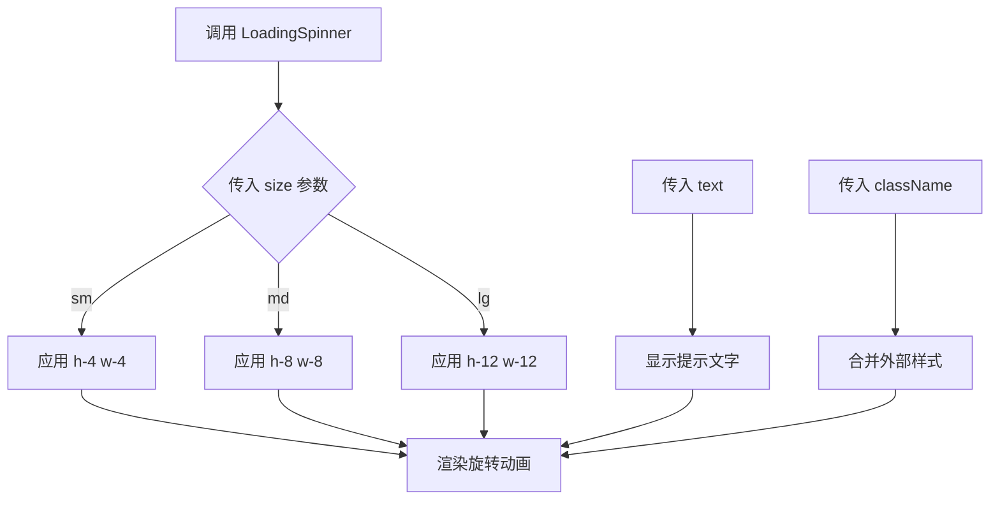
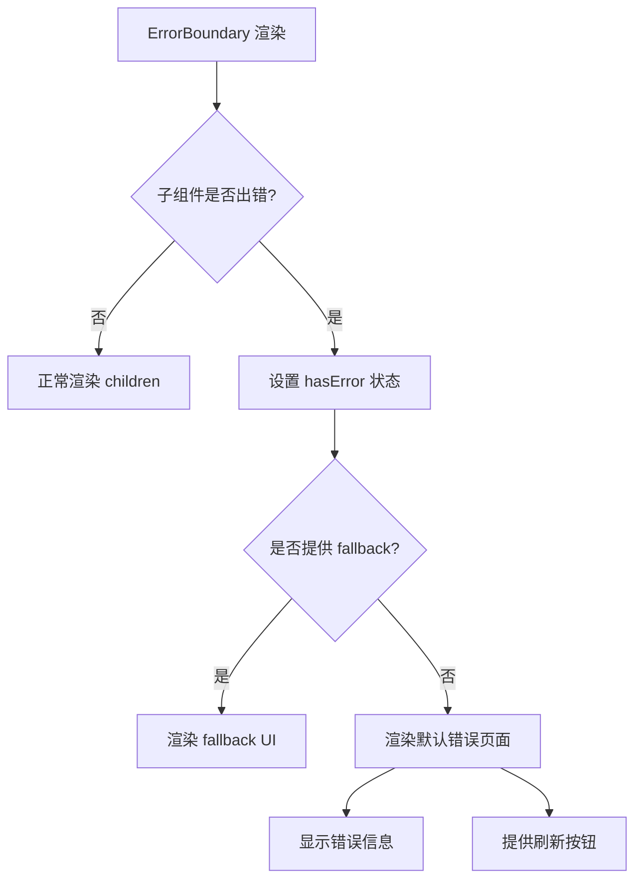

# 基础UI组件

<cite>
**Referenced Files in This Document**   
- [Header.tsx](file://src/components/Header.tsx)
- [LoadingSpinner.tsx](file://src/components/LoadingSpinner.tsx)
- [ThemeToggle.tsx](file://src/components/ThemeToggle.tsx)
- [ErrorMessage.tsx](file://src/components/ErrorMessage.tsx)
- [ErrorBoundary.tsx](file://src/components/ErrorBoundary.tsx)
</cite>

## 目录
1. [简介](#简介)
2. [核心组件分析](#核心组件分析)
3. [组件集成与使用场景](#组件集成与使用场景)
4. [设计价值与开发效率](#设计价值与开发效率)
5. [结论](#结论)

## 简介
本文档详细介绍了数字化作品互动展示平台中的基础UI组件，这些原子级可复用元素构成了系统前端界面的核心构建块。文档聚焦于五个关键组件：Header（头部导航）、LoadingSpinner（加载指示器）、ThemeToggle（主题切换）、ErrorMessage（错误消息）与ErrorBoundary（错误边界），阐述其设计目的、接口定义、使用方式及在提升开发效率和视觉一致性方面的价值。

## 核心组件分析

### Header 组件
Header 组件负责提供全局导航功能和用户身份状态展示。它位于页面顶部，采用渐变背景色设计，包含平台名称、当前页面标题以及在线人数统计。组件通过 `useSession` 钩子获取用户会话状态，并根据登录状态动态渲染“登录/登出”或“个人中心”等操作按钮。

该组件支持通过 `pageTitle` 属性设置当前页面标题，通过 `showBackButton`、`backUrl` 和 `backText` 控制返回按钮的显示与行为。平台名称点击后会在新标签页中打开指定链接，增强了用户体验。

**Section sources**
- [Header.tsx](file://src/components/Header.tsx#L21-L115)

### LoadingSpinner 组件
LoadingSpinner 是一个轻量级的加载指示器组件，用于在异步操作（如API请求、数据加载）期间向用户提供视觉反馈，防止界面出现“假死”现象。

该组件通过 `size` 属性控制尺寸，支持 `sm`、`md`、`lg` 三种规格，分别对应不同的高度和宽度。`text` 属性用于设置加载时的提示文字，默认为“加载中...”。`className` 属性允许外部传入自定义样式类，实现灵活的样式扩展。



**Diagram sources**
- [LoadingSpinner.tsx](file://src/components/LoadingSpinner.tsx#L8-L31)

**Section sources**
- [LoadingSpinner.tsx](file://src/components/LoadingSpinner.tsx#L8-L31)

### ThemeToggle 组件
ThemeToggle 组件实现了明暗主题的切换功能，提升应用的可访问性和用户体验。它依赖于 `ThemeContext` 上下文来获取当前主题状态和切换函数。

组件提供 `size` 属性控制按钮大小，支持 `sm`、`md`、`lg` 三种尺寸。`className` 属性用于扩展样式。视觉上，组件使用两个SVG图标（太阳和月亮），通过CSS类的条件渲染和过渡动画实现平滑的图标切换效果。按钮的 `aria-label` 和 `title` 属性根据当前主题动态更新，确保无障碍访问。

**Section sources**
- [ThemeToggle.tsx](file://src/components/ThemeToggle.tsx#L10-L74)

### ErrorMessage 组件
ErrorMessage 组件用于展示具体的错误信息，通常在数据获取失败或表单验证出错时使用。它接收一个必填的 `message` 属性来显示错误详情。

可选的 `onRetry` 回调函数允许用户点击“重试”按钮时触发重试逻辑。`className` 属性支持样式定制。组件采用居中布局，包含一个警告表情符号、错误标题和描述性文字，界面清晰直观。

**Section sources**
- [ErrorMessage.tsx](file://src/components/ErrorMessage.tsx#L8-L32)

### ErrorBoundary 组件
ErrorBoundary 是一个React错误边界类组件，用于捕获其子组件树中JavaScript错误，防止整个应用崩溃。它实现了 `getDerivedStateFromError` 和 `componentDidCatch` 生命周期方法。

当捕获到错误时，组件会进入错误状态。如果提供了 `fallback` 属性，则渲染备用UI；否则，显示默认的错误页面，包含错误提示和“刷新页面”按钮。该组件应包裹在可能出错的UI区域外层，作为最后的防线。



**Diagram sources**
- [ErrorBoundary.tsx](file://src/components/ErrorBoundary.tsx#L14-L57)

**Section sources**
- [ErrorBoundary.tsx](file://src/components/ErrorBoundary.tsx#L14-L57)

## 组件集成与使用场景

### 页面加载与API请求集成
在页面加载或执行API请求时，`LoadingSpinner` 可作为占位符，提升用户体验。例如，在获取作品列表时，可先显示加载动画：

```tsx
{isLoading ? <LoadingSpinner size="lg" /> : <InfiniteScrollWorks works={works} />}
```

### 错误处理机制集成
`ErrorMessage` 和 `ErrorBoundary` 共同构建了完整的错误处理机制。`ErrorBoundary` 捕获运行时错误，防止白屏；`ErrorMessage` 则用于处理业务逻辑中的预期错误，如网络请求失败：

```tsx
{error ? <ErrorMessage message={error} onRetry={fetchWorks} /> : <WorkCard work={work} />}
```

### 主题切换与导航集成
`ThemeToggle` 通常集成在 `Header` 或侧边栏中，方便用户随时切换。`Header` 组件本身也集成了 `OnlineCounter` 组件，实时显示在线人数，体现了组件间的组合复用。

## 设计价值与开发效率

这些基础UI组件的设计显著提升了开发效率和视觉一致性：

1. **可复用性**：每个组件都是独立的原子单元，可在多个页面和复合组件中重复使用，避免代码重复。
2. **一致性**：统一的样式和交互规范确保了整个应用的视觉和体验一致性。
3. **可维护性**：组件逻辑集中，修改一处即可影响所有使用该组件的地方。
4. **开发效率**：开发者无需从零构建常见UI元素，可专注于业务逻辑开发。
5. **可测试性**：独立的组件更易于编写单元测试和集成测试。

通过将这些基础组件作为构建块，团队能够快速搭建新页面和功能，同时保证高质量的用户体验。

## 结论
本文档详细分析了数字化作品互动展示平台中的五个核心基础UI组件。这些组件不仅实现了各自的功能目标，更通过良好的设计和接口定义，成为提升开发效率、保证视觉一致性的关键资产。建议在后续开发中继续遵循原子化组件设计原则，不断丰富和优化组件库。