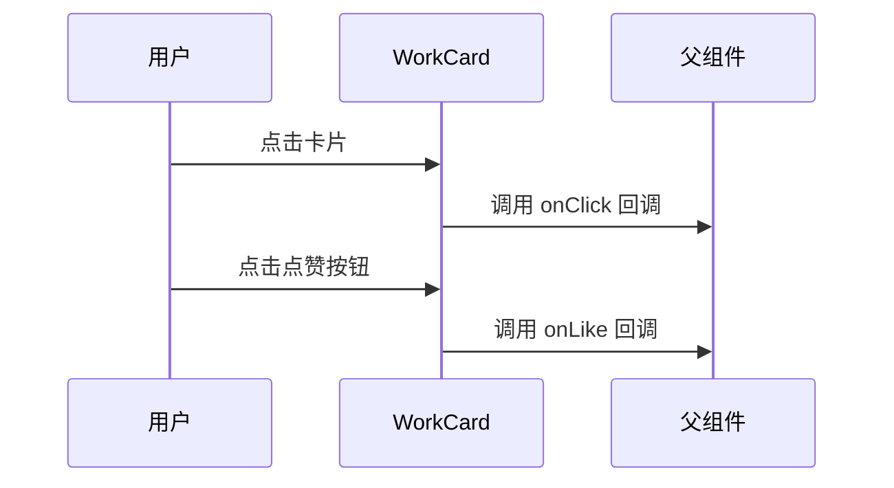
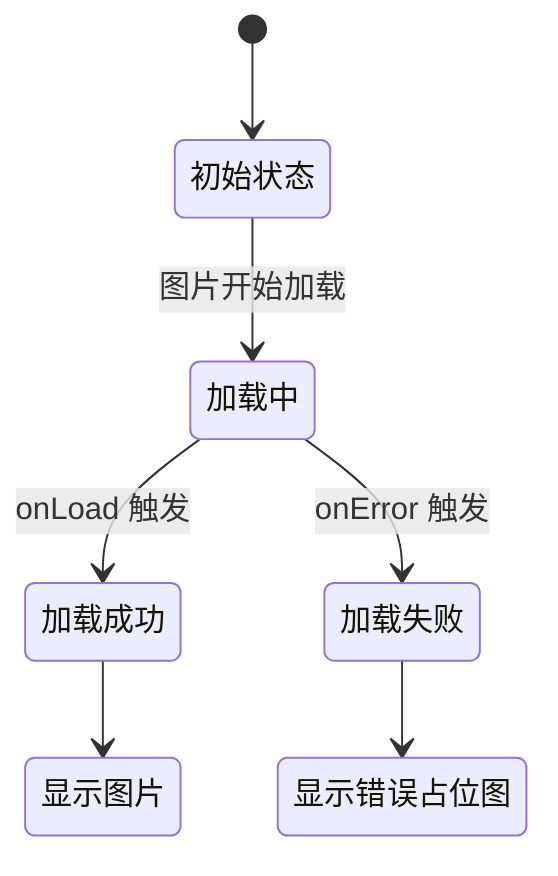
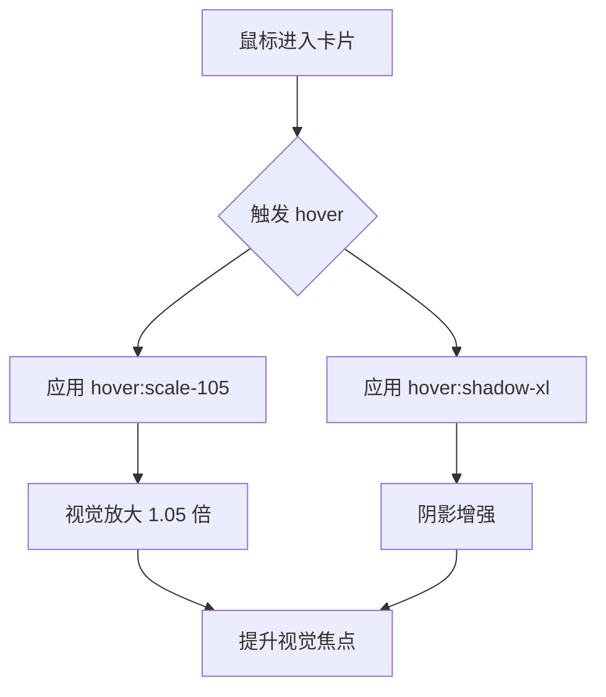
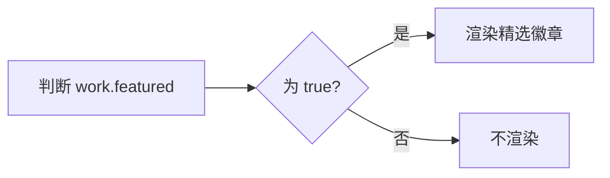
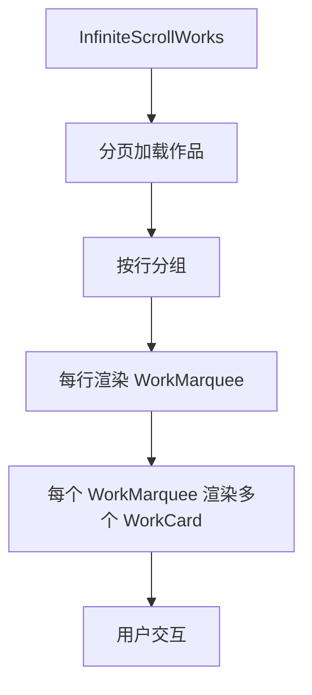
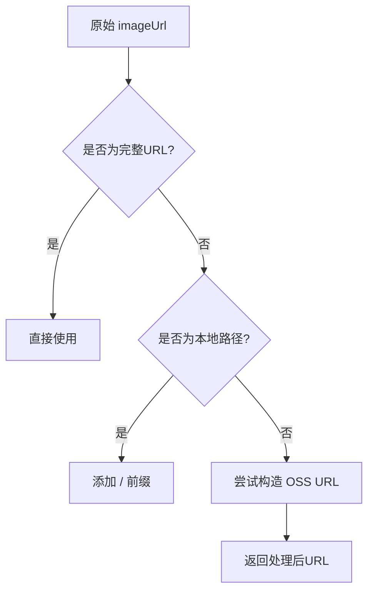

# 作品卡片组件

<cite>
**本文档引用文件**  
- [WorkCard.tsx](file://src/components/WorkCard.tsx#L7-L92)
- [work.d.ts](file://src/types/work.d.ts#L3-L9)
- [WorkMarquee.tsx](file://src/components/WorkMarquee.tsx#L1-L59)
- [InfiniteScrollWorks.tsx](file://src/components/InfiniteScrollWorks.tsx#L1-L267)
- [image-url.ts](file://src/lib/image-url.ts#L1-L95)
</cite>

## 目录
1. [简介](#简介)
2. [核心功能与设计](#核心功能与设计)
3. [作品对象结构](#作品对象结构)
4. [交互机制](#交互机制)
5. [内部状态管理](#内部状态管理)
6. [UI与动画实现](#ui与动画实现)
7. [精选徽章渲染逻辑](#精选徽章渲染逻辑)
8. [事件冒泡控制](#事件冒泡控制)
9. [集成使用示例](#集成使用示例)
10. [性能优化策略](#性能优化策略)

## 简介
`WorkCard` 是数字化作品互动展示平台中的核心UI单元，用于统一展示每一件用户上传的作品。该组件设计简洁、响应式良好，支持图片懒加载、错误回退、悬停动画及精选标识等特性，广泛应用于作品流、轮播展示和无限滚动等场景。

**Section sources**
- [WorkCard.tsx](file://src/components/WorkCard.tsx#L7-L92)

## 核心功能与设计
`WorkCard` 组件作为作品展示的基本单元，承担了视觉呈现与用户交互的双重职责。其设计目标是提供一致、美观且高性能的作品卡片视图，支持在多种布局中复用，如横向滚动（`WorkMarquee`）和垂直无限加载（`InfiniteScrollWorks`）。

组件采用函数式组件与React Hooks实现，结合Next.js的`Image`组件进行图片优化，并通过Tailwind CSS实现现代化的响应式样式与交互动画。

**Section sources**
- [WorkCard.tsx](file://src/components/WorkCard.tsx#L7-L92)

## 作品对象结构
`WorkCard` 接收一个 `work` 对象作为核心数据源，其类型定义为 `WorkWithUser`，扩展自Prisma生成的`Work`模型，并包含关联的用户信息。

该对象包含以下关键字段：

| 字段名 | 类型 | 描述 |
|--------|------|------|
| `name` | string | 作品名称 |
| `author` | string | 作者名称（可为空） |
| `imageUrl` | string | 作品图片URL |
| `likeCount` | number | 点赞数 |
| `viewCount` | number | 浏览量 |
| `featured` | boolean | 是否为精选作品 |

**Section sources**
- [work.d.ts](file://src/types/work.d.ts#L3-L9)

## 交互机制
组件通过两个可选回调函数实现交互：

- `onClick`: 点击卡片时触发，通常用于打开作品详情模态框。
- `onLike`: 点击点赞按钮时触发，用于更新点赞状态。

这两个回调通过Props传递，确保组件的高内聚与低耦合，便于在不同上下文中复用。



**Diagram sources**
- [WorkCard.tsx](file://src/components/WorkCard.tsx#L7-L92)

## 内部状态管理
组件使用 `useState` 管理两个关键图片加载状态：

- `imageLoaded`: 布尔值，表示图片是否已成功加载。
- `imageError`: 布尔值，表示图片加载是否出错。

通过 `onLoad` 和 `onError` 事件监听，动态更新状态，实现加载动画、成功显示与错误回退的三态切换。



**Diagram sources**
- [WorkCard.tsx](file://src/components/WorkCard.tsx#L7-L92)

## UI与动画实现
组件使用Tailwind CSS实现现代化UI与流畅动画效果：

- **悬停缩放**: 使用 `hover:scale-105` 实现卡片悬停时轻微放大。
- **阴影过渡**: 使用 `hover:shadow-xl` 和 `transition-all duration-300` 实现阴影动态增强。
- **圆角与边框**: 使用 `rounded-lg` 和 `overflow-hidden` 确保视觉一致性。
- **暗色模式支持**: 使用 `dark:` 前缀类实现深色主题适配。



**Diagram sources**
- [WorkCard.tsx](file://src/components/WorkCard.tsx#L21)

## 精选徽章渲染逻辑
当 `work.featured` 为 `true` 时，组件条件渲染一个精选徽章：

- 位置：右上角绝对定位（`absolute top-2 right-2`）。
- 样式：渐变背景（`from-yellow-400 to-orange-500`）、白色文字、圆角标签。
- 内容：包含⭐图标与“精选”文字。

该徽章使用 `z-10` 确保层级高于图片，提升视觉识别度。



**Diagram sources**
- [WorkCard.tsx](file://src/components/WorkCard.tsx#L24-L31)

## 事件冒泡控制
点赞按钮的点击事件通过 `handleLikeClick` 处理：

```ts
const handleLikeClick = (e: React.MouseEvent) => {
  e.stopPropagation(); // 阻止事件冒泡至父级onClick
  onLike?.();
};
```

此设计确保点击点赞按钮时仅触发点赞逻辑，不会同时触发卡片整体的 `onClick` 事件，避免误操作。

**Section sources**
- [WorkCard.tsx](file://src/components/WorkCard.tsx#L13-L16)

## 集成使用示例
`WorkCard` 通常嵌套在更高阶组件中使用：

### 与 `WorkMarquee` 集成
`WorkMarquee` 实现横向滚动作品流，内部遍历 `works` 数组并为每个作品渲染 `WorkCard`。

```tsx
<WorkMarquee 
  works={works} 
  onWorkClick={handleWorkClick}
/>
```

### 与 `InfiniteScrollWorks` 集成
`InfiniteScrollWorks` 实现垂直无限滚动，内部将作品分组为多行，每行使用 `WorkMarquee` 渲染，形成网格滚动效果。

```tsx
<InfiniteScrollWorks 
  onWorkClick={handleWorkClick}
  worksPerRow={8}
/>
```



**Diagram sources**
- [WorkMarquee.tsx](file://src/components/WorkMarquee.tsx#L1-L59)
- [InfiniteScrollWorks.tsx](file://src/components/InfiniteScrollWorks.tsx#L1-L267)

## 性能优化策略
组件在多个层面进行了性能优化：

### 图片懒加载
通过 `sizes` 属性配合响应式断点，确保不同设备加载合适尺寸的图片，减少带宽消耗。

### 错误处理与回退
- 图片加载失败时显示占位图（🖼️ + “图片加载失败”）。
- 加载中显示旋转动画，提升用户体验。

### 图片URL处理
通过 `getImageUrl` 工具函数统一处理多种图片来源（本地、OSS、Cloudinary等），确保URL格式正确。



**Diagram sources**
- [image-url.ts](file://src/lib/image-url.ts#L1-L95)