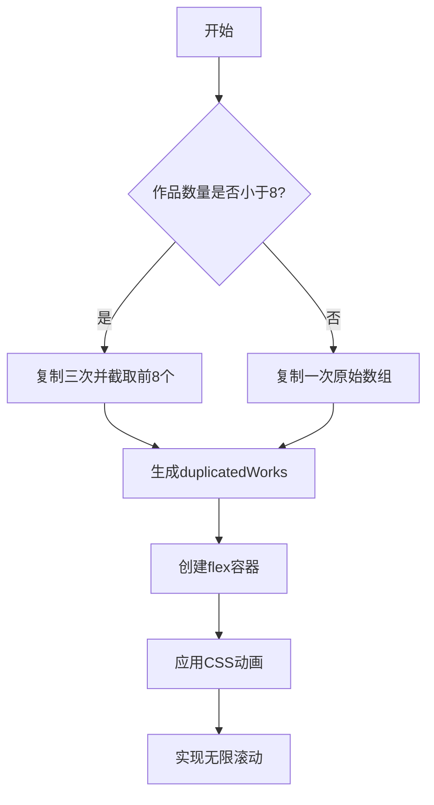
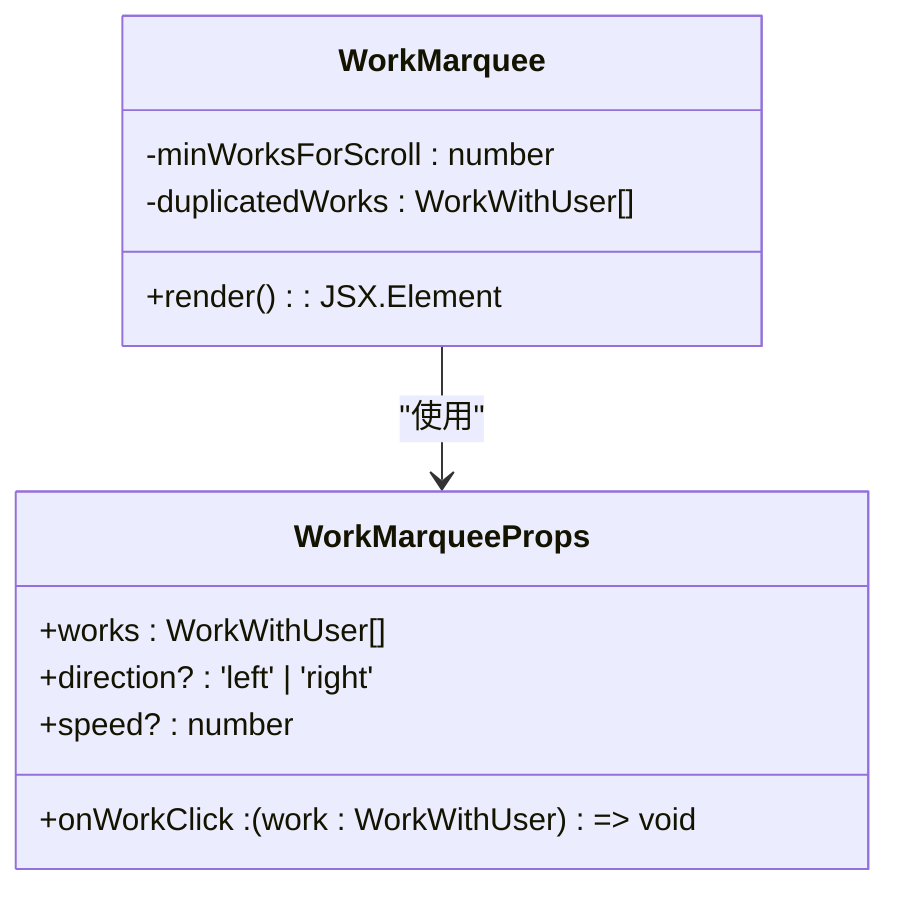
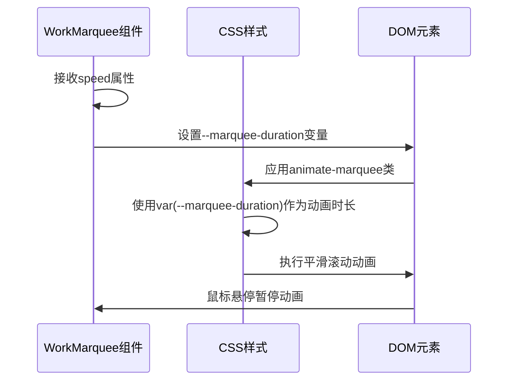
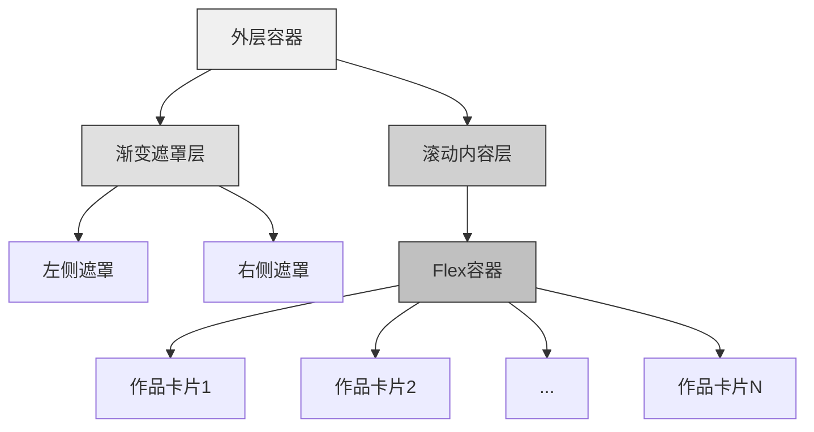
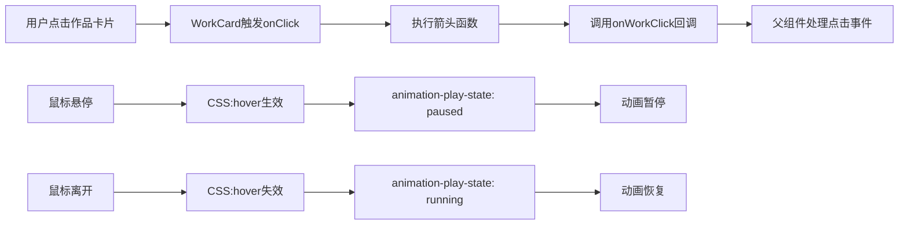
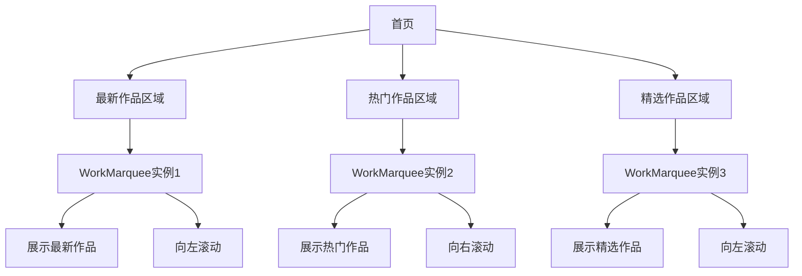

# 作品跑马灯组件

<cite>
**本文档引用的文件**
- [WorkMarquee.tsx](file://src/components/WorkMarquee.tsx)
- [work.d.ts](file://src/types/work.d.ts)
- [WorkCard.tsx](file://src/components/WorkCard.tsx)
- [globals.css](file://src/app/globals.css)
- [tailwind.config.js](file://tailwind.config.js)
</cite>

## 目录
1. [简介](#简介)
2. [核心机制](#核心机制)
3. [属性与配置](#属性与配置)
4. [CSS动画实现](#css动画实现)
5. [布局与视觉设计](#布局与视觉设计)
6. [事件处理与交互](#事件处理与交互)
7. [典型使用场景](#典型使用场景)
8. [响应式设计考量](#响应式设计考量)
9. [结论](#结论)

## 简介
作品跑马灯组件（WorkMarquee）是一个基于CSS动画实现的无限水平滚动组件，用于在首页或推荐区域展示数字化作品。该组件通过复制作品列表确保滚动连续性，并结合渐变遮罩提升视觉体验。组件支持方向和速度控制，且与作品卡片（WorkCard）紧密集成，实现无缝的作品展示效果。

**Section sources**
- [WorkMarquee.tsx](file://src/components/WorkMarquee.tsx#L1-L60)

## 核心机制
作品跑马灯组件的核心在于通过CSS动画实现无缝无限滚动。其关键机制包括作品复制策略、滚动连续性保障和动态宽度计算。

组件通过`duplicatedWorks`逻辑确保滚动的连续性：当作品数量少于8个时，将原始作品数组复制三次后截取前8个元素；当作品数量达到或超过8个时，则仅复制一次原始数组。这种策略确保了无论作品数量多少，都能形成足够长的滚动序列以实现平滑过渡。

滚动的实现依赖于flex布局和CSS动画的结合。内部容器使用flex布局横向排列所有作品卡片，并通过CSS动画不断改变其水平位置，从而产生滚动效果。

**Diagram sources**
- [WorkMarquee.tsx](file://src/components/WorkMarquee.tsx#L15-L25)

**Section sources**
- [WorkMarquee.tsx](file://src/components/WorkMarquee.tsx#L15-L30)

## 属性与配置
组件接受四个主要属性来控制其行为和外观，这些属性定义在`WorkMarqueeProps`接口中。

| 属性 | 类型 | 默认值 | 描述 |
|------|------|--------|------|
| works | WorkWithUser[] | 必需 | 要展示的作品数组 |
| onWorkClick | (work: WorkWithUser) => void | 必需 | 作品点击回调函数 |
| direction | 'left' \| 'right' | 'left' | 滚动方向 |
| speed | number | 30 | 滚动速度（秒） |

direction属性控制动画方向，当值为'right'时使用反向动画类；speed属性通过CSS变量--marquee-duration动态设置动画时长，实现速度控制的灵活性。

**Diagram sources**
- [work.d.ts](file://src/types/work.d.ts#L83-L88)
- [WorkMarquee.tsx](file://src/components/WorkMarquee.tsx#L6-L10)

**Section sources**
- [work.d.ts](file://src/types/work.d.ts#L83-L88)
- [WorkMarquee.tsx](file://src/components/WorkMarquee.tsx#L6-L14)

## CSS动画实现
组件的无限滚动效果通过CSS动画实现，核心包括关键帧定义、动画类应用和动态时长控制。

CSS中定义了两个关键帧动画：`marquee`和`marquee-reverse`。`marquee`动画从0%位置移动到-50%位置，实现了向左的无限滚动效果；`marquee-reverse`则相反，实现了向右滚动。这种50%的位移设计确保了动画的无缝衔接。

动画时长通过CSS变量`--marquee-duration`动态设置，该变量在组件中通过内联样式绑定speed属性值。这种设计使得动画速度可以在运行时动态调整，而无需重新编译CSS。

**Diagram sources**
- [globals.css](file://src/app/globals.css#L87-L101)
- [tailwind.config.js](file://tailwind.config.js#L15-L20)
- [WorkMarquee.tsx](file://src/components/WorkMarquee.tsx#L45-L50)

**Section sources**
- [globals.css](file://src/app/globals.css#L87-L107)
- [tailwind.config.js](file://tailwind.config.js#L15-L20)

## 布局与视觉设计
组件采用多层布局设计，结合flex布局和渐变遮罩，创造出专业级的视觉效果。

内部使用flex布局横向排列所有作品卡片，每个卡片宽度固定为320px（w-80），间距为24px（space-x-6）。容器宽度根据复制后作品数量动态计算，确保所有卡片能完全容纳。

视觉上，组件在左右两侧添加了渐变遮罩，左侧为从白色到透明的右向渐变，右侧为从白色到透明的左向渐变。这种设计有效隐藏了滚动边缘的突兀感，提升了整体视觉流畅度。

**Diagram sources**
- [WorkMarquee.tsx](file://src/components/WorkMarquee.tsx#L31-L35)
- [WorkMarquee.tsx](file://src/components/WorkMarquee.tsx#L40-L55)

**Section sources**
- [WorkMarquee.tsx](file://src/components/WorkMarquee.tsx#L31-L55)

## 事件处理与交互
组件实现了完善的事件处理机制，包括作品点击事件传递和鼠标悬停暂停功能。

组件与WorkCard组件嵌套使用，每个作品卡片都绑定了点击事件处理器。当用户点击某个作品时，`onWorkClick`回调函数会被触发，并将对应的作品数据向上传递，实现事件的向上冒泡。

值得注意的是，组件利用CSS的`:hover`伪类实现了动画暂停功能，无需在JavaScript中维护暂停状态。当鼠标悬停在跑马灯上时，`animation-play-state`属性被设置为`paused`，动画自动暂停；鼠标离开后，动画自动恢复。

**Diagram sources**
- [WorkMarquee.tsx](file://src/components/WorkMarquee.tsx#L52-L54)
- [WorkCard.tsx](file://src/components/WorkCard.tsx#L20-L22)
- [globals.css](file://src/app/globals.css#L106-L107)

**Section sources**
- [WorkMarquee.tsx](file://src/components/WorkMarquee.tsx#L52-L54)
- [WorkCard.tsx](file://src/components/WorkCard.tsx#L20-L22)

## 典型使用场景
作品跑马灯组件主要用于首页和推荐区域的作品展示，常见于最新作品和热门作品的展示场景。

在首页中，组件通常用于展示最新上传的作品或热门作品。通过将作品数据传递给组件，并设置合适的点击回调，可以实现作品的动态展示和交互。组件支持多实例同时运行，可以创建多个跑马灯展示不同类型的作品。

**Diagram sources**
- [WorkMarquee.tsx](file://src/components/WorkMarquee.tsx)
- [WorkCard.tsx](file://src/components/WorkCard.tsx)

**Section sources**
- [WorkMarquee.tsx](file://src/components/WorkMarquee.tsx)
- [WorkCard.tsx](file://src/components/WorkCard.tsx)

## 响应式设计考量
组件在响应式设计方面需要考虑宽度适配问题，特别是在不同屏幕尺寸下的表现。

由于组件使用固定宽度计算（每个卡片320px），在小屏幕设备上可能会出现布局问题。建议在移动端使用时调整卡片宽度或减少每屏显示的作品数量。组件的外层容器使用`overflow-hidden`，确保超出部分被隐藏，避免水平滚动条的出现。

渐变遮罩的宽度（w-20）在不同屏幕尺寸下保持固定，这在极小屏幕上可能不够有效。未来优化可以考虑使用相对单位或媒体查询来调整遮罩宽度。

**Section sources**
- [WorkMarquee.tsx](file://src/components/WorkMarquee.tsx#L40-L45)
- [globals.css](file://src/app/globals.css)

## 结论
作品跑马灯组件通过巧妙的CSS动画和JavaScript逻辑结合，实现了高效、流畅的无限滚动效果。组件的设计充分考虑了用户体验，通过渐变遮罩和悬停暂停功能提升了交互质量。其灵活的属性配置和良好的事件处理机制，使其能够适应多种展示场景。未来可进一步优化响应式设计，增强在移动设备上的表现。