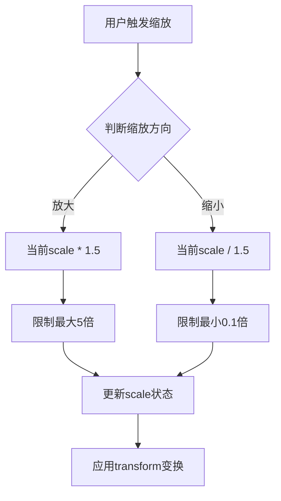
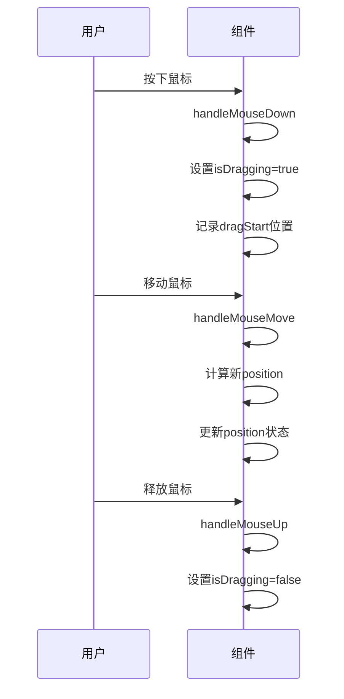
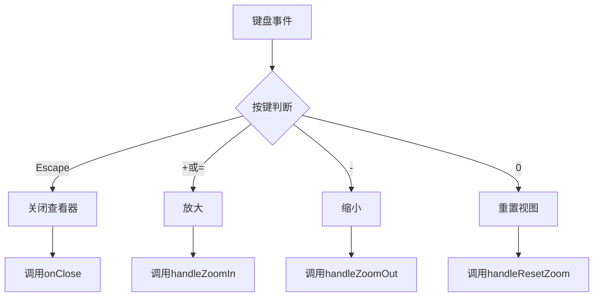
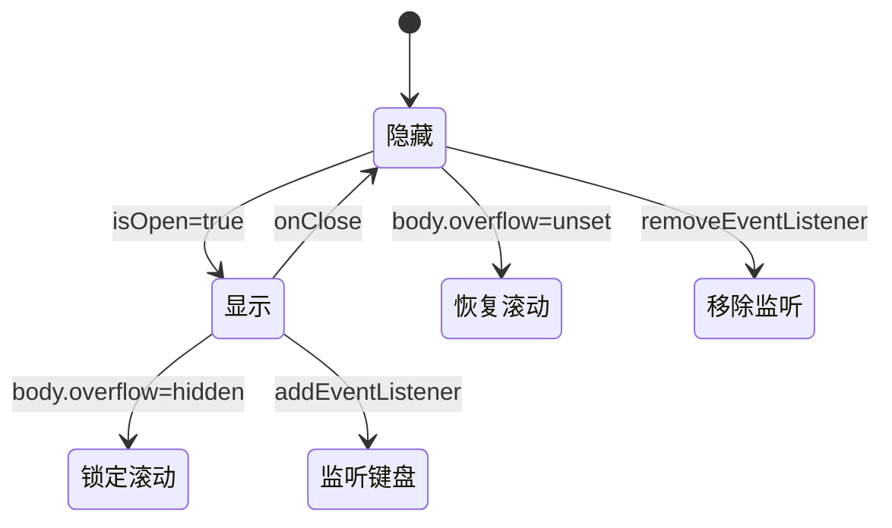
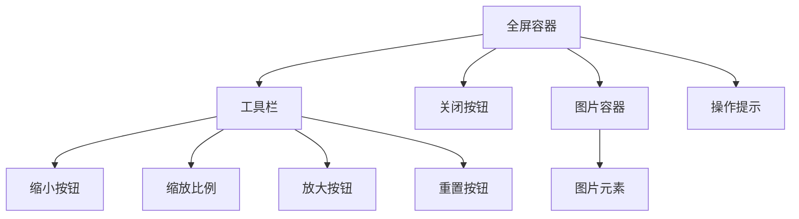
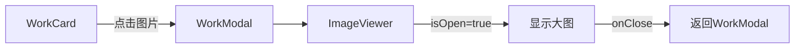
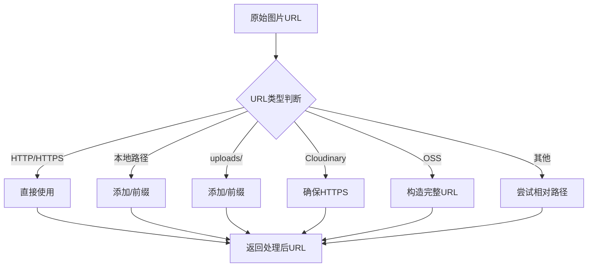

# 图片查看器组件

<cite>
**Referenced Files in This Document**   
- [ImageViewer.tsx](file://src/components/ImageViewer.tsx)
- [WorkModal.tsx](file://src/components/WorkModal.tsx)
- [image-url.ts](file://src/lib/image-url.ts)
</cite>

## 目录
1. [简介](#简介)
2. [核心功能与交互逻辑](#核心功能与交互逻辑)
3. [状态管理与生命周期](#状态管理与生命周期)
4. [UI布局与视觉设计](#ui布局与视觉设计)
5. [图片加载与性能优化](#图片加载与性能优化)
6. [集成示例与使用场景](#集成示例与使用场景)
7. [响应式设计与用户体验](#响应式设计与用户体验)
8. [结论](#结论)

## 简介

图片查看器组件（ImageViewer）是一个模态式交互组件，专为提供高质量的图片浏览体验而设计。该组件通过 `isOpen` 属性控制其显示状态，当开启时会以全屏模态框的形式展示图片，并锁定页面滚动以防止背景内容滚动干扰。组件支持多种交互方式，包括缩放、拖拽平移、滚轮控制和键盘快捷键操作，为用户提供直观且流畅的图片查看功能。

**Section sources**
- [ImageViewer.tsx](file://src/components/ImageViewer.tsx#L1-L216)

## 核心功能与交互逻辑

### 缩放功能实现

图片查看器提供了完整的缩放控制功能，通过 `handleZoomIn` 和 `handleZoomOut` 方法实现。缩放操作基于 `scale` 状态变量，初始值为 1（100% 缩放比例）。放大时，缩放比例乘以 1.5，最大限制为 5 倍；缩小则除以 1.5，最小限制为 0.1 倍。这种指数级缩放方式提供了平滑的视觉过渡效果。

**Diagram sources**
- [ImageViewer.tsx](file://src/components/ImageViewer.tsx#L57-L65)

### 拖拽平移交互

拖拽平移功能通过 `handleMouseDown`、`handleMouseMove` 和 `handleMouseUp` 三个事件处理器实现。当图片缩放比例大于 1 时，用户可以通过鼠标拖拽来平移图片。组件使用 `isDragging` 状态标记拖拽状态，并通过 `dragStart` 记录拖拽起始位置。在拖拽过程中，`position` 状态根据鼠标移动距离动态更新，实现平滑的图片移动效果。

**Diagram sources**
- [ImageViewer.tsx](file://src/components/ImageViewer.tsx#L67-L85)

### 滚轮与键盘控制

组件支持滚轮缩放和键盘快捷键操作，增强了用户的交互体验。滚轮事件通过 `handleWheel` 处理，阻止默认的页面滚动行为，并根据滚轮方向调整缩放比例。键盘事件通过 `useEffect` 监听，支持以下快捷键：
- `+` 或 `=`：放大图片
- `-`：缩小图片
- `0`：重置缩放和位置
- `Esc`：关闭查看器

**Diagram sources**
- [ImageViewer.tsx](file://src/components/ImageViewer.tsx#L87-L114)

## 状态管理与生命周期

### 状态变量设计

组件使用多个 `useState` 钩子管理其内部状态，包括：
- `scale`：控制图片缩放比例
- `position`：记录图片的平移位置
- `isDragging`：标记当前是否处于拖拽状态
- `dragStart`：存储拖拽起始坐标
- `imageLoaded`：指示图片是否已加载完成

这些状态变量共同协作，实现了复杂的交互功能。

**Section sources**
- [ImageViewer.tsx](file://src/components/ImageViewer.tsx#L15-L22)

### 生命周期与副作用

组件通过多个 `useEffect` 钩子管理其生命周期和副作用：
- 页面滚动控制：当 `isOpen` 为 true 时，设置 `document.body.style.overflow = 'hidden'` 锁定页面滚动；关闭时恢复
- 键盘事件监听：仅在查看器开启时添加和移除键盘事件监听器
- 状态重置：当图片源改变或查看器关闭时，重置缩放和位置状态

**Diagram sources**
- [ImageViewer.tsx](file://src/components/ImageViewer.tsx#L116-L158)

## UI布局与视觉设计

### 整体布局结构

组件采用固定定位的全屏布局，背景为半透明黑色（`bg-opacity-95`），并添加了背景模糊效果（`backdrop-blur-sm`）。主要包含三个UI元素：
1. **工具栏**：位于顶部中央，提供缩放控制按钮和当前缩放比例显示
2. **关闭按钮**：位于右上角，提供明确的关闭入口
3. **操作提示**：位于底部中央，指导用户使用各种交互方式

**Diagram sources**
- [ImageViewer.tsx](file://src/components/ImageViewer.tsx#L160-L216)

### 变换与定位

图片的缩放和平移通过 CSS `transform` 属性实现，结合 `translate` 和 `scale` 函数。关键设置是 `transformOrigin: 'center center'`，这确保了缩放始终以图片中心为基准点，提供更自然的视觉效果。光标样式根据缩放状态动态变化：正常状态下为默认光标，缩放后为 `grab`（可拖拽），拖拽时为 `grabbing`（正在拖拽）。

**Section sources**
- [ImageViewer.tsx](file://src/components/ImageViewer.tsx#L200-L208)

## 图片加载与性能优化

### 图片加载处理

组件通过 `imageLoaded` 状态管理图片加载过程。在图片加载完成前，显示一个旋转的加载指示器；加载完成后，隐藏指示器并显示图片。这种设计提升了用户体验，避免了空白或错位的视觉效果。

**Section sources**
- [ImageViewer.tsx](file://src/components/ImageViewer.tsx#L198-L205)

### 性能优化策略

组件采用了多项性能优化措施：
- **unoptimized属性**：在 `Image` 组件上设置 `unoptimized` 属性，禁用 Next.js 的默认图片优化，适用于外部图片源（如 OSS、Cloudinary）
- **优先加载**：使用 `priority` 属性提示浏览器优先加载当前查看的图片
- **尺寸限制**：通过 `max-w-[90vw]` 和 `max-h-[90vh]` 限制图片最大尺寸，确保在各种屏幕上的良好显示

**Section sources**
- [ImageViewer.tsx](file://src/components/ImageViewer.tsx#L209-L213)

## 集成示例与使用场景

### 与WorkCard组件的集成

图片查看器通常与作品卡片（WorkCard）组件配合使用。当用户点击作品卡片中的图片时，触发 `onClick` 回调，打开 `WorkModal`（作品详情模态框），在其中集成图片查看器功能。

**Diagram sources**
- [WorkModal.tsx](file://src/components/WorkModal.tsx#L190-L226)

### 图片URL处理

组件通过 `getImageUrl` 工具函数处理各种来源的图片URL，支持：
- 完整的 HTTP/HTTPS URL
- 本地绝对路径
- 旧版 uploads 路径
- Cloudinary 格式
- 阿里云 OSS 格式

这种设计确保了组件的通用性和兼容性。

**Diagram sources**
- [image-url.ts](file://src/lib/image-url.ts#L1-L95)

## 响应式设计与用户体验

### 响应式布局

组件采用响应式设计，图片容器使用 `max-w-[90vw]` 和 `max-h-[90vh]` 限制，确保在移动设备和桌面设备上都有良好的显示效果。`object-contain` 样式确保图片在保持宽高比的同时完整显示。

### 用户体验优化

组件提供了全面的用户指导：
- 工具栏按钮带有 `title` 属性，提供悬停提示
- 底部操作提示区域明确列出所有可用操作
- 键盘快捷键与按钮功能对应，降低学习成本
- 光标样式变化提供视觉反馈

这些设计共同提升了用户的操作效率和满意度。

**Section sources**
- [ImageViewer.tsx](file://src/components/ImageViewer.tsx#L160-L216)

## 结论

图片查看器组件是一个功能完整、交互丰富的模态式图片浏览解决方案。通过精细的状态管理、多种交互方式的支持和良好的性能优化，为用户提供了高质量的图片查看体验。组件的设计考虑了实际使用场景，与作品详情模态框无缝集成，并通过灵活的图片URL处理机制适应不同的部署环境。其响应式设计和用户体验优化确保了在各种设备和使用情境下的良好表现。