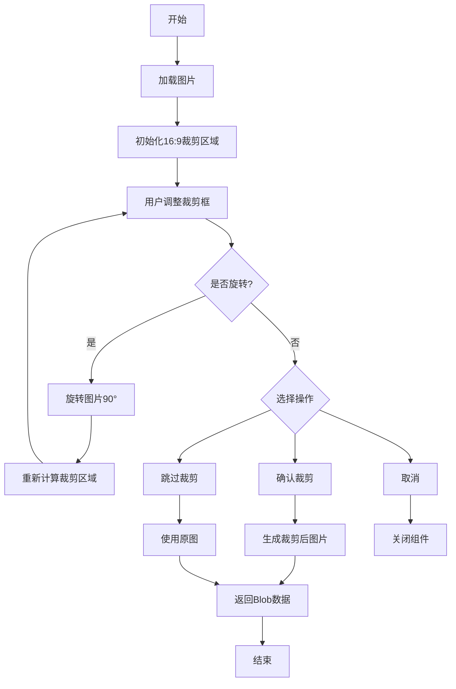
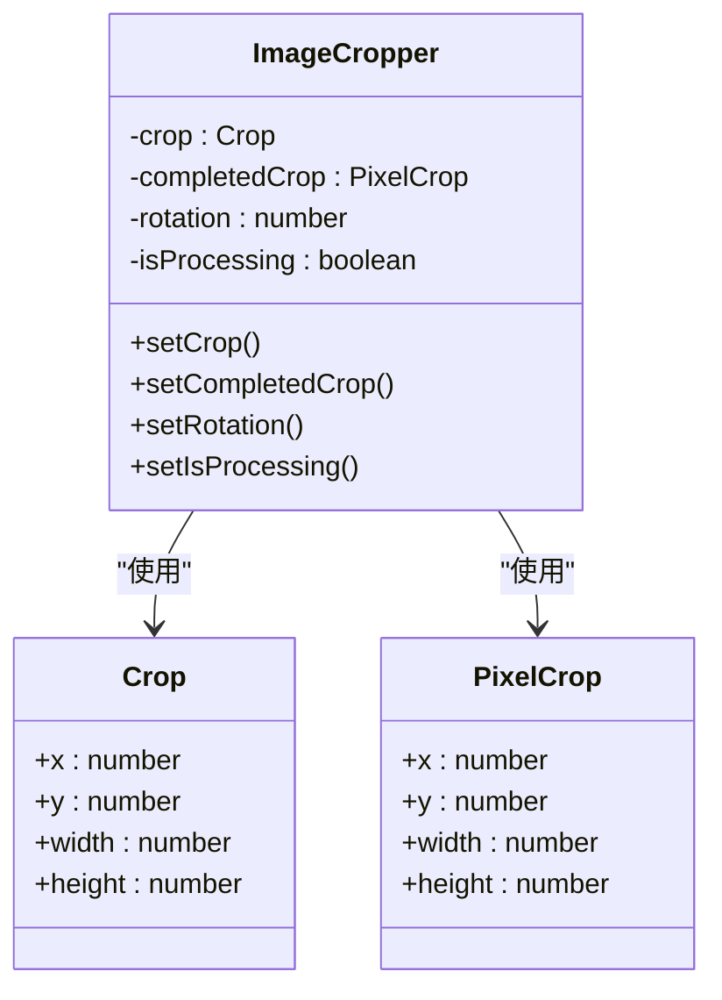
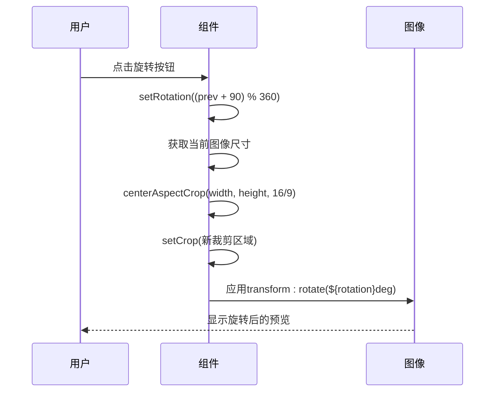
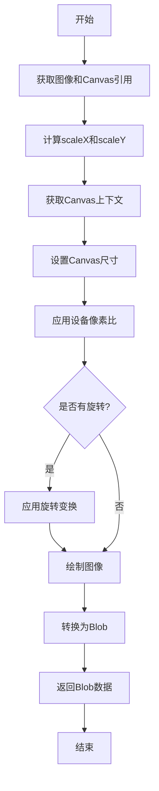
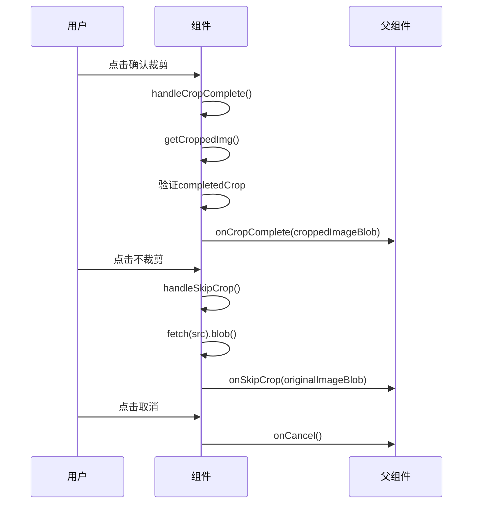
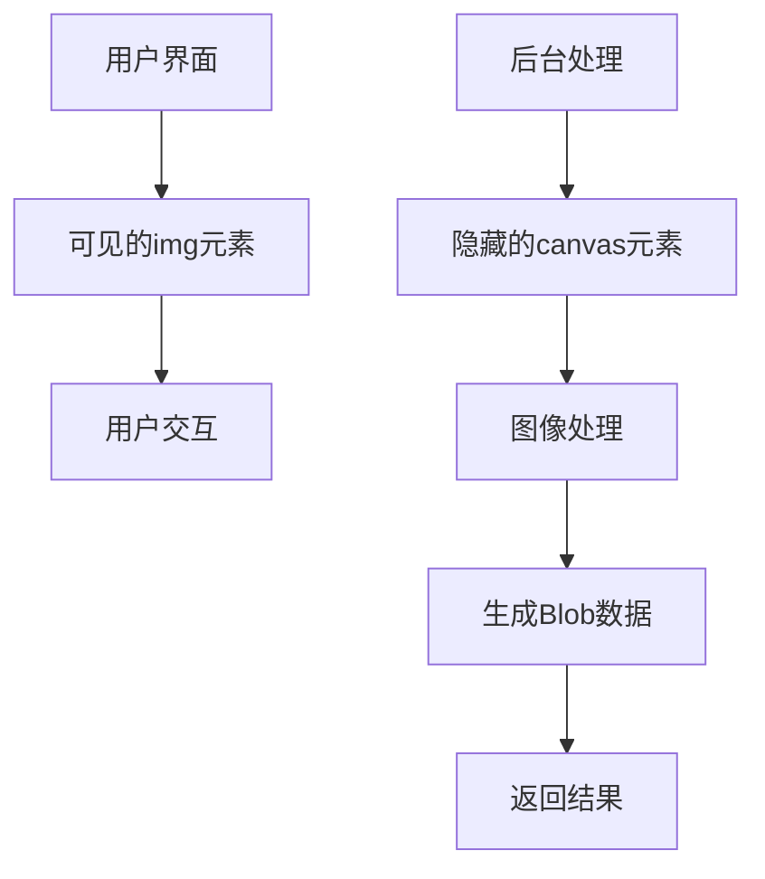
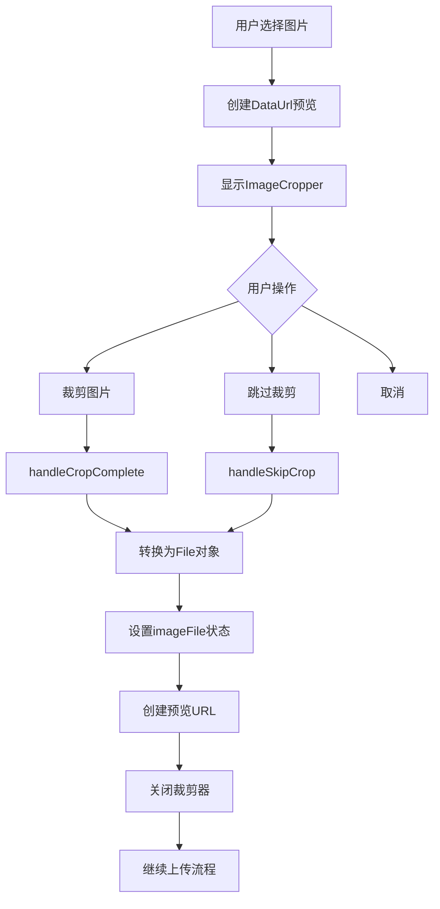
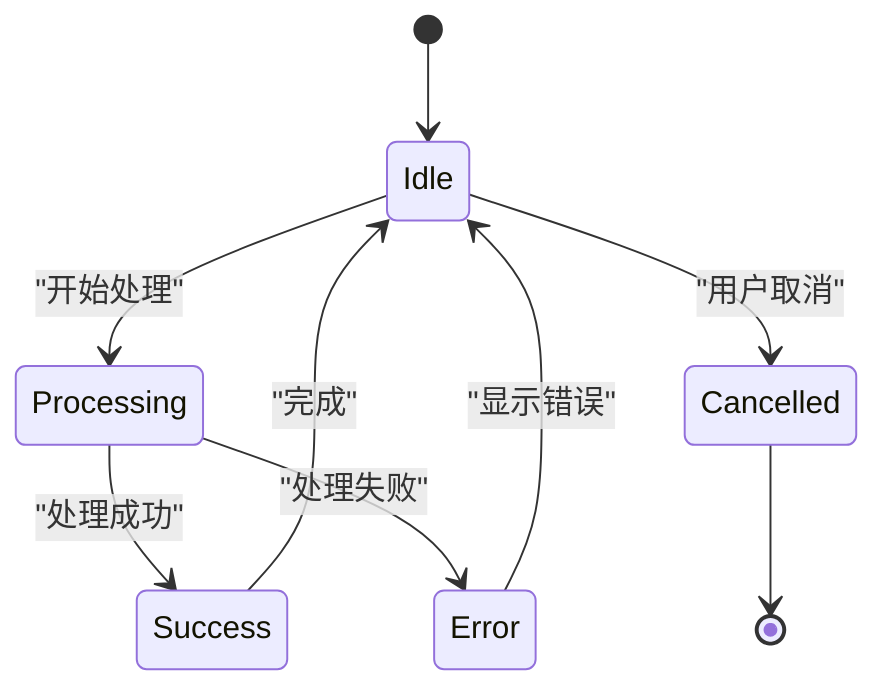

# 图片裁剪器组件

<cite>
**本文档引用的文件**   
- [ImageCropper.tsx](file://src/components/ImageCropper.tsx)
- [upload/page.tsx](file://src/app/upload/page.tsx)
</cite>

## 目录
1. [简介](#简介)
2. [核心功能](#核心功能)
3. [状态管理](#状态管理)
4. [旋转功能实现](#旋转功能实现)
5. [裁剪图像生成](#裁剪图像生成)
6. [回调函数](#回调函数)
7. [离屏绘制与Canvas](#离屏绘制与canvas)
8. [高质量输出](#高质量输出)
9. [集成使用场景](#集成使用场景)
10. [错误处理与用户体验](#错误处理与用户体验)

## 简介
图片裁剪器组件是一个基于ReactCrop库实现的图片处理工具，专为数字化作品互动展示平台设计。该组件提供直观的用户界面，允许用户对上传的图片进行精确裁剪，确保作品展示符合16:9的宽高比要求。组件通过现代化的React技术栈构建，支持图片旋转、高质量输出和流畅的用户体验。

**Section sources**
- [ImageCropper.tsx](file://src/components/ImageCropper.tsx#L1-L30)

## 核心功能
图片裁剪器组件的核心功能是基于ReactCrop库实现的图片裁剪能力。组件强制执行16:9的宽高比约束，确保所有上传的作品图片都符合平台的展示标准。用户可以通过拖拽交互来调整裁剪区域，预览效果实时更新。组件还提供旋转功能，允许用户调整图片方向，以获得最佳的构图效果。

**Diagram sources**
- [ImageCropper.tsx](file://src/components/ImageCropper.tsx#L213-L238)

## 状态管理
组件通过React的useState Hook管理多个关键状态，确保裁剪过程的流畅性和数据一致性。核心状态包括crop和completedCrop，分别用于跟踪当前的裁剪区域和已完成的裁剪区域。crop状态在用户拖拽调整时实时更新，而completedCrop状态在用户完成裁剪操作后被设置。

**Diagram sources**
- [ImageCropper.tsx](file://src/components/ImageCropper.tsx#L30-L35)

## 旋转功能实现
旋转功能通过handleRotate函数实现，该函数更新rotation状态并重新计算裁剪区域。当用户点击"旋转90°"按钮时，rotation状态以90度为单位递增，并在达到360度时重置为0度，实现循环旋转效果。旋转后，组件会重新调用centerAspectCrop函数，基于当前图片尺寸和16:9的宽高比约束，计算新的居中裁剪区域。

**Diagram sources**
- [ImageCropper.tsx](file://src/components/ImageCropper.tsx#L60-L68)

## 裁剪图像生成
getCroppedImg函数负责根据像素比例、设备像素比和旋转角度精确生成裁剪后的Blob数据。函数首先获取图像的自然尺寸与显示尺寸的比例，以确保在高DPI设备上保持图像质量。然后根据设备像素比调整canvas尺寸，实现高清输出。如果存在旋转角度，函数会在canvas中心应用旋转变换，确保裁剪结果正确。

**Diagram sources**
- [ImageCropper.tsx](file://src/components/ImageCropper.tsx#L122-L176)

## 回调函数
组件定义了三个重要的回调函数：onCropComplete、onSkipCrop和onCancel。这些回调函数在特定操作完成后触发，将处理结果传递给父组件。onCropComplete在用户确认裁剪后调用，返回裁剪后的Blob数据。onSkipCrop在用户选择不裁剪时调用，返回原图的Blob数据。onCancel在用户取消操作时调用，不返回任何数据。

**Diagram sources**
- [ImageCropper.tsx](file://src/components/ImageCropper.tsx#L178-L211)
- [ImageCropper.tsx](file://src/components/ImageCropper.tsx#L65-L120)

## 离屏绘制与Canvas
canvasRef在组件中扮演着离屏绘制的关键角色。隐藏的canvas元素用于在后台生成裁剪后的图片，而不会影响用户界面的显示。这种技术避免了在主UI线程上进行复杂的图像处理操作，提高了应用的响应性和性能。canvasRef通过useRef Hook创建，确保在整个组件生命周期中保持对同一DOM元素的引用。

**Diagram sources**
- [ImageCropper.tsx](file://src/components/ImageCropper.tsx#L34)
- [ImageCropper.tsx](file://src/components/ImageCropper.tsx#L310-L311)

## 高质量输出
组件通过设置高质量JPEG输出（0.95质量因子）来确保生成的图片具有最佳视觉效果。在canvas.toBlob调用中，质量参数被设置为0.95，这在文件大小和图像质量之间提供了良好的平衡。这种高质量设置特别重要，因为上传的作品将在平台上公开展示，需要保持清晰度和细节。

**Section sources**
- [ImageCropper.tsx](file://src/components/ImageCropper.tsx#L174-L176)
- [ImageCropper.tsx](file://src/components/ImageCropper.tsx#L103-L104)

## 集成使用场景
在作品上传流程中，图片裁剪器组件被集成在upload/page.tsx页面中。当用户选择图片文件后，系统会创建预览并显示裁剪界面。用户可以进行裁剪或选择不裁剪，处理后的图片Blob会被转换为File对象，用于后续的上传操作。这种集成方式确保了所有上传的作品都符合平台的质量和格式要求。

**Diagram sources**
- [upload/page.tsx](file://src/app/upload/page.tsx#L158-L201)
- [upload/page.tsx](file://src/app/upload/page.tsx#L619-L644)

## 错误处理与用户体验
组件通过多种机制确保良好的用户体验和错误处理。当用户尝试在没有选择裁剪区域的情况下确认裁剪时，系统会显示"请先选择裁剪区域"的提示。在处理图片过程中，组件显示"处理中..."的加载状态，防止用户重复操作。如果图片处理失败，系统会显示"处理图片失败，请重试"的错误提示。这些设计确保了用户能够清晰地了解操作状态和可能的问题。

**Section sources**
- [ImageCropper.tsx](file://src/components/ImageCropper.tsx#L180-L182)
- [ImageCropper.tsx](file://src/components/ImageCropper.tsx#L190-L192)
- [ImageCropper.tsx](file://src/components/ImageCropper.tsx#L107-L109)