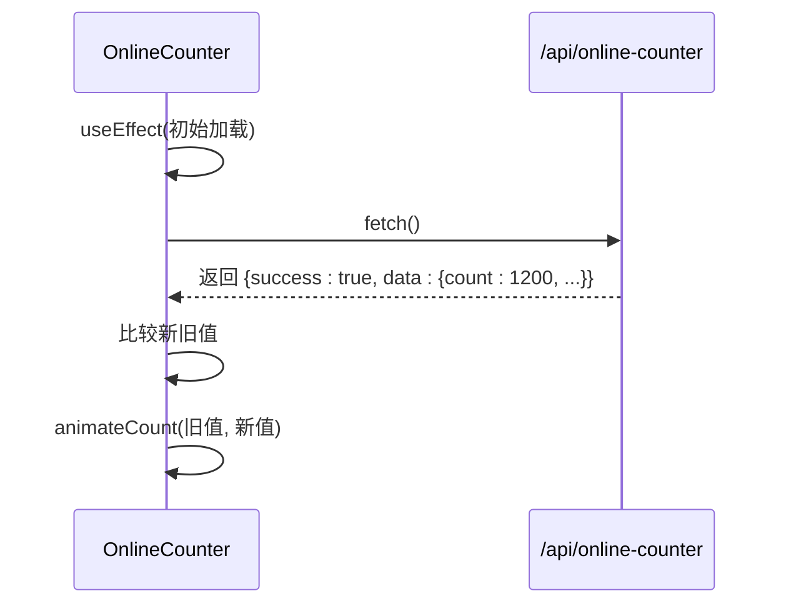
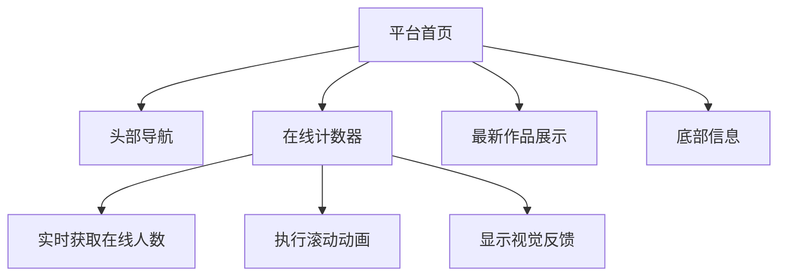

# 在线计数器组件

<cite>
**本文档引用的文件**  
- [OnlineCounter.tsx](file://src/components/OnlineCounter.tsx)
- [page.tsx](file://src/app/page.tsx)
</cite>

## 目录
1. [简介](#简介)
2. [核心功能概述](#核心功能概述)
3. [数据获取与轮询机制](#数据获取与轮询机制)
4. [数字滚动动画实现](#数字滚动动画实现)
5. [状态管理与协同工作机制](#状态管理与协同工作机制)
6. [视觉反馈与加载状态](#视觉反馈与加载状态)
7. [启用控制与条件渲染](#启用控制与条件渲染)
8. [集成示例](#集成示例)

## 简介
在线计数器组件（`OnlineCounter`）用于在平台首页实时展示当前在线创作的用户数量。该组件通过调用后端API获取数据，并结合动态数字滚动动画，提供直观且具有视觉吸引力的实时数据展示。组件具备加载状态、动画状态反馈，并支持通过配置决定是否渲染，适用于云栖大会等需要突出活跃用户数的场景。

## 核心功能概述
`OnlineCounter` 组件的核心功能包括：
- 从 `/api/online-counter` 接口获取实时在线用户数
- 使用 `useEffect` 设置每10秒一次的定时轮询机制
- 利用 `requestAnimationFrame` 和缓动函数实现平滑的数字过渡动画
- 通过 `currentAnimatedValue` 与 `displayCount` 状态协同工作，确保动画流畅性
- 提供加载状态与动画状态的视觉反馈（如发光、缩放）
- 根据 `isEnabled` 配置决定是否渲染组件

**Section sources**  
- [OnlineCounter.tsx](file://src/components/OnlineCounter.tsx#L15-L157)

## 数据获取与轮询机制
组件通过 `fetchOnlineCount` 函数向 `/api/online-counter` 发起 `fetch` 请求，获取最新的在线用户数据。该函数在组件挂载时立即执行一次，并通过 `useEffect` 结合 `setInterval` 设置每10秒自动调用一次，实现数据的周期性更新。

当请求成功并返回新数据时，组件会比较新旧数值。若数值发生变化且非首次加载，则触发数字滚动动画；若为首次加载，则直接设置显示值。



**Diagram sources**  
- [OnlineCounter.tsx](file://src/components/OnlineCounter.tsx#L90-L115)

**Section sources**  
- [OnlineCounter.tsx](file://src/components/OnlineCounter.tsx#L90-L115)

## 数字滚动动画实现
动画的核心函数为 `animateCount`，它使用 `requestAnimationFrame` 实现高性能的帧动画。动画持续时间为1500毫秒，采用 `easeOutCubic` 缓动函数，使数字变化在开始时较快，结束时逐渐放缓，营造自然流畅的视觉效果。

`easeOutCubic` 函数定义如下：
```ts
const easeOutCubic = (t: number): number => {
  return 1 - Math.pow(1 - t, 3);
};
```

动画过程中，`currentAnimatedValue` 状态被持续更新，反映当前插值计算出的中间数值。动画结束后，`displayCount` 被精确设置为目标值，`isAnimating` 状态重置。

```mermaid
flowchart TD
A[调用 animateCount(from, to)] --> B{from === to?}
B --> |是| C[直接设置最终值]
B --> |否| D[启动 requestAnimationFrame]
D --> E[计算 elapsed 和 progress]
E --> F[应用 easeOutCubic 缓动]
F --> G[计算 currentValue]
G --> H[更新 currentAnimatedValue]
H --> I{progress < 1?}
I --> |是| D
I --> |否| J[设置 displayCount = to]
J --> K[isAnimating = false]
```

**Diagram sources**  
- [OnlineCounter.tsx](file://src/components/OnlineCounter.tsx#L41-L87)
- [OnlineCounter.tsx](file://src/components/OnlineCounter.tsx#L31-L33)

**Section sources**  
- [OnlineCounter.tsx](file://src/components/OnlineCounter.tsx#L41-L87)

## 状态管理与协同工作机制
组件使用多个状态和引用（`useRef`）协同工作：
- `counterData`: 存储从API获取的完整数据（计数、文本、启用状态）
- `displayCount`: 存储当前应显示的整数，用于非动画状态下的渲染
- `currentAnimatedValue`: 动画过程中实时变化的浮点数值
- `isAnimating`: 布尔值，控制是否应用动画样式
- `animationRef`: 存储 `requestAnimationFrame` 的ID，用于取消动画
- `startValueRef` 和 `targetValueRef`: 存储动画的起始值和目标值

当数据更新时，若处于动画状态，则使用 `currentAnimatedValue` 并格式化显示；否则显示 `displayCount`。这种机制确保了动画的连续性和状态的准确性。

**Section sources**  
- [OnlineCounter.tsx](file://src/components/OnlineCounter.tsx#L15-L157)

## 視覺反饋與加載狀態
组件提供了丰富的视觉反馈：
- **加载状态**：在首次数据获取完成前，显示“加载中...”并应用 `animate-pulse` 脉冲动画。
- **动画状态**：当数字发生变化并触发动画时，数字区域会应用 `scale-105` 缩放效果和 `text-yellow-300 drop-shadow-lg` 发光阴影，增强视觉冲击力。
- **火箭图标**：右侧的火箭图标使用 `animate-bounce` 实现弹跳动画，象征活跃与增长。

这些视觉元素结合使用，使用户能够直观感知数据的更新和变化。

**Section sources**  
- [OnlineCounter.tsx](file://src/components/OnlineCounter.tsx#L140-L155)

## 啟用控制與條件渲染
组件通过 `counterData.isEnabled` 字段控制是否渲染。如果后端返回的配置中 `isEnabled` 为 `false`，组件将直接返回 `null`，不进行任何渲染。这使得管理员可以通过后台配置灵活地开启或关闭在线计数器的显示，而无需修改前端代码。

**Section sources**  
- [OnlineCounter.tsx](file://src/components/OnlineCounter.tsx#L138-L140)

## 集成示例
该组件已在平台首页集成，用于展示实时活跃用户数。在 `src/app/page.tsx` 中，`OnlineCounter` 被作为关键指标组件嵌入页面布局，与其他内容（如作品展示区）协同工作，共同构建动态、实时的用户体验。



**Diagram sources**  
- [page.tsx](file://src/app/page.tsx#L69-L122)
- [OnlineCounter.tsx](file://src/components/OnlineCounter.tsx#L15-L157)

**Section sources**  
- [page.tsx](file://src/app/page.tsx#L69-L122)