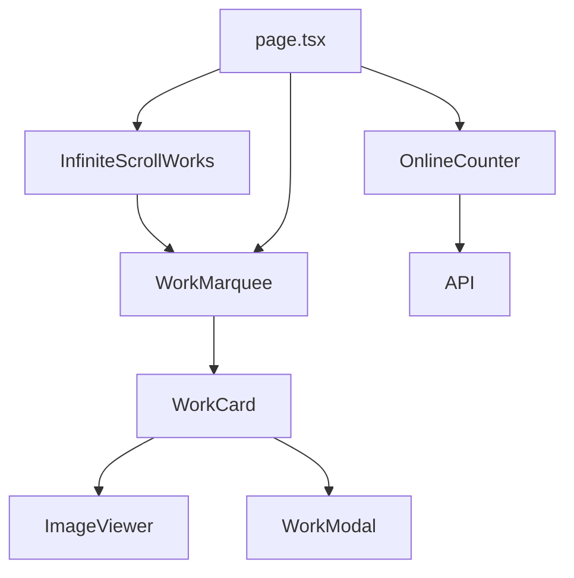
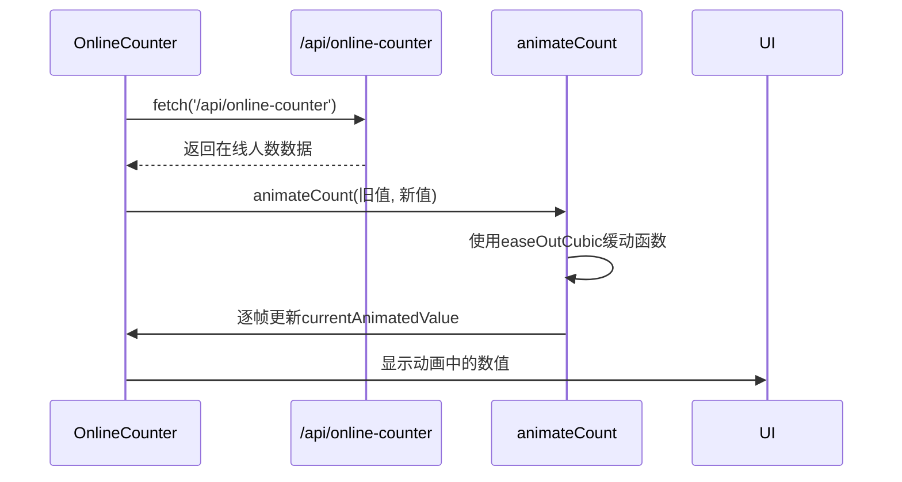
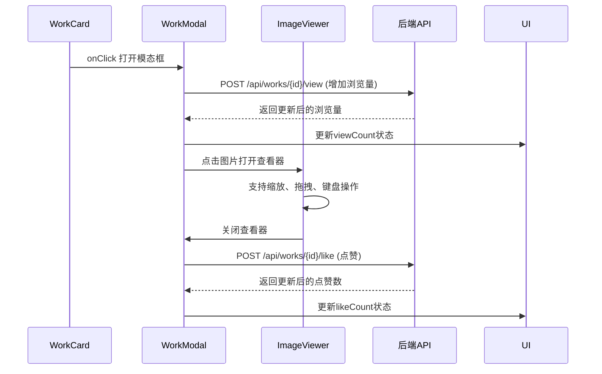
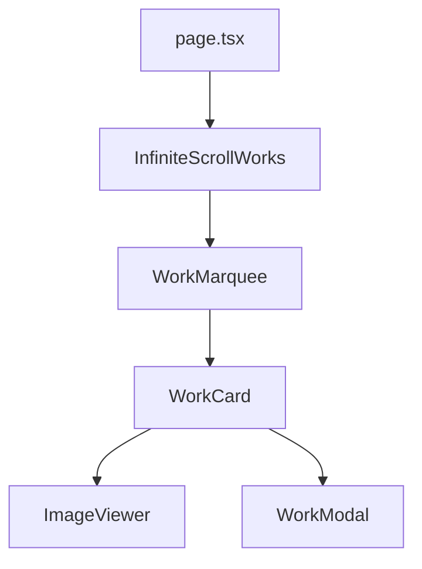

# 复合展示组件

<cite>
**本文档引用文件**  
- [WorkCard.tsx](file://src/components/WorkCard.tsx)
- [WorkMarquee.tsx](file://src/components/WorkMarquee.tsx)
- [OnlineCounter.tsx](file://src/components/OnlineCounter.tsx)
- [InfiniteScrollWorks.tsx](file://src/components/InfiniteScrollWorks.tsx)
- [WorkModal.tsx](file://src/components/WorkModal.tsx)
- [ImageViewer.tsx](file://src/components/ImageViewer.tsx)
- [work.d.ts](file://src/types/work.d.ts)
- [image-url.ts](file://src/lib/image-url.ts)
- [page.tsx](file://src/app/page.tsx)
- [route.ts](file://src/app/api/online-counter/route.ts)
- [init-online-counter.ts](file://src/lib/init-online-counter.ts)
</cite>

## 目录
1. [组件概述](#组件概述)
2. [作品卡片（WorkCard）](#作品卡片workcard)
3. [跑马灯展示（WorkMarquee）](#跑马灯展示workmarquee)
4. [在线人数计数器（OnlineCounter）](#在线人数计数器onlinecounter)
5. [无限滚动作品流（InfiniteScrollWorks）](#无限滚动作品流infinitescrollworks)
6. [图片查看器（ImageViewer）与作品模态框（WorkModal）](#图片查看器imageviewer-与作品模态框workmodal)
7. [组件嵌套使用最佳实践](#组件嵌套使用最佳实践)

## 组件概述

本项目包含多个复合展示组件，通过组合基础UI元素实现丰富的交互功能。核心组件包括`WorkCard`（作品卡片）、`WorkMarquee`（跑马灯）、`OnlineCounter`（在线计数器）和`InfiniteScrollWorks`（无限滚动），它们共同构建了数字化作品互动展示平台的前端展示层。

**组件关系图**


**图示来源**
- [InfiniteScrollWorks.tsx](file://src/components/InfiniteScrollWorks.tsx)
- [WorkMarquee.tsx](file://src/components/WorkMarquee.tsx)
- [WorkCard.tsx](file://src/components/WorkCard.tsx)
- [page.tsx](file://src/app/page.tsx)

## 作品卡片（WorkCard）

`WorkCard`组件是展示单个作品的核心UI单元，集成了图片展示、元数据和交互按钮。

### 输入属性
| 属性 | 类型 | 描述 |
|------|------|------|
| `work` | `WorkWithUser` | 作品数据对象，包含名称、作者、图片URL、点赞数等 |
| `onClick` | `() => void` | 点击卡片时的回调函数，通常用于打开作品详情 |
| `onLike` | `() => void` | 点击点赞按钮时的回调函数 |

### 核心功能
1. **图片展示**：使用`Image`组件加载作品图片，支持加载状态、错误处理和占位符
2. **精选徽章**：当`work.featured`为`true`时显示"精选"徽章
3. **交互按钮**：集成点赞（Like）和浏览量（View）展示，点赞按钮阻止事件冒泡以避免触发卡片点击
4. **响应式布局**：使用Tailwind CSS实现暗色模式支持和悬停动画效果

### 数据结构
```typescript
interface WorkWithUser extends Work {
  user?: {
    id: string;
    name: string;
    email: string;
  };
}
```

**组件来源**
- [WorkCard.tsx](file://src/components/WorkCard.tsx#L7-L92)
- [work.d.ts](file://src/types/work.d.ts#L1-L95)

## 跑马灯展示（WorkMarquee）

`WorkMarquee`组件利用CSS动画实现作品的无限滚动效果。

### 实现原理
1. **CSS动画**：通过Tailwind配置的`animate-marquee`和`animate-marquee-reverse`类实现水平滚动
2. **无缝滚动**：当作品数量不足时，自动复制作品数组以确保滚动的连续性
3. **渐变遮罩**：使用左右渐变遮罩实现平滑的视觉过渡效果

### 输入属性
| 属性 | 类型 | 描述 |
|------|------|------|
| `works` | `WorkWithUser[]` | 作品数组 |
| `onWorkClick` | `(work: WorkWithUser) => void` | 点击作品时的回调 |
| `direction` | `'left' \| 'right'` | 滚动方向，默认为'left' |
| `speed` | `number` | 滚动速度（秒），默认为30 |

### CSS动画配置
```javascript
// tailwind.config.js
theme: {
  extend: {
    animation: {
      'marquee': 'marquee 30s linear infinite',
      'marquee-reverse': 'marquee 30s linear infinite reverse',
    },
    keyframes: {
      marquee: {
        '0%': { transform: 'translateX(0%)' },
        '100%': { transform: 'translateX(-50%)' },
      },
    },
  },
}
```

**组件来源**
- [WorkMarquee.tsx](file://src/components/WorkMarquee.tsx#L6-L59)
- [tailwind.config.js](file://tailwind.config.js#L0-L25)

## 在线人数计数器（OnlineCounter）

`OnlineCounter`组件实时显示在线用户数，并带有平滑的数字滚动动画。

### 核心功能
1. **数据获取**：每10秒通过`/api/online-counter`接口获取最新在线人数
2. **动画效果**：使用`requestAnimationFrame`和缓动函数实现平滑的数字滚动动画
3. **状态管理**：维护当前计数、加载状态和动画状态

### 动画实现


### 输入属性
| 属性 | 类型 | 描述 |
|------|------|------|
| `className` | `string` | 自定义CSS类名 |

**组件来源**
- [OnlineCounter.tsx](file://src/components/OnlineCounter.tsx#L15-L157)
- [route.ts](file://src/app/api/online-counter/route.ts#L0-L188)
- [init-online-counter.ts](file://src/lib/init-online-counter.ts#L0-L52)

## 无限滚动作品流（InfiniteScrollWorks）

`InfiniteScrollWorks`组件实现分页加载和无限滚动功能。

### 核心功能
1. **分页加载**：通过`IntersectionObserver`监听加载指示器的可见性，自动加载下一页
2. **手动加载**：提供手动加载按钮作为备选方案
3. **数据缓存**：维护所有已加载作品的数组，避免重复请求

### 输入属性
| 属性 | 类型 | 描述 |
|------|------|------|
| `onWorkClick` | `(work: WorkWithUser) => void` | 点击作品时的回调 |
| `worksPerRow` | `number` | 每行显示的作品数，默认为8 |
| `refreshTrigger` | `number` | 刷新触发器，数值变化时重新加载数据 |
| `onNewContent` | `(count: number) => void` | 新内容加载完成时的回调 |

### 数据流
```mermaid
flowchart TD
A[初始加载] --> B[fetch /api/works?page=1]
B --> C{成功?}
C --> |是| D[更新allWorks状态]
C --> |否| E[显示错误信息]
D --> F[检查hasMore]
F --> |是| G[监听IntersectionObserver]
G --> H[滚动到加载区域]
H --> I[加载下一页]
I --> B
F --> |否| J[显示"已加载完毕"]
```

**组件来源**
- [InfiniteScrollWorks.tsx](file://src/components/InfiniteScrollWorks.tsx#L7-L267)
- [page.tsx](file://src/app/page.tsx#L0-L386)

## 图片查看器（ImageViewer）与作品模态框（WorkModal）

这两个组件协同工作，提供完整的作品详情查看体验。

### ImageViewer功能
1. **缩放控制**：支持鼠标滚轮缩放、按钮缩放和键盘快捷键
2. **拖拽移动**：在放大状态下可拖拽查看图片细节
3. **键盘支持**：支持ESC关闭、+/-缩放、0重置

### WorkModal功能
1. **作品详情**：显示作品名称、作者、创建时间等元数据
2. **提示词展示**：显示创作提示词并提供复制功能
3. **交互统计**：显示并更新点赞数和浏览量
4. **嵌套组件**：内部使用`ImageViewer`实现大图查看

### 交互流程


**组件来源**
- [WorkModal.tsx](file://src/components/WorkModal.tsx#L10-L308)
- [ImageViewer.tsx](file://src/components/ImageViewer.tsx#L13-L216)

## 组件嵌套使用最佳实践

### 首页作品流实现
在首页中，多个组件嵌套使用形成完整的作品展示流：



### 数据绑定示例
```typescript
// page.tsx 中的组件嵌套
<InfiniteScrollWorks 
  onWorkClick={handleWorkClick}
  worksPerRow={8}
  refreshTrigger={hotWorksRefreshTrigger}
  onNewContent={handleHotWorksNewContent}
/>
```

### 事件传递机制
1. **从内到外**：`WorkCard`的`onLike`回调传递给父组件进行状态更新
2. **从外到内**：`InfiniteScrollWorks`的`onWorkClick`传递给`WorkMarquee`，再传递给`WorkCard`
3. **状态同步**：使用`onWorkUpdate`回调确保作品数据在多个组件间保持一致

### 响应式布局策略
- 使用Tailwind CSS的`dark:`前缀实现暗色模式
- 使用`line-clamp`类实现文本截断
- 使用`aspect-video`保持图片宽高比
- 使用`hover:scale-105`实现悬停动画效果

**最佳实践来源**
- [page.tsx](file://src/app/page.tsx#L0-L386)
- [InfiniteScrollWorks.tsx](file://src/components/InfiniteScrollWorks.tsx#L7-L267)
- [WorkMarquee.tsx](file://src/components/WorkMarquee.tsx#L6-L59)