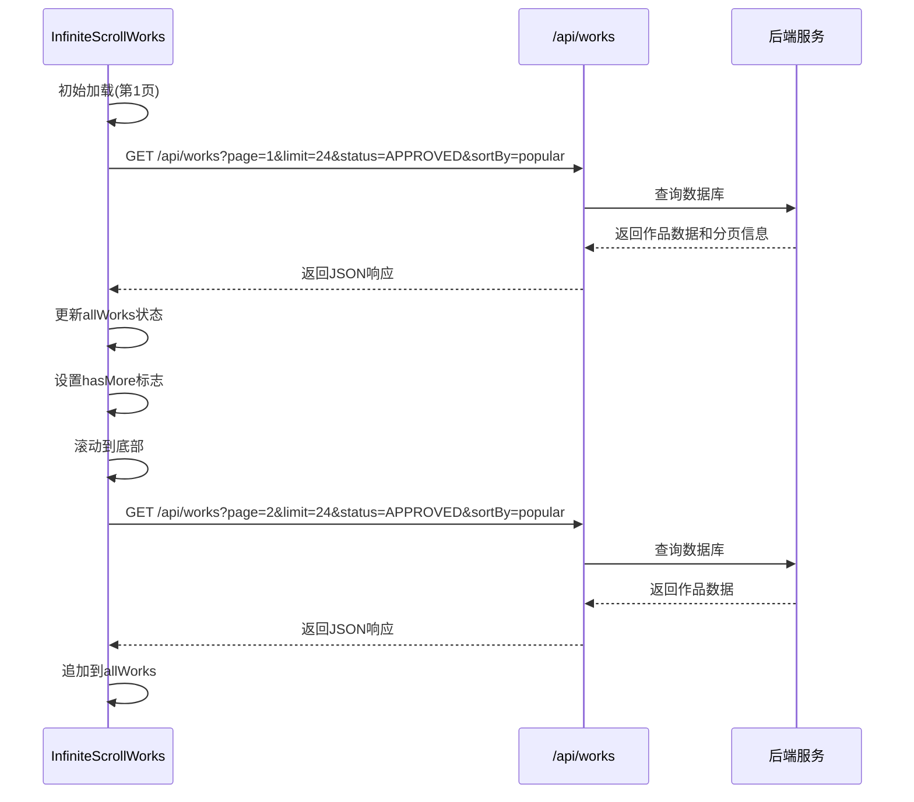
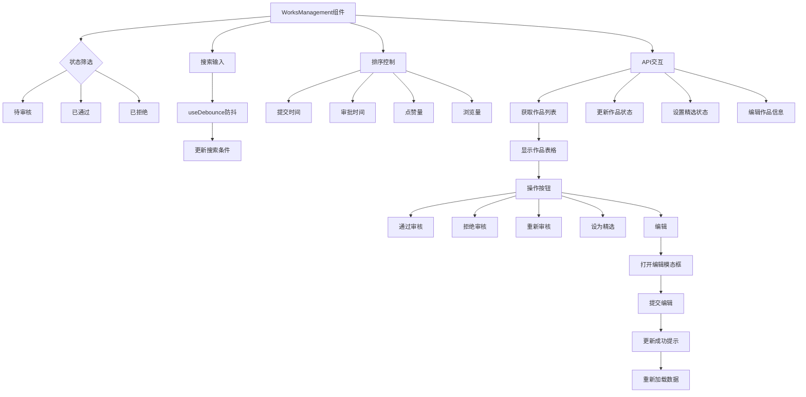

# 容器与状态管理组件

<cite>
**本文档中引用的文件**  
- [SessionWrapper.tsx](file://src/components/SessionWrapper.tsx)
- [InfiniteScrollWorks.tsx](file://src/components/InfiniteScrollWorks.tsx)
- [WorksManagement.tsx](file://src/components/admin/WorksManagement.tsx)
- [useApi.ts](file://src/hooks/useApi.ts)
</cite>

## 目录
1. [简介](#简介)
2. [核心容器组件概览](#核心容器组件概览)
3. [SessionWrapper：认证状态封装](#sessionwrapper认证状态封装)
4. [InfiniteScrollWorks：无限滚动与数据获取](#infinitescrollworks无限滚动与数据获取)
5. [WorksManagement：管理员作品管理容器](#worksmangement管理员作品管理容器)
6. [组件交互与状态流](#组件交互与状态流)
7. [使用示例与最佳实践](#使用示例与最佳实践)
8. [错误处理与性能优化](#错误处理与性能优化)
9. [总结](#总结)

## 简介
本文档详细说明了数字化作品互动展示平台中的三个核心容器型组件：`SessionWrapper`、`InfiniteScrollWorks` 和 `WorksManagement`。这些组件分别承担着认证状态管理、分页数据加载和管理员功能集成的关键职责。文档将深入分析其内部状态管理机制、数据获取流程、上下文封装能力以及与后端API的交互方式，并提供在不同场景下的使用示例和优化建议。

## 核心容器组件概览
本项目中的容器组件遵循职责分离原则，每个组件专注于特定的业务功能：
- `SessionWrapper`：为受保护路由提供统一的认证上下文
- `InfiniteScrollWorks`：实现作品列表的无限滚动加载，优化初始渲染性能
- `WorksManagement`：为管理员提供作品审核、编辑和批量操作的完整管理界面

这些组件通过组合使用自定义Hook（如`useApi`）和React状态管理，实现了复杂功能的模块化封装。

## SessionWrapper认证状态封装

`SessionWrapper` 组件是一个轻量级的高阶容器，其主要职责是通过 `next-auth/react` 提供的 `SessionProvider` 来封装和管理用户的认证状态。它作为应用的认证上下文入口，确保所有受保护的子组件都能访问到当前用户的会话信息。

该组件不包含复杂的逻辑或状态管理，而是作为一个纯粹的上下文提供者，将认证状态注入到React组件树中。任何需要访问用户登录状态、用户信息或进行权限控制的组件，都必须被包裹在 `SessionWrapper` 内。

**Section sources**
- [SessionWrapper.tsx](file://src/components/SessionWrapper.tsx#L9-L15)

## InfiniteScrollWorks无限滚动与数据获取

`InfiniteScrollWorks` 是一个功能丰富的容器组件，负责实现作品列表的分页加载和无限滚动功能。它通过结合 `useApi` Hook 和 `IntersectionObserver` API，实现了高效的数据获取和用户体验优化。

### Props设计
- `onWorkClick`: 点击作品时的回调函数
- `worksPerRow`: 每行显示的作品数量，默认为8
- `refreshTrigger`: 外部触发刷新的信号值
- `onNewContent`: 新内容加载完成后的回调函数

### 内部状态管理
组件使用多个 `useState` 和 `useRef` 来管理复杂的状态：
- `allWorks`: 存储所有已加载的作品数据
- `loading`: 控制加载状态显示
- `hasMore`: 标识是否还有更多数据可加载
- `page`: 当前页码
- `error`: 存储加载错误信息

使用 `useRef` 来避免闭包问题，确保在异步操作中能访问到最新的状态值。

### 数据获取流程
组件通过直接调用 `/api/works` 接口获取数据，采用基于页码的分页策略：
1. 初始加载第一页数据
2. 当用户滚动到页面底部时，自动加载下一页
3. 支持手动点击"加载更多"按钮触发加载
4. 提供错误重试机制

数据请求参数包括分页信息、状态过滤（APPROVED）和排序方式（popular），确保只加载已审核通过的热门作品。



**Diagram sources**
- [InfiniteScrollWorks.tsx](file://src/components/InfiniteScrollWorks.tsx#L7-L267)

**Section sources**
- [InfiniteScrollWorks.tsx](file://src/components/InfiniteScrollWorks.tsx#L7-L267)
- [useApi.ts](file://src/hooks/useApi.ts#L19-L85)

## Worksmangement管理员作品管理容器

`WorksManagement` 组件是管理员专用的复合容器，集成了作品列表展示、筛选、排序、审核和编辑等多种功能。它展示了如何在一个组件中协调管理多个子状态和复杂的用户交互。

### 功能特性
- **多状态筛选**：支持待审核、已通过、已拒绝三种状态的筛选
- **搜索功能**：通过防抖技术实现作品名称和作者的实时搜索
- **排序控制**：对已通过作品支持按提交时间、审批时间、点赞量和浏览量排序
- **批量操作**：提供通过、拒绝、重新审核、设为精选等批量操作按钮
- **模态框交互**：集成作品详情查看和编辑功能

### 状态管理机制
组件使用 `useState` 管理多个独立的状态变量：
- `works`: 当前页的作品数据
- `pagination`: 分页元数据
- `currentPage`: 当前页码
- `statusFilter`: 状态筛选条件
- `searchTerm`: 搜索关键词
- `sortBy` 和 `sortOrder`: 排序配置
- `selectedWork` 和 `editingWork`: 模态框相关状态

通过 `useDebounce` Hook 对搜索输入进行防抖处理，减少不必要的API调用。

### 与后端API交互
组件主要与以下API端点交互：
- `GET /api/admin/works`: 获取作品列表（带分页和筛选）
- `PATCH /api/admin/works/[id]`: 更新作品状态
- `PATCH /api/admin/works/[id]/featured`: 设置/取消精选状态
- `GET /api/admin/works/[id]/edit`: 获取作品编辑详情
- `PUT /api/admin/works/[id]/edit`: 更新作品信息

使用 `useApi` Hook 管理API请求的状态（加载、错误、数据），并通过 `execute` 函数触发具体的请求。



**Diagram sources**
- [WorksManagement.tsx](file://src/components/admin/WorksManagement.tsx#L22-L782)

**Section sources**
- [WorksManagement.tsx](file://src/components/admin/WorksManagement.tsx#L22-L782)
- [useApi.ts](file://src/hooks/useApi.ts#L19-L85)

## 组件交互与状态流

这三个容器组件共同构成了应用的核心数据流和状态管理体系：
- `SessionWrapper` 提供全局认证上下文，是所有受保护组件的基础
- `InfiniteScrollWorks` 依赖于认证状态，但不直接与 `SessionWrapper` 交互，而是通过应用的整体架构间接使用会话信息
- `WorksManagement` 作为管理员专用组件，其访问本身就受到认证状态的保护

数据获取方面，`InfiniteScrollWorks` 和 `WorksManagement` 都使用了 `useApi` Hook，体现了代码复用和统一的API交互模式。两者的主要区别在于：
- `InfiniteScrollWorks` 使用直接的 `fetch` 调用，专注于性能优化
- `WorksManagement` 使用 `useApi` Hook，更注重状态管理和错误处理

```mermaid
graph TD
A[SessionWrapper] --> |提供认证上下文| B[应用组件树]
B --> C[InfiniteScrollWorks]
B --> D[WorksManagement]
C --> |直接fetch| E[/api/works]
D --> |useApi Hook| F[/api/admin/works]
D --> |直接fetch| G[/api/admin/works/[id]]
H[useApi] --> |封装| I[统一的API交互模式]
C --> |独立管理| J[滚动加载状态]
D --> |复杂管理| K[筛选、排序、分页状态]
style A fill:#f9f,stroke:#333
style C fill:#bbf,stroke:#333
style D fill:#f96,stroke:#333
```

**Diagram sources**
- [SessionWrapper.tsx](file://src/components/SessionWrapper.tsx#L9-L15)
- [InfiniteScrollWorks.tsx](file://src/components/InfiniteScrollWorks.tsx#L7-L267)
- [WorksManagement.tsx](file://src/components/admin/WorksManagement.tsx#L22-L782)
- [useApi.ts](file://src/hooks/useApi.ts#L19-L85)

## 使用示例与最佳实践

### SessionWrapper使用示例
```tsx
<SessionWrapper>
  <ProtectedRoute />
</SessionWrapper>
```

### InfiniteScrollWorks使用示例
```tsx
<InfiniteScrollWorks 
  onWorkClick={handleWorkClick}
  worksPerRow={6}
  refreshTrigger={refreshCount}
  onNewContent={handleNewContent}
/>
```

### WorksManagement使用场景
该组件应仅在管理员路由中使用：
```tsx
// app/admin/page.tsx
import { WorksManagement } from '@/components/admin/WorksManagement';

export default function AdminPage() {
  return <WorksManagement />;
}
```

### 最佳实践建议
1. **状态管理**：对于简单上下文使用 `Context`，对于复杂状态考虑使用 `useReducer`
2. **性能优化**：对频繁更新的状态使用 `useRef` 避免闭包问题
3. **错误处理**：提供用户友好的错误提示和重试机制
4. **防抖策略**：对搜索等高频操作使用防抖技术
5. **资源清理**：在 `useEffect` 中正确清理 `IntersectionObserver` 等资源

## 错误处理与性能优化

### 错误处理策略
- **网络错误**：捕获 `fetch` 异常，显示友好的错误消息
- **API错误**：解析响应中的错误信息并展示给用户
- **重试机制**：提供"重试"按钮，允许用户手动重新加载数据
- **边界情况**：处理空数据、无更多数据等边界情况

### 性能优化措施
- **分页加载**：减少初始渲染的数据量，提升首屏加载速度
- **IntersectionObserver**：实现真正的无限滚动，避免预加载所有数据
- **防抖搜索**：减少不必要的API调用，降低服务器压力
- **状态同步**：使用 `useRef` 同步状态，避免因闭包导致的状态不一致问题
- **条件渲染**：根据状态条件渲染不同的UI组件，减少不必要的渲染

## 总结
`SessionWrapper`、`InfiniteScrollWorks` 和 `WorksManagement` 三个容器组件展示了现代React应用中状态管理、数据获取和上下文封装的最佳实践。它们通过合理的职责划分和复用机制，构建了一个高效、可维护的前端架构。开发者在使用这些组件时，应遵循其设计模式，充分利用其提供的功能，同时注意性能优化和错误处理，以提供优质的用户体验。