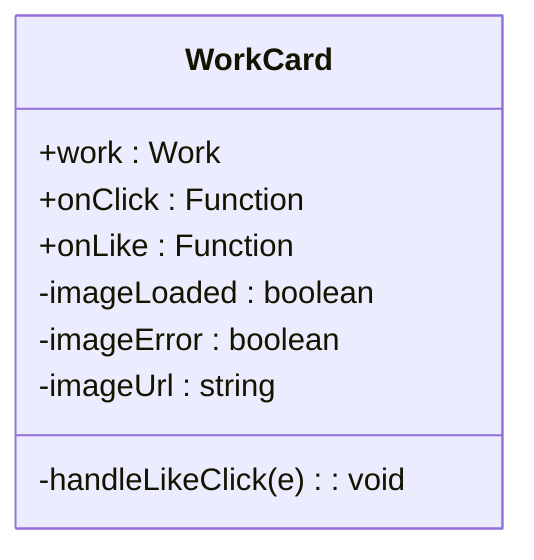
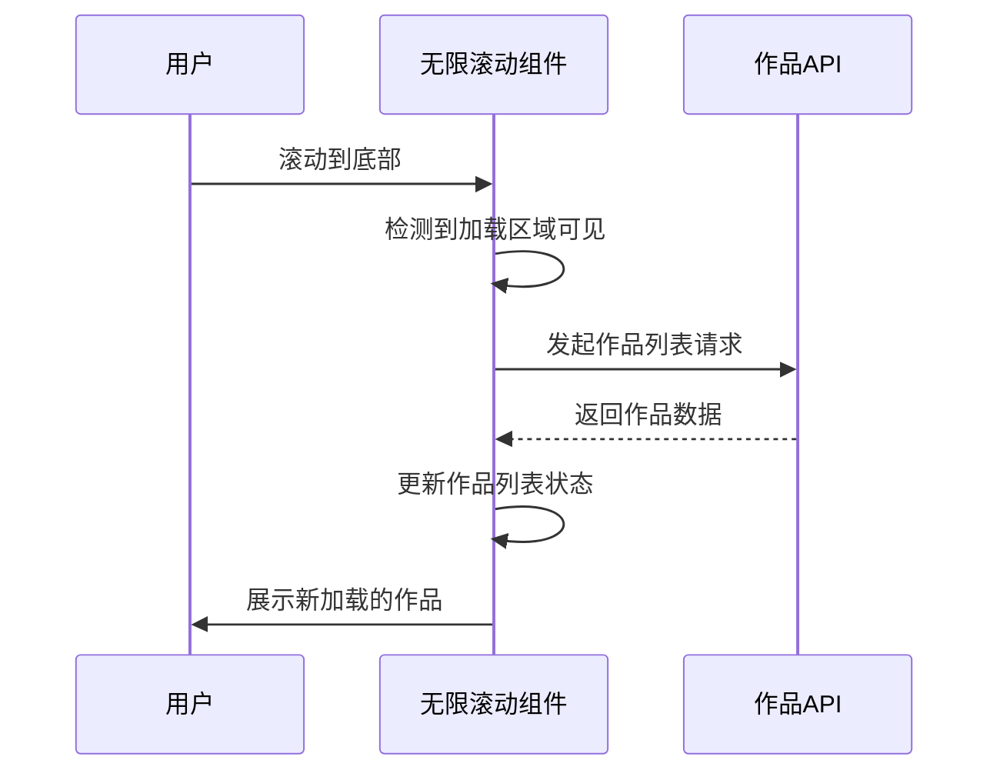
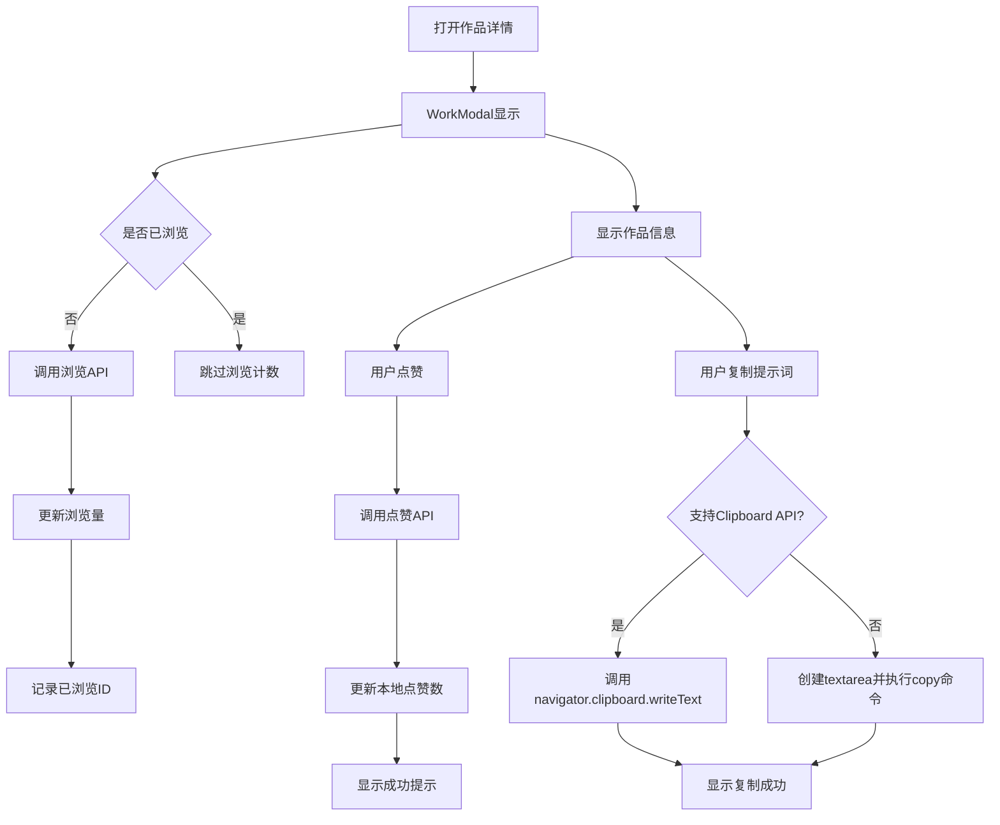
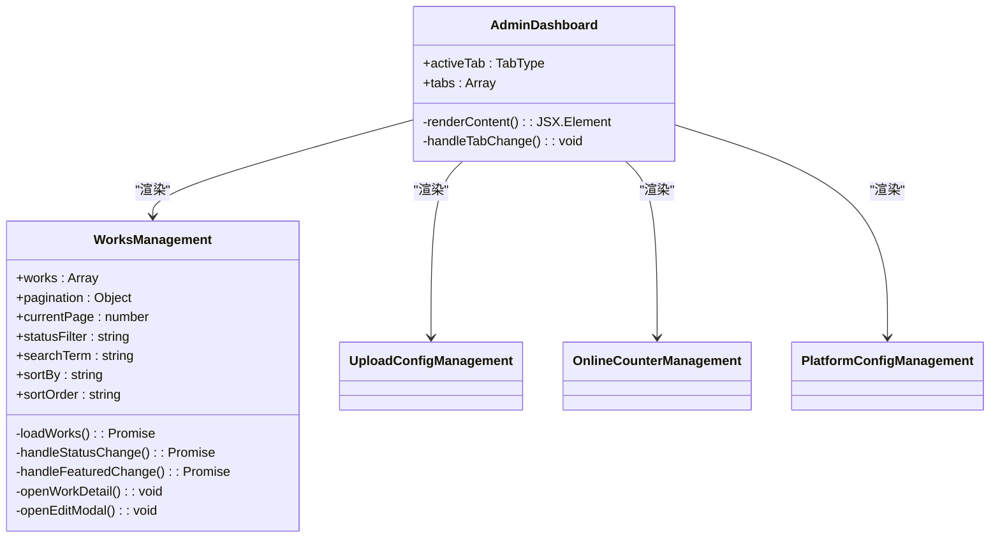

# 组件体系

<cite>
**本文档引用文件**  
- [WorkCard.tsx](file://src/components/WorkCard.tsx)
- [WorkModal.tsx](file://src/components/WorkModal.tsx)
- [ImageViewer.tsx](file://src/components/ImageViewer.tsx)
- [AdminDashboard.tsx](file://src/components/admin/AdminDashboard.tsx)
- [WorksManagement.tsx](file://src/components/admin/WorksManagement.tsx)
- [Header.tsx](file://src/components/Header.tsx)
- [LoadingSpinner.tsx](file://src/components/LoadingSpinner.tsx)
- [SessionWrapper.tsx](file://src/components/SessionWrapper.tsx)
- [InfiniteScrollWorks.tsx](file://src/components/InfiniteScrollWorks.tsx)
- [WorkMarquee.tsx](file://src/components/WorkMarquee.tsx)
</cite>

## 目录
1. [简介](#简介)
2. [基础组件](#基础组件)
3. [复合组件](#复合组件)
4. [容器型组件](#容器型组件)
5. [作品展示组件协同机制](#作品展示组件协同机制)
6. [管理员专用组件](#管理员专用组件)
7. [组件调用示例与可定制化](#组件调用示例与可定制化)
8. [响应式适配策略](#响应式适配策略)

## 简介
本文档详细阐述了数字化作品互动展示平台的前端组件体系，聚焦于UI组件的分层设计与复用机制。系统采用分层架构，将组件划分为基础、复合和容器型三类，实现高内聚、低耦合的设计目标。通过组合与封装，各层级组件协同工作，构建出完整的用户界面与交互体验。

## 基础组件
基础组件是系统中最底层的UI元素，提供原子化的视觉与交互功能。

### Header
`Header` 组件作为全局导航栏，集成平台主标题、页面标题和在线人数显示。支持动态平台标题获取，通过API调用更新显示内容。提供平台名称点击跳转、用户个人中心访问、登录/登出操作及管理员入口等功能。组件采用响应式设计，适配不同屏幕尺寸，并使用渐变背景增强视觉效果。

**组件来源**
- [Header.tsx](file://src/components/Header.tsx#L21-L115)

### LoadingSpinner
`LoadingSpinner` 组件用于展示加载状态，提供三种尺寸（小、中、大）以适应不同场景。通过`size`属性控制旋转动画大小，`text`属性自定义加载提示文本，`className`支持外部样式扩展。组件采用Flex布局居中显示，包含旋转动画和可选的文字提示。

**组件来源**
- [LoadingSpinner.tsx](file://src/components/LoadingSpinner.tsx#L8-L31)

## 复合组件
复合组件由多个基础组件组合而成，实现特定业务功能。

### WorkCard
`WorkCard` 组件用于展示单个作品的缩略信息，包含作品图片、名称、作者、点赞数和浏览量。支持精选作品徽章显示，通过`work.featured`字段判断是否展示。图片加载采用懒加载策略，包含加载中、加载失败和成功三种状态处理。点赞按钮点击时阻止事件冒泡，避免触发卡片整体点击事件。组件具备悬停放大效果和阴影变化，提升交互体验。

**组件来源**
- [WorkCard.tsx](file://src/components/WorkCard.tsx#L7-L92)

### WorkMarquee
`WorkMarquee` 组件实现作品横向滚动展示效果，支持左右两个方向。通过CSS动画实现无缝滚动，当作品数量不足时自动复制填充以保证滚动连续性。组件包含左右渐变遮罩，提升视觉层次感。每个滚动单元包含多个`WorkCard`，形成作品流效果。

**组件来源**
- [WorkMarquee.tsx](file://src/components/WorkMarquee.tsx#L6-L59)

## 容器型组件
容器型组件负责数据获取、状态管理和组件组合，是功能模块的核心。

### SessionWrapper
`SessionWrapper` 组件作为会话提供者，包裹整个应用，为子组件提供认证会话上下文。通过`SessionProvider`来自NextAuth，实现用户登录状态的全局管理。所有需要访问用户会话的组件都必须位于此容器内部。

**组件来源**
- [SessionWrapper.tsx](file://src/components/SessionWrapper.tsx#L9-L15)

### InfiniteScrollWorks
`InfiniteScrollWorks` 组件实现无限滚动加载作品列表功能。通过IntersectionObserver监听底部加载区域，实现滚动触底自动加载。支持手动加载按钮作为备选方案。组件将作品按行分组，每行使用`WorkMarquee`进行滚动展示，形成多行滚动效果。具备加载中、加载失败、无更多数据等状态提示，并支持刷新触发器实现数据重载。

**组件来源**
- [InfiniteScrollWorks.tsx](file://src/components/InfiniteScrollWorks.tsx#L7-L267)

## 作品展示组件协同机制
作品展示相关组件通过事件驱动和状态共享实现协同工作，为用户提供完整的浏览体验。

### WorkModal
`WorkModal` 组件作为作品详情展示模态框，集成作品信息、点赞功能和提示词展示。打开时自动增加浏览量，并记录到sessionStorage防止重复计数。点赞功能通过API调用实现，成功后更新本地点赞数并通知父组件。支持提示词复制功能，兼容现代Clipboard API和传统document.execCommand降级方案。

**组件来源**
- [WorkModal.tsx](file://src/components/WorkModal.tsx#L10-L308)

### ImageViewer
`ImageViewer` 组件提供作品图片的增强查看功能，支持缩放、拖拽和键盘快捷键操作。集成滚轮缩放、鼠标拖拽移动、ESC关闭、+/-/0快捷键等交互方式。通过transform属性实现图片缩放和平移，保持高性能。模态框层级高于`WorkModal`，实现图片的全屏查看体验。

**组件来源**
- [ImageViewer.tsx](file://src/components/ImageViewer.tsx#L13-L216)

## 管理员专用组件
管理员专用组件封装了后台管理功能，提供作品审核、配置管理等高级功能。

### AdminDashboard
`AdminDashboard` 组件作为管理员后台的主界面，采用标签页布局组织不同管理功能。包含作品管理、上传配置、在线人数和平台配置四个功能模块。通过`activeTab`状态管理当前激活的标签页，动态渲染对应的内容组件。提供主题切换和退出登录功能，确保管理员操作的便捷性。

**组件来源**
- [AdminDashboard.tsx](file://src/components/admin/AdminDashboard.tsx#L12-L89)

### WorksManagement
`WorksManagement` 组件实现作品的全生命周期管理，包括审核、编辑、精选设置等功能。支持按状态（待审核、已通过、已拒绝）筛选，提供搜索和排序功能。对于已通过的作品，支持按点赞量、浏览量等维度排序。审核操作包含通过、拒绝和重新审核，拒绝时可输入理由。支持将作品设为精选或取消精选，影响前端展示优先级。提供作品信息编辑功能，可修改作品名称、作者和提示词。

**组件来源**
- [WorksManagement.tsx](file://src/components/admin/WorksManagement.tsx#L22-L782)

## 组件调用示例与可定制化
各组件提供灵活的API接口，支持多种定制化选项。

### 可定制化选项
- **className**: 所有组件均支持`className`属性，允许外部样式覆盖
- **回调函数**: 组件通过`onClick`、`onLike`、`onClose`等回调函数暴露交互事件
- **条件渲染**: 通过布尔属性控制特定元素的显示，如`work.featured`
- **文本定制**: 支持自定义提示文本，如`LoadingSpinner`的`text`属性

### 组件组合示例
作品展示页面通过`InfiniteScrollWorks`、`WorkMarquee`和`WorkCard`的组合实现：
1. `InfiniteScrollWorks` 负责数据获取和分页管理
2. 将作品数据按行分组，每行传递给`WorkMarquee`
3. `WorkMarquee` 将每件作品传递给`WorkCard`进行渲染
4. `WorkCard` 的点击事件触发`WorkModal`显示详情

## 响应式适配策略
系统采用移动优先的响应式设计策略，确保在不同设备上均有良好体验。

### 断点设计
- **移动设备** (<768px): 单列布局，字体适中，触摸友好
- **平板设备** (768px-1200px): 多列布局，适当增加元素尺寸
- **桌面设备** (>1200px): 宽屏布局，充分利用屏幕空间

### 媒体查询应用
- 图片`sizes`属性根据屏幕宽度调整加载策略
- `Header` 组件在不同尺寸下调整字体大小
- 表格在小屏幕上自动水平滚动
- 模态框最大宽度根据屏幕尺寸调整

### 触摸优化
- 所有可点击元素具备足够触摸区域
- 滚动组件支持触摸滑动
- 避免依赖悬停效果作为主要交互方式