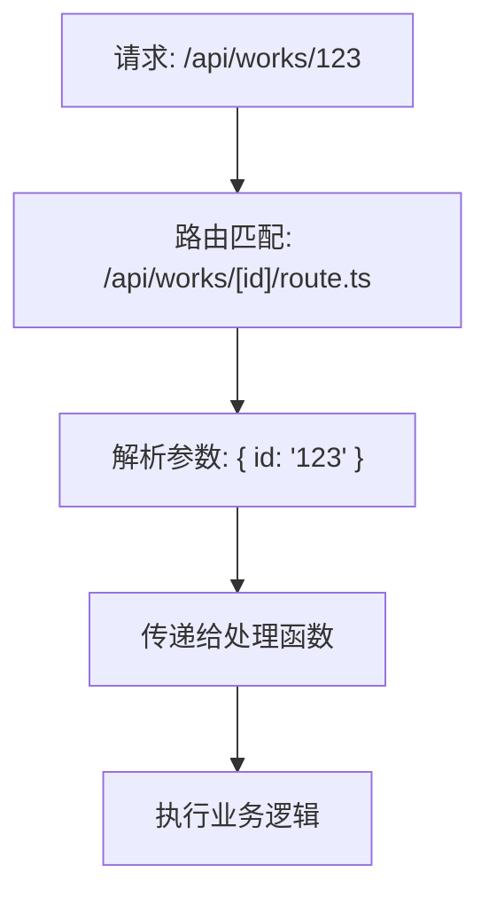
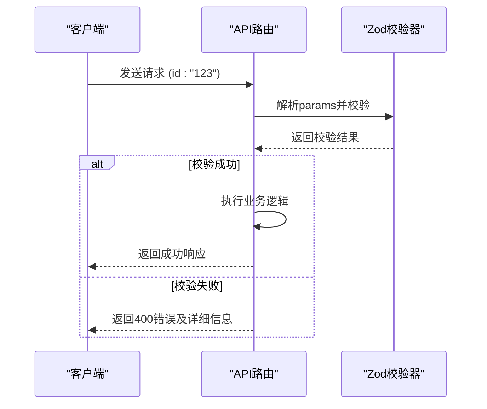
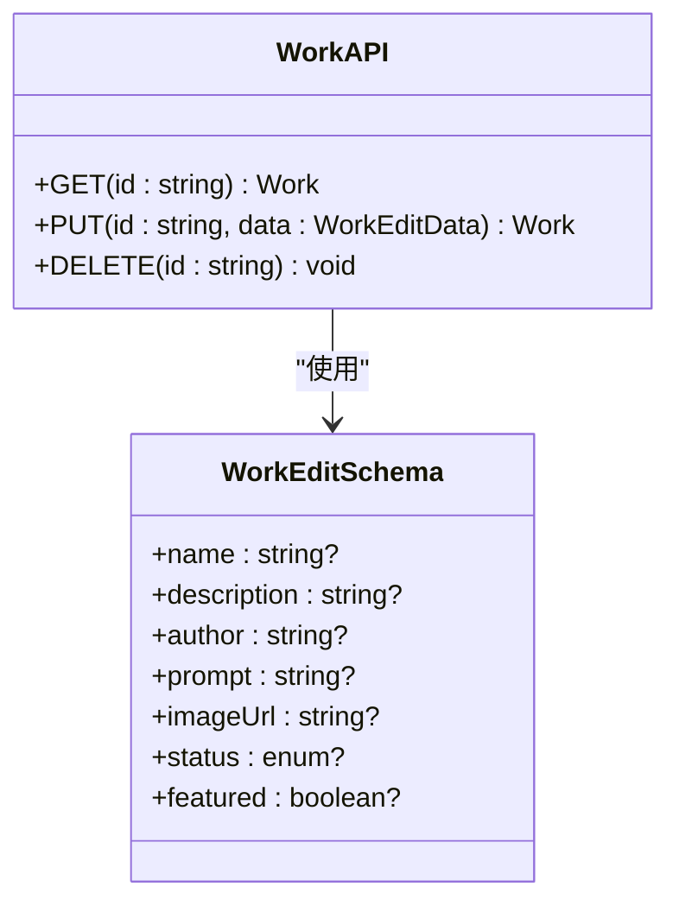
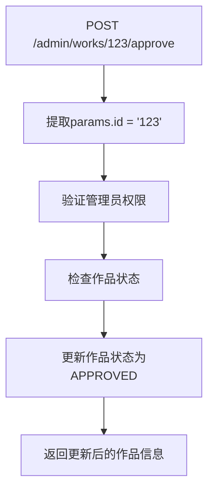
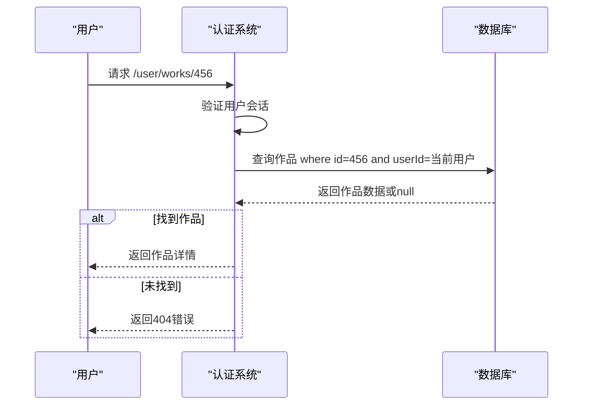
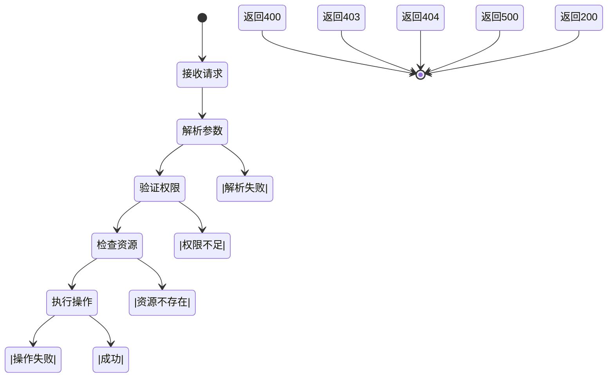

# 动态参数解析

<cite>
**本文档引用的文件**
- [src/app/api/works/[id]/route.ts](file://src/app/api/works/[id]/route.ts)
- [src/app/api/admin/works/[id]/approve/route.ts](file://src/app/api/admin/works/[id]/approve/route.ts)
- [src/app/api/admin/works/[id]/reject/route.ts](file://src/app/api/admin/works/[id]/reject/route.ts)
- [src/app/api/works/[id]/like/route.ts](file://src/app/api/works/[id]/like/route.ts)
- [src/app/api/admin/works/[id]/edit/route.ts](file://src/app/api/admin/works/[id]/edit/route.ts)
- [src/app/api/user/works/[id]/route.ts](file://src/app/api/user/works/[id]/route.ts)
- [src/app/api/admin/users/[id]/route.ts](file://src/app/api/admin/users/[id]/route.ts)
- [src/app/api/works/[id]/view/route.ts](file://src/app/api/works/[id]/view/route.ts)
- [src/lib/auth.ts](file://src/lib/auth.ts)
- [src/nextjs15-type-fixes-report.md](file://src/nextjs15-type-fixes-report.md)
</cite>

## 目录
1. [引言](#引言)
2. [动态路由参数基础机制](#动态路由参数基础机制)
3. [多层级动态路径匹配规则](#多层级动态路径匹配规则)
4. [参数提取与类型处理](#参数提取与类型处理)
5. [结合Zod的安全参数校验](#结合zod的安全参数校验)
6. [实际应用场景分析](#实际应用场景分析)
7. [错误处理与边界情况](#错误处理与边界情况)
8. [最佳实践建议](#最佳实践建议)

## 引言
Next.js App Router提供了强大的动态路由功能，允许开发者创建灵活的API接口。本文档深入分析动态路由参数的提取与使用机制，重点探讨`[id]`等动态段如何通过`params`对象在服务器端API路由中获取。结合作品详情页、管理员审核接口等实际代码示例，展示参数传递流程，并解释多层级动态路径的匹配规则与优先级处理逻辑。

## 动态路由参数基础机制

在Next.js App Router中，动态路由参数通过方括号`[]`语法定义。当请求到达时，Next.js会自动将URL中的动态段解析为`params`对象，供API路由函数使用。



**图示来源**
- [src/app/api/works/[id]/route.ts](file://src/app/api/works/[id]/route.ts#L1-L328)

**本节来源**
- [src/app/api/works/[id]/route.ts](file://src/app/api/works/[id]/route.ts#L1-L328)

## 多层级动态路径匹配规则

项目中存在复杂的多层级动态路径结构，如`/admin/works/[id]/approve`。Next.js按照从具体到抽象的优先级进行路由匹配，确保更具体的静态路径优先于动态路径。

```mermaid
graph TB
A[/admin/works/[id]/approve] --> B[第一层: admin]
A --> C[第二层: works]
A --> D[第三层: [id] - 动态参数]
A --> E[第四层: approve]
D --> F["params.id = '作品ID'"]
E --> G["对应 approve/route.ts"]
```

**图示来源**
- [src/app/api/admin/works/[id]/approve/route.ts](file://src/app/api/admin/works/[id]/approve/route.ts#L1-L76)
- [src/app/api/admin/works/[id]/reject/route.ts](file://src/app/api/admin/works/[id]/reject/route.ts#L1-L95)

**本节来源**
- [src/app/api/admin/works/[id]/approve/route.ts](file://src/app/api/admin/works/[id]/approve/route.ts#L1-L76)
- [src/app/api/admin/works/[id]/reject/route.ts](file://src/app/api/admin/works/[id]/reject/route.ts#L1-L95)

## 参数提取与类型处理

在Next.js 15中，动态路由参数`params`被定义为Promise类型，需要使用`await`关键字进行解析。这种设计提高了类型安全性，避免了潜在的异步问题。

```typescript
interface RouteParams {
  params: Promise<{
    id: string;
  }>;
}

export async function GET(
  request: NextRequest,
  { params }: RouteParams
) {
  const { id } = await params; // 必须使用await
  // 使用id参数进行业务逻辑处理
}
```

**本节来源**
- [src/nextjs15-type-fixes-report.md](file://src/nextjs15-type-fixes-report.md#L184-L224)
- [src/app/api/works/[id]/route.ts](file://src/app/api/works/[id]/route.ts#L1-L328)

## 结合Zod的安全参数校验

项目采用Zod库对动态参数和请求体进行严格的类型校验，确保数据的安全性和完整性。Zod提供了优雅的类型推断和详细的错误信息。



**图示来源**
- [src/app/api/admin/works/[id]/reject/route.ts](file://src/app/api/admin/works/[id]/reject/route.ts#L1-L95)
- [src/app/api/works/[id]/route.ts](file://src/app/api/works/[id]/route.ts#L1-L328)

**本节来源**
- [src/app/api/admin/works/[id]/reject/route.ts](file://src/app/api/admin/works/[id]/reject/route.ts#L1-L95)
- [src/app/api/works/[id]/route.ts](file://src/app/api/works/[id]/route.ts#L1-L328)

## 实际应用场景分析

### 作品详情页参数处理
作品详情页通过`[id]`参数获取特定作品信息，实现了GET、PUT、DELETE等操作的统一接口。



**图示来源**
- [src/app/api/works/[id]/route.ts](file://src/app/api/works/[id]/route.ts#L1-L328)

**本节来源**
- [src/app/api/works/[id]/route.ts](file://src/app/api/works/[id]/route.ts#L1-L328)

### 管理员审核接口
管理员审核接口展示了多层级动态路径的典型应用，通过`/admin/works/[id]/approve`和`/admin/works/[id]/reject`实现审核功能。



**图示来源**
- [src/app/api/admin/works/[id]/approve/route.ts](file://src/app/api/admin/works/[id]/approve/route.ts#L1-L76)

**本节来源**
- [src/app/api/admin/works/[id]/approve/route.ts](file://src/app/api/admin/works/[id]/approve/route.ts#L1-L76)
- [src/app/api/admin/works/[id]/reject/route.ts](file://src/app/api/admin/works/[id]/reject/route.ts#L1-L95)

### 用户作品管理
用户作品管理接口通过`/user/works/[id]`实现对用户自己作品的访问控制，确保只能操作自己的作品。



**图示来源**
- [src/app/api/user/works/[id]/route.ts](file://src/app/api/user/works/[id]/route.ts#L1-L140)

**本节来源**
- [src/app/api/user/works/[id]/route.ts](file://src/app/api/user/works/[id]/route.ts#L1-L140)

## 错误处理与边界情况

系统对各种边界情况进行了全面的错误处理，包括参数不存在、权限不足、资源未找到等情况。



**图示来源**
- [src/app/api/works/[id]/route.ts](file://src/app/api/works/[id]/route.ts#L1-L328)
- [src/app/api/admin/works/[id]/approve/route.ts](file://src/app/api/admin/works/[id]/approve/route.ts#L1-L76)

**本节来源**
- [src/app/api/works/[id]/route.ts](file://src/app/api/works/[id]/route.ts#L1-L328)
- [src/app/api/admin/works/[id]/approve/route.ts](file://src/app/api/admin/works/[id]/approve/route.ts#L1-L76)
- [src/app/api/admin/works/[id]/reject/route.ts](file://src/app/api/admin/works/[id]/reject/route.ts#L1-L95)

## 最佳实践建议

1. **始终使用await解析params**：Next.js 15中params为Promise类型，必须使用await
2. **实施严格的输入验证**：使用Zod等库对所有输入数据进行验证
3. **合理的权限控制**：在访问资源前验证用户权限
4. **详细的错误处理**：提供清晰的错误信息和适当的HTTP状态码
5. **保持接口一致性**：相似功能的API应保持一致的响应格式

**本节来源**
- [src/nextjs15-type-fixes-report.md](file://src/nextjs15-type-fixes-report.md#L184-L224)
- [src/lib/auth.ts](file://src/lib/auth.ts#L1-L72)