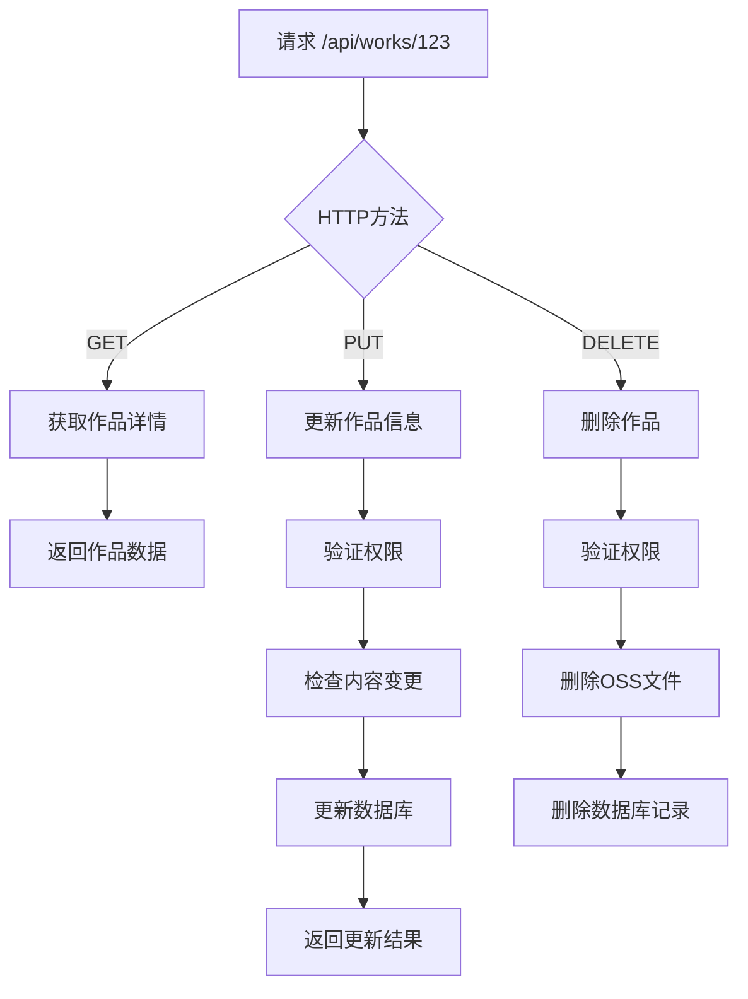
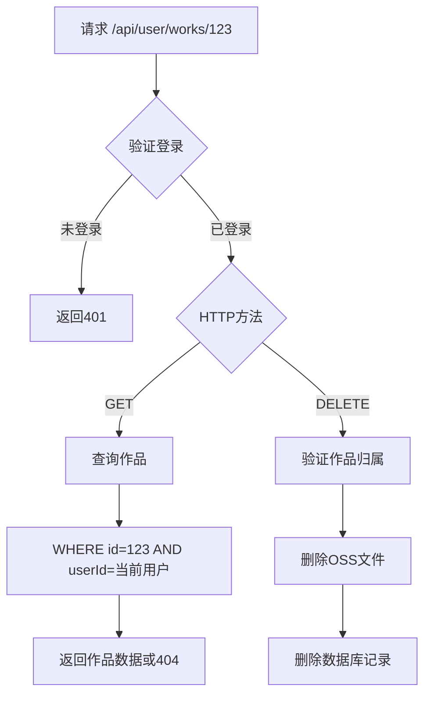
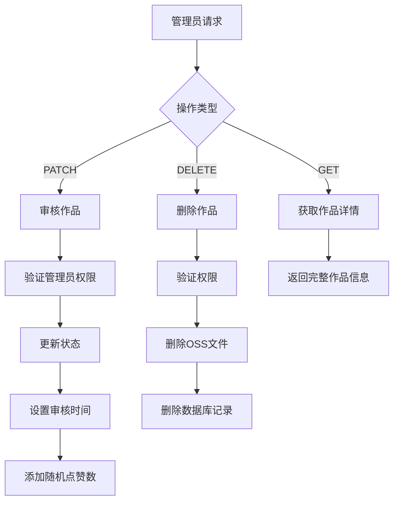
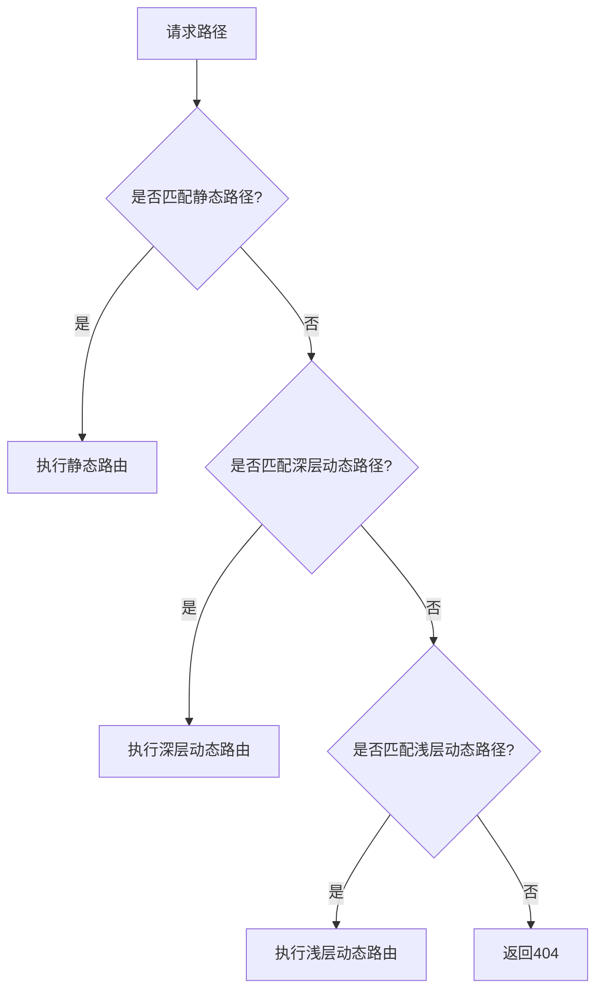
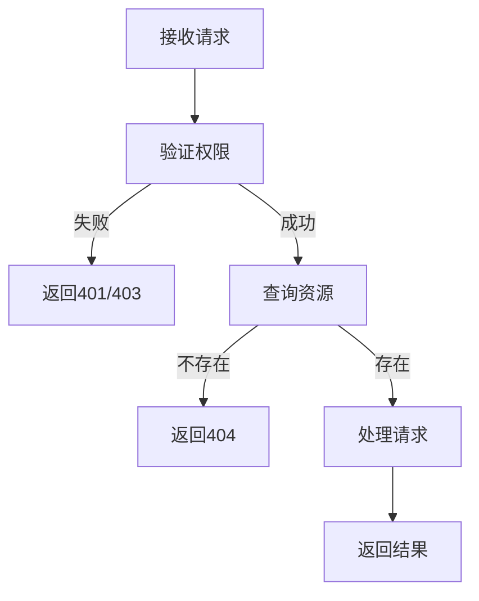
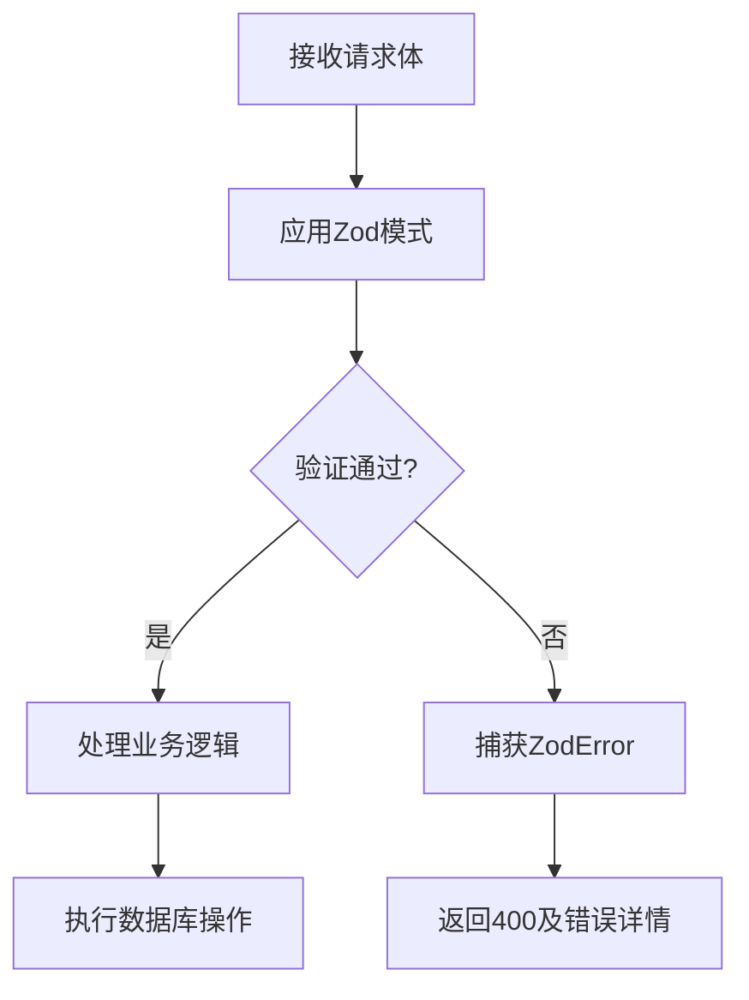

# 动态路由

<cite>
**本文档中引用的文件**  
- [src\app\api\admin\works\[id]\route.ts](file://src/app/api/admin/works/[id]/route.ts)
- [src\app\api\user\works\[id]\route.ts](file://src/app/api/user/works/[id]/route.ts)
- [src\app\api\works\[id]\route.ts](file://src/app/api/works/[id]/route.ts)
- [src\app\api\admin\users\[id]\route.ts](file://src/app/api/admin/users/[id]/route.ts)
- [src\app\api\works\[id]\like\route.ts](file://src/app/api/works/[id]/like/route.ts)
- [src\app\api\works\[id]\view\route.ts](file://src/app/api/works/[id]/view/route.ts)
- [src\app\api\admin\works\[id]\approve\route.ts](file://src/app/api/admin/works/[id]/approve/route.ts)
- [src\app\api\admin\works\[id]\reject\route.ts](file://src/app/api/admin/works/[id]/reject/route.ts)
- [src\app\api\admin\works\[id]\featured\route.ts](file://src/app/api/admin/works/[id]/featured/route.ts)
- [src\app\api\admin\works\[id]\edit\route.ts](file://src/app/api/admin/works/[id]/edit/route.ts)
</cite>

## 目录
1. [引言](#引言)
2. [动态路由基础机制](#动态路由基础机制)
3. [作品详情场景中的动态路由](#作品详情场景中的动态路由)
4. [用户作品管理场景中的动态路由](#用户作品管理场景中的动态路由)
5. [管理员审核场景中的动态路由](#管理员审核场景中的管理员审核)
6. [多层级动态路径组合](#多层级动态路径组合)
7. [参数提取与数据获取](#参数提取与数据获取)
8. [动态路由匹配优先级](#动态路由匹配优先级)
9. [静态生成优化策略](#静态生成优化策略)
10. [异常参数处理与404页面](#异常参数处理与404页面)
11. [基于Zod的参数校验实践](#基于zod的参数校验实践)
12. [总结](#总结)

## 引言
本文档深入解析Next.js中的动态路由机制，重点分析`[id]`形式的动态段在作品详情、用户作品管理、管理员审核等核心业务场景中的应用。通过实际代码示例说明如何从URL中提取动态参数并用于数据获取，结合API路由阐述服务端处理逻辑。文档详细描述动态路由的匹配优先级、多层级动态路径的组合方式，以及使用`generateStaticParams`进行静态生成的优化策略。同时提供捕获异常参数、处理404页面的实践方案，并结合Zod进行参数校验的最佳实践示例。

## 动态路由基础机制
Next.js中的动态路由通过在文件夹名中使用方括号`[param]`来定义动态段，允许在运行时根据URL路径动态生成页面。当请求到达时，Next.js会自动将路径中的动态部分解析为`params`对象，供页面组件或API路由使用。

动态路由文件结构遵循约定式路由规则，例如`app/api/works/[id]/route.ts`会匹配`/api/works/123`这样的请求，其中`123`作为`id`参数传递。这种机制支持单层和多层嵌套的动态路径，为构建灵活的RESTful API和动态内容页面提供了基础。

**Section sources**
- [src\app\api\works\[id]\route.ts](file://src/app/api/works/[id]/route.ts)

## 作品详情场景中的动态路由
在作品详情展示场景中，系统通过`[id]`动态路由实现对特定作品的访问。`src/app/api/works/[id]/route.ts`文件定义了对单个作品的GET、PUT和DELETE操作，支持作品详情获取、更新和删除功能。

该路由无需用户登录即可访问作品详情，但更新和删除操作需要身份验证和权限检查。在PUT请求中，系统会验证用户是否为作品创建者或管理员，确保数据安全。此外，当普通用户更新已审核通过的作品时，系统会自动将其状态重置为“待审核”，确保内容变更经过管理员审核。



**Diagram sources**
- [src\app\api\works\[id]\route.ts](file://src/app/api/works/[id]/route.ts)

**Section sources**
- [src\app\api\works\[id]\route.ts](file://src/app/api/works/[id]/route.ts)

## 用户作品管理场景中的动态路由
用户作品管理功能通过`src/app/api/user/works/[id]/route.ts`实现，为用户提供对其个人作品的专属管理接口。该路由确保用户只能访问和操作自己创建的作品，通过在数据库查询中添加`userId`条件实现数据隔离。

在GET请求中，系统会查找`id`匹配且`userId`与当前登录用户一致的作品记录。DELETE操作同样遵循此权限控制原则，防止用户越权删除他人作品。这种设计模式确保了用户数据的安全性和隐私性，是多用户系统中常见的权限控制实践。



**Diagram sources**
- [src\app\api\user\works\[id]\route.ts](file://src/app/api/user/works/[id]/route.ts)

**Section sources**
- [src\app\api\user\works\[id]\route.ts](file://src/app/api/user/works/[id]/route.ts)

## 管理员审核场景中的动态路由
管理员审核功能通过`src/app/api/admin/works/[id]/route.ts`及子路由实现复杂的作品管理操作。该路由体系支持作品审核、状态更新、精选设置、批准、拒绝等多种管理功能，构成了平台内容审核的核心。

在PATCH请求中，管理员可以审核作品并设置状态为"APPROVED"、"REJECTED"或"PENDING"。当作品审核通过时，系统会自动为其分配10-50之间的随机初始点赞数，增加作品的社交互动性。DELETE操作则允许管理员删除违规作品，并自动清理OSS存储中的相关文件。



**Diagram sources**
- [src\app\api\admin\works\[id]\route.ts](file://src/app/api/admin/works/[id]/route.ts)

**Section sources**
- [src\app\api\admin\works\[id]\route.ts](file://src/app/api/admin/works/[id]/route.ts)

## 多层级动态路径组合
系统采用多层级动态路径组合实现复杂的功能路由。例如`/api/admin/works/[id]/approve`、`/api/admin/works/[id]/reject`和`/api/admin/works/[id]/featured`等路径，通过在`[id]`基础上添加特定操作子路径，实现了对同一资源的不同操作分离。

这种设计模式遵循RESTful API最佳实践，将不同操作分离到独立的端点，提高了代码的可维护性和可读性。每个子路由专注于单一功能，如`approve/route.ts`仅处理审核通过逻辑，`reject/route.ts`仅处理审核拒绝逻辑，便于权限控制和错误处理。

```mermaid
graph TD
A[/api/admin/works/[id]] --> B[基本操作]
A --> C[approve]
A --> D[reject]
A --> E[featured]
A --> F[edit]
B --> G[GET: 获取详情]
B --> H[PATCH: 审核]
B --> I[DELETE: 删除]
C --> J[POST: 审核通过]
D --> K[POST: 审核拒绝]
E --> L[PATCH: 设置精选]
F --> M[PUT: 编辑信息]
```

**Diagram sources**
- [src\app\api\admin\works\[id]\approve\route.ts](file://src/app/api/admin/works/[id]/approve/route.ts)
- [src\app\api\admin\works\[id]\reject\route.ts](file://src/app/api/admin/works/[id]/reject/route.ts)
- [src\app\api\admin\works\[id]\featured\route.ts](file://src/app/api/admin/works/[id]/featured/route.ts)
- [src\app\api\admin\works\[id]\edit\route.ts](file://src/app/api/admin/works/[id]/edit/route.ts)

**Section sources**
- [src\app\api\admin\works\[id]\approve\route.ts](file://src/app/api/admin/works/[id]/approve/route.ts)
- [src\app\api\admin\works\[id]\reject\route.ts](file://src/app/api/admin/works/[id]/reject/route.ts)
- [src\app\api\admin\works\[id]\featured\route.ts](file://src/app/api/admin/works/[id]/featured/route.ts)
- [src\app\api\admin\works\[id]\edit\route.ts](file://src/app/api/admin/works/[id]/edit/route.ts)

## 参数提取与数据获取
在Next.js API路由中，动态参数通过`{ params }`解构从上下文对象中提取。系统采用异步`params`对象处理，确保在访问参数前完成解析。例如`const { id } = await params;`语句用于获取`[id]`动态段的值。

获取到动态参数后，系统将其用于数据库查询，如`prisma.work.findUnique({ where: { id } })`。在用户作品管理场景中，还会结合会话信息进行复合查询，确保`userId`与当前用户匹配。这种参数提取和数据获取模式贯穿于所有动态路由实现中，构成了数据访问的基础。

**Section sources**
- [src\app\api\works\[id]\route.ts](file://src/app/api/works/[id]/route.ts)
- [src\app\api\user\works\[id]\route.ts](file://src/app/api/user/works/[id]/route.ts)
- [src\app\api\admin\works\[id]\route.ts](file://src/app/api/admin/works/[id]/route.ts)

## 动态路由匹配优先级
Next.js遵循精确匹配优先于动态匹配的路由优先级规则。静态路径如`/api/works/list`会优先于动态路径`/api/works/[id]`匹配。当存在多个动态段时，路径匹配按照从左到右的顺序进行。

在本系统中，路由结构设计避免了冲突。例如`/api/works/[id]/like`和`/api/works/[id]/view`作为`[id]`的子路径，优先于根级`[id]`路由匹配。这种层次化设计确保了路由的可预测性和稳定性，防止意外的路由冲突。



**Diagram sources**
- [src\app\api\works\[id]\like\route.ts](file://src/app/api/works/[id]/like/route.ts)
- [src\app\api\works\[id]\view\route.ts](file://src/app/api/works/[id]/view/route.ts)

**Section sources**
- [src\app\api\works\[id]\like\route.ts](file://src/app/api/works/[id]/like/route.ts)
- [src\app\api\works\[id]\view\route.ts](file://src/app/api/works/[id]/view/route.ts)

## 静态生成优化策略
对于高频访问的作品详情页面，可采用`generateStaticParams`函数进行静态生成优化。该函数在构建时预生成常见作品ID的静态页面，提高访问性能。对于不常访问的作品，则回退到服务器端渲染（SSR）。

虽然当前代码未显式实现`generateStaticParams`，但其API设计兼容此优化策略。通过分析作品访问频率数据，可选择热门作品ID在构建时生成静态页面，平衡构建时间和运行时性能。这种混合渲染策略是Next.js应用性能优化的重要手段。

**Section sources**
- [src\app\api\works\[id]\route.ts](file://src/app/api/works/[id]/route.ts)

## 异常参数处理与404页面
系统实现了完善的异常参数处理机制。当请求的`id`对应的作品不存在时，API返回404状态码和相应的错误信息。权限不足时返回403状态码，未登录时返回401状态码，形成完整的错误处理体系。

在代码实现中，每个路由首先验证用户权限，然后检查资源是否存在。如果`prisma.findUnique`返回`null`，则立即返回404响应。这种防御性编程模式确保了API的健壮性，为前端提供了清晰的错误反馈，便于实现友好的用户界面。



**Diagram sources**
- [src\app\api\works\[id]\route.ts](file://src/app/api/works/[id]/route.ts)
- [src\app\api\user\works\[id]\route.ts](file://src/app/api/user/works/[id]/route.ts)

**Section sources**
- [src\app\api\works\[id]\route.ts](file://src/app/api/works/[id]/route.ts)
- [src\app\api\user\works\[id]\route.ts](file://src/app/api/user/works/[id]/route.ts)

## 基于Zod的参数校验实践
系统广泛采用Zod库进行请求参数校验，确保数据的完整性和安全性。在`src/app/api/admin/works/[id]/route.ts`中，`WorkReviewSchema`定义了审核操作的验证规则，包括状态枚举和可选的拒绝理由。

Zod模式在运行时进行类型验证，捕获`z.ZodError`异常并返回详细的验证错误信息。这种集中式验证模式提高了代码的可维护性，避免了分散的条件检查。对于复杂对象，Zod提供了丰富的验证方法，如字符串长度限制、枚举值检查和自定义验证函数。



**Diagram sources**
- [src\app\api\admin\works\[id]\route.ts](file://src/app/api/admin/works/[id]/route.ts)
- [src\app\api\admin\users\[id]\route.ts](file://src/app/api/admin/users/[id]/route.ts)

**Section sources**
- [src\app\api\admin\works\[id]\route.ts](file://src/app/api/admin/works/[id]/route.ts)
- [src\app\api\admin\users\[id]\route.ts](file://src/app/api/admin/users/[id]/route.ts)

## 总结
本文档全面解析了Next.js动态路由在数字化作品互动展示平台中的应用。通过`[id]`形式的动态段，系统实现了灵活的作品详情展示、用户作品管理和管理员审核功能。参数提取、权限验证、数据获取和错误处理构成了动态路由的核心逻辑。

多层级动态路径组合支持复杂的功能分离，Zod参数校验确保了数据安全，完善的异常处理机制提供了良好的用户体验。这些实践共同构建了一个健壮、安全、可维护的API体系，为平台的稳定运行提供了坚实基础。未来可通过`generateStaticParams`进一步优化性能，提升用户访问体验。