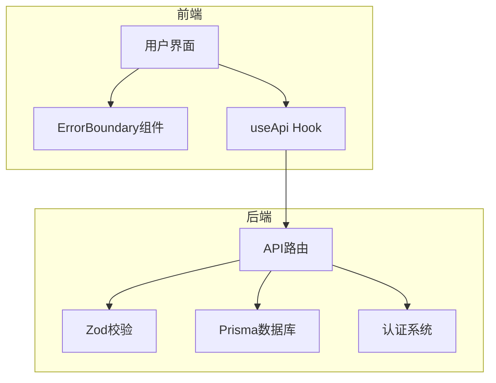
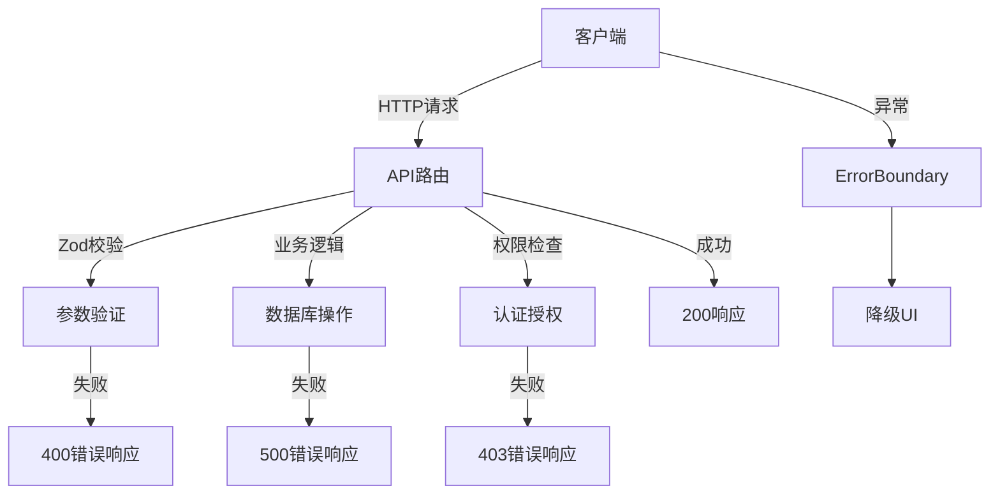
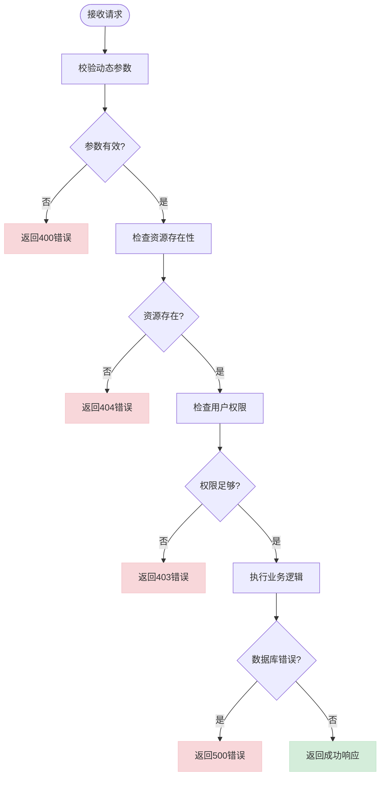
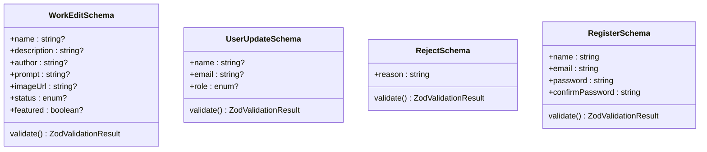
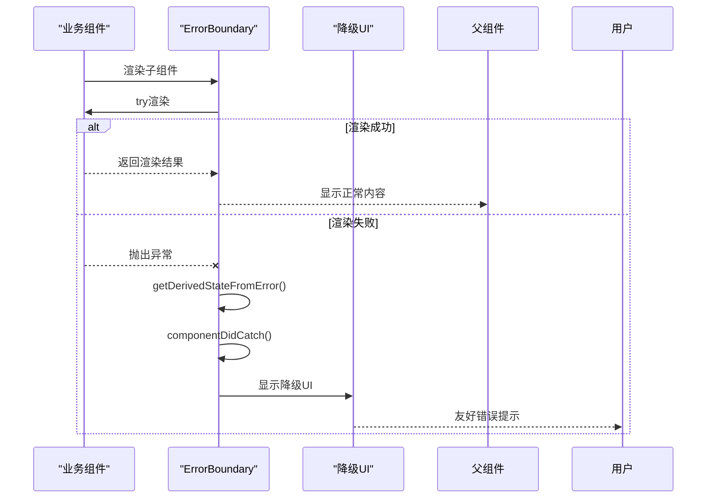
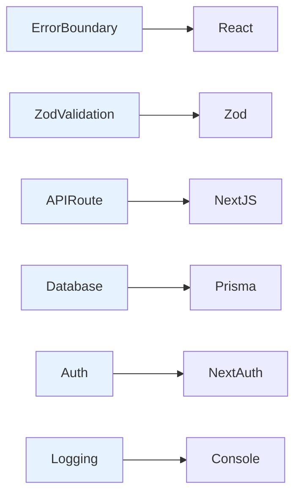

# 异常处理与校验

<cite>
**本文档引用的文件**  
- [ErrorBoundary.tsx](file://src/components/ErrorBoundary.tsx)
- [works/[id]/route.ts](file://src/app/api/works/[id]/route.ts)
- [admin/users/[id]/route.ts](file://src/app/api/admin/users/[id]/route.ts)
- [user/profile/route.ts](file://src/app/api/user/profile/route.ts)
- [register/route.ts](file://src/app/api/register/route.ts)
- [health/route.ts](file://src/app/api/health/route.ts)
- [admin/works/[id]/approve/route.ts](file://src/app/api/admin/works/[id]/approve/route.ts)
- [admin/works/[id]/reject/route.ts](file://src/app/api/admin/works/[id]/reject/route.ts)
- [app/error.tsx](file://src/app/error.tsx)
- [lib/auth-utils.ts](file://src/lib/auth-utils.ts)
</cite>

## 目录
1. [简介](#简介)
2. [项目结构](#项目结构)
3. [核心组件](#核心组件)
4. [架构概述](#架构概述)
5. [详细组件分析](#详细组件分析)
6. [依赖分析](#依赖分析)
7. [性能考虑](#性能考虑)
8. [故障排除指南](#故障排除指南)
9. [结论](#结论)

## 简介
本文档系统讲解数字化作品互动展示平台中的异常捕获与处理机制，涵盖动态路由中常见的非法参数、数据库查询失败、权限不足等错误场景。重点介绍如何使用Zod进行类型安全校验，结合ErrorBoundary实现前端错误兜底，并提供统一的API错误响应格式设计建议。

## 项目结构
本项目采用Next.js App Router架构，API路由集中于`src/app/api`目录下，动态路由参数通过`[id]`形式实现。异常处理机制贯穿前后端，从前端组件到API路由均有完善的错误捕获与响应策略。



**图示来源**  
- [ErrorBoundary.tsx](file://src/components/ErrorBoundary.tsx)
- [useApi.ts](file://src/hooks/useApi.ts)
- [works/[id]/route.ts](file://src/app/api/works/[id]/route.ts)

**本节来源**  
- [src/app/api](file://src/app/api)

## 核心组件
系统核心异常处理组件包括前端ErrorBoundary、API路由中的Zod校验、统一的错误响应格式以及日志记录机制。这些组件协同工作，确保系统在各种异常情况下仍能提供良好的用户体验和可维护性。

**本节来源**  
- [ErrorBoundary.tsx](file://src/components/ErrorBoundary.tsx)
- [works/[id]/route.ts](file://src/app/api/works/[id]/route.ts)
- [admin/users/[id]/route.ts](file://src/app/api/admin/users/[id]/route.ts)

## 架构概述
系统采用分层异常处理架构，从前端到后端形成完整的错误处理链条。前端通过ErrorBoundary捕获渲染错误，API路由使用try-catch捕获运行时异常，Zod负责请求参数的类型校验。



**图示来源**  
- [works/[id]/route.ts](file://src/app/api/works/[id]/route.ts)
- [ErrorBoundary.tsx](file://src/components/ErrorBoundary.tsx)
- [auth-utils.ts](file://src/lib/auth-utils.ts)

## 详细组件分析

### 动态路由异常处理分析
动态路由中的异常处理主要集中在参数校验、资源存在性检查和权限验证三个方面。以作品详情路由为例，系统对各种可能的异常情况进行了全面处理。

#### API路由异常处理流程


**图示来源**  
- [works/[id]/route.ts](file://src/app/api/works/[id]/route.ts)
- [admin/users/[id]/route.ts](file://src/app/api/admin/users/[id]/route.ts)

#### Zod参数校验机制
系统使用Zod对动态路由参数进行类型安全校验，确保输入数据的完整性和正确性。校验失败时返回结构化的错误信息，便于前端展示。



**图示来源**  
- [works/[id]/route.ts](file://src/app/api/works/[id]/route.ts)
- [admin/users/[id]/route.ts](file://src/app/api/admin/users/[id]/route.ts)
- [user/profile/route.ts](file://src/app/api/user/profile/route.ts)
- [register/route.ts](file://src/app/api/register/route.ts)

**本节来源**  
- [works/[id]/route.ts](file://src/app/api/works/[id]/route.ts#L15-L45)
- [admin/users/[id]/route.ts](file://src/app/api/admin/users/[id]/route.ts#L10-L25)
- [user/profile/route.ts](file://src/app/api/user/profile/route.ts#L15-L30)
- [register/route.ts](file://src/app/api/register/route.ts#L5-L25)

### 前端错误兜底方案
前端通过ErrorBoundary组件实现错误兜底，确保在组件渲染异常时仍能提供友好的用户界面，避免白屏。

#### ErrorBoundary组件分析


**图示来源**  
- [ErrorBoundary.tsx](file://src/components/ErrorBoundary.tsx)

**本节来源**  
- [ErrorBoundary.tsx](file://src/components/ErrorBoundary.tsx#L14-L57)
- [app/error.tsx](file://src/app/error.tsx#L5-L42)

### 统一API错误响应格式
系统采用统一的API错误响应格式，确保前后端错误处理的一致性，便于前端统一处理各种错误情况。

#### API错误响应结构
```mermaid
erDiagram
ERROR_RESPONSE {
boolean success PK
string error
string code
array details
string message
}
VALIDATION_ERROR ||--o{ ERROR_RESPONSE : "details包含"
DATABASE_ERROR ||--o{ ERROR_RESPONSE : "code标识"
AUTH_ERROR ||--o{ ERROR_RESPONSE : "code标识"
class VALIDATION_ERROR {
field: string
message: string
code: string
}
class DATABASE_ERROR {
code: string
message: string
}
class AUTH_ERROR {
code: string
message: string
}
```

**图示来源**  
- [works/[id]/route.ts](file://src/app/api/works/[id]/route.ts)
- [admin/users/[id]/route.ts](file://src/app/api/admin/users/[id]/route.ts)
- [health/route.ts](file://src/app/api/health/route.ts)

**本节来源**  
- [works/[id]/route.ts](file://src/app/api/works/[id]/route.ts#L50-L327)
- [admin/users/[id]/route.ts](file://src/app/api/admin/users/[id]/route.ts#L50-L225)
- [health/route.ts](file://src/app/api/health/route.ts#L10-L25)

## 依赖分析
系统异常处理机制依赖于多个核心库和组件，包括Zod用于数据校验、Prisma用于数据库操作、NextAuth用于认证授权。



**图示来源**  
- [ErrorBoundary.tsx](file://src/components/ErrorBoundary.tsx)
- [works/[id]/route.ts](file://src/app/api/works/[id]/route.ts)
- [lib/prisma.ts](file://src/lib/prisma.ts)
- [lib/auth.ts](file://src/lib/auth.ts)

**本节来源**  
- [package.json](file://package.json)
- [tsconfig.json](file://tsconfig.json)

## 性能考虑
异常处理机制对系统性能影响较小，Zod校验在请求入口处快速失败，避免无效请求进入深层业务逻辑。错误日志仅在开发环境输出详细信息，生产环境保持简洁。

## 故障排除指南
当系统出现异常时，可按以下步骤进行排查：

1. **查看前端控制台**：检查是否有JavaScript错误或网络请求失败
2. **检查API响应**：查看返回的错误码和错误信息
3. **查看服务器日志**：检查console.error输出的详细错误信息
4. **验证输入参数**：确认请求参数符合Zod校验规则
5. **检查权限配置**：确认当前用户具有执行操作的权限

**本节来源**  
- [ErrorBoundary.tsx](file://src/components/ErrorBoundary.tsx#L35-L38)
- [works/[id]/route.ts](file://src/app/api/works/[id]/route.ts#L55-L58)
- [admin/users/[id]/route.ts](file://src/app/api/admin/users/[id]/route.ts#L65-L68)

## 结论
本系统建立了完善的异常处理与校验机制，从前端到后端形成闭环。通过Zod实现类型安全的参数校验，统一的API错误响应格式提高了前后端协作效率，ErrorBoundary组件确保了用户体验的一致性。建议在后续开发中继续保持这种结构化错误处理模式，并完善错误日志监控系统。