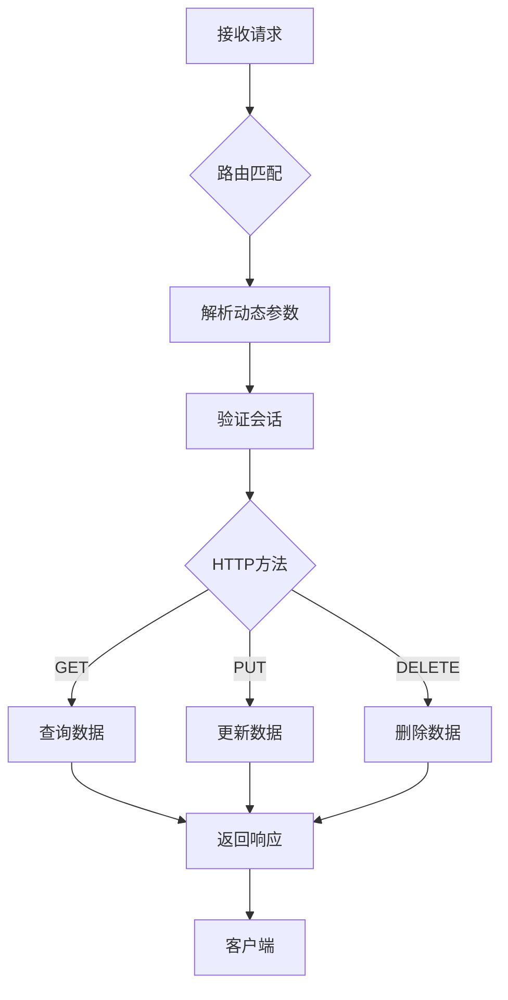
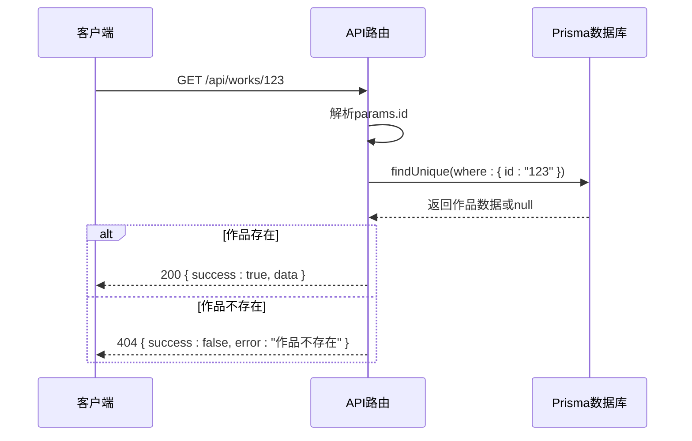
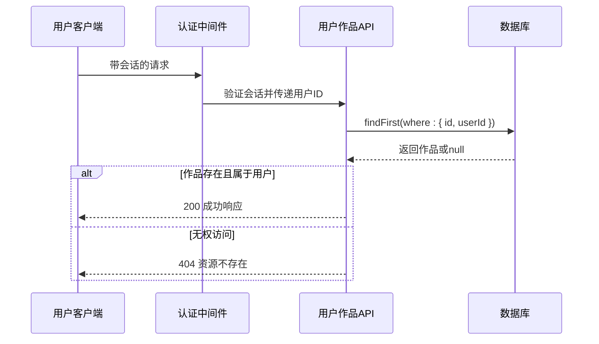
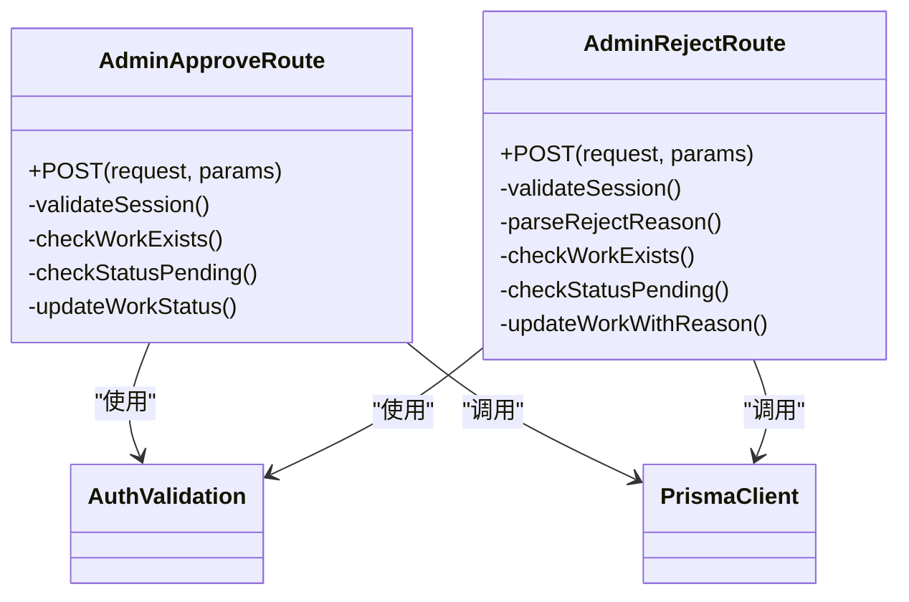
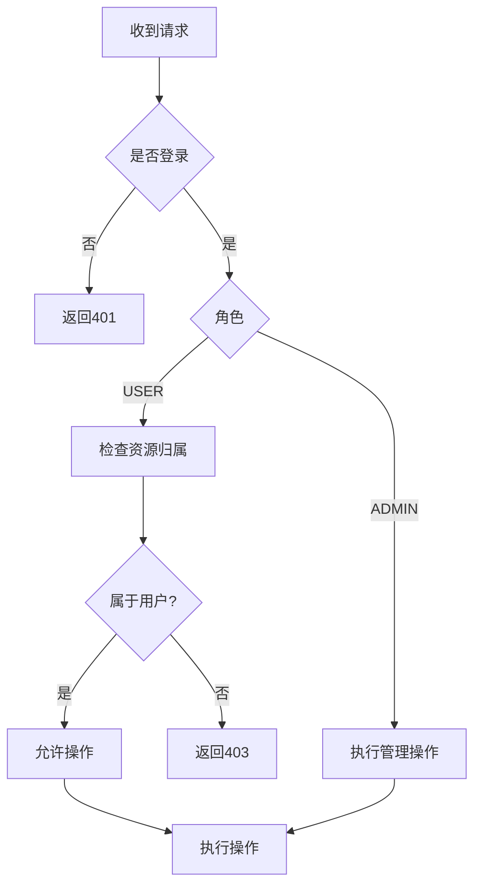
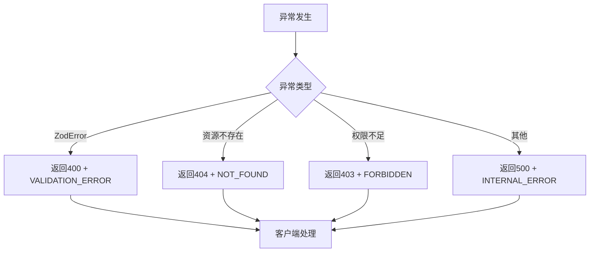
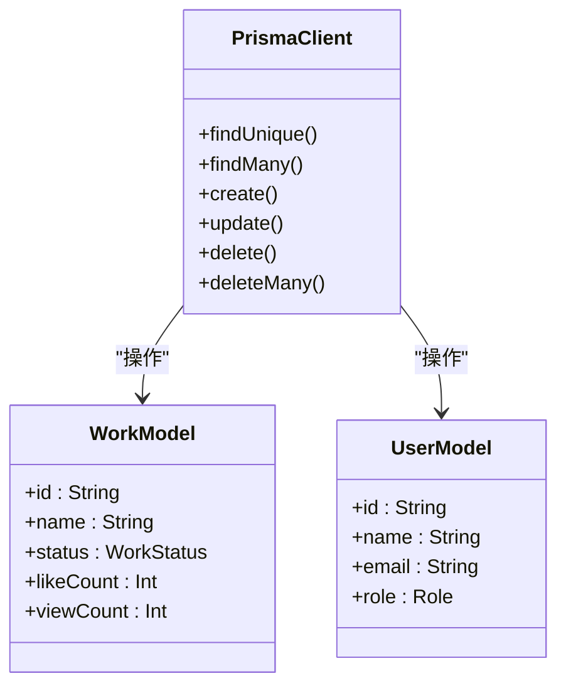
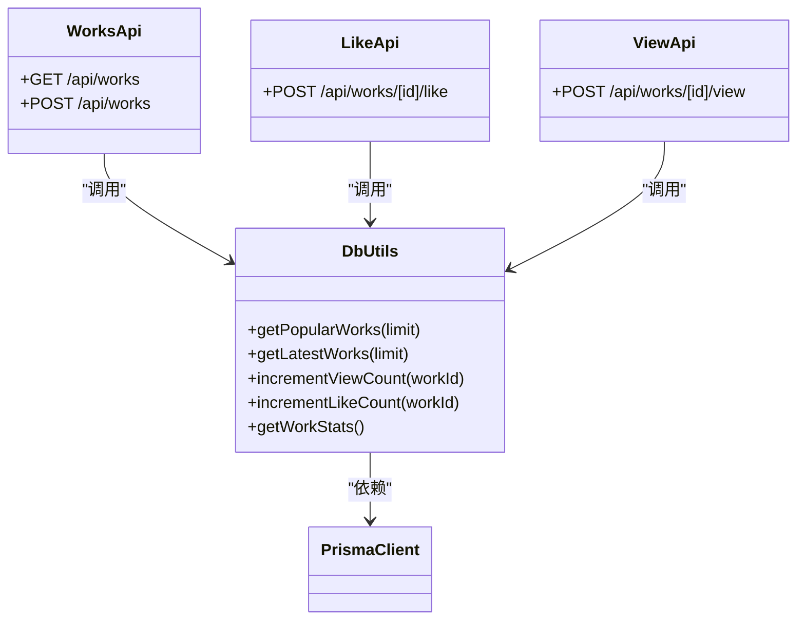

# 服务端处理逻辑

<cite>
**本文档中引用的文件**  
- [src/app/api/works/[id]/route.ts](file://src/app/api/works/[id]/route.ts)
- [src/app/api/user/works/[id]/route.ts](file://src/app/api/user/works/[id]/route.ts)
- [src/app/api/admin/works/[id]/approve/route.ts](file://src/app/api/admin/works/[id]/approve/route.ts)
- [src/app/api/admin/works/[id]/reject/route.ts](file://src/app/api/admin/works/[id]/reject/route.ts)
- [src/app/api/admin/works/[id]/route.ts](file://src/app/api/admin/works/[id]/route.ts)
- [src/app/api/admin/works/route.ts](file://src/app/api/admin/works/route.ts)
- [src/app/api/works/[id]/like/route.ts](file://src/app/api/works/[id]/like/route.ts)
- [src/app/api/works/[id]/view/route.ts](file://src/app/api/works/[id]/view/route.ts)
- [src/lib/db-utils.ts](file://src/lib/db-utils.ts)
- [src/lib/prisma.ts](file://src/lib/prisma.ts)
- [src/lib/auth.ts](file://src/lib/auth.ts)
</cite>

## 目录
1. [引言](#引言)
2. [动态路由处理流程](#动态路由处理流程)
3. [核心API实现分析](#核心api实现分析)
4. [权限验证机制](#权限验证机制)
5. [错误处理策略](#错误处理策略)
6. [Prisma ORM集成与数据访问模式](#prisma-orm集成与数据访问模式)
7. [自定义工具函数封装](#自定义工具函数封装)
8. [总结](#总结)

## 引言
本文档深入剖析数字化作品互动展示平台中服务端动态路由的完整处理流程。结合作品查询、用户作品管理、管理员审批等核心API，系统阐述从请求接收到响应返回的生命周期。重点分析基于动态参数的数据查询、权限控制、业务逻辑执行及错误处理机制，并展示与Prisma ORM的集成方式与数据访问模式。

## 动态路由处理流程
服务端动态路由采用Next.js App Router架构，通过`[id]`等动态段实现参数化API端点。当客户端发起请求时，服务端按以下流程处理：

1. **路由匹配**：根据请求路径匹配对应的`route.ts`文件，如`/api/works/123`匹配`src/app/api/works/[id]/route.ts`。
2. **参数解析**：通过`params`参数获取动态ID，使用`await params`异步解析。
3. **会话验证**：调用`getServerSession(authOptions)`验证用户登录状态与角色权限。
4. **数据库查询**：使用Prisma Client根据ID查询作品记录。
5. **业务逻辑执行**：根据HTTP方法（GET/PUT/DELETE）执行相应操作。
6. **响应构造**：返回标准化JSON响应，包含`success`、`data`、`error`等字段。

**Diagram sources**
- [src/app/api/works/[id]/route.ts](file://src/app/api/works/[id]/route.ts#L1-L328)

**Section sources**
- [src/app/api/works/[id]/route.ts](file://src/app/api/works/[id]/route.ts#L1-L328)

## 核心API实现分析
### 作品查询API
`GET /api/works/[id]`用于获取单个作品详情。服务端通过`prisma.work.findUnique`查询作品，若不存在则返回404状态码。

**Diagram sources**
- [src/app/api/works/[id]/route.ts](file://src/app/api/works/[id]/route.ts#L34-L65)

**Section sources**
- [src/app/api/works/[id]/route.ts](file://src/app/api/works/[id]/route.ts#L34-L65)

### 用户作品管理API
`GET /api/user/works/[id]`允许用户查询自己的作品。通过`findFirst`结合`userId`条件确保只能访问所属作品。

**Diagram sources**
- [src/app/api/user/works/[id]/route.ts](file://src/app/api/user/works/[id]/route.ts#L10-L75)

**Section sources**
- [src/app/api/user/works/[id]/route.ts](file://src/app/api/user/works/[id]/route.ts#L10-L75)

### 管理员审批API
管理员可通过`POST /api/admin/works/[id]/approve`和`POST /api/admin/works/[id]/reject`进行作品审批。

**Diagram sources**
- [src/app/api/admin/works/[id]/approve/route.ts](file://src/app/api/admin/works/[id]/approve/route.ts#L1-L76)
- [src/app/api/admin/works/[id]/reject/route.ts](file://src/app/api/admin/works/[id]/reject/route.ts#L1-L95)

**Section sources**
- [src/app/api/admin/works/[id]/approve/route.ts](file://src/app/api/admin/works/[id]/approve/route.ts#L1-L76)
- [src/app/api/admin/works/[id]/reject/route.ts](file://src/app/api/admin/works/[id]/reject/route.ts#L1-L95)

## 权限验证机制
系统采用基于角色的访问控制（RBAC），通过`Role`枚举区分`USER`和`ADMIN`。

- **普通用户**：只能编辑、删除自己的作品。
- **管理员**：可审核、删除任意作品，管理用户。

权限检查逻辑统一在API处理函数中实现，通过会话中的`role`字段判断。

**Diagram sources**
- [src/app/api/works/[id]/route.ts](file://src/app/api/works/[id]/route.ts#L77-L150)
- [src/lib/auth.ts](file://src/lib/auth.ts#L1-L72)

**Section sources**
- [src/app/api/works/[id]/route.ts](file://src/app/api/works/[id]/route.ts#L77-L150)
- [src/lib/auth.ts](file://src/lib/auth.ts#L1-L72)

## 错误处理策略
系统采用分层错误处理机制：

1. **参数验证错误**：使用Zod进行输入验证，失败时返回400及详细错误信息。
2. **资源不存在**：数据库查询返回null时，返回404状态码。
3. **权限不足**：返回403状态码及`FORBIDDEN`错误码。
4. **服务器内部错误**：捕获异常并返回500状态码。

**Diagram sources**
- [src/app/api/works/[id]/route.ts](file://src/app/api/works/[id]/route.ts#L152-L328)
- [src/app/api/admin/works/[id]/reject/route.ts](file://src/app/api/admin/works/[id]/reject/route.ts#L70-L95)

**Section sources**
- [src/app/api/works/[id]/route.ts](file://src/app/api/works/[id]/route.ts#L152-L328)

## Prisma ORM集成与数据访问模式
项目通过`prisma`单例连接数据库，配置连接池参数以优化性能。

**Diagram sources**
- [src/lib/prisma.ts](file://src/lib/prisma.ts#L1-L51)
- [src/app/api/works/route.ts](file://src/app/api/works/route.ts#L1-L217)

**Section sources**
- [src/lib/prisma.ts](file://src/lib/prisma.ts#L1-L51)

## 自定义工具函数封装
通过`db-utils.ts`封装常用数据库操作，提高代码复用性。

**Diagram sources**
- [src/lib/db-utils.ts](file://src/lib/db-utils.ts#L1-L68)
- [src/app/api/works/[id]/like/route.ts](file://src/app/api/works/[id]/like/route.ts#L1-L65)
- [src/app/api/works/[id]/view/route.ts](file://src/app/api/works/[id]/view/route.ts#L1-L62)

**Section sources**
- [src/lib/db-utils.ts](file://src/lib/db-utils.ts#L1-L68)

## 总结
本文档系统分析了服务端动态路由的处理流程，涵盖从请求接收、权限验证、业务逻辑执行到响应返回的完整生命周期。通过结合具体API实现，展示了基于Prisma ORM的数据访问模式、基于角色的权限控制机制以及完善的错误处理策略。自定义工具函数的封装进一步提升了代码的可维护性与复用性，为系统的稳定运行提供了保障。