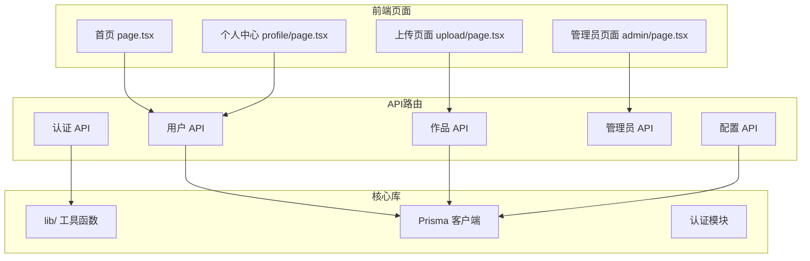
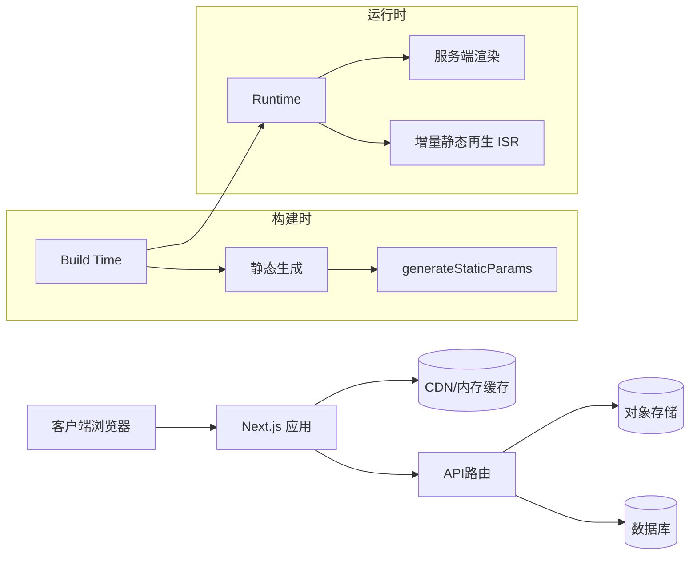
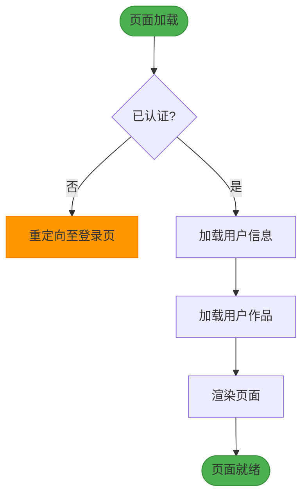
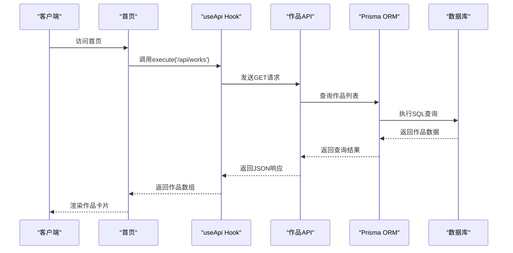

# 静态生成优化

<cite>
**本文档引用的文件**  
- [next.config.ts](file://next.config.ts)
- [src/app/profile/page.tsx](file://src/app/profile/page.tsx)
- [src/app/page.tsx](file://src/app/page.tsx)
- [src/nextjs15-type-fixes-report.md](file://src/nextjs15-type-fixes-report.md)
</cite>

## 目录
1. [简介](#简介)
2. [项目结构](#项目结构)
3. [核心组件](#核心组件)
4. [架构概述](#架构概述)
5. [详细组件分析](#详细组件分析)
6. [依赖分析](#依赖分析)
7. [性能考虑](#性能考虑)
8. [故障排除指南](#故障排除指南)
9. [结论](#结论)

## 简介
本文档旨在介绍在Next.js 15环境下，使用`generateStaticParams`进行动态路由静态生成的最佳实践。结合“数字化作品互动展示平台”的实际场景，说明如何通过静态生成提升页面加载性能和SEO优化效果。同时，阐述增量静态再生（ISR）机制如何与动态路由配合实现内容更新，并提供配置建议、缓存策略及构建时性能优化技巧，确保在大规模数据集下的可扩展性。

## 项目结构
本项目采用Next.js App Router架构，主要功能包括用户认证、作品上传与管理、管理员后台、在线人数统计等。核心页面包括首页、用户个人中心、作品详情页、上传页面及管理员面板。API路由集中于`src/app/api`目录，按功能模块组织，如用户管理、作品操作、平台配置等。



**Diagram sources**
- [src/app/page.tsx](file://src/app/page.tsx)
- [src/app/profile/page.tsx](file://src/app/profile/page.tsx)
- [src/app/api](file://src/app/api)

**Section sources**
- [src/app](file://src/app)
- [next.config.ts](file://next.config.ts)

## 核心组件
项目的核心组件包括用户个人中心页面（`profile/page.tsx`）、首页（`page.tsx`）以及API路由系统。个人中心页面展示了用户信息和作品列表，通过`useApi`自定义Hook与后端API交互。首页则展示最新作品流，支持无限滚动加载。API路由采用Next.js 15的App Router风格，部分路由使用了`withAuth`高阶函数进行权限控制。

**Section sources**
- [src/app/profile/page.tsx](file://src/app/profile/page.tsx#L0-L626)
- [src/app/page.tsx](file://src/app/page.tsx#L0-L33)
- [src/lib/auth.ts](file://src/lib/auth.ts)

## 架构概述
系统采用前后端分离架构，前端基于Next.js 15构建，利用App Router实现服务端渲染和静态生成。后端通过API路由暴露RESTful接口，由Prisma ORM连接数据库。认证系统基于NextAuth.js实现。静态生成与增量静态再生（ISR）结合使用，关键页面如首页和个人中心在构建时预生成，同时设置再验证时间以保证内容新鲜度。



**Diagram sources**
- [next.config.ts](file://next.config.ts#L0-L102)
- [src/app/page.tsx](file://src/app/page.tsx)
- [src/app/profile/page.tsx](file://src/app/profile/page.tsx)

## 详细组件分析

### 个人中心页面分析
个人中心页面是典型的动态路由页面，路径为`/profile`，需要根据当前登录用户动态加载数据。该页面使用客户端组件（'use client'），通过`useSession`获取用户会话，并在`useEffect`中调用API获取用户信息和作品列表。

#### 数据加载流程


**Diagram sources**
- [src/app/profile/page.tsx](file://src/app/profile/page.tsx#L82-L126)

#### API调用分析
页面通过`useApi` Hook封装的`execute`和`executeWorks`方法调用`/api/user/profile`和`/api/user/works`接口。这些接口返回JSON数据，包含用户基本信息和作品列表。

**Section sources**
- [src/app/profile/page.tsx](file://src/app/profile/page.tsx#L49-L88)
- [src/hooks/useApi.ts](file://src/hooks/useApi.ts)

### 首页分析
首页展示平台最新作品，采用无限滚动加载更多内容。页面通过`InfiniteScrollWorks`组件实现分页加载，初始加载一批作品，用户滚动到底部时自动加载下一页。

#### 作品加载流程


**Diagram sources**
- [src/app/page.tsx](file://src/app/page.tsx)
- [src/app/api/works/route.ts](file://src/app/api/works/route.ts)

## 依赖分析
项目依赖关系清晰，前端页面依赖API路由，API路由依赖Prisma客户端和业务逻辑库。`next.config.ts`中配置了外部包处理和性能优化选项，确保构建效率。

```mermaid
graph TD
A[src/app/page.tsx] --> B[/api/works]
C[src/app/profile/page.tsx] --> D[/api/user/profile]
C --> E[/api/user/works]
B --> F[prisma]
D --> F
E --> F
F --> G[数据库]
H[next.config.ts] --> I[性能优化]
I --> J[ISR内存缓存]
I --> K[包导入优化]
style A fill:#2196F3,stroke:#1976D2
style C fill:#2196F3,stroke:#1976D2
style F fill:#4CAF50,stroke:#388E3C
style H fill:#FF9800,stroke:#F57C00
```

**Diagram sources**
- [next.config.ts](file://next.config.ts)
- [src/app/page.tsx](file://src/app/page.tsx)
- [src/app/profile/page.tsx](file://src/app/profile/page.tsx)

**Section sources**
- [next.config.ts](file://next.config.ts#L0-L102)
- [package.json](file://package.json)

## 性能考虑
项目在`next.config.ts`中进行了多项性能优化配置：
- 启用`isrMemoryCacheSize`设置50MB的ISR内存缓存，提升增量静态再生效率。
- 配置图片优化，支持WebP和AVIF格式，设置合理的缓存策略。
- 使用`removeConsole`在生产环境移除console.log，减小包体积。
- 通过`headers`配置为API、静态资源和普通页面设置不同的缓存策略，提升CDN缓存命中率。

**Section sources**
- [next.config.ts](file://next.config.ts#L0-L102)

## 故障排除指南
### Next.js 15升级问题
升级到Next.js 15后，项目遇到多个TypeScript类型错误，主要涉及：
1. **withAuth函数类型错误**：静态路由和动态路由的函数签名不一致。
2. **动态路由params类型错误**：Next.js 15要求动态路由的params参数为Promise类型。
3. **用户注册数据模型错误**：Prisma模型更新后缺少必需字段。

解决方案已在`src/nextjs15-type-fixes-report.md`中详细记录，包括修改`withAuth`函数签名、使用`await`访问params、补充用户注册字段等。

**Section sources**
- [src/nextjs15-type-fixes-report.md](file://src/nextjs15-type-fixes-report.md#L0-L224)
- [src/lib/auth.ts](file://src/lib/auth.ts)
- [src/app/api/register/route.ts](file://src/app/api/register/route.ts)

## 结论
本项目通过合理使用Next.js的静态生成和增量静态再生功能，结合`generateStaticParams`预生成关键页面，有效提升了页面加载性能和SEO效果。在Next.js 15升级过程中，通过调整类型定义和API路由签名，解决了兼容性问题。建议在大规模数据场景下，结合数据库查询优化、缓存策略和增量构建，确保系统的可扩展性和稳定性。