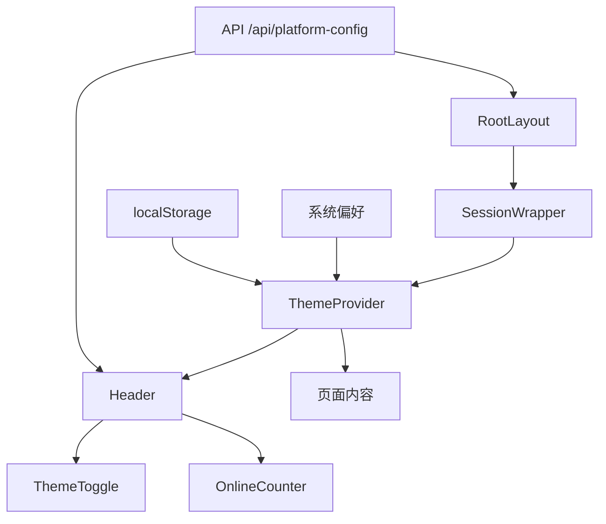
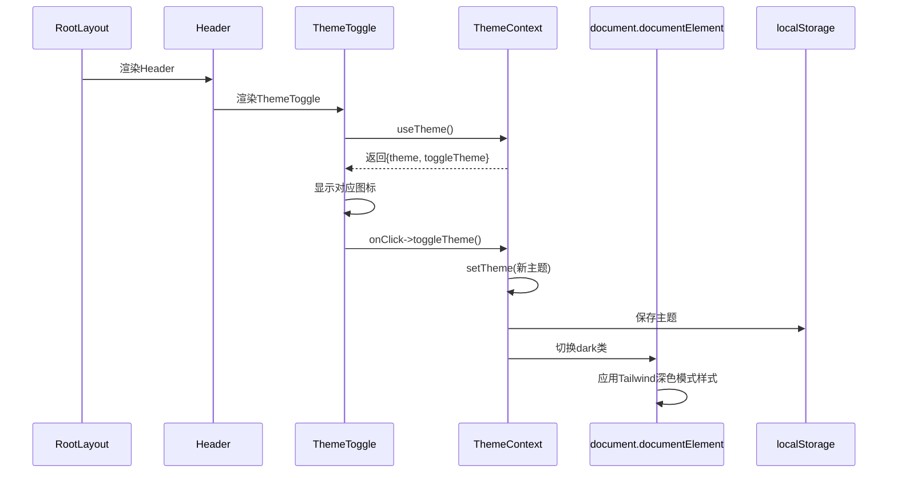
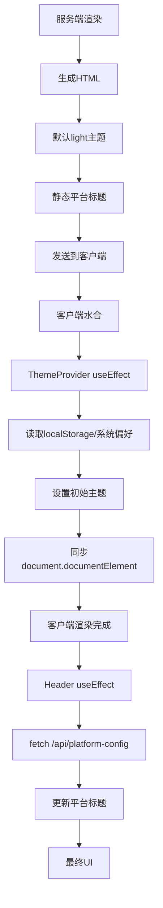
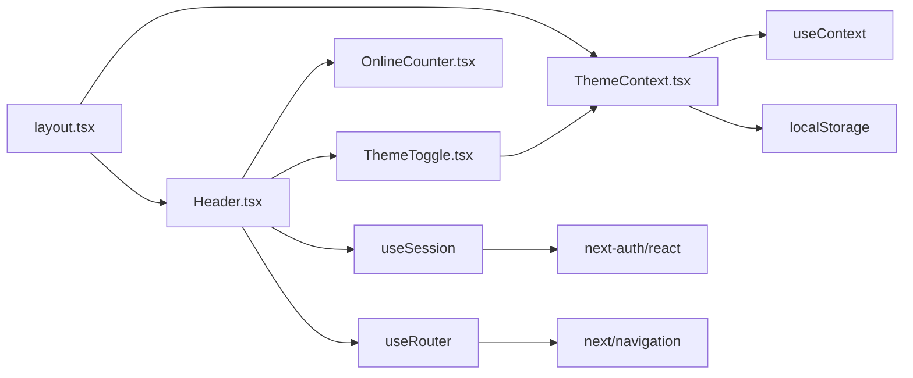

# 共享UI结构

<cite>
**本文档中引用的文件**  
- [layout.tsx](file://src/app/layout.tsx)
- [Header.tsx](file://src/components/Header.tsx)
- [ThemeToggle.tsx](file://src/components/ThemeToggle.tsx)
- [ThemeContext.tsx](file://src/contexts/ThemeContext.tsx)
- [PlatformConfigManagement.tsx](file://src/components/admin/PlatformConfigManagement.tsx)
- [route.ts](file://src/app/api/platform-config/route.ts)
</cite>

## 目录
1. [简介](#简介)
2. [项目结构](#项目结构)
3. [核心组件](#核心组件)
4. [架构概览](#架构概览)
5. [详细组件分析](#详细组件分析)
6. [依赖分析](#依赖分析)
7. [性能考虑](#性能考虑)
8. [故障排除指南](#故障排除指南)
9. [结论](#结论)

## 简介
本文档详细说明了数字化作品互动展示平台中根布局 `layout.tsx` 如何集成 `Header` 和 `ThemeToggle` 组件以构建全局共享的用户界面。通过分析这些组件在所有页面间保持状态一致性的实现机制，阐述其在不同路由下的渲染行为与样式隔离策略。结合 `Header` 的导航逻辑与 `ThemeToggle` 的主题切换功能，深入探讨如何通过布局组件实现跨页面的交互一致性。同时提供关于如何扩展共享UI组件的指导，并讨论潜在的性能优化点，如组件懒加载与服务端渲染兼容性。

## 项目结构
项目采用Next.js App Router架构，核心共享UI组件通过根布局 `layout.tsx` 进行全局集成。`Header` 和 `ThemeToggle` 组件位于 `src/components` 目录下，由 `layout.tsx` 引入并渲染。主题状态管理通过 `ThemeContext` 实现，确保状态在客户端路由切换时持久化。平台配置（如标题）通过API动态获取，支持管理员在后台进行修改。

**Section sources**
- [layout.tsx](file://src/app/layout.tsx#L0-L84)
- [Header.tsx](file://src/components/Header.tsx#L0-L118)
- [ThemeContext.tsx](file://src/contexts/ThemeContext.tsx#L0-L77)

## 核心组件
`Header` 组件负责展示平台主标题、动态页面标题和在线人数计数器，并集成 `ThemeToggle` 组件提供主题切换功能。`ThemeToggle` 通过 `useTheme` Hook 与 `ThemeProvider` 交互，实现主题状态的读取与切换。`ThemeContext` 使用 `localStorage` 持久化主题偏好，并监听系统主题变化，提供无缝的用户体验。

**Section sources**
- [Header.tsx](file://src/components/Header.tsx#L21-L115)
- [ThemeToggle.tsx](file://src/components/ThemeToggle.tsx#L10-L74)
- [ThemeContext.tsx](file://src/contexts/ThemeContext.tsx#L14-L69)

## 架构概览

**Diagram sources**
- [layout.tsx](file://src/app/layout.tsx#L0-L84)
- [Header.tsx](file://src/components/Header.tsx#L0-L118)
- [ThemeContext.tsx](file://src/contexts/ThemeContext.tsx#L0-L77)

## 详细组件分析

### Header与ThemeToggle集成分析
`Header` 组件作为全局导航栏，通过 `useEffect` 钩子在客户端挂载后从 `/api/platform-config` API 获取动态平台标题，并使用 `useState` 管理本地状态。`ThemeToggle` 组件作为其子组件，通过 `useTheme` 钩子访问由 `ThemeProvider` 提供的主题上下文。当用户点击切换按钮时，`toggleTheme` 函数被调用，更新状态并同步到 `localStorage` 和 `document.documentElement` 的CSS类，从而实现全局样式切换。

**Diagram sources**
- [layout.tsx](file://src/app/layout.tsx#L0-L84)
- [Header.tsx](file://src/components/Header.tsx#L21-L115)
- [ThemeToggle.tsx](file://src/components/ThemeToggle.tsx#L10-L74)
- [ThemeContext.tsx](file://src/contexts/ThemeContext.tsx#L14-L69)

### 状态一致性与渲染行为分析
全局状态一致性通过React Context实现。`ThemeProvider` 在 `layout.tsx` 中包裹所有子页面，确保所有组件都能访问同一主题上下文。服务端渲染(SSR)时，`layout.tsx` 生成的HTML默认为浅色模式（`light`），客户端水合(hydration)后，`ThemeProvider` 的 `useEffect` 会立即读取 `localStorage` 或系统偏好，将状态同步到客户端，避免了水合不匹配。对于动态标题，`Header` 在客户端通过 `useEffect` 获取，因此初始SSR HTML中的标题是静态的，客户端会进行更新。

**Diagram sources**
- [layout.tsx](file://src/app/layout.tsx#L0-L84)
- [Header.tsx](file://src/components/Header.tsx#L21-L115)
- [ThemeContext.tsx](file://src/contexts/ThemeContext.tsx#L14-L69)

### 样式隔离策略分析
项目使用Tailwind CSS进行样式管理，其深色模式通过在 `document.documentElement` 上添加 `dark` 类来激活。所有相关的深色模式样式都使用 `dark:` 前缀，确保了样式的隔离性。`ThemeToggle` 组件自身的样式也遵循此模式，其背景、边框和文本颜色在 `light` 和 `dark` 模式下都有明确的定义。此外，项目通过CSS变量 `--toast-bg` 和 `--toast-color` 实现了第三方组件 `react-hot-toast` 的主题适配，确保了UI的一致性。

**Section sources**
- [globals.css](file://src/app/globals.css#L0-L195)
- [ThemeToggle.tsx](file://src/components/ThemeToggle.tsx#L0-L74)
- [ThemeContext.tsx](file://src/contexts/ThemeContext.tsx#L0-L77)

## 依赖分析

**Diagram sources**
- [layout.tsx](file://src/app/layout.tsx#L0-L84)
- [Header.tsx](file://src/components/Header.tsx#L0-L118)
- [ThemeContext.tsx](file://src/contexts/ThemeContext.tsx#L0-L77)

## 性能考虑
当前实现已具备良好的性能基础。`Header` 和 `ThemeToggle` 作为共享组件，避免了重复渲染和代码重复。主题状态的持久化减少了每次页面加载时的API调用。然而，`Header` 中的 `useEffect` 每次页面加载都会调用 `/api/platform-config` 接口，尽管该接口可能被缓存，但仍存在优化空间。可以考虑将平台配置也通过 `layout.tsx` 的 `generateMetadata` 函数获取，并通过React Context向下传递，从而在服务端完成数据获取，减少客户端的网络请求。

**Section sources**
- [layout.tsx](file://src/app/layout.tsx#L32-L84)
- [Header.tsx](file://src/components/Header.tsx#L21-L115)
- [route.ts](file://src/app/api/platform-config/route.ts#L44-L113)

## 故障排除指南
- **问题：主题切换后页面闪烁。**  
  **原因：** 服务端渲染的初始主题与客户端期望的主题不一致。  
  **解决方案：** 确保 `ThemeProvider` 的 `useEffect` 在客户端尽快执行，以最小化闪烁时间。当前实现已通过 `mounted` 状态避免了SSR时的状态更新，是正确的做法。

- **问题：动态标题未更新。**  
  **原因：** `/api/platform-config` 接口返回失败或数据格式错误。  
  **解决方案：** 检查API路由 `src/app/api/platform-config/route.ts` 的实现，确保管理员已正确配置。`Header` 组件已包含错误处理，会保留默认标题。

- **问题：主题偏好未保存。**  
  **原因：** 浏览器禁用了 `localStorage`。  
  **解决方案：** 提示用户启用 `localStorage`，或提供一个不依赖 `localStorage` 的备选方案（如仅使用会话存储）。

**Section sources**
- [Header.tsx](file://src/components/Header.tsx#L21-L115)
- [ThemeContext.tsx](file://src/contexts/ThemeContext.tsx#L14-L69)
- [route.ts](file://src/app/api/platform-config/route.ts#L44-L113)

## 结论
根布局 `layout.tsx` 通过集成 `Header` 和 `ThemeToggle` 组件，成功构建了一个功能完整、状态一致的全局共享UI。`ThemeContext` 提供了强大的状态管理机制，确保了主题在跨页面导航时的持久化和一致性。`Header` 组件通过客户端数据获取实现了动态内容的展示。整体架构清晰，组件职责分明。未来的优化方向可以集中在减少客户端数据获取、实现组件懒加载以进一步提升首屏性能，以及探索更高级的服务端主题渲染策略。